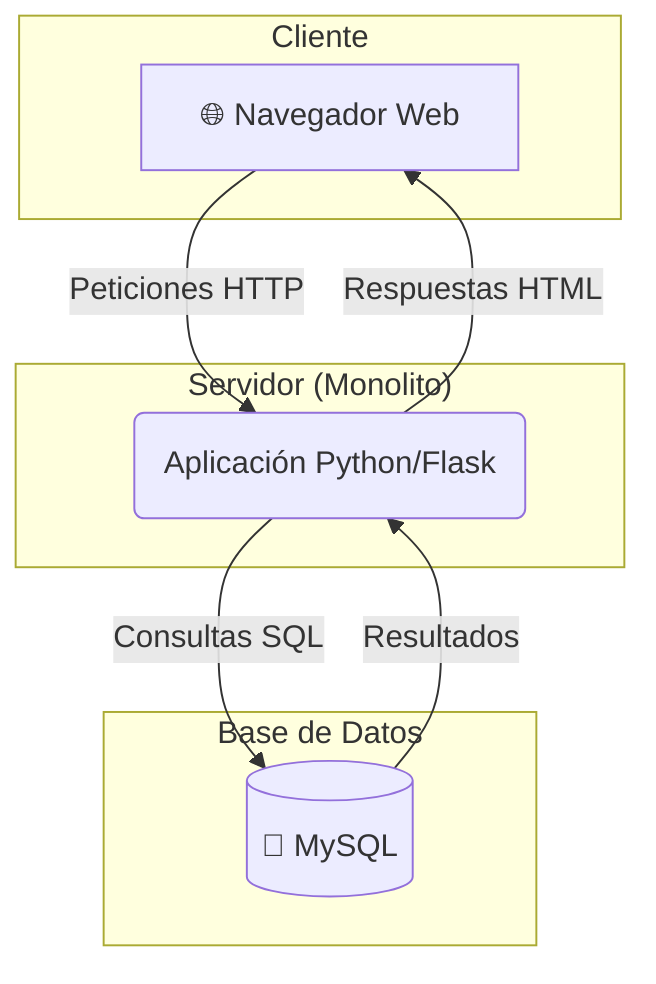
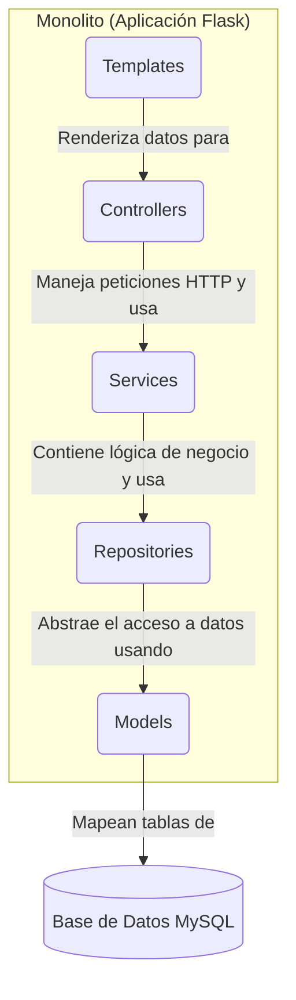

# Laboratorio 1: Arquitectura Monolítica

[cite_start]Este documento presenta los entregables para el Laboratorio 1, enfocados en el diseño de un sistema de software simple utilizando un estilo arquitectónico monolítico[cite: 5].

---

## 1. Representación Gráfica de la Estructura del Sistema

[cite_start]El sistema fue diseñado siguiendo dos decisiones arquitectónicas clave: un estilo **cliente-servidor** para la estructura general [cite: 12] [cite_start]y un patrón de **arquitectura en capas** para la estructura interna del monolito[cite: 15].

### Vista de Componentes (Estilo Cliente-Servidor)

Esta vista ilustra los componentes de alto nivel y sus interacciones. El sistema se compone de un cliente (navegador), un servidor monolítico que centraliza la lógica, y una base de datos para la persistencia.

* **Navegador Web**: Es el cliente que permite a los usuarios interactuar con el sistema a través de una interfaz web.
* [cite_start]**Aplicación Python/Flask**: Es el componente monolítico único que contiene toda la lógica de negocio, el acceso a datos y la renderización de las vistas[cite: 14].
* [cite_start]**MySQL**: Es el sistema gestor de base de datos que almacena la información de libros y géneros literarios[cite: 13].

### Vista de Capas (Patrón Interno del Monolito)

[cite_start]Esta vista detalla la organización interna del monolito, la cual sigue un estricto patrón en capas para separar responsabilidades, como se especifica en el diseño[cite: 15].

* [cite_start]**Templates**: Capa de presentación (vistas en HTML) que se muestra al usuario[cite: 15, 34].
* [cite_start]**Controllers**: Reciben las peticiones HTTP, validan la entrada y coordinan la respuesta, utilizando la capa de servicios[cite: 15, 31].
* [cite_start]**Services**: Contienen la lógica de negocio principal y orquestan las operaciones, desacoplando los controladores de los detalles del acceso a datos[cite: 15, 29].
* [cite_start]**Repositories**: Encapsulan la lógica de acceso a datos, realizando las consultas a la base de datos[cite: 15, 27].
* [cite_start]**Models**: Definen la estructura de los datos y las relaciones, mapeando directamente las tablas de la base de datos[cite: 15, 25].

---

## 2. Descripción de Propiedades del Sistema

A continuación, se describen cinco propiedades sistémicas (atributos de calidad) identificadas en esta arquitectura.

1.  **Simplicidad (Simplicity)**
    Al ser un sistema monolítico, todo el código reside en una única base de código y se ejecuta como un solo proceso. Esto simplifica enormemente el desarrollo inicial, la depuración y las pruebas, ya que no hay complejidad asociada a la comunicación de red entre componentes.

2.  **Desplegabilidad (Deployability)**
    El despliegue es sencillo y atómico. [cite_start]Toda la aplicación se empaqueta en una única imagen de Docker (`swarch-mo`) y se despliega con un solo comando: `docker-compose up --build`[cite: 350]. Esto reduce el riesgo de despliegues parciales o inconsistentes que pueden ocurrir en arquitecturas distribuidas.

3.  **Rendimiento (Performance)**
    La comunicación entre las diferentes capas (por ejemplo, cuando un `Controller` llama a un `Service` y este a un `Repository`) se realiza a través de llamadas a funciones dentro del mismo proceso. Esto resulta en una latencia extremadamente baja y un alto rendimiento, en comparación con las llamadas a través de la red (RPC o HTTP) comunes en arquitecturas de microservicios.

4.  **Escalabilidad (Scalability)**
    La propiedad de escalabilidad en este sistema es limitada. La única manera de escalar la aplicación para manejar una mayor carga es de forma horizontal, es decir, ejecutando múltiples instancias del monolito completo detrás de un balanceador de carga. No es posible escalar de forma independiente solo la funcionalidad de "géneros" si esta recibiera más tráfico que la de "libros", lo que puede llevar a un uso ineficiente de los recursos.

5.  **Mantenibilidad (Maintainability)**
    A medida que la aplicación crece, la mantenibilidad puede convertirse en un desafío. [cite_start]Debido al alto acoplamiento inherente de un monolito, un cambio en un módulo compartido o en un modelo de datos (ej. `book.py` [cite: 39]) puede tener efectos en cascada en múltiples capas, haciendo que las modificaciones sean riesgosas y más lentas de implementar. [cite_start]La estricta separación en capas [cite: 15] ayuda a mitigar esto, pero el riesgo persiste.
