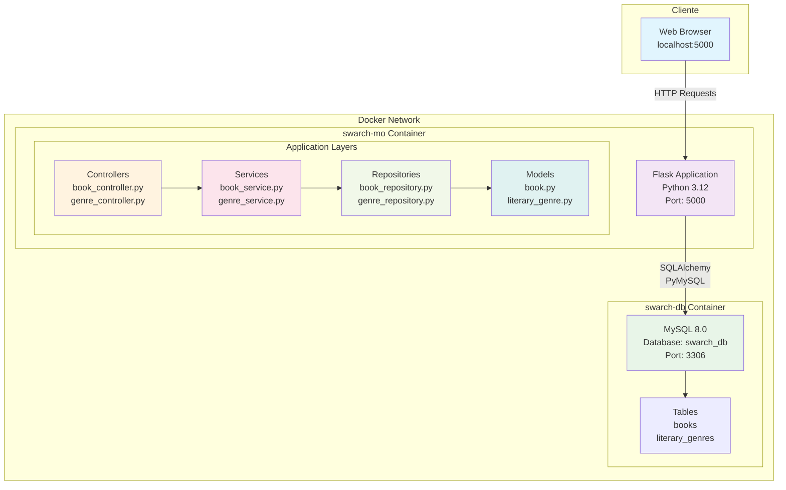
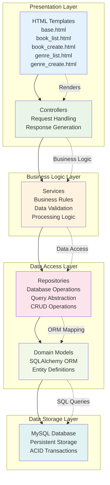

# Software Architecture Laboratory 1 - Book Management System

## System Architecture

### Arquitectura de contenedores(Container Architecture)

### Arquitectura de capas (Layered Architecture)

## System Properties

### 1. Modularidad (Modularity)
**Descripción**: El sistema implementa una arquitectura modular basada en el patrón MVC (Model-View-Controller) y Repository Pattern, donde cada componente tiene responsabilidades específicas y bien definidas.

**Evidencia técnica**:
- Separación clara entre controladores (`book_controller.py`, `genre_controller.py`)
- Servicios de negocio independientes (`book_service.py`, `genre_service.py`)
- Repositorios para acceso a datos (`book_repository.py`, `genre_repository.py`)
- Modelos de dominio separados (`book.py`, `literary_genre.py`)
- Configuración centralizada en `config.py`

**Beneficios**: Facilita el mantenimiento, testing unitario, y desarrollo paralelo de diferentes módulos.

### 2. Escalabilidad (Scalability)
**Descripción**: La arquitectura permite escalamiento tanto horizontal como vertical mediante contenedores Docker y separación de la capa de datos.

**Evidencia técnica**:
- Contenedorización con Docker permite replicar instancias de la aplicación
- Base de datos MySQL separada en contenedor independiente
- Uso de SQLAlchemy ORM que soporta connection pooling
- Arquitectura stateless en la capa de aplicación
- Posibilidad de implementar load balancing entre múltiples instancias

**Beneficios**: El sistema puede manejar mayor carga agregando más contenedores Flask y escalando la base de datos independientemente.

### 3. Mantenibilidad (Maintainability)
**Descripción**: El código está organizado siguiendo principios SOLID y patrones arquitectónicos que facilitan las modificaciones y extensiones futuras.

**Evidencia técnica**:
- Patrón Repository que abstrae el acceso a datos
- Separación de responsabilidades en capas bien definidas
- Uso de Blueprints de Flask para organizar rutas
- Configuración externalizada y ambiente-específica
- Estructura de directorios clara y convencional
- Uso de Flask-Migrate para control de versiones de base de datos

**Beneficios**: Cambios en una capa no afectan otras capas, facilita debugging y adición de nuevas funcionalidades.

### 4. Portabilidad (Portability)
**Descripción**: El sistema es completamente portable gracias a la contenedorización y manejo de dependencias, pudiendo ejecutarse en cualquier ambiente que soporte Docker.

**Evidencia técnica**:
- Docker Compose para orquestación multi-contenedor
- Dockerfile con especificación exacta del ambiente Python
- `requirements.txt` para manejo determinístico de dependencias
- Variables de ambiente para configuración específica del entorno
- Base de datos MySQL en contenedor con configuración estandarizada
- No dependencias del sistema operativo host

**Beneficios**: Deployment consistente entre desarrollo, testing y producción.

### 5. Separación de Responsabilidades (Separation of Concerns)
**Descripción**: Cada componente del sistema tiene una responsabilidad única y bien definida, siguiendo el principio de Single Responsibility Principle (SRP).

**Evidencia técnica**:
- **Controllers**: Manejan únicamente requests HTTP y responses
- **Services**: Contienen exclusivamente lógica de negocio y validaciones
- **Repositories**: Realizan solo operaciones de persistencia y consultas
- **Models**: Definen únicamente la estructura de datos y relaciones
- **Templates**: Se encargan solo de la presentación visual
- **Config**: Maneja únicamente configuración de la aplicación

**Beneficios**: Código más testeable, modificable y comprensible. Cada cambio tiene un scope limitado y predecible.

