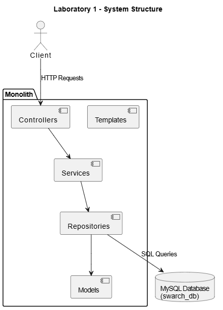

# Laboratory 1 - Deliverable

## System Structure

La arquitectura del sistema sigue el estilo monolítico cliente-servidor.  
El cliente (navegador web) envía peticiones HTTP al monolito, el cual maneja la lógica de negocio mediante una arquitectura en capas y persiste la información en una base de datos MySQL.  

---

## Identified System Properties

### Quality Properties
1. **Modularity**  
   El sistema está dividido en capas dentro del monolito (templates, controllers, services, repositories, models), lo que facilita el mantenimiento y la extensión de funcionalidades.

2. **Portability**  
   El uso de Docker permite que el sistema pueda ejecutarse en distintos entornos (Windows, Linux, macOS) sin problemas de dependencias.

### Externally visible behaviour Properties
3. **Creation of Literary Genres**  
   El sistema permite añadir nuevos géneros literarios a través de la interfaz web.

4. **Book Registration**  
   Los usuarios pueden registrar nuevos libros con título, autor, año de publicación y género, mediante el formulario en la interfaz gráfica.

5. **Listing of Books and Genres**  
   El sistema ofrece la posibilidad de visualizar listas de todos los géneros (`/genres/`) y de todos los libros (`/books/`), mostrando de manera clara la información registrada.
