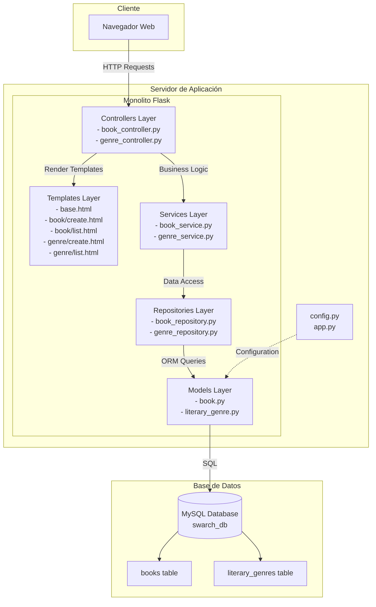
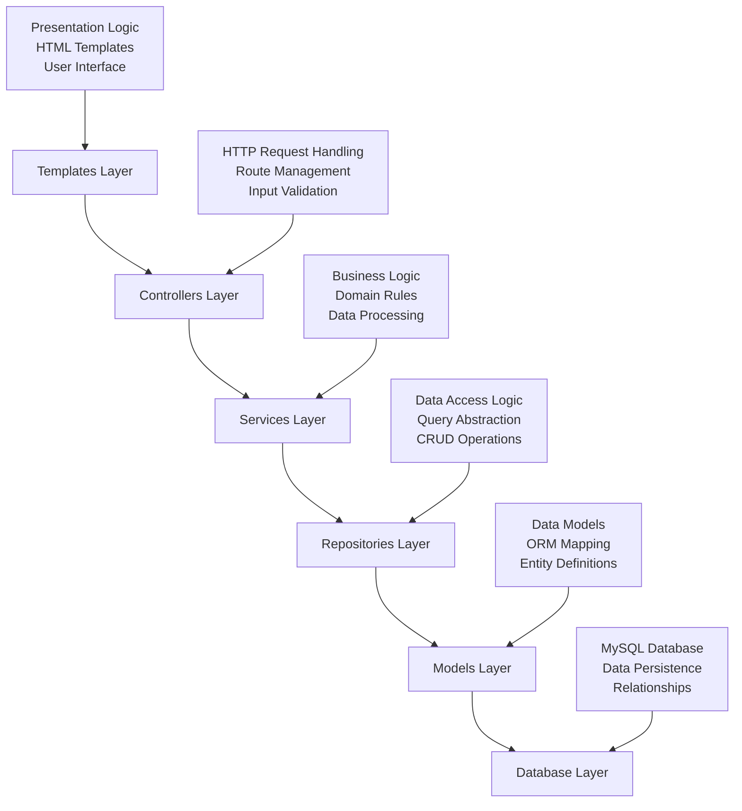

# Laboratory 1 - Architectural Design

## 1. Representación Gráfica de la Estructura del Sistema

### Arquitectura General del Sistema

### Estructura de Capas del Monolito

## 2. Descripción de Cinco (5) Propiedades del Sistema Identificadas

### 2.1 **Mantenibilidad**
El sistema presenta una arquitectura en capas bien definida que facilita el mantenimiento del código. Cada capa tiene responsabilidades específicas y está desacoplada de las demás, lo que permite modificar una capa sin afectar significativamente las otras. La separación entre modelos, repositorios, servicios y controladores hace que el código sea más legible y fácil de mantener a largo plazo.

### 2.2 **Escalabilidad Limitada**
Como sistema monolítico, la aplicación tiene limitaciones inherentes de escalabilidad. Todo el código se ejecuta en un único proceso y contenedor, lo que significa que para escalar se debe replicar toda la aplicación completa. No es posible escalar componentes individuales según la demanda específica de cada funcionalidad (libros vs géneros).

### 2.3 **Cohesión Alta**
Cada módulo del sistema presenta alta cohesión interna. Los repositorios se encargan exclusivamente del acceso a datos, los servicios manejan únicamente la lógica de negocio, y los controladores se ocupan solo del manejo de peticiones HTTP. Esta alta cohesión hace que cada componente sea más robusto y fácil de entender.

### 2.4 **Acoplamiento Controlado**
El sistema presenta un acoplamiento controlado entre capas. Aunque existe dependencia entre las capas (los controladores dependen de los servicios, los servicios de los repositorios, etc.), estas dependencias siguen un patrón descendente claro y están bien definidas. El uso de inyección de dependencias en los servicios y controladores ayuda a mantener este acoplamiento bajo control.

### 2.5 **Disponibilidad Dependiente**
La disponibilidad del sistema depende completamente de dos componentes críticos: el contenedor de la aplicación Flask y la base de datos MySQL. Si cualquiera de estos componentes falla, todo el sistema se vuelve no disponible. Esta es una característica típica de las arquitecturas monolíticas donde un único punto de falla puede comprometer toda la funcionalidad del sistema.

## Conclusión

El sistema implementado siguiendo el patrón arquitectónico monolítico presenta ventajas en términos de simplicidad de desarrollo y despliegue, pero también tiene limitaciones importantes en cuanto a escalabilidad y disponibilidad. La arquitectura en capas utilizada dentro del monolito proporciona una buena organización del código y facilita el mantenimiento, aunque todas las funcionalidades permanecen acopladas en un único deployable.