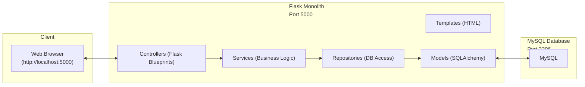
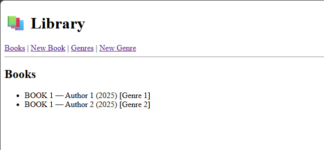
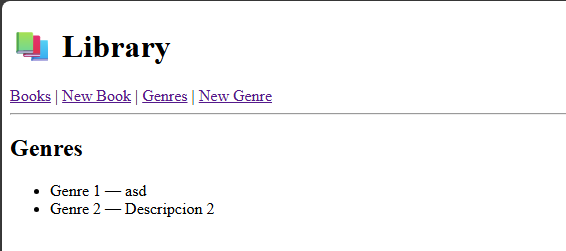
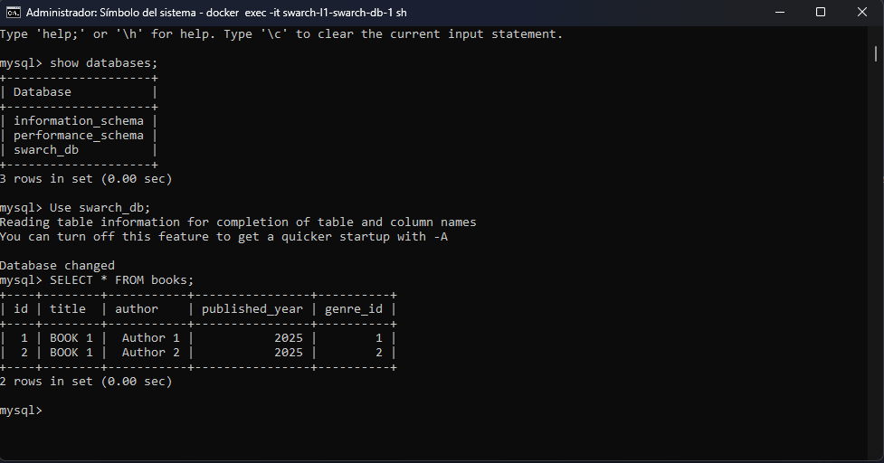

# Laboratorio 1

---

## Arquitectura

El sistema desarrollado sigue el estilo **monolítico**, pero dentro de él se aplica una **arquitectura en capas** que organiza el código de manera clara.  
El flujo de comunicación funciona así:

- El usuario interactúa desde el navegador.
- El monolito está construido en **Flask (Python)** y dividido en:
  - **Templates (HTML)** → lo que ve el usuario en pantalla.
  - **Controllers** → reciben las peticiones del cliente.
  - **Services** → contienen la lógica de negocio.
  - **Repositories** → se encargan de acceder a la base de datos.
  - **Models** → definen las tablas y relaciones usando SQLAlchemy.
- La base de datos es **MySQL**, encargada de almacenar la información de libros y géneros.

---

## Diagrama de la estructura del sistema

---

## Propiedades del sistema

1. **Modularidad**: El sistema está dividido en capas bien definidas,

2. **Mantenibilidad**: La separación por capas permite hacer cambios localizados.

3. **Abstracción de datos con SQLAlchemy**: El uso de SQLAlchemy permite trabajar con la base de datos a través de modelos en Python en lugar de escribir consultas SQL directamente.

4. **Fiabilidad**: Usar una base de datos como **MySQL** en lugar de guardar datos en memoria asegura persistencia.

5. **Implementabilidad**: Con **Docker y docker-compose**, podemos desplegar el sistema fácilmente en cualquier computador.

---

## EVIDENCIAS

