# System Properties - swarch-L1 Project

This document describes five key system properties identified in the swarch-L1 library management system.

## 1. Modularity

**Description**: The system is designed with a clear separation of concerns through a layered architecture.

**Implementation**:
- **Models Layer**: Defines data structures (`Book`, `LiteraryGenre`)
- **Repository Layer**: Handles data access and persistence
- **Service Layer**: Contains business logic and validation
- **Controller Layer**: Manages HTTP requests and responses
- **Presentation Layer**: HTML templates for user interface

**Benefits**:
- Easy maintenance and testing
- Code reusability
- Clear responsibility boundaries
- Simplified debugging

## 2. Scalability

**Description**: The system architecture supports horizontal and vertical scaling through containerization and database separation.

**Implementation**:
- **Docker Containerization**: Application and database run in separate containers
- **Database Separation**: MySQL database runs independently from the Flask application
- **Stateless Design**: Flask application doesn't maintain session state
- **Load Balancer Ready**: Can be easily deployed behind a load balancer

**Benefits**:
- Can handle increased user load
- Easy deployment across multiple servers
- Resource optimization
- High availability potential

## 3. Reliability

**Description**: The system implements fault tolerance and error handling mechanisms to ensure consistent operation.

**Implementation**:
- **Database Connection Retry**: Automatic retry mechanism with exponential backoff
- **Health Checks**: Docker health checks for MySQL container
- **Graceful Error Handling**: Proper exception handling in services and controllers
- **Data Validation**: Input validation at service layer
- **Container Restart Policy**: Automatic container restart on failure

**Benefits**:
- Reduced downtime
- Automatic recovery from transient failures
- Consistent user experience
- Data integrity protection

## 4. Maintainability

**Description**: The codebase is structured to facilitate easy updates, bug fixes, and feature additions.

**Implementation**:
- **Clean Code Structure**: Following Python PEP 8 standards
- **Separation of Concerns**: Each layer has distinct responsibilities
- **Configuration Management**: Centralized configuration in `config.py`
- **Template Inheritance**: Base template for consistent UI structure
- **Dependency Management**: Clear dependency specification in `requirements.txt`

**Benefits**:
- Faster development cycles
- Easier onboarding for new developers
- Reduced technical debt
- Simplified testing and debugging

## 5. Portability

**Description**: The system can be deployed across different environments and platforms with minimal configuration changes.

**Implementation**:
- **Docker Containerization**: Platform-independent deployment
- **Environment Variables**: Configuration through environment variables
- **Database Abstraction**: SQLAlchemy ORM for database independence
- **Standard Technologies**: Uses widely supported technologies (Python, Flask, MySQL)
- **Docker Compose**: Simplified multi-container deployment

**Benefits**:
- Easy deployment across development, staging, and production
- Reduced environment-specific issues
- Simplified CI/CD pipeline integration
- Cross-platform compatibility

---

## Summary

These five system properties work together to create a robust, maintainable, and scalable library management system. The modular architecture ensures clean code organization, while containerization provides scalability and portability. Reliability mechanisms protect against failures, and the maintainable structure facilitates long-term development and support.

---

## Test

---

## Diagrams

### System Architecture Diagram

The following diagram illustrates the layered architecture of the swarch-L1 library management system:

```mermaid
%%{init: {'flowchart': {'htmlLabels': true}} }%%
flowchart TB
  TPL["Templates (Jinja2)<br/>base.html · book/* · genre/*"]
  CTRL["Controllers (Blueprints)<br/>book_controller.py<br/>genre_controller.py"]
  SRV["Services<br/>book_service.py<br/>genre_service.py"]
  REPO["Repositories<br/>book_repository.py<br/>genre_repository.py"]
  MODEL["Models (SQLAlchemy)<br/>Book · LiteraryGenre"]
  DB[("MySQL<br/>literary_genres · books")]

  TPL --> CTRL --> SRV --> REPO --> MODEL --> DB

```

**Architecture Description:**

This diagram represents a **layered architecture pattern** with clear separation of concerns:

1. **Presentation Layer (Templates)**: Jinja2 templates handle the user interface rendering, including base template and specific views for books and genres.

2. **Controller Layer (Blueprints)**: Flask blueprints manage HTTP requests and responses, routing user actions to appropriate services.

3. **Service Layer**: Contains business logic and validation rules, acting as an intermediary between controllers and repositories.

4. **Repository Layer**: Handles data access patterns and database operations, providing an abstraction over the data persistence layer.

5. **Model Layer**: SQLAlchemy ORM models define the data structure and relationships between entities (Book and LiteraryGenre).

6. **Data Layer**: MySQL database stores the actual data in `literary_genres` and `books` tables.

**Data Flow:**
- **Downward**: User requests flow from templates through controllers, services, repositories, to models and finally to the database.
- **Upward**: Data flows back through the same layers, ensuring proper transformation and validation at each level.

This architecture promotes **maintainability**, **testability**, and **scalability** by enforcing clear boundaries between different system responsibilities.

### Deployment Architecture Diagram

The following diagram illustrates the deployment architecture using Docker Compose:

**Deployment Description:**

This diagram represents the **containerized deployment architecture** of the swarch-L1 system:

#### Components:

1. **Cliente (Navegador)**:
   - External web browser accessing the application
   - Connects to `http://localhost:5000/books`
   - Represents the user interface layer

2. **Docker Compose Network**:
   - Isolated network environment for container communication
   - Enables secure inter-container connectivity
   - Manages service discovery and networking

3. **swarch-mo (Flask Monolith)**:
   - Container running the Flask application (`app.py`)
   - Exposes port 5000 for HTTP traffic
   - Contains the entire web application stack
   - Handles all business logic and web requests

4. **swarch-db (MySQL 8.0)**:
   - Database container with MySQL 8.0
   - Hosts the `swarch_db` database
   - Stores books and literary genres data
   - Isolated from external access for security

#### Communication Flow:

- **HTTP Traffic**: Browser sends HTTP requests to Flask app on port 5000
- **Database Connection**: Flask app connects internally to MySQL container
- **Network Isolation**: Database is not directly accessible from outside the Docker network
- **Service Dependencies**: Flask container waits for MySQL health check before starting

#### Deployment Benefits:

- **Containerization**: Consistent environment across development and production
- **Service Isolation**: Each component runs in its own container
- **Network Security**: Database is not exposed to external traffic
- **Scalability**: Easy to scale individual components
- **Portability**: Can be deployed on any Docker-compatible environment
- **Development Efficiency**: Simple setup with `docker-compose up`

This deployment architecture ensures a **secure**, **scalable**, and **maintainable** production-ready environment for the library management system.

