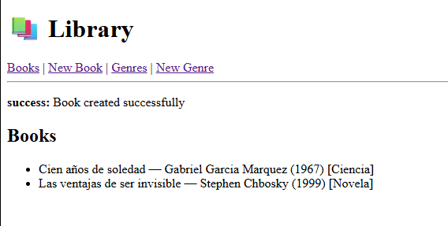
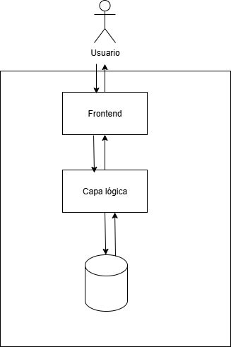

# Laboratory 1

**System properties** identificadas en el diseño del laboratorio:

1. **Modifiability & Maintainability**
   El monolito adopta una **arquitectura en capas** (templates → controllers → services → repositories → models). Esta separación de responsabilidades reduce acoplamiento y facilita cambios localizados (como justar lógica de negocio sin tocar vistas ni acceso a datos).

2. **Deployability & Portability**
   El uso de **Dockerfile** y **docker-compose** permite construir y arrancar el sistema con un comando, reproduciendo el entorno en cualquier máquina. La app corre en `python:3.12-slim` y la base en `mysql:8.0`, lo que estandariza dependencias y simplifica la entrega.

3. **Data Integrity & Consistency**
   El **modelo relacional** define claves y relaciones explícitas: `Book.genre_id` es FK hacia `LiteraryGenre`, con restricciones `nullable/unique` en los campos clave. Esto previene “huérfanos” y mantiene coherencia entre libros y géneros.

4. **Security & Configurability**
   La configuración sensible se inyecta vía **variables de entorno** ( `MYSQL_USER`, `MYSQL_PASSWORD`, `SECRET_KEY`) leídas por `Config`. Esto desacopla secretos del código y habilita configuraciones por entorno. (Nota: en el ejemplo de `docker-compose` las credenciales están en texto plano; en producción conviene `.env`, secretos y credenciales no triviales).

5. **Testability & Operability**
   Hay un **ciclo de prueba end-to-end** claro: levantar servicios con `docker-compose`, navegar a `/books` y usar formularios para crear géneros/libros, y validar en MySQL con comandos (`SHOW DATABASES; SELECT * FROM books;`). Las capas `service/repository` también favorecen pruebas unitarias de lógica y acceso a datos.

# Testing

Se evidencia la creación de 2 generos literarios y la creación de 2 libros.

# Graphical representation of the system

