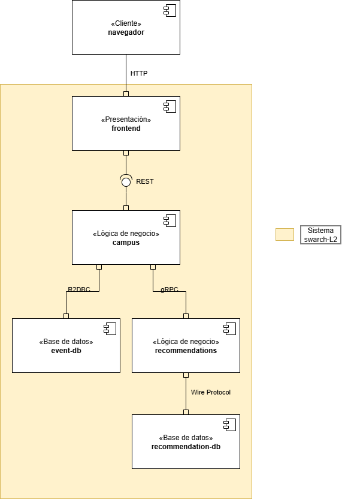

# Laboratorio #2: Componentes y Conectores
**Anderson David Morales Chila**

**amoralesch@unal.edu.co**

**Universidad Nacional de Colombia**

## 1. Vista componente y conector

## Descripción de componentes y conectores
El sistema tiene en total, 5 componentes y 5 conectores, los cuales, se describiran a continuación.

### Componentes
- #### frontend
    Este componente hace parte del prototipado horizontal del sistema de presentación. Este componente se encarga de mostrar la interfaz gráfica al usuario por medio de un navegador web. Adicionalmente, realiza peticiones HTTP REST al componente _campus_ y los datos que reciba los mostrará en pantalla. 

    Este componente es *stateless*, ya que no guarda datos de forma permanente o en algún cache u otro tipo de memoria interna. Además, esta escrito en *Vue*.

- #### campus
    Este componente hace parte del prototipado horizontal del sistema de lógica de negocio. También se encarga de recibir las peticiones HTTP Rest del _frontend_ y darle una respuesta. Adicionalmente, esta conectado, por medio de _R2DBC_, a una base de datos de MySQL. De esta, obtiene la información del usuario, del evento, y a que evento va a ir cada usuario. A su vez, se comunica, por medio de un conector _gRPC_, al componente de _recommendations_, del cual obtiene los eventos recomendados para cada usuario. 

    Este componente es *stateless*, ya que no guarda datos de forma permanente o en algún cache u otro tipo de memoria interna o estructura de datos. Además, esta escrito en *Spring* de Java.

- #### event-db
    Este componente hace parte del prototipado horizontal de datos del sistema. Se encarga de almacenar la información de los usuarios, como su nombre y correo; de los eventos, como su título, ubicación, descripción y horario; y a que evvento va a asistir cada usuario. Adicionalmente, se comunica, por medio de _R2DBC_, al componente de _campus_, escribiendo o devoviendole la información que necesite.

    Este componente es *statefull*, ya que debe guardar datos de forma persistente. Es una base de datos MySQL.

- #### recommendations
    Este componente hace parte del prototipado horizontal del sistema de lógica de negocio. Se encarga de comunicarse con el componente _campus_, por medio de _gRPC_ y de comunicarse con una base de datos MongoDB, por medio de _Wire Protocol_. A _campus_ le devuelve los eventos recomendados a cada usuario que se encuentran en la base de datos de MongoDB.

    Este componente es *stateless*, ya que no guarda datos de forma permanente o en algún cache u otro tipo de memoria interna o estructura de datos. Además, esta escrito en *Python*.

- #### recommendation-db
     Este componente hace parte del prototipado horizontal de datos del sistema. Se encarga de almacenar la información de los eventos recomendados a cada usuario. Adicionalmente, se comunica, por medio de _Wire Protocol_, con el componente de _recommendations_, escribiendo o devoviendole la información que necesite.

    Este componente es *statefull*, ya que debe guardar datos de forma persistente. Es una base de datos MongoDB.

### Conectores

- #### HTTP
    Este conector se utiliza para comunicar el componente frontend con el cliente.

- #### Rest
    Es un conector asíncrono que le permite realizar peticiones, al componente frontend, al componente campus.

- #### R2DBC
    Permite conectar la base de datos con el componente campus, de forma dinámica y asíncrona.

- #### gRPC
    Permite la comunicación entre campus y recommendations de forma asíncrona. Transporta los mensajes de forma binaria y permite las peticiones de campus a recommendations.

- #### Wire Protocol
    Es un protocolo usado para comunicar el componente, en este caso recommendations, con una base de datos MongoDB. En este sistema, se utiliza de forma asíncrona ya que utiliza el método _AsyncIOMotorClient_ para Python.

