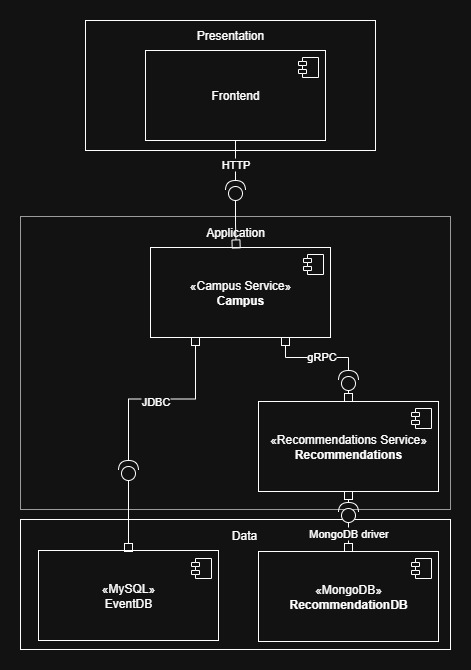

# Laboratorio 2 - Vista de Componentes y Conectores

## Descripción de los Componentes y Conectores Identificados

### Componentes

#### 1. Frontend de Eventos (events-fe)
- **Tipo**: Componente de Interfaz de Usuario
- **Tecnología**: Aplicación Vue.js servida por Nginx
- **Puerto**: 80
- **Responsabilidad**: Proporciona la interfaz web para que los usuarios interactúen con el sistema de eventos. Maneja la autenticación de usuarios, navegación de eventos y muestra recomendaciones.

#### 2. Servicio Campus (campus)
- **Tipo**: Componente de Lógica de Negocio / API Gateway
- **Tecnología**: Aplicación Spring Boot (Java/Kotlin)
- **Puerto**: 8080
- **Responsabilidad**: Servicio principal de lógica de negocio que gestiona eventos, datos de usuarios y orquesta la comunicación entre el frontend y el servicio de recomendaciones.

#### 3. Servicio de Recomendaciones (recommendations)
- **Tipo**: Servicio de Negocio Especializado
- **Tecnología**: Aplicación Python con servidor gRPC
- **Puerto**: 8000
- **Responsabilidad**: Proporciona recomendaciones personalizadas de eventos basadas en preferencias y comportamiento del usuario utilizando algoritmos de aprendizaje automático.

#### 4. Base de Datos de Eventos (event-db)
- **Tipo**: Componente de Almacenamiento de Datos
- **Tecnología**: MySQL 8.0
- **Puerto**: 3306
- **Responsabilidad**: Almacena información de eventos, datos de usuarios y datos transaccionales para la aplicación principal.

#### 5. Base de Datos de Recomendaciones (recommendation-db)
- **Tipo**: Componente de Almacenamiento de Datos
- **Tecnología**: MongoDB 6
- **Puerto**: 27017
- **Responsabilidad**: Almacena datos de comportamiento del usuario, modelos de recomendación y datos analíticos optimizados para el servicio de recomendaciones.

### Conectores

#### 1. HTTP/REST (Frontend ↔ Campus)
- **Tipo**: Conector de Petición-Respuesta
- **Protocolo**: HTTP/HTTPS con API REST
- **Descripción**: Comunicación síncrona para interacciones de usuario, consultas de eventos y recuperación de datos entre la interfaz web y el servicio principal.

#### 2. gRPC (Campus ↔ Recomendaciones)
- **Tipo**: Conector de Llamada a Procedimiento Remoto
- **Protocolo**: gRPC sobre HTTP/2
- **Descripción**: Comunicación de alto rendimiento y type-safe para solicitar recomendaciones personalizadas. Proporciona serialización eficiente y capacidades de streaming.

#### 3. R2DBC (Campus ↔ Base de Datos de Eventos)
- **Tipo**: Conector de Acceso a Datos
- **Protocolo**: Conectividad Reactiva a Base de Datos
- **Descripción**: Acceso no bloqueante y reactivo a la base de datos para el manejo eficiente de peticiones concurrentes a la base de datos MySQL.

#### 4. Driver MongoDB (Recomendaciones ↔ Base de Datos de Recomendaciones)
- **Tipo**: Conector de Acceso a Datos
- **Protocolo**: Protocolo Wire de MongoDB
- **Descripción**: Conectividad nativa a la base de datos para almacenar y recuperar datos de recomendaciones, analíticas de comportamiento del usuario y datos de modelos de aprendizaje automático.

### Patrones Arquitectónicos

- **Arquitectura de Microservicios**: El sistema está descompuesto en servicios independientes y débilmente acoplados
- **Base de Datos por Servicio**: Cada servicio tiene su propia base de datos dedicada optimizada para sus necesidades específicas
- **Patrón API Gateway**: El servicio campus actúa como punto de entrada y orquestador para los servicios backend
- **Persistencia Políglota**: Utiliza diferentes tecnologías de base de datos (MySQL para datos transaccionales, MongoDB para analíticas)