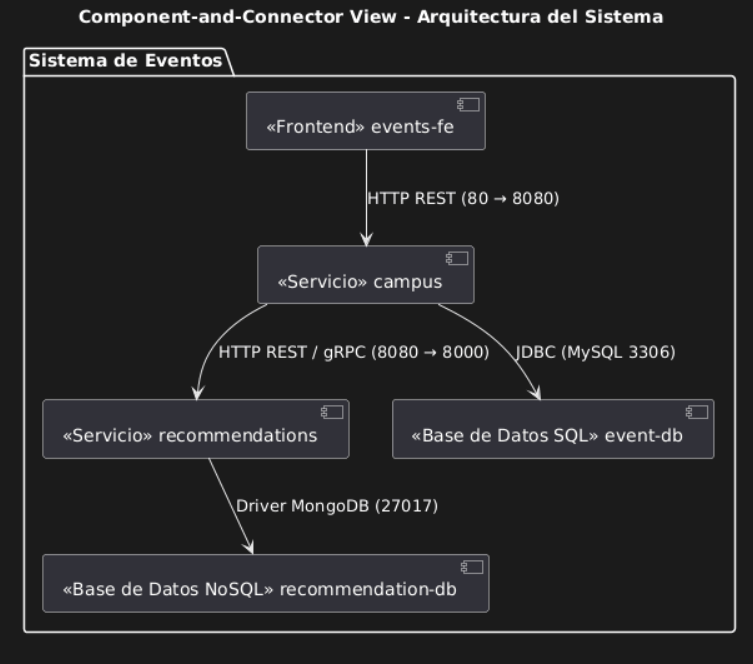

# ENTREGABLE LABORATORIO 2

Cristian David Machado Guzmán

A continuación, se responde a las preguntas planteadas en el pdf de instrucciones con base en la definición del archivo `docker-compose.yaml`:

---
### Sobre los componentes

### A. ¿Cuántos componentes hacen parte del sistema?

El sistema está conformado por **cinco componentes principales**:

1. **Frontend**: interfaz de usuario accesible desde el navegador.  
2. **Campus**: servicio backend central encargado de la lógica de negocio.  
3. **Recommendations**: microservicio auxiliar especializado en generar recomendaciones.  
4. **Event-db**: base de datos relacional (MySQL).  
5. **Recommendation-db**: base de datos NoSQL (MongoDB).

---

### B. ¿Qué tipos de bases de datos están presentes en el sistema?

Hay dos tipos de bases de datos:

- **MySQL**: base de datos relacional utilizada por el servicio `campus` para el manejo de datos estructurados relacionados con los eventos.  
- **MongoDB**: base de datos documental (NoSQL) empleada por el servicio `recommendations` para almacenar y gestionar información semiestructurada vinculada a las recomendaciones.

---

### C. ¿Cuál es el alcance de cada componente dentro de la arquitectura?

- **Frontend**: proporciona la capa de presentación, actuando como punto de interacción con los usuarios finales.  
- **Campus**: gestiona la lógica de negocio principal, procesa las solicitudes provenientes del frontend y coordina la interacción con `event-db` y `recommendations`.  
- **Recommendations**: encapsula la lógica de recomendaciones, delegando el almacenamiento y recuperación de datos a `recommendation-db`.  
- **Event-db**: garantiza la persistencia de los datos estructurados, como usuarios, eventos y reservas.  
- **Recommendation-db**: proporciona almacenamiento para datos no estructurados o semiestructurados relacionados con las recomendaciones.

---

### D. ¿Qué componentes son *stateless* y cuáles son *stateful*?

- **Stateless (sin estado interno, fácilmente escalables):**  
  - `frontend`  
  - `campus`  
  - `recommendations`  

- **Stateful (mantienen datos persistentes y requieren almacenamiento duradero):**  
  - `event-db` (MySQL)  
  - `recommendation-db` (MongoDB)

---
### Sobre los conectores

¿Cuantos conectores tiene el sistema? ¿De que tipo son? ¿Son sincronos o asincronos?

| Conector        | Fuente              | Destino           | Tipo              | Sinc/Asinc|
| --------------- | ------------------- | ----------------- | ----------------- |-------------|
| HTTP (80)       | Usuario (navegador) | Frontend          | Cliente-servidor  | Sincrono|
| HTTP REST (8080)    | Frontend            | Campus            | Cliente-servidor  | Sincrono|
| HTTP gRPC(8000)     | Campus              | Recommendations   | Cliente-servidor  | Sincrono|
| MySQL (3306)    | Campus              | Event-db          | Driver JDBC/MySQL | Sincrono|
| MongoDB (27017) | Recommendations     | Recommendation-db | Driver MongoDB    | Sincrono|

Según el analisis realizado no hay conectores asincronos ya que no se utilizan colas de mensajería o procesamiento de eventos, todo se maneja a aprtir HTTP y consultas a las bases de datos, que son sincronicas por naturaleza

## DIAGRAMA COMPONENTE - CONECTOR 

## Explicación de los componentes y conectores:

- Frontend (events-fe): aplicación cliente web que consume los servicios del backend campus.

- Campus: servicio central que coordina la lógica de negocio, consulta la base de datos de eventos y hace llamadas al servicio de recomendaciones.

- Recommendations: microservicio encargado de generar recomendaciones, accede a su propia base de datos Mongo.

- Event-DB (MySQL): almacena datos estructurados de eventos.

- Recommendation-DB (MongoDB): almacena datos no estructurados para el motor de recomendaciones.

#### Conectores:

- HTTP entre frontend, campus y recommendations (síncronos).

- JDBC entre campus y MySQL (síncrono).

- Driver MongoDB entre recommendations y Mongo (síncrono).