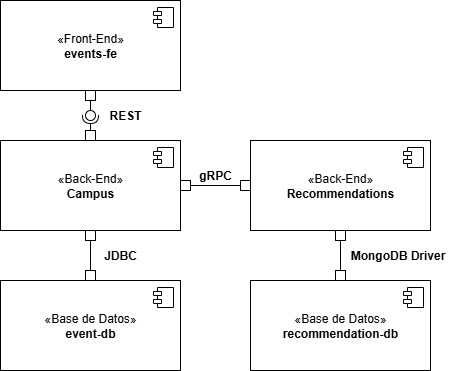

# Laboratorio 2 - Componentes y Conectores

## Información del estudiante
- **Nombre completo:** Gabriel Castiblanco Céspedes

---

## Vista de Componentes y Conectores
El siguiente diagrama representa la **Vista de Componentes y Conectores** del sistema, modelada con notación semi-formal en UML:

---

## Componentes

1. **Frontend (events-fe)**  
   - Tipo: Aplicación web (React + Nginx).  
   - Alcance: Proporciona la interfaz de usuario para interactuar con el sistema (solicitar y mostrar recomendaciones de eventos).  
   - Naturaleza: **Stateless** (solo sirve archivos estáticos).  

2. **Campus (Back-End)**  
   - Tipo: Microservicio en Spring Boot.  
   - Alcance: Expone APIs REST al frontend, gestiona eventos y usuarios, se comunica con la base de datos y con el servicio de Recomendaciones.  
   - Naturaleza: **Stateless** (solo lógica de negocio, sin persistencia interna más allá de la base de datos).  

3. **Recommendations (Back-End)**  
   - Tipo: Microservicio en Python (FastAPI + gRPC).  
   - Alcance: Ofrece recomendaciones personalizadas de eventos consultando su propia base de datos en MongoDB.  
   - Naturaleza: **Stateless** (procesa cada petición de manera independiente).  

4. **Event-db (Base de Datos)**  
   - Tipo: MySQL.  
   - Alcance: Almacena eventos, usuarios y datos de RSVP para el servicio Campus.  
   - Naturaleza: **Stateful**.  

5. **Recommendation-db (Base de Datos)**  
   - Tipo: MongoDB.  
   - Alcance: Almacena la información relacionada con las recomendaciones del servicio Recommendations.  
   - Naturaleza: **Stateful**.  

---

## Conectores

1. **Frontend → Campus**  
   - Tipo: **REST/HTTP**  
   - Naturaleza: **Sincrónico**  

2. **Campus → Event-db**  
   - Tipo: **JDBC/R2DBC (SQL)**  
   - Naturaleza: **Sincrónico**  

3. **Campus → Recommendations**  
   - Tipo: **gRPC**  
   - Naturaleza: **Sincrónico**  

4. **Recommendations → Recommendation-db**  
   - Tipo: **MongoDB Driver (Motor)**  
   - Naturaleza: **Asincrónico** (cliente no bloqueante para MongoDB)  

---
