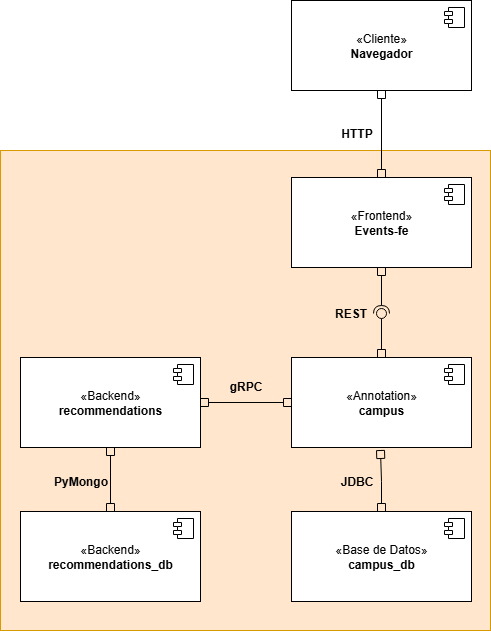
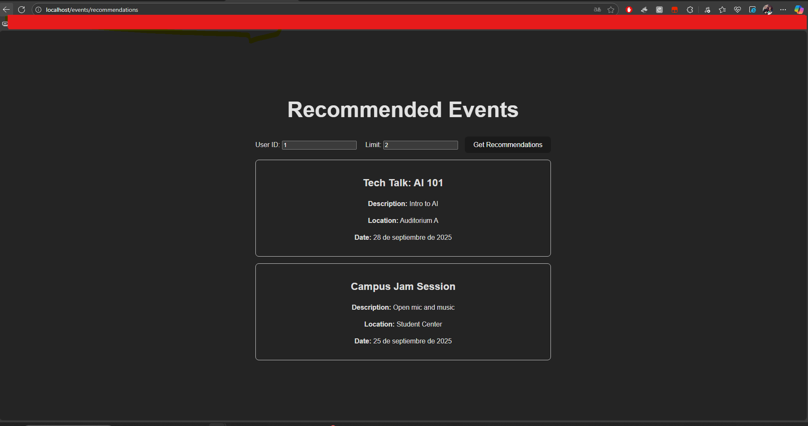

# LABORATORIO 2

---

## 3.4 Preguntas

### A. ¿Cuántos componentes forman parte del sistema?

Hay **5 componentes principales**:

- **Cliente (Navegador)**
- **Frontend events-fe (Vite + vue)**
- **Backend campus (Spring Boot)**
- **Backend recommendations (Python)**
- **Bases de datos:**
  - **campus_db (MySQL)**
  - **recommendations_db (MongoDB)**

### B. ¿Qué tipos de bases de datos hay en el sistema?

- **MySQL** (relacional) para `campus_db`
- **MongoDB** (NoSQL) para `recommendations_db`

### C. Alcance de cada componente

- **Cliente/Navegador:** Interfaz de usuario.
- **Frontend (events-fe):** Proporciona la interfaz de usuario y consume la API REST de campus.
- **Backend campus:** Backend principal que gestiona eventos, persiste en MySQL y llama a recommendations.
- **Backend recommendations:** Servicio de Python que genera recomendaciones y persiste en MongoDB.
- **campus_db:** Almacenamiento relacional de eventos.
- **recommendations_db:** Almacenamiento de documentos de recomendaciones.

### D. Sin estado vs. Sin estado con estado

- **Sin estado:** Frontend, Servicio de Campus, Servicio de Recomendaciones (sin estado interno; delegado a la base de datos).
- **Con estado:** `campus_db` (MySQL), `recommendations_db` (MongoDB).

---

## 3.5 Preguntas

### A. ¿Cuántos conectores tiene el sistema?

Cinco conectores principales:

1. Cliente → Frontend (HTTP)
2. Frontend → Campus (REST)
3. Campus → campus_db (JDBC)
4. Campus → Recomendaciones (gRPC)
5. Recomendaciones → recomendaciones_db (PyMongo)

### B. ¿Qué tipos de conectores se utilizan?

- **HTTP**
- **REST**
- **JDBC**
- **gRPC**
- **PyMongo**

### C. ¿Los conectores son síncronos o asíncronos?

Todos los conectores son **síncronos** (solicitud/respuesta): HTTP, REST, JDBC, gRPC, PyMongo.

---

### Bonus: Mala práctica en el proyecto de primavera (Campus)

El proyecto parece exponer **modelos de entidad JPA directamente en los controladores** (usando clases @Entity como DTO), esto es una mala práctica porque combina la persistencia con las capas de presentación y puede exponer campos sensibles.
Es mejor usar **DTO** o **modelos de vista** para las respuestas de la API.

---

## Diagrama de componentes 

---

## Evidencia

