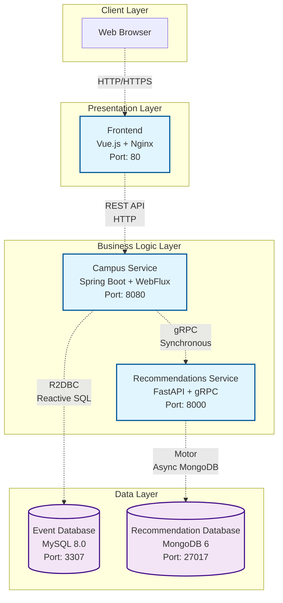

# [SwArch - 2025II] - Laboratory 2 (September 18)

**Nombre completo:** Jorge Andrés Torres Leal - Kevin Julian González Guerra

## Component-and-Connector View

### Diagrama de Arquitectura (Notación Semi-formal)



---

## Análisis de Componentes

### 3.4 Respuestas sobre Componentes

**A. ¿Cuántos componentes forman parte del sistema?**

El sistema está compuesto por **5 componentes principales**:

1. **Frontend (events-fe)** - Interfaz de usuario
2. **Campus** - Servicio de gestión de eventos
3. **Recommendations** - Servicio de recomendaciones
4. **Event-db** - Base de datos de eventos (MySQL)
5. **Recommendation-db** - Base de datos de recomendaciones (MongoDB)

**B. ¿Qué tipos de bases de datos están presentes en el sistema?**

El sistema utiliza **2 tipos de bases de datos**:

1. **MySQL 8.0** (event-db):
   - Base de datos relacional
   - Almacena eventos del campus, usuarios y RSVPs
   - Puerto: 3307 (externo) → 3306 (interno) ; En este caso esos son los puertos pues tenemos MySQL corriendo en el 3306 externo

2. **MongoDB 6** (recommendation-db):
   - Base de datos NoSQL orientada a documentos
   - Almacena datos de recomendaciones y patrones de usuario
   - Puerto: 27017

**C. ¿Cuál es el alcance de cada componente dentro de la arquitectura?**

| Componente | Alcance | Responsabilidades |
|------------|---------|-------------------|
| **Frontend** | Presentación | - Interfaz de usuario con Vue.js<br/>- Renderizado de eventos recomendados<br/>- Interacción con usuario |
| **Campus** | Lógica de Negocio | - API REST para gestión de eventos<br/>- Orquestación de servicios<br/>- Integración con recomendaciones |
| **Recommendations** | Lógica de Negocio | - Algoritmos de recomendación<br/>- Servicio gRPC<br/>- Análisis de patrones de usuario |
| **Event-db** | Persistencia | - Almacenamiento de eventos<br/>- Gestión de usuarios y RSVPs<br/>- Transacciones ACID |
| **Recommendation-db** | Persistencia | - Almacenamiento de datos de ML<br/>- Patrones de comportamiento<br/>- Escalabilidad horizontal |

**D. ¿Qué componentes son stateless vs. stateful?**

**Componentes Stateless:**
- **Frontend**: No mantiene estado del servidor, solo estado de UI local
- **Campus**: Servicio REST stateless, cada request es independiente
- **Recommendations**: Servicio gRPC stateless, procesa requests independientemente

**Componentes Stateful:**
- **Event-db (MySQL)**: Mantiene estado persistente de eventos, usuarios y RSVPs
- **Recommendation-db (MongoDB)**: Mantiene estado de patrones de recomendación y datos de ML

---

## Análisis de Conectores

### 3.5 Respuestas sobre Conectores

**A. ¿Cuántos conectores tiene el sistema?**

El sistema tiene **5 conectores principales**:

1. **HTTP/HTTPS** (Browser ↔ Frontend)
2. **REST API** (Frontend ↔ Campus)
3. **gRPC** (Campus ↔ Recommendations)
4. **R2DBC** (Campus ↔ Event-db)
5. **Motor/PyMongo** (Recommendations ↔ Recommendation-db)

**B. ¿Qué tipos de conectores se utilizan?**

| Conector | Tipo | Protocolo | Uso |
|----------|------|-----------|-----|
| **HTTP/HTTPS** | Request-Response | HTTP/1.1, HTTP/2 | Comunicación web cliente-servidor |
| **REST API** | Request-Response | HTTP + JSON | API RESTful para operaciones CRUD |
| **gRPC** | RPC | HTTP/2 + Protocol Buffers | Comunicación inter-servicios eficiente |
| **R2DBC** | Database Connector | MySQL Protocol | Acceso reactivo a base de datos |
| **Motor** | Database Connector | MongoDB Wire Protocol | Acceso asíncrono a MongoDB |

**C. ¿Los conectores son síncronos o asíncronos?**

| Conector | Naturaleza | Justificación |
|----------|------------|---------------|
| **HTTP/HTTPS** | **Síncrono** | Request-response bloqueante desde perspectiva del cliente |
| **REST API** | **Síncrono** | Operaciones HTTP síncronas con respuesta inmediata |
| **gRPC** | **Síncrono** | RPC bloqueante, aunque usa HTTP/2 para eficiencia |
| **R2DBC** | **Asíncrono** | Reactive Streams, operaciones no bloqueantes |
| **Motor** | **Asíncrono** | Driver asíncrono de MongoDB para Python |

---

## Pregunta Bonus

**En el proyecto Spring (campus), ¿cuál es la mala práctica vista con los modelos de entidad de BD?**

**Respuesta:** La mala práctica identificada es el **uso inconsistente de convenciones de nomenclatura en las columnas de base de datos**.

**Evidencia:**

```java
// En CampusEvent.java
@Table("campus_event")
public record CampusEvent(
  @Id @Column("caev_id") Long id,  // ❌ Prefijo críptico "caev_"
  String title,                    // ✅ Sin mapeo explícito
  String description,              // ✅ Sin mapeo explícito  
  String location,                 // ✅ Sin mapeo explícito
  @Column("event_date") LocalDateTime eventDate // ✅ Snake_case apropiado
)

// En User.java
@Table("user")
public record User(
  @Id @Column("user_id") Long id,  // ✅ Convención clara
  String name,                     // ✅ Sin mapeo explícito
  String email                     // ✅ Sin mapeo explícito
)

// En Rsvp.java  
@Table("rsvp")
public record Rsvp(
  @Id @Column("rsvp_id") Long id,  // ✅ Convención clara
  @Column("user_id") Long userId,  // ✅ Convención clara
  @Column("caev_id") Long eventId, // ❌ Prefijo críptico inconsistente
  // ...
)
```

**Problemas identificados:**

1. **Prefijo críptico "caev_"**: No es descriptivo ni sigue convenciones estándar
2. **Inconsistencia**: Mezcla prefijos crípticos con convenciones claras
3. **Mantenibilidad**: Dificulta la comprensión del esquema de base de datos
4. **Estándares**: No sigue convenciones de nomenclatura de Spring Data

**Solución recomendada:**
- Usar convenciones consistentes como `campus_event_id` en lugar de `caev_id`
- Mantener nomenclatura descriptiva y uniforme en todo el proyecto
- Seguir convenciones estándar de snake_case para columnas de base de datos

---

## Descripción de Componentes y Conectores

### Componentes

1. **Frontend (Vue.js + Nginx)**
   - **Tecnología**: Vue.js 3, Vite, Nginx
   - **Responsabilidad**: Interfaz de usuario para visualizar eventos recomendados
   - **Características**: SPA reactiva, comunicación REST con backend

2. **Campus (Spring Boot)**
   - **Tecnología**: Spring Boot 3, WebFlux, R2DBC, gRPC Client
   - **Responsabilidad**: API principal para gestión de eventos y orquestación
   - **Características**: Reactivo, integración con servicio de recomendaciones

3. **Recommendations (FastAPI + gRPC)**
   - **Tecnología**: FastAPI, gRPC, Motor (MongoDB async driver)
   - **Responsabilidad**: Servicio de recomendaciones basado en algoritmos de ML
   - **Características**: Alto rendimiento, comunicación gRPC

4. **Event Database (MySQL)**
   - **Tecnología**: MySQL 8.0
   - **Responsabilidad**: Persistencia de eventos, usuarios y RSVPs
   - **Características**: ACID, relacional, transaccional

5. **Recommendation Database (MongoDB)**
   - **Tecnología**: MongoDB 6
   - **Responsabilidad**: Almacenamiento de datos de recomendaciones
   - **Características**: NoSQL, escalable, flexible

### Conectores

1. **HTTP/REST**: Comunicación estándar web y API
2. **gRPC**: Comunicación eficiente inter-servicios
3. **R2DBC**: Acceso reactivo a base de datos relacional
4. **Motor**: Driver asíncrono para MongoDB
5. **HTTP/HTTPS**: Protocolo web estándar

---

## Conclusiones

El sistema implementa una **arquitectura de microservicios** con separación clara de responsabilidades:

- **Escalabilidad**: Servicios independientes escalables
- **Tecnología heterogénea**: Diferentes tecnologías optimizadas por dominio
- **Comunicación eficiente**: gRPC para inter-servicios, REST para cliente
- **Persistencia poliglota**: MySQL para datos transaccionales, MongoDB para ML
- **Reactividad**: Programación reactiva en componentes críticos

Esta arquitectura permite **alta disponibilidad**, **escalabilidad independiente** y **mantenibilidad** de cada componente del sistema.