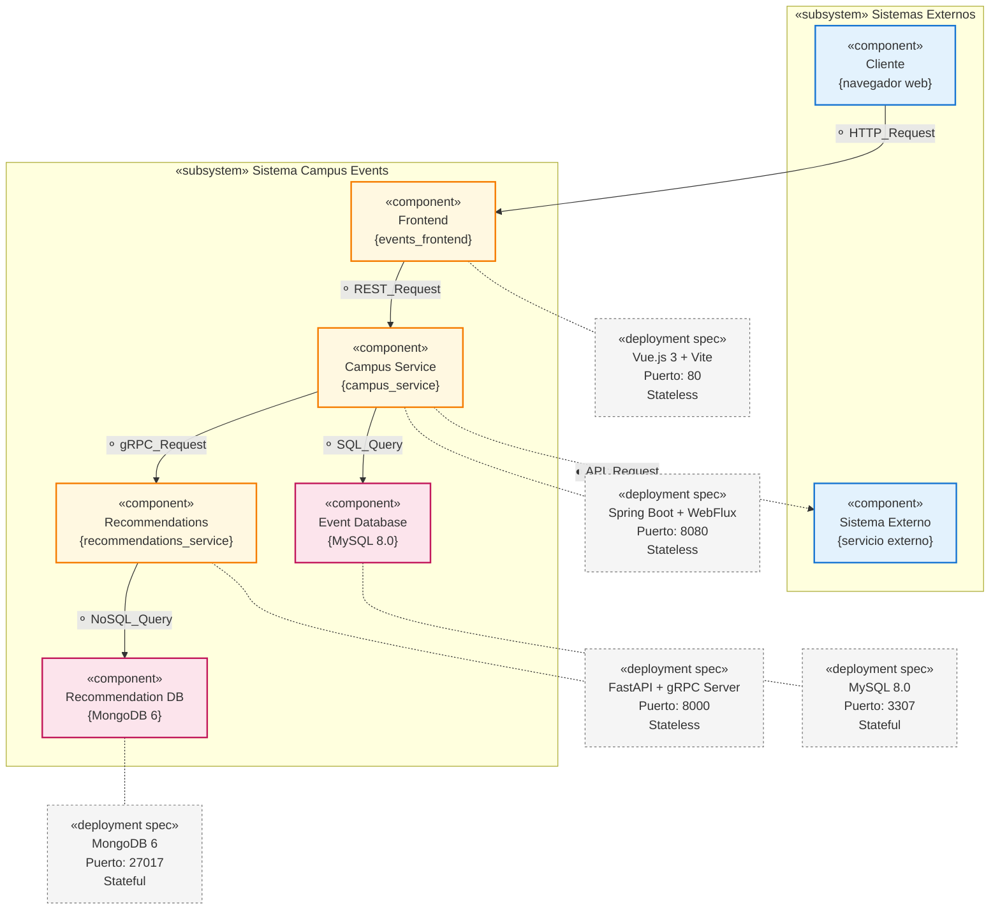

# [SwArch - 2025II] - Laboratory 2 (September 18)

**Nombre completo:** Jorge Andrés Torres Leal - Kevin Julian González Guerra

## Component-and-Connector View

### Diagrama de Componentes y Conectores (UML 2.0)



### Justificación UML 2.0

Este diagrama cumple con los estándares UML 2.0 para diagramas de componentes por las siguientes razones:

**Elementos UML 2.0 Implementados:**

1. **Estereotipos de Componentes**: Uso de `«component»` según la notación UML 2.0
2. **Subsistemas**: Agrupación con `«subsystem»` para organizar componentes relacionados
3. **Interfaces Proporcionadas**: Símbolo ⚬ (lollipop) representa interfaces que el componente proporciona
4. **Interfaces Requeridas**: Símbolo ◐ (socket) representa interfaces que el componente requiere
5. **Assembly Connectors**: Conectores que unen interfaces proporcionadas con interfaces requeridas
6. **Especificaciones de Despliegue**: Uso de `«deployment spec»` para detalles técnicos

**Diferencias con UML 1.x:**
- UML 2.0 introduce la notación con estereotipos `«component»` en lugar de los rectángulos con iconos de UML 1.x
- Los puertos y interfaces están claramente diferenciados según la especificación UML 2.0
- Los assembly connectors siguen la semántica de UML 2.0 para conectar servicios proporcionados con servicios requeridos

---

## Análisis de Componentes

### 3.4 Respuestas sobre Componentes

**A. ¿Cuántos componentes forman parte del sistema?**

El sistema está compuesto por **5 componentes principales**:

1. **Frontend (events-fe)** - Interfaz de usuario
2. **Campus** - Servicio de gestión de eventos
3. **Recommendations** - Servicio de recomendaciones
4. **Event-db** - Base de datos de eventos (MySQL)
5. **Recommendation-db** - Base de datos de recomendaciones (MongoDB)

**B. ¿Qué tipos de bases de datos están presentes en el sistema?**

El sistema utiliza **2 tipos de bases de datos**:

1. **MySQL 8.0** (event-db):
   - Base de datos relacional
   - Almacena eventos del campus, usuarios y RSVPs
   - Puerto: 3307 (externo) → 3306 (interno) ; En este caso esos son los puertos pues tenemos MySQL corriendo en el 3306 externo

2. **MongoDB 6** (recommendation-db):
   - Base de datos NoSQL orientada a documentos
   - Almacena datos de recomendaciones y patrones de usuario
   - Puerto: 27017

**C. ¿Cuál es el alcance de cada componente dentro de la arquitectura?**

| Componente | Alcance | Responsabilidades |
|------------|---------|-------------------|
| **Frontend** | Presentación | - Interfaz de usuario con Vue.js<br/>- Renderizado de eventos recomendados<br/>- Interacción con usuario |
| **Campus** | Lógica de Negocio | - API REST para gestión de eventos<br/>- Orquestación de servicios<br/>- Integración con recomendaciones |
| **Recommendations** | Lógica de Negocio | - Algoritmos de recomendación<br/>- Servicio gRPC<br/>- Análisis de patrones de usuario |
| **Event-db** | Persistencia | - Almacenamiento de eventos<br/>- Gestión de usuarios y RSVPs<br/>- Transacciones ACID |
| **Recommendation-db** | Persistencia | - Almacenamiento de datos de ML<br/>- Patrones de comportamiento<br/>- Escalabilidad horizontal |

**D. ¿Qué componentes son stateless vs. stateful?**

**Componentes Stateless:**
- **Frontend**: No mantiene estado del servidor, solo estado de UI local
- **Campus**: Servicio REST stateless, cada request es independiente
- **Recommendations**: Servicio gRPC stateless, procesa requests independientemente

**Componentes Stateful:**
- **Event-db (MySQL)**: Mantiene estado persistente de eventos, usuarios y RSVPs
- **Recommendation-db (MongoDB)**: Mantiene estado de patrones de recomendación y datos de ML

---

## Análisis de Conectores

### 3.5 Respuestas sobre Conectores

**A. ¿Cuántos conectores tiene el sistema?**

El sistema tiene **5 conectores principales**:

1. **HTTP/HTTPS** (Browser ↔ Frontend)
2. **REST API** (Frontend ↔ Campus)
3. **gRPC** (Campus ↔ Recommendations)
4. **R2DBC** (Campus ↔ Event-db)
5. **Motor/PyMongo** (Recommendations ↔ Recommendation-db)

**B. ¿Qué tipos de conectores se utilizan?**

| Conector | Tipo | Protocolo | Uso |
|----------|------|-----------|-----|
| **HTTP/HTTPS** | Request-Response | HTTP/1.1, HTTP/2 | Comunicación web cliente-servidor |
| **REST API** | Request-Response | HTTP + JSON | API RESTful para operaciones CRUD |
| **gRPC** | RPC | HTTP/2 + Protocol Buffers | Comunicación inter-servicios eficiente |
| **R2DBC** | Database Connector | MySQL Protocol | Acceso reactivo a base de datos |
| **Motor** | Database Connector | MongoDB Wire Protocol | Acceso asíncrono a MongoDB |

**C. ¿Los conectores son síncronos o asíncronos?**

| Conector | Naturaleza | Justificación |
|----------|------------|---------------|
| **HTTP/HTTPS** | **Síncrono** | Request-response bloqueante desde perspectiva del cliente |
| **REST API** | **Síncrono** | Operaciones HTTP síncronas con respuesta inmediata |
| **gRPC** | **Síncrono** | RPC bloqueante, aunque usa HTTP/2 para eficiencia |
| **R2DBC** | **Asíncrono** | Reactive Streams, operaciones no bloqueantes |
| **Motor** | **Asíncrono** | Driver asíncrono de MongoDB para Python |

---

## Pregunta Bonus

**En el proyecto Spring (campus), ¿cuál es la mala práctica vista con los modelos de entidad de BD?**

**Respuesta:** La mala práctica principal identificada es **usar las entidades de base de datos directamente como modelos de API/dominio** (persistence models = exposure models).

**Evidencia:**

```java
// En CampusEventController.java
@RestController
@RequestMapping("/v1")
public class CampusEventController {
    
    @GetMapping("/events")
    public Flux<CampusEvent> getEvents() {  // ❌ Retorna entidad directamente
        return campusEventService.getEvents();
    }

    @GetMapping("/events/recommendations")
    public Flux<CampusEvent> getRecommendedEvents(...) {  // ❌ Retorna entidad directamente
        return campusEventService.getRecommendedEvents(userId, limit);
    }
}

// En CampusEvent.java - Entidad de BD expuesta como API
@Table("campus_event")
public record CampusEvent(
    @Id @Column("caev_id") Long id,           // ❌ Detalles de BD expuestos
    String title,
    String description,
    String location,
    @Column("event_date") LocalDateTime eventDate  // ❌ Nombres de columnas expuestos
)
```

**¿Por qué es problemático?**

1. **Fuerte acoplamiento**: Cualquier cambio en la BD rompe el API
2. **Filtración de detalles**: Nombres de columnas (`caev_id`, `event_date`) se exponen en el API
3. **Evolución limitada**: Dificulta versionado y evolución del contrato público
4. **Validación ausente**: No hay validaciones específicas para el API
5. **Modelos anémicos**: Empuja hacia anti-patrones de agregados

**Problemas adicionales identificados:**

1. **Nombre de tabla reservado**: `@Table("user")` puede chocar con palabras reservadas de SQL
2. **Auditoría inconsistente**: Uso de `@ReadOnlyProperty` en lugar de `@CreatedDate`/`@LastModifiedDate`
3. **Nomenclatura inconsistente**: Mezcla de `snake_case` y campos sin `@Column` explícito
4. **Prefijo críptico**: `caev_id` no es descriptivo

**Solución recomendada:**

```java
// 1. Separar capas con DTOs
public record CampusEventResponse(
    Long id,
    String title,
    String description,
    String location,
    LocalDateTime eventDate
) {
    // Validaciones con jakarta.validation si es necesario
}

// 2. Controlador usando DTOs
@GetMapping("/events")
public Flux<CampusEventResponse> getEvents() {
    return campusEventService.getEvents()
        .map(this::toResponse);  // Mapeo explícito
}

// 3. Entidad solo para persistencia
@Table("campus_events")  // Evitar nombres reservados
public record CampusEvent(
    @Id @Column("campus_event_id") Long id,  // Nomenclatura descriptiva
    String title,
    String description,
    String location,
    @Column("event_date") LocalDateTime eventDate,
    @CreatedDate LocalDateTime createdAt,    // Auditoría apropiada
    @LastModifiedDate LocalDateTime updatedAt
)

// 4. Habilitar auditoría
@EnableJdbcAuditing  // En lugar de @ReadOnlyProperty
```

**Beneficios de la separación:**
- **Estabilidad del API**: Cambios en BD no afectan contratos públicos
- **Validación específica**: DTOs con validaciones apropiadas para cada contexto
- **Evolución independiente**: Versionado y cambios sin romper compatibilidad
- **Seguridad**: Control sobre qué datos se exponen
- **Mantenibilidad**: Responsabilidades claras entre capas

---

## Descripción de Componentes y Conectores

### Componentes

1. **Frontend (Vue.js + Nginx)**
   - **Tecnología**: Vue.js 3, Vite, Nginx
   - **Responsabilidad**: Interfaz de usuario para visualizar eventos recomendados
   - **Características**: SPA reactiva, comunicación REST con backend

2. **Campus (Spring Boot)**
   - **Tecnología**: Spring Boot 3, WebFlux, R2DBC, gRPC Client
   - **Responsabilidad**: API principal para gestión de eventos y orquestación
   - **Características**: Reactivo, integración con servicio de recomendaciones

3. **Recommendations (FastAPI + gRPC)**
   - **Tecnología**: FastAPI, gRPC, Motor (MongoDB async driver)
   - **Responsabilidad**: Servicio de recomendaciones basado en algoritmos de ML
   - **Características**: Alto rendimiento, comunicación gRPC

4. **Event Database (MySQL)**
   - **Tecnología**: MySQL 8.0
   - **Responsabilidad**: Persistencia de eventos, usuarios y RSVPs
   - **Características**: ACID, relacional, transaccional

5. **Recommendation Database (MongoDB)**
   - **Tecnología**: MongoDB 6
   - **Responsabilidad**: Almacenamiento de datos de recomendaciones
   - **Características**: NoSQL, escalable, flexible

### Conectores

1. **HTTP/REST**: Comunicación estándar web y API
2. **gRPC**: Comunicación eficiente inter-servicios
3. **R2DBC**: Acceso reactivo a base de datos relacional
4. **Motor**: Driver asíncrono para MongoDB
5. **HTTP/HTTPS**: Protocolo web estándar

---

## Conclusiones

El sistema implementa una **arquitectura de microservicios** con separación clara de responsabilidades:

- **Escalabilidad**: Servicios independientes escalables
- **Tecnología heterogénea**: Diferentes tecnologías optimizadas por dominio
- **Comunicación eficiente**: gRPC para inter-servicios, REST para cliente
- **Persistencia poliglota**: MySQL para datos transaccionales, MongoDB para ML
- **Reactividad**: Programación reactiva en componentes críticos

Esta arquitectura permite **alta disponibilidad**, **escalabilidad independiente** y **mantenibilidad** de cada componente del sistema.