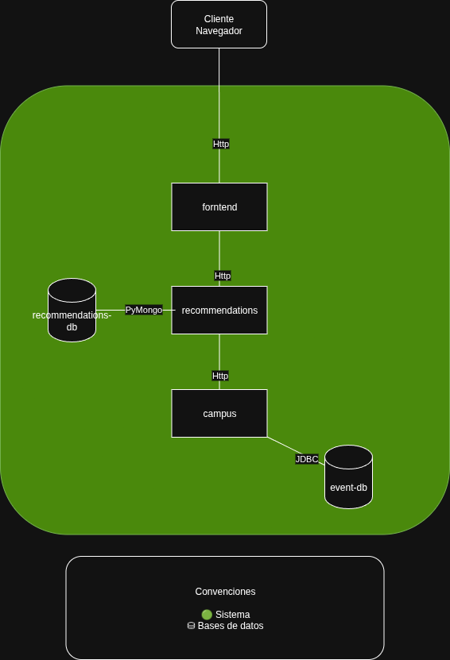

# Arquitectura del Sistema – Laboratorio 2
## Julián Andrés Vargas Gutiérrez
## Gabriel Felipe Gonzalez Bohorquez

Este documento resume el análisis de los **componentes** y **conectores** definidos en el archivo `docker-compose.yaml` ubicado en `SwArch/laboratories/laboratory_2/swarch-L2`.

---

## 1. Componentes

**A. How many components are part of the system?**  
El sistema cuenta con **5 componentes**:  
1. `frontend`  
2. `campus`  
3. `recommendations`  
4. `event-db` (MySQL)  
5. `recommendation-db` (MongoDB)  

---

**B. What types of databases are present in the system?**  
- **MySQL 8.0** → Base de datos relacional.  
- **MongoDB 6** → Base de datos NoSQL orientada a documentos.  

---

**C. What is the scope of each component within the architecture?**  
- **frontend** → Interfaz de usuario, expone la aplicación al cliente (puerto 80).  
- **campus** → Servicio backend principal, maneja la lógica de negocio de eventos y consume las recomendaciones.  
- **recommendations** → Microservicio especializado en sugerencias, conectado a MongoDB.  
- **event-db (MySQL)** → Persistencia de datos estructurados relacionados con eventos.  
- **recommendation-db (MongoDB)** → Persistencia flexible para las recomendaciones.  

---

**D. Which components are stateless vs. stateful?**  
- **Stateless**:  
  - `frontend`  
  - `campus`  
  - `recommendations`  

- **Stateful**:  
  - `event-db` (MySQL)  
  - `recommendation-db` (MongoDB)  

---

## 2. Conectores

**A. How many connectors does the system have?**  
El sistema tiene **4 conectores principales**:  
1. `frontend → campus` (HTTP)  
2. `campus → event-db` (MySQL TCP)  
3. `campus → recommendations` (HTTP)  
4. `recommendations → recommendation-db` (MongoDB TCP)  

---

**B. What types of connectors are used?**  
- **REST/HTTP** → comunicación entre frontend y backend.  
- **MySQL Connector (TCP 3306)** → comunicación con la base de datos de eventos.  
- **MongoDB driver (TCP 27017)** → comunicación con la base de datos de recomendaciones.  

---

**C. Are connectors synchronous or asynchronous?**  
Todos los conectores son **síncronos**, ya que:  
- HTTP (REST) implica que el cliente espera la respuesta del servidor.  
- Las conexiones a bases de datos (MySQL y MongoDB) son operaciones bloqueantes/síncronas.  

---

## 3. Diagrama de Componentes y Conectores

A continuación se muestra un diagrama semiformal que representa los componentes y sus conectores:

