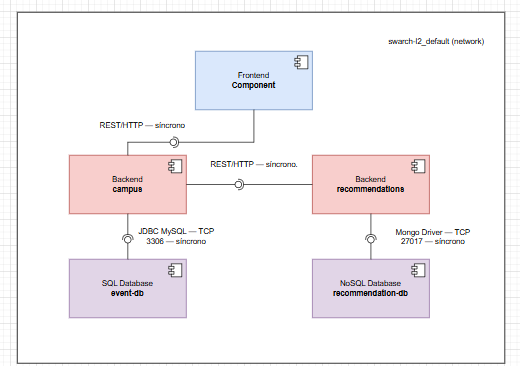

# Laboratory 2 — Components & Connectors
**Nombre:** Lizeth Mariana Garcia (lgarciadu)  
**Fecha:** 18 Sep 2025

## 1. Vista general (qué hice y qué corre)

Levanté el sistema con `docker compose up -d` en `laboratories/laboratory_2/swarch-L2`.  
Verifiqué servicios y puertos con `docker compose ps` y la definición con `docker compose config`.

**Servicios activos y puertos:**

- `frontend` → `swarch-l2-frontend` → **:80**
- `campus` → `swarch-l2-campus` (Spring Boot) → **:8080**
- `recommendations` → `swarch-l2-recommendations` (Python) → **:8000**
- `event-db` → `mysql:8.0` → **host 3307 → contenedor 3306**
- `recommendation-db` → `mongo:6` → **:27017**

**Red por defecto:** `swarch-l2_default` (bridge)

---

## 2. Componentes (qué son y para qué sirven)
Tomé como **componentes** los servicios del `docker compose` (cada servicio es una unidad desplegable con responsabilidades claras):

| Componente (servicio) | Tecnología / Imagen                  | Puerto expuesto | Rol / Alcance dentro de la arquitectura | Es stateful? |
|---|---|---:|---|:---:|
| `frontend` | Nginx (`swarch-l2-frontend`) | 80 | Sirve la UI estática y consume APIs internas | No |
| `campus` | Java Spring Boot (`swarch-l2-campus`) | 8080 | API backend principal (lógica de negocio) | No |
| `recommendations` | Python (`swarch-l2-recommendations`) | 8000 | API de recomendaciones (servicio especializado) | No |
| `event-db` | MySQL 8.0 | 3307→3306 | Base de datos relacional usada por `campus` | **Sí** |
| `recommendation-db` | MongoDB 6 | 27017 | Base de datos documental usada por `recommendations` | **Sí** |

**Clasificación stateless vs stateful**
- **Stateless**: `frontend`, `campus`, `recommendations` (procesan requests; no persisten estado por sí mismos).
- **Stateful**: `event-db` (MySQL), `recommendation-db` (MongoDB) (persisten datos).

**Total de componentes:** **5**  
**Tipos de bases de datos:** **MySQL 8.0** (relacional) y **MongoDB 6** (NoSQL documental).

---

## 3. Conectores (cómo se hablan los componentes)
A partir de puertos y variables de entorno en `docker compose config`:

- `frontend → campus` por **HTTP/REST** (el frontend llama a la API en `:8080`) → **Síncrono**
- `campus → recommendations` por **HTTP/REST** (UI a `:8000`) → **Síncrono**
- `campus → event-db` por **driver JDBC MySQL (TCP 3306)** usando env: `DB_HOST=event-db`, `DB_PORT=3306`, `DB_USERNAME=app`, `DB_PASSWORD=123` → **Síncrono**
- `recommendations → recommendation-db` por **driver Mongo (TCP 27017)** usando env: `MONGO_HOSTNAME=recommendation-db`, `MONGO_PORT=27017`, `MONGO_USERNAME=app`, `MONGO_PASSWORD=123` → **Síncrono**

No se observan colas de mensajería ni eventos; todos los conectores identificados son síncronos.

**Número de conectores internos:** **4**  
**Tipos de conectores:** **REST/HTTP**, **JDBC MySQL**, **Mongo driver**  
**Naturaleza:** todos **síncronos** (request/response o conexión directa a BD).

## 4. Diagrama (semi-formal)

