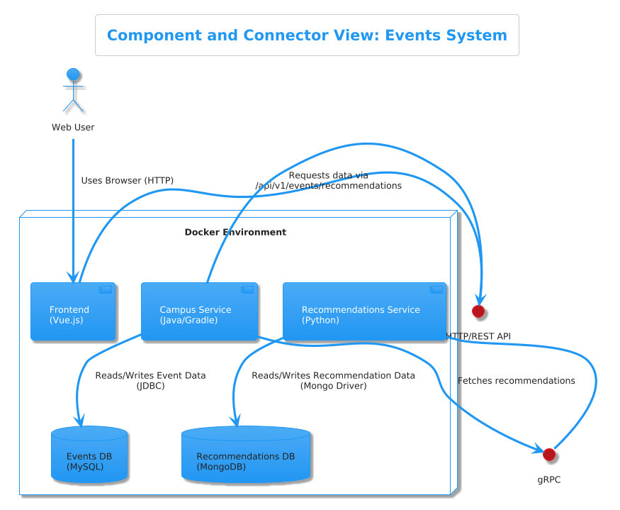

## Laboratorio 2 Arquitectura de Software 2025-ii
## Andrés Felipe Poveda Bellón

Análisis Arquitectónico del Sistema de Eventos

Este sistema se fundamenta en una arquitectura de microservicios compuesta por cinco componentes principales que trabajan en conjunto. La estructura incluye:
 Frontend: Su alcance se limita a la capa de presentación. Renderiza la interfaz de usuario, captura la entrada del usuario (como el ID de usuario y el límite) y se comunica con el Campus Service del backend para obtener y mostrar datos.

 Campus Service: Actúa como la puerta de enlace de la API (API Gateway) y la capa principal de lógica de negocio. Su alcance es exponer una API REST al frontend, orquestar llamadas a otros servicios (como el Recommendations Service) y gestionar los datos principales de la aplicación interactuando con la Events DB.

 Recommendations Service: Es un servicio especializado de responsabilidad única. Su alcance es encapsular toda la lógica y los datos relacionados con la generación de recomendaciones de eventos. Expone su funcionalidad a través de una interfaz gRPC.

 Events DB: Es la capa de persistencia con estado para los datos principales de la aplicación. Su alcance es almacenar, recuperar y garantizar la integridad de la información estructurada de los eventos.

 Recommendations DB: Es la capa de persistencia con estado para la funcionalidad de recomendaciones. Su alcance es almacenar cualquier dato que el Recommendations Service necesite, como perfiles de usuario, registros de interacción o modelos precalculados.

El alcance de cada componente está claramente definido. El Frontend actúa exclusivamente como la capa de presentación, encargándose de renderizar la interfaz y capturar las interacciones del usuario para luego comunicarse con el backend. Este se conecta con el Campus Service, que es el verdadero centro neurálgico del sistema, funcionando como API Gateway y capa de lógica de negocio. Su responsabilidad es exponer una API REST, orquestar las llamadas a otros microservicios y gestionar los datos principales en la Events DB. Por su parte, el Recommendations Service es un componente de responsabilidad única, cuya única función es encapsular la lógica para generar recomendaciones de eventos, exponiendo su funcionalidad a través de una eficiente interfaz gRPC. Finalmente, las bases de datos sirven como las capas de persistencia: la Events DB garantiza la integridad de los datos estructurados, mientras que la Recommendations DB ofrece la flexibilidad necesaria para los datos que impulsan las recomendaciones.

Los servicios de la aplicación —Frontend, Campus Service y Recommendations Service— están diseñados para ser stateless (sin estado), lo que significa que no guardan información de sesiones pasadas y pueden escalarse horizontalmente con facilidad. En contraste, las bases de datos, Events DB y Recommendations DB, son inherentemente stateful (con estado), ya que su propósito fundamental es almacenar y gestionar los datos de la aplicación de manera persistente.

La comunicación entre estos componentes se logra a través de cuatro conectores internos principales, cada uno seleccionado para una tarea específica. La interacción del cliente con el servidor se da mediante una llamada API HTTP/REST desde el Frontend al Campus Service. Para la comunicación interna entre servicios, se utiliza gRPC, un conector más eficiente y fuertemente tipado, para enlazar el Campus Service con el Recommendations Service. La conexión con las bases de datos se realiza a través de controladores específicos: JDBC para la comunicación entre el Campus Service y MySQL, y un Mongo Driver para la interacción entre el Recommendations Service y MongoDB. Es importante destacar que todos estos conectores operan de manera síncrona: cada solicitud espera una respuesta antes de continuar el proceso, como lo demuestra el uso de await fetch en el código del frontend.