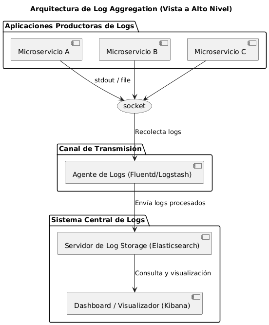

# Análisis técnico de patrones arquitectónicos

## A) In your own technical words, what is the fundamental problem that the Microfrontends pattern aims to solve? How does it solve it?

### A.1) Microfrontends

### Problema principal que pretende resolver
Los **microfrontends** abordan el problema del **monolitismo en la capa de presentación**: un frontend grande y acoplado que dificulta el desarrollo paralelo, los despliegues independientes, la evolución tecnológica y la escalabilidad del proceso de entrega.  
También solucionan la falta de **límites de responsabilidad claros** dentro de aplicaciones web complejas, reduciendo tiempos de compilación, pruebas y riesgos de regresión.

### Cómo lo hace (técnicamente)
- **Fragmentación por dominio o funcionalidad:** la interfaz se divide en módulos independientes (por ruta, área funcional o widget), cada uno mantenido por un equipo.  
- **Composición flexible:** los módulos se ensamblan en tiempo de *build* o en tiempo de ejecución mediante:
  - *Server-side composition* (ensamblado en el servidor),
  - *Client-side composition* (carga dinámica),
  - *Iframes* (aislamiento fuerte),
  - *Webpack Module Federation* (compartición controlada de código).  
- **Despliegue independiente:** cada microfrontend se construye y publica como artefacto autónomo, permitiendo versiones desacopladas.  
- **Aislamiento técnico:** se evitan conflictos de CSS/JS usando *CSS Modules*, *Shadow DOM* o *namespaces*.  
- **Contratos bien definidos:** la comunicación entre módulos se basa en APIs, eventos o props, usando REST/GraphQL o *custom events*.  
- **Gestión de dependencias compartidas:** librerías comunes (p. ej. React, Vue) pueden compartirse en tiempo de ejecución o empacarse individualmente.  

**Consecuencia técnica:** mayor autonomía de equipos y velocidad de entrega, pero con mayor complejidad en orquestación, rendimiento y gobernanza.

### A.2) Log Aggregation

### Problema principal que pretende resolver
El patrón de **agregación de logs** aborda la falta de **observabilidad centralizada** en sistemas distribuidos.  
En entornos de microservicios, los registros están dispersos entre múltiples instancias y contenedores, lo que dificulta su búsqueda, correlación y análisis.  
Sin una estrategia de agregación, depurar fallos, auditar y generar alertas es ineficiente.

### Cómo lo hace (técnicamente)
- **Recolección distribuida:** agentes ligeros (p. ej. *Filebeat*, *Fluentd*, *Vector*, *Promtail*) capturan logs desde archivos locales, `stdout`, `stderr` o sistemas de logging del host.  
- **Normalización y estructuración:** los registros se transforman en formato estructurado (JSON) y se enriquecen con metadatos como `timestamp`, `host`, `service`, `trace-id` o `severity`.  
- **Transporte confiable:** los agentes envían los datos a un *pipeline* central mediante protocolos como HTTP, gRPC, Kafka o Syslog, con *buffering* y reintentos.  
- **Indexación y almacenamiento centralizado:** herramientas como *ELK/EFK Stack*, *Graylog*, *Splunk* o *Loki* almacenan e indexan los eventos para consultas rápidas.  
- **Correlación de eventos:** se usan identificadores globales (`trace-id`, `request-id`) para reconstruir el flujo de ejecución entre servicios.  
- **Procesamiento y retención:** los *pipelines* aplican filtros, alertas y políticas de retención (niveles *hot/warm/cold*).  
- **Consulta y monitoreo:** paneles, búsquedas ad-hoc y alertas automatizadas permiten detección y diagnóstico rápido de problemas.  
- **Seguridad y acceso:** control mediante roles, cifrado en tránsito y políticas sobre índices o buckets.

**Consecuencia técnica:** mejora la visibilidad y reduce el tiempo de resolución de incidentes, aunque introduce costes y complejidad en la infraestructura de observabilidad.

---

## B) How does this pattern impact system coupling and cohesion?

### B.1) Microfrontends

### Acoplamiento
El patrón de **microfrontends** busca **reducir el acoplamiento** entre las partes del sistema en la capa de presentación.  
Cada módulo (microfrontend) es autónomo y se comunica con otros mediante **interfaces bien definidas** (APIs o eventos), evitando dependencias directas de código.  
Sin embargo, puede aparecer **acoplamiento implícito** si los módulos comparten estados globales, estilos o librerías de manera descontrolada.

- **Efecto técnico:** acoplamiento *débil* a nivel de despliegue y código, pero riesgo de acoplamiento *lógico* si no se definen límites claros de dominio.

### Cohesión
Los microfrontends **aumentan la cohesión** interna al organizar cada módulo alrededor de un dominio funcional o contexto de negocio (p. ej. “Catálogo”, “Carrito”, “Perfil”).  
Esto refuerza la responsabilidad única del módulo y facilita su evolución independiente.

- **Efecto técnico:** cohesión *alta* dentro de cada microfrontend, al estar orientado a un objetivo funcional específico.

### B.2) Log Aggregation

### Acoplamiento
La **agregación de logs** introduce un **acoplamiento indirecto** entre los servicios y la infraestructura de observabilidad.  
Cada componente debe emitir logs en un formato o protocolo compatible con el sistema central (p. ej. JSON estructurado, uso de `trace-id`).  
Sin embargo, este acoplamiento es **débil y técnico**, no funcional: los servicios no dependen entre sí, solo del mecanismo de logging.

- **Efecto técnico:** acoplamiento *técnico débil* hacia un sistema de observabilidad común, manteniendo independencia entre microservicios.

### Cohesión
Este patrón **aumenta la cohesión transversal** del sistema, ya que centraliza la responsabilidad de monitoreo y análisis en un único punto.  
No afecta directamente la cohesión funcional de los servicios, pero mejora la coherencia en cómo el sistema maneja la trazabilidad y el diagnóstico.

- **Efecto técnico:** cohesión *alta* en el subsistema de observabilidad, sin impacto negativo en la cohesión interna de los servicios.

---

### Conclusión técnica

| Patrón           | Acoplamiento                               | Cohesión                                          |
|------------------|---------------------------------------------|--------------------------------------------------|
| **Microfrontends** | Débil entre módulos, fuerte si comparten estado o dependencias globales | Alta dentro de cada módulo funcional |
| **Log Aggregation** | Débil y técnico hacia la infraestructura de logging | Alta en el dominio de observabilidad |

Ambos patrones, bien aplicados, tienden a **reducir el acoplamiento** y **aumentar la cohesión** dentro de sus respectivos ámbitos, contribuyendo a sistemas más mantenibles y escalables.

## C) Explain the fundamental mechanism of the pattern.

### C.1) Microfrontends

### Mecanismo fundamental
El patrón **Microfrontends** se basa en **dividir la interfaz de usuario monolítica** en múltiples **módulos front-end independientes**, donde cada uno representa una parte funcional del sistema y es desarrollado, desplegado y versionado de manera autónoma.

Cada microfrontend:
- Se **integra dinámicamente** en la aplicación principal (a menudo llamada *shell* o *host*) mediante técnicas como:
  - **Module Federation** (Webpack 5),
  - **iframes**,
  - **Web Components**, o
  - **Single-SPA / import remoto**.
- Se comunica con otros módulos a través de **eventos**, **mensajes** o **APIs compartidas**, evitando referencias directas de código.
- Mantiene su propio **ciclo de vida independiente**: puede actualizarse o escalarse sin afectar a los demás.

En resumen, el mecanismo clave es la **composición dinámica de interfaces distribuidas**, donde cada módulo es una unidad funcional autónoma que coopera en tiempo de ejecución para formar la aplicación completa.

### C.2) Log Aggregation

### Mecanismo fundamental
El patrón **Log Aggregation** funciona mediante la **recolección, normalización y centralización de registros (logs)** generados por los distintos microservicios de un sistema distribuido.

El proceso típico implica tres pasos técnicos:

1. **Emisión de logs estructurados:**  
   Cada servicio genera registros en un formato uniforme (generalmente JSON), incluyendo metadatos como `timestamp`, `service-id`, `trace-id` y `log-level`.

2. **Transporte y almacenamiento centralizado:**  
   Los logs se envían —mediante protocolos como **Fluentd**, **Logstash**, o **Filebeat**— a un **sistema de agregación** (por ejemplo, **Elasticsearch**, **Graylog**, **Splunk**, o **Grafana Loki**).

3. **Indexación y análisis:**  
   Los datos son indexados para permitir **búsqueda, correlación y visualización** de eventos, facilitando el monitoreo, la trazabilidad de errores y la auditoría del sistema.

En esencia, el mecanismo clave es la **canalización centralizada de eventos de logging**, que convierte flujos de logs distribuidos en información estructurada y consultable.

---

### Comparación técnica

| Patrón | Mecanismo central | Nivel de operación |
|--------|--------------------|--------------------|
| **Microfrontends** | Composición dinámica de interfaces front-end independientes | Capa de presentación |
| **Log Aggregation** | Centralización y análisis de logs estructurados emitidos por múltiples servicios | Capa de observabilidad / infraestructura |

Ambos patrones aportan independencia modular, pero en niveles distintos del sistema: uno en la **UI** y otro en la **monitorización**.

## D) Illustrate the architecture at a high level.

### D.1) Microfrontends

### D.2) Log aggregation

## E) What are the main benefits?

| Patrón             | Enfoque               | Beneficios clave                                                   |
|--------------------|------------------------|---------------------------------------------------------------------|
| **Microfrontends** | Frontend (UI)          | Escalabilidad, autonomía de equipos, despliegue independiente       |
| **Log Aggregation**| Observabilidad / Logs  | Visibilidad global, trazabilidad, monitoreo, auditoría              |

## F) What complexities or downsides appear? What trade-offs does it introduce in terms of performance, complexity, or security?

### Microfrontends

- **Coordinación entre equipos**
  - Aunque los equipos son independientes, aún deben alinearse en ciertos estándares (UI, diseño, rutas, etc.).

- **Carga inicial y rendimiento**
  - Cargar múltiples bundles JavaScript puede afectar el tiempo de carga si no se optimiza correctamente.

- **Gestión del estado global**
  - Compartir o sincronizar el estado entre microfrontends (por ejemplo, sesión de usuario) puede ser complejo.

- **Routing y navegación**
  - Implementar un sistema de rutas común sin colisiones entre microfrontends requiere una estrategia clara (por ejemplo, routing basado en host o en rutas hijas).

- **Consistencia visual**
  - Mantener una experiencia de usuario coherente (estilos, componentes, comportamiento) entre microfrontends es difícil si no hay un diseño centralizado.

- **Sobrecarga tecnológica**
  - Si se usan múltiples frameworks (React, Angular, etc.), puede haber duplicación de librerías, aumentando el tamaño del bundle.

---

### Log Aggregation

- **Volumen de datos**
  - En sistemas con muchos microservicios, el volumen de logs puede crecer exponencialmente, afectando rendimiento y costos de almacenamiento.

- **Formato de logs inconsistente**
  - Si los equipos no siguen un estándar de log (JSON, campos clave, nivel de severidad), se dificulta el análisis y la búsqueda.

- **Correlación entre servicios**
  - Requiere implementar correctamente **IDs de correlación** (trace IDs) para seguir el rastro de una solicitud entre servicios.

- **Complejidad operativa**
  - Configurar, mantener y escalar herramientas como ELK, Loki, o Fluentd requiere conocimiento especializado.

- **Latencia en el acceso**
  - En algunos casos, los logs no aparecen en tiempo real debido a buffers, reintentos o problemas de red.

- **Seguridad y privacidad**
  - Los logs pueden contener datos sensibles; es fundamental aplicar políticas de anonimización y control de acceso.

## G) Describe a realistic system that would use this pattern.

### Microfrontends – Plataforma de eCommerce

Una tienda online grande (como Amazon o Mercado Libre) divide su sitio web en módulos independientes: productos, carrito, pagos, perfil, etc.
Cada módulo es desarrollado y desplegado por un equipo distinto, usando tecnologías diferentes (React, Vue, Angular).
Esto permite mayor autonomía, actualizaciones rápidas y escalabilidad en el frontend.

### Log Aggregation – Plataforma SaaS de gestión empresarial

Una app SaaS con múltiples microservicios (autenticación, pagos, notificaciones, reportes) centraliza todos sus logs usando herramientas como Elasticsearch + Kibana o Grafana Loki.
Cada servicio envía logs estructurados con un ID de trazabilidad. Esto facilita el monitoreo, la depuración y la auditoría de errores en entornos distribuidos.

 ---
# Analisis de los escenario especificos

## Escenario 1 – PagoGlobal

### Contexto resumido

- **Empresa:** PagoGlobal, fintech colombiana.
- **Servicio crítico:** `PaymentProcessor`, maneja millones de transacciones.
- **Dependencia externa:** `FraudBlocker`, usado solo para transacciones > $100,000 COP.
- **Problema:** `FraudBlocker` no falla, pero se vuelve extremadamente lento en picos (brownout), causando:

  - Bloqueo del thread pool de `PaymentProcessor`.
  - Rechazo de todas las solicitudes, incluso las que no requieren validación de fraude.
  - Caída total durante 45 minutos con gran impacto económico.

---

### Análisis profundo del escenario

### Naturaleza del problema

- **Brownouts son más peligrosos que fallos totales:** el servicio lento no activa mecanismos de error tradicionales.
- **Bloqueo por diseño sin control de recursos:** las llamadas a `FraudBlocker` bloquean el mismo recurso que otras operaciones críticas.
- **Falta de aislamiento:** una dependencia no esencial para todas las operaciones causa una caída total.
- **Timeout inadecuado:** 20 segundos por llamada es demasiado para un servicio de alta concurrencia.
- **Riesgo de cascada:** cuando los recursos (hilos) se agotan, el sistema completo falla.

---

## Características clave del sistema

| Característica                          | Implicación arquitectónica                            |
|----------------------------------------|--------------------------------------------------------|
| Alta concurrencia                      | Se requieren soluciones no bloqueantes o aisladas     |
| Dependencia crítica con rendimiento variable | Se necesita protección frente a degradación         |
| Lógica condicional (fraude > $100,000) | Posible separación del flujo crítico y no crítico     |
| Impacto total por fallo parcial        | Se necesita contener el impacto de fallos externos    |

---

## Recomendación arquitectónica: 2 patrones clave

### 1. Circuit Breaker

#### Qué es:
Un mecanismo que "abre el circuito" y deja de llamar a un servicio cuando detecta que está fallando o está lento.

#### Por qué es adecuado aquí:

- Evita hacer más llamadas a `FraudBlocker` cuando ya está lento.
- Libera recursos en `PaymentProcessor` y evita saturación por espera.
- Permite definir un fallback (por ejemplo, rechazar o marcar transacción como "pendiente").

#### Cómo implementarlo:
- Usar herramientas como **Resilience4j**, **Istio**, o **Envoy**.
- Configurar:
  - **Timeout:** 2–3 segundos.
  - **Thresholds:** número de fallos o lentitud para abrir el circuito.
  - **Recovery time:** para volver a probar después de cierto tiempo.

---

### 2. Bulkhead

#### Qué es:
Un patrón que separa recursos (como hilos, procesos o contenedores) para que una parte del sistema no afecte a otra.

#### Por qué es adecuado aquí:

- Permite aislar las llamadas a `FraudBlocker` en su propio grupo de recursos (por ejemplo, un thread pool separado).
- Si el pool se llena, solo las transacciones > $100,000 COP fallan.
- Las transacciones normales (< $100,000) siguen siendo procesadas con normalidad.

#### Cómo implementarlo:
- Configurar un **pool de hilos dedicado** para las llamadas a `FraudBlocker`.
- O separar en un **microservicio especializado de validación antifraude**, que el `PaymentProcessor` invoque solo cuando sea necesario.

---

## Alternativa a considerar a mediano plazo

### Queue-Based Isolation (asincronía con colas)

Convertir el chequeo de fraude en una tarea asincrónica para desacoplar completamente del flujo en tiempo real. Sin embargo, **esto implica cambios en la experiencia del usuario y en los flujos de negocio**, por lo que es mejor considerarlo como un rediseño a mediano plazo.

---

## Conclusión final

> **El problema no es que `FraudBlocker` falle, sino que lo hace lentamente y sin control, afectando todo el sistema.**

Por tanto, la solución debe enfocarse en **aislar el impacto de la dependencia lenta** y **proteger el núcleo del sistema de pagos**.

### Patrones recomendados:

1. **Circuit Breaker** – Para detectar y cortar llamadas lentas a `FraudBlocker`.
2. **Bulkhead** – Para aislar recursos y evitar que una parte del sistema bloquee a todo lo demás.

Aplicados correctamente, estos patrones garantizarán que:

- Las transacciones que **no requieren fraude** sigan funcionando.
- Las llamadas a `FraudBlocker` **no saturen** el sistema.
- El sistema degrade con gracia, **sin colapsar completamente**.

 ## Escenario 2 - MiSalud Digital

## 📘 Contexto resumido

- **Plataforma:** MiSalud Digital, sistema de historia clínica electrónica nacional.
- **Estructura:** Más de 70 microservicios, desarrollados por múltiples equipos en diferentes lenguajes.
- **Problemas críticos detectados antes del lanzamiento:**

1. Requisito de **seguridad Zero-Trust** con **mutual TLS (mTLS)** obligatorio entre servicios.
2. Necesidad de **auditoría fina y centralizada** para accesos a datos sensibles.
3. Soporte para **canary releases** (ej. 1% de tráfico a nueva versión).
4. Inconsistencia total en **resiliencia** (timeouts, retries) por diferencias entre tecnologías y librerías personalizadas.
5. Uso de "common libraries" ha resultado ineficiente y difícil de mantener.

## Análisis profundo del escenario

| Característica                         | Implicación arquitectónica                               |
|----------------------------------------|-----------------------------------------------------------|
| Arquitectura grande (70+ servicios)   | Alta complejidad operativa                                |
| Equipos independientes y poliglotas   | Difícil estandarizar lógica dentro del código             |
| Requisitos de seguridad críticos      | Necesario aplicar políticas a nivel de red, no solo código|
| Auditoría y trazabilidad              | Centralización y protección contra manipulación           |
| Despliegue progresivo                 | Requiere control avanzado de tráfico                      |
| Inconsistencia en resiliencia         | Riesgo de comportamiento no predecible en fallos          |

---

## Recomendación arquitectónica: 1 patrón principal

### **Service Mesh** (🔑 Patrón más adecuado)

#### Qué es:
Una capa de infraestructura que se encarga de la comunicación entre microservicios, **desacoplando la lógica de red, seguridad, auditoría y resiliencia del código de aplicación**.

Herramientas comunes: **Istio**, **Linkerd**, **Consul Connect**

---

## Por qué Service Mesh es ideal aquí

### 1. Seguridad Zero-Trust con mTLS

- Service Mesh gestiona automáticamente certificados TLS y autenticación mutua entre servicios.
- No requiere que cada servicio implemente su propio stack de seguridad.
- Cumple fácilmente con los requisitos de cifrado interno exigidos por regulación.

### 2. Auditoría de tráfico a nivel de red

- Permite **observabilidad detallada** de cada llamada entre servicios: origen, destino, URL, latencia.
- Logs generados por el **sidecar proxy** (como Envoy) son **externos e inmutables**, cumpliendo con requisitos de no manipulación.

### 3. Canary Releases / Progressive Rollouts

- Service Mesh puede enrutar dinámicamente porcentajes específicos de tráfico a diferentes versiones.
- Ejemplo: 1% al nuevo `Appointment-Scheduler v2`, 99% al estable.
- Todo configurable sin tocar el código de los servicios.

### 4. Resiliencia consistente

- Timeouts, retries, circuit breakers y políticas de fallos se configuran de forma **uniforme** a nivel de malla.
- Se eliminan las diferencias entre implementaciones en Java, Node.js, Python, etc.
- Los desarrolladores no tienen que implementar esa lógica en cada lenguaje.

---

## Alternativa descartada: Common Libraries

Aunque parecía una solución lógica, ha demostrado ser:

- Lenta de mantener.
- Difícil de coordinar entre 70+ servicios.
- Inviable en entornos poliglotas.
- Incompatible con cambios rápidos en políticas de seguridad o monitoreo.

---

## Conclusión final

> **El problema principal no es técnico, sino de gobernanza, estandarización y control operacional a escala.**

Por tanto, la solución debe abstraer la lógica común fuera del código, y gestionarla de forma centralizada y consistente.

### Patrón recomendado:

| Patrón         | Por qué aplicarlo                                          |
|----------------|------------------------------------------------------------|
| **Service Mesh** | Proporciona seguridad, auditoría, resiliencia y routing progresivo sin tocar el código |

---

## Beneficios directos de aplicar Service Mesh

| Requisito del escenario       | Resuelto con Service Mesh        |
|-------------------------------|----------------------------------|
| mTLS obligatorio              |  Certificados automáticos y rotación |
| Auditoría completa            |  Logging de tráfico externo y estructurado |
| Canary releases               |  Routing granular por porcentaje, headers, etc. |
| Resiliencia inconsistente     |  Timeouts, retries y circuit breakers centralizados |
| Poliglotismo + 70 servicios   | ✅Desacopla lógica común del lenguaje y del equipo |

