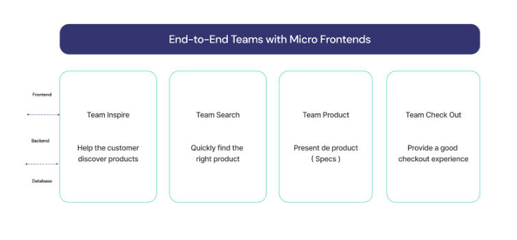
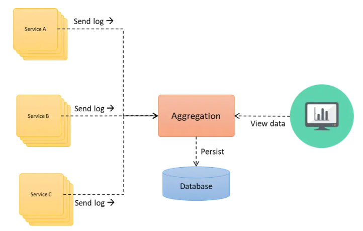

# Laboratorio 4  
**Integrantes:**  
- Gabriel Castiblanco Céspedes - gcastiblancoc
- Javier Esteban Martínez - jmartinezgi
- Lizeth Mariana García - lgarciadu

---

## Micro FrontEnds

### In your own technical words, what is the fundamental problem that the Microfrontends pattern aims to solve? How does it solve it?  
El problema fundamental que resuelve está arquitectura es el alto acoplamiento que existe en el componente Front End tradicional o de tipo monolito, pues en este patrón, todos los módulos se encuentran desarrollados en un mismo componente.
Cada función de la aplicación de front end se maneja como un servicio independiente en módulos autocontenidos.

### How does this pattern impact system coupling and cohesion?  
Aunque el acoplamiento no desaparece, pues se debe tener en cuenta la correcta integración y diseño, al considerar módulos independientes este se ve reducido con respecto al monolito en términos de desarrollo, pues por cada componente existe un equipo responsable, y que usa lenguajes o frameworks específicos que pueden diferir de los otros módulos, lo cual da más flexibilidad. Por otro lado, el sistema debe seguir conservando su cohesión entre los micro frontends para poder entregar una experiencia y funcionalidad correcta a los usuarios.

### Explain the fundamental mechanism of the pattern  
Se basa en una organización vertical, con una arquitectura menos compleja que divide la aplicación en pequeñas funciones independientes, implementando simultáneamente cada una, desde el backend hasta el frontend, por un mismo equipo de trabajo.

### Illustrate the architecture at a high level  

### What are the main benefits?  
- Ser independiente de la tecnología: Cada equipo de trabajo tiene la libertad de adoptar el stack tecnológico que desee, sin tener que coordinarse con otros equipos.
- El código de la aplicación de cada equipo está aislado: No se comparte tiempo de ejecución entre los diferentes equipos de trabajo, aun cuando utilicen el mismo framework. Por tanto, en las aplicaciones no existen variables globales ni estados compartidos.
- Implementaciones independientes: Con la arquitectura micro frontend, las funciones de una aplicación monolítica son separadas para convertirlas en diferentes sub-aplicaciones que son implementadas de forma independiente por diferentes equipos de trabajo, en lugar de implementar todas las funciones de una vez.
- Mayor rendimiento: En una aplicación monolítica debe cargarse siempre toda la aplicación, aunque no todas sus partes sean utilizadas, haciendo que su tiempo inicial de carga sea alto. Con la arquitectura micro frontend se carga bajo demanda un módulo específico de la aplicación, con lo cual se reduce el tiempo inicial de carga.
- Implementación más rápida: Al implementarse cada función de forma independiente, la velocidad de desarrollo se incrementa significativamente. Para corregir o agregar algo dentro de una función no hay que ejecutar toda la aplicación.
- Confiabilidad: Si uno de los módulos presenta fallas, los otros seguirán funcionando. Esto es muy importante para una aplicación grande, por tener múltiples funciones independientes.

### What complexities or downsides appear? What trade-offs does it introduce in terms of performance, complexity, or security?  
- Tamaño del payload: Los módulos independientes de JavaScript, por ejemplo, pueden generar una duplicación de dependencias, lo cual aumenta el número de bytes que hay que enviar en la red hacia los usuarios. Por lo tanto, la experiencia de usuario puede ser más lenta en comparación a un sistema con un monolito de front end.  
- Diferencias de ambientes: Cuando se desarrollan los módulos independientes se pueden ejecutar aislados. Sin embargo, existen unos riesgos de desarrollar en ambientes que son muy diferentes al de producción. Si el contenedor de desarrollo se comporta muy diferente al de producción, puede ocasionar que los micro frontends se ejecuten de forma incorrecta. 
- Integración más compleja: se deben coordinar aspectos como enrutamiento, diseño y funcionalidad compartida entre los micro frontEnds.
- Uso de dependencias: puesto que los módulos se desarrollan de forma independiente puede existir conflictos en el uso de distintas versiones de librerías, impactando en la integración, funcionamiento y/o seguridad.
- Superficie de ataque más amplia: al considerar más componentes de frontEnd se pueden considerar como posibles puntos de entrada para vulnerabilidades.
- Mayor latencia: existe también la posibilidad de que la latencia se vea aumentada pues al cargar los módulos de forma dinámica e independiente se puede tener cierto delay en las primeras interacciones del usuario.

### Describe a realistic system that would use this pattern  
Un sistema que usa micro frontends sería una plataforma de e-commerce grande como Amazon, Mercado Libre o Shopify. En este tipo de sistema cada parte visible del sitio, como la página de productos, el carrito, el perfil del usuario, las recomendaciones y el chat de soporte, puede ser desarrollada y desplegada de forma independiente por distintos equipos, usando incluso diferentes frameworks. Cada micro frontend se despliega de forma autónoma pero todos se integran en un contenedor.

---

## Log Aggregation

### In your own technical words, what is the fundamental problem that the Log Aggregation pattern aims to solve? How does it solve it?  
Soluciona el problema de descentralización de logs de los componentes de un sistema o aplicación donde hay varios servicios o microservicios, centralizando estos en un elemento común facilitando la resolución de errores y el debugging.

### How does this pattern impact system coupling and cohesion?  
El sistema es desacoplado respecto a la independencia de la generación de los logs de cada servicio. Por otro lado, al centralizar estos logs en un servidor común añade acoplamiento al sistema, pues, todos dependen de este componente.
Existe cohesión en la integración de los logs, pues, estos se agregar a un elemento común (aggregation server), que permite, visualizar, analizar y dar trazabilidad al funcionamiento de los componentes y las relaciones entre estos.

### Explain the fundamental mechanism of the pattern  
1. Emisión local: cada servicio genera los logs de forma autónoma basado en su funcionamiento, los cuales normalmente se estructuran como JSON.  
2. Recolección: en cada contenedor o host (servicio) se ejecuta un agente que recolecta los logs como Fluent Bit o Vector. 
3. Transporte: los logs se envían mediante TCP, HTTP o Kafka.  
4. Parseo y enriquecimiento: se hacen ajustes de formato y se añaden metadatos a los logs. 
5. Almacenamiento e indexación: Los logs se almacenan en sistemas como Elasticsearch, Loki o OpenSearch. La indexación permite búsquedas rápidas, agregaciones y correlación.
6. Consulta y visualización: se usan herramientas como Grafana, Kibana, o Graylog para explorar los logs, así como métricas, estadísticas, creando dashboards (paneles gráficos para métricas) y configuración de alertas.

### Illustrate the architecture at a high level  
 

### What are the main benefits?  
- Monitoreo Centralizado: permite reunir todos los registros del sistema, aplicaciones y servidores en un solo lugar. Esto facilita tener una visión global del funcionamiento del sistema, detectar patrones y actuar rápidamente ante problemas sin tener que revisar logs dispersos.
- Depuración Mejorada: al tener todos los logs consolidados, es mucho más fácil identificar la causa raíz de los errores. Se puede seguir el flujo de un problema a través de diferentes servicios o componentes, reduciendo el tiempo que toma resolver incidentes.
- Cumplimiento y Auditoría: ayuda a cumplir con normativas y auditorías de seguridad al mantener registros detallados y organizados. Los logs sirven como evidencia de actividades, accesos y transacciones, permitiendo rastrear cualquier evento relevante.
- Análisis de Datos Históricos: permite analizar el comportamiento del sistema a lo largo del tiempo, con esta información se pueden identificar tendencias, predecir fallos o planificar mejoras de capacidad y rendimiento.
- Alertas: con la agregación de logs se pueden configurar alertas automáticas cuando ocurre algo anómalo (por ejemplo, muchos errores o caídas de servicio). Esto permite reaccionar de inmediato y minimizar el impacto de los incidentes.
- Colaboración en Tiempo Real: los equipos pueden acceder y analizar los logs simultáneamente desde una misma plataforma. Esto mejora la comunicación entre desarrolladores, operaciones y soporte, facilitando la resolución rápida de problemas.

### What complexities or downsides appear? What trade-offs does it introduce in terms of performance, complexity, or security?  
- En términos de performance, este patrón introduce un SOP (single point of failure) si el log aggregator no es resiliente. 
- Además, en términos de complejidad, puede producir grandes volúmenes de data, por ende, requiere grandes cantidades de almacenamiento y recursos de procesamiento. 
- En cuestión de seguridad, los logs pueden contener información sensible, como ID, tokens o trazas de error, y si el servidor de agregación es vulnerado podría exponer esta información crítica.

### Describe a realistic system that would use this pattern  
Una plataforma de e-commerce que usa un estilo arquitectónico de microservicios, en la que cada servicio genera logs. El patrón arquitectónico de log aggregation centraliza estos logs, lo que permite a los administradores monitorear y analizar la actividad por completo del sistema. Asimismo, permitiría a los usuarios buscar los logs por su cuenta si el sistema así lo permite. 

---

## Escenarios

### 1. PagoGlobal  
**Problema:**  El servicio externo FraudBlocker se vuelve extremadamente lento durante picos de tráfico (brownout). Adicionalmente las llamadas HTTP bloqueantes saturan el pool de hilos del microservicio PaymentProcessor y existen casos en los cuales transacciones que no requieren validación por fraude son rechazadas por la ausencia de recursos.  

**Patrones recomendados:**  
- Cola asincrónica: permitiría desacoplar la validación de fraude del flujo de pago. Esto, enviando transacciones a una cola para validación posterior y así se reduce la latencia y evita bloqueos.
- Timeout y Fallback: limitar el tiempo de espera en llamadas externas, configurando timeouts y teniendo una lógica alternativa de falla, esto mejora la resiliencia y la disponibilidad al no permitir que se espere indefinidamente por una respuesta.
- Bulkhead: optar por un aislamiento de recursos como los hilos y categorizarlos por tipo, llamadas de fraude o transacciones normales, y con ello, evitando que una parte del sistema se afecte por otro.
- Circuit breaker: evitar que el sistema realice llamados a servicios que se encuentren abajo o caídos, donde inicialmente se intenta la comunicación y si falla se no permite realizar la llamada hasta que se encuentre el servicio arriba. Con esto se previene la saturación del sistema y permite aplicar logica de fallback.

---

### 2. MiSalud Digital  
**Problema:** El proyecto MiSalud Digital busca unificar los registros médicos electrónicos de todos los ciudadanos a través de una plataforma gubernamental basada en microservicios. Sin embargo, su desarrollo se ha vuelto extremadamente complejo debido a la participación de múltiples equipos que trabajan con diferentes lenguajes y tecnologías. Justo antes del lanzamiento, se detectaron varios problemas críticos relacionados con seguridad, auditoría, despliegue y resiliencia. Por un lado, las regulaciones exigen una arquitectura de Zero-Trust, lo que implica que todas las comunicaciones internas deben estar cifradas mediante mTLS, garantizando la identidad de cada servicio. Además, cada llamada a una API que maneje datos sensibles debe registrarse con información detallada y de forma inalterable, lo que añade una fuerte carga de cumplimiento normativo.

A esto se suma la necesidad de realizar despliegues progresivos, como el canary release solicitado por el equipo de agendamiento, y la falta de consistencia en las políticas de resiliencia entre los distintos equipos, que implementaron sus propias soluciones sin una guía común. La propuesta inicial de usar librerías compartidas por lenguaje demostró ser ineficiente, ya que cualquier cambio obliga a actualizar y re-desplegar más de 70 servicios, generando retrasos y riesgos operativos. 

**Patrones recomendados:**  
- Service Mesh: El Service Mesh permite delegar todas estas preocupaciones transversales a una capa de red que intercepta y gestiona la comunicación entre servicios, sin modificar el código de las aplicaciones. Este patrón resuelve directamente el mandato de Zero-Trust Security, ya que se encarga de cifrar todo el tráfico interno con mTLS y verificar las identidades de los servicios. También unifica las políticas de resiliencia (reintentos, timeouts y circuit breakers), que antes eran inconsistentes entre equipos y lenguajes. Finalmente, permite implementar canary releases al ofrecer control sobre el enrutamiento del tráfico, lo que facilita enviar solo un porcentaje de las solicitudes (por ejemplo, 1%) a la nueva versión del Appointment Scheduler.
- Audit Logging: Es esencial para cumplir con los requisitos de auditoría y trazabilidad de datos sensibles, algo obligatorio en sistemas de salud. Aplicar este patrón en MiSalud Digital garantiza la transparencia y cumplimiento normativo, ya que se almacena un registro permanente e inmutable de todas las interacciones entre servicios. Además, al implementar la auditoría de forma separada del código de negocio (por ejemplo, mediante interceptores o eventos), se evita mezclar lógica funcional con lógica de monitoreo, mejorando la mantenibilidad y reduciendo errores humanos. En conjunto con el Service Mesh, este patrón aporta una capa de confianza y trazabilidad completa en un entorno distribuido.
- Externalized Configuration: soluciona el problema operativo de tener que actualizar y redistribuir librerías cada vez que cambian configuraciones de seguridad, certificados o endpoints. Este patrón propone separar la configuración del código y cargarla dinámicamente en tiempo de ejecución, ya sea mediante variables de entorno (push model) o desde un servidor centralizado de configuración (pull model). En el caso de MiSalud Digital, esto permite ajustar certificados, rutas o parámetros de auditoría sin necesidad de recompilar los 70 servicios, reduciendo drásticamente los tiempos de despliegue y errores por configuración inconsistente.

---

### 3. EntregaRápida  
**Problema:**  
La empresa *EntregaRápida* migra a Kubernetes para mejorar escalabilidad, pero enfrenta fallos por la falta de un mecanismo de descubrimiento de servicios. Los pods del *Routing-Service* cambian de IP constantemente, y el *Dispatch-Service* depende de un archivo de configuración que se actualiza cada cinco minutos. Durante un pico de demanda, este archivo quedó obsoleto, generando timeouts, saturación de recursos y una caída total del sistema.  

**Patrón recomendado:** *Service Discovery (con Load Balancer)*  

**¿Por qué ese patrón?**  
La empresa *EntregaRápida* migra a Kubernetes para mejorar escalabilidad, pero enfrenta fallos por la falta de un mecanismo de descubrimiento de servicios. Los pods del *Routing-Service* cambian de IP constantemente, y el *Dispatch-Service* depende de un archivo de configuración que se actualiza cada cinco minutos. Durante un pico de demanda, este archivo quedó obsoleto, generando timeouts, saturación de recursos y una caída total del sistema.  

**Cómo habría evitado el desastre:**  
Sin listas de IP ni cron: el Dispatch llama a routing-service.mi-dominio (nombre estable).
Cuando K8s escala de 5→50 pods, el LB/registro actualiza los endpoints; el cliente no se entera del cambio.
Si un pod muere, el balanceador deja de enrutar allí → no hay timeouts masivos por IPs obsoletas.

**Aplicación práctica:**  
Exponer Routing-Service detrás de un endpoint estable (DNS) y un Load Balancer.
Hacer que Dispatch-Service use solo ese FQDN.
(Opcional pero recomendado): poner timeouts y reintentos con backoff en el cliente para resiliencia básica.