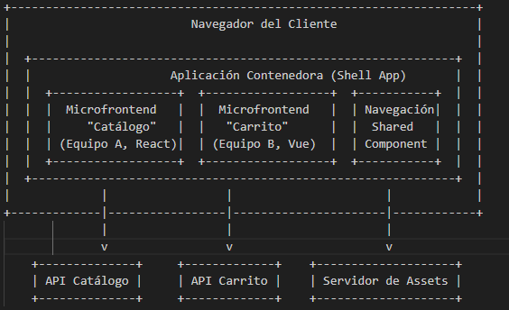
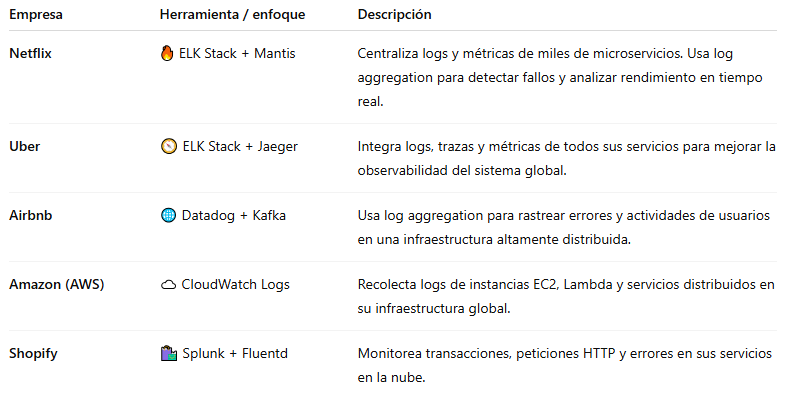

### Gabriel Felipe Fonseca Guerrero
### Ivan David Molina
# 2.Patterns Deconstruction
- 1-Microfrontends 
- 2-Log aggregation
## A. In your own technical words, what is the fundamental problem that the Microfrontends pattern aims to solve? How does it solve it?
- 1) Microfrontends: El problema que busca resolver es que todo el frontend esté agrupado en único pedazo de código con la misma técnología, como un monolíto. La razón de que sea un problema es que requiere de mayor coordinación, menor flexibilidad, modularidad, pueden afectarse otras partes de front implementando un cambio. Lo que resuelve, en vez de tenerlo en un solo bloque, modulariza, y crea micro-frontends que los vuelve independientes, corrigiendo los defectos que se nombraron anteriormente
- 2) El problema fundamental es que cuando se tienen muchos microservicios, un evento de error puede estar relacionado con cientos de servicios y no hay un registro para el entendimiento del error. La forma en que resuelve este problema es centralizar los registros, trazas y métricas para mayor capacidad de busqueda y analizis 
## B. How does this pattern impact system coupling and cohesion? 
- 1) Microfrontends: No afecta el acoplamiento entre servicios en el backend, pero si afecta y modifica el frontend. Respecto al acomplamiento, busca minimizar las dependencias entre diferentes partes de la interfaz. Al reducir el acoplamiento puede evolucionar y actualizarse de forma independiente si afectar al resto del sistema. Además con la cohesión, cada microfronend está diseñado para tener una alta cohesión, mejor dicho que todos sus componentes y código estén fuertemente relacionados y trabajan para implementar una funcionalidad específica.
- 2) Log aggregation: De manera similar reduce el acomplamiento y aumenta la cohesión la diferencia radica en que gira en torno a que cada componente ya no necesita saber como interactua o intercambia información con otros para el registro de eventos ya que los logs se envían a un sistema de agregación centralizado.
## C. Explain the fundamental mechanism of the pattern.
- 1) Para el microfronend se divide un todo cohesivo (una aplicación grande) en fragmentos más pequeños e independientes que se pueden desarrollar, implementar y desplegar pro separado, estós se integran en tiempo de ejecución (runtime) o se puede integrar en el servidor.
- 2) Log aggregation tiene un proceso de centralización de los datos donde se recopilan, normalizan, almacenan, hacen de buffer, analizan y visualizan.
## D. Illustrate the architecture at a high level. 
- 1) Microfrontends
- 
- 2) Log aggregation
- 
## E. What are the main benefits? 
- 1) Microfrontends
       - Escalabilidad organizacional
       - Despliegue independiente
       - Mantenibilidad y modularidad
       - Autonomía tecnológica
       - Rendimiento optimizado por contexto
       - Reutilización y consistencia
- 2) Log aggregation
       - Visibilidad unificada, la resolución de problemas más rápida
       - Facilita la observabilidad
       - Debugging eficiente
       - Monitoreo en tiempo real
       - Análisis y métricas
       - Escalabilidad y automatización 
## F. What complexities or downsides appear? What trade-offs does it introduce in terms of performance, complexity, or security? 
- 1) Microfrontend: En el momento de diseño es necesario definir el dominio de cada modulo y su comunicación con el resto, además de que es la infraestructura de orquestación puede llegar a ser bastante compleja conforme aumenten la cantidad de modulos independientes. También esta comunicación si no es gestionada de la manera correcta puede presentar latencia lo que puede generar una mala experiencia. Respecto a las tencnologías al poder usar varias y diversas (React, Bue, Angular) el equipo de desarrollo debe estar alerta de mantenter una identidad visual y de diseño unificada. Este patrón requiere de mucho mantenimiento por lo que aumenta más los costos que un monolíto, en ese sentido el patrón arquitectonico es más compatible con proyectos grandes y de varios equipos paralelos.
Por último con la seguridad al tener varios puntos de entrada (como cada microfrontend puede ser servido desde diferentes orígene o dominios) aumenta la superficie de ataque.
- 2) Log aggregation: Apesar de todos los beneficios que trae este patrón arquitectónico hay que tener en cuenta que por su complejidad se necesita una infraestructura adicional para su mantenimiento y configuración como log collectors, almacenamiento, sobre el desempeño(performance), la recojer y analizar estos datos puede consumir bastante CPU y memoria. Además dependiendo de la carga también latencia. También hay que tener en cuenta para cualquier proyecto el costo economico ya que el almacenamiento de los logs puede llegar a ser caro. De la misma manera al generar tantan información puede llegar a ser dificil seleccionar información que sea relevante. Y acerca de seguridad los propios logs pueden contener información sensible entonces puede estar sujeto a ataques, por lo mismo debe cumplir con las regulaciones para la protección de los datos. 
## G. Describe a realistic system that would use this pattern. 
- 1) Microfrontend
### Normalmente se usan para:
       - Plataformas e-commerce (con múltiples módulos: catálogo, pagos, perfil, soporte).
       - Dashboards empresariales con secciones independientes (reportes, métricas, usuarios, configuración).
       - Aplicaciones SaaS con diferentes equipos responsables de funcionalidades separadas.
       - Portales de banca digital o plataformas gubernamentales donde cada módulo es desarrollado por un área diferente.  
### Ejemplos en la vida real

- 2) Log Aggregation
### Normalmente se usan para:
       -Arquitecturas de microservicios (docenas o cientos de contenedores).
       -Plataformas de streaming, banca o comercio electrónico, donde se necesita rastrear errores en tiempo real.
       -Sistemas en la nube o Kubernetes, que generan logs dinámicos y efímeros.
       -Empresas con requisitos de auditoría o cumplimiento normativo.
### Ejemplos en la vida real:

# 3. Anaysis of Scenarios
## 3.1 Scenario1 
## 3.2 Scenario2

