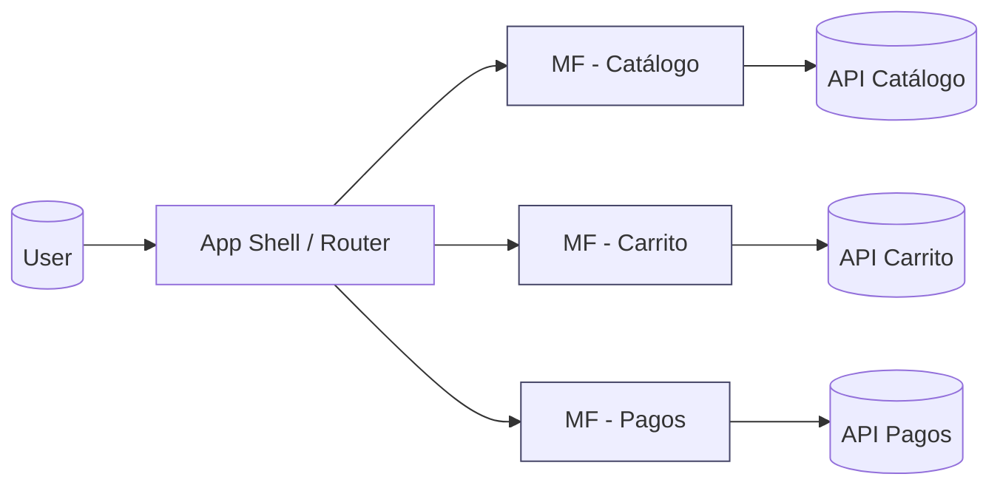
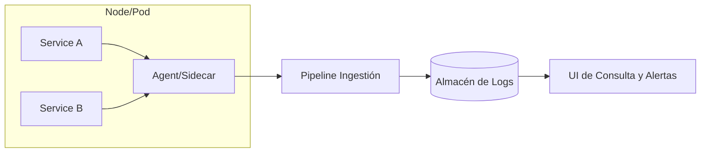
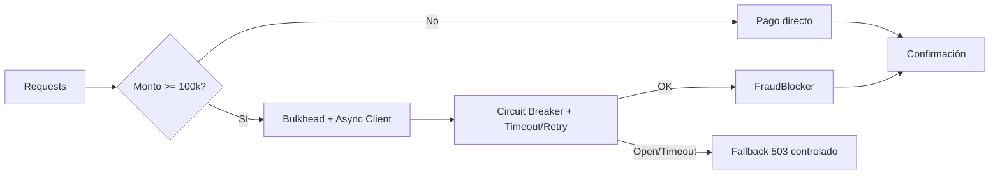
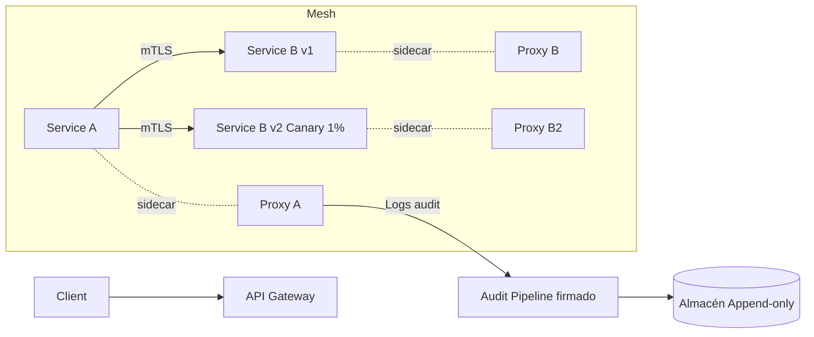
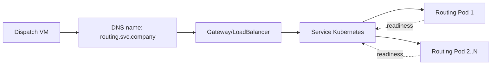

# Laboratory 4 – Architectural Patterns

Curso: Software Architecture 2025-II

Fecha: 14 de octubre

Equipo: Javier Andrés Carrillo Carrasco, Kevin Julian Gonzalez Guerra, Jorge Andrés Torres Leal

## 1. Objetivo

Entender a fondo dos patrones arquitectónicos y aplicarlos a situaciones reales. Vas a describir el problema que resuelven, cómo funcionan, beneficios, costos y un caso de uso. Luego resuelves tres escenarios con decisiones concretas y diagramas.

---

## 2. Pattern Deconstruction

### 2.1 Microfrontends

A. Problema que resuelve y cómo lo resuelve

- Equipos grandes que chocan en un único frontend, ciclos de despliegue lentos y dependencias cruzadas.

- Divide la UI en microaplicaciones independientes por dominio. Cada equipo desarrolla, prueba y despliega su parte sin bloquear a los demás. Se orquesta en tiempo de ejecución o en build.

B. Impacto en acoplamiento y cohesión

- Reduce acoplamiento entre equipos y dominios.

- Aumenta cohesión por dominio funcional.

- Introduce acoplamiento en la capa de integración si no defines contratos claros.

C. Mecanismo

- Un contenedor de UI compone microfrontends.

- Integración por routing, módulos remotos o web components.

- Contratos compartidos para diseño, autenticación, eventos y observabilidad.

- Comunicación por eventos o bus ligero en el navegador.

D. Arquitectura de alto nivel

E. Beneficios
- Despliegues independientes.
- Escalamiento por módulo.
- Autonomía de equipos y ciclos cortos.
- Gradual migration del monolito de UI.

F. Complejidades y trade-offs
- Orquestación de versiones y layout.
- Rendimiento, más bundles y fronteras de red.
- Seguridad de sesión y autorización coherente.
- Diseño consistente sin frenar la autonomía.
- Observabilidad distribuida en el cliente.

G. Sistema real
- Marketplace con módulos de búsqueda, producto, checkout y postventa. Cada dominio sale a producción a su ritmo y se prueba por canary en el cliente.

---

### 2.2 Log Aggregation

A. Problema que resuelve y cómo
- Logs dispersos en muchos servicios impiden depurar, auditar y medir.
- Centraliza, estandariza y enriquece logs. Los envía a un storage indexable y consulta unificada.

B. Impacto en acoplamiento y cohesión
- Menos acoplamiento operativo entre equipos.
- Cohesiona la observabilidad con un formato único y trazabilidad.

C. Mecanismo
- Agentes en cada host o sidecars recolectan logs.
- Pipeline de ingestión que parsea, enriquece y enruta.
- Almacén indexado y capa de consultas.
- Correlation IDs y trazas distribuidas.

D. Arquitectura de alto nivel

E. Beneficios
- Búsqueda centralizada y alertas.
- Auditoría y cumplimiento.
- Menor MTTR y análisis de causa raíz.
- Métricas derivadas de logs.

F. Complejidades y trade-offs
- Costo de almacenamiento y retención.
- Back-pressure en picos.
- Redacción y protección de datos sensibles.
- Gobernanza de esquemas de logs.

G. Sistema real
- Plataforma de salud con 70 servicios. Recolectores por pod, pipeline con filtrado de PII y retención diferenciada por tipo de dato.

---

## 3. Analysis of Scenarios

### 3.1 Scenario 1 – PagoGlobal

Problema
FraudBlocker entra en brownout y bloquea hilos del PaymentProcessor por timeouts largos. El pool se agota, rechaza también pagos pequeños y hay caída en cascada.

Objetivos
- Proteger PaymentProcessor de la latencia del tercero.
- Mantener operativos los flujos que no requieren fraude.
- Prevenir agotamiento de hilos y conexiones.

Decisiones y patrones

1. Circuit Breaker en la llamada a FraudBlocker
   - Estados closed, open, half-open.
   - Umbral por tasa de error y latencia p95.
2. Timeouts y retries con backoff y jitter
   - Timeout cliente 800 a 1200 ms.
   - Retries máx. 1 en half-open.
3. Bulkhead e hilos separados
   - Pool dedicado para FraudBlocker con semáforos.
   - Pool distinto para pagos < 100k para que no se bloqueen.
4. Programación no bloqueante
   - Cliente HTTP async y reactor pattern.
5. Colas y aislamiento de picos
   - Para transacciones que permiten espera.
   - Para > 100k, evalúa short queue con TTL y abandono temprano.
6. Degradación controlada
   - Si el breaker está open, responde 503 con reintento al usuario.
   - Mantén pagos < 100k en ruta rápida.
7. Observabilidad
   - Métricas por ruta, latencias y tasa de apertura del breaker.
   - Correlation ID por transacción.

Diagrama de alto nivel

Parámetros iniciales sugeridos
- Timeout 1 s, retry 1, backoff 200 ms con jitter.
- Breaker: error o latencia p95 > 1.5 s en 20 de 50 llamadas abre. Half-open prueba 5.
- Pools: 70 por ciento para fast path, 30 por ciento para fraude. Límite duro de 200 conexiones a FraudBlocker.

Validación
- Pruebas de estrés con cola de 10 mil rps y brownout sintético de 15 s.
- Objetivo: pagos < 100k con éxito mayor a 99.9 por ciento durante el brownout.
- p95 de fast path menor a 300 ms en saturación.

Riesgos y mitigaciones
- Falsos positivos del breaker. Ajusta ventanas deslizantes.
- Backlog de colas. Usa TTL y rechazos tempranos con códigos claros.

---

### 3.2 Scenario 2 – MiSalud Digital

Problema
mTLS obligatorio, auditoría fina, canary 1 por ciento y resiliencia inconsistente entre lenguajes. Las bibliotecas comunes no escalan en coordinación.

Objetivos
- Seguridad y auditoría uniformes sin tocar cada servicio.
- Despliegues progresivos controlados.
- Resiliencia homogénea.

Decisiones y patrones

1. Service Mesh
   - Sidecars proxy en cada pod.
   - mTLS transparente, rotación de certificados, autenticación mutua.
2. Política de resiliencia central
   - Timeouts, retries, circuit breaker y rate limiting definidos en el mesh.
3. Auditoría inmutable
   - El mesh emite logs con origen, destino, ruta y latencia.
   - Envía a un pipeline con firma y almacenamiento append-only.
4. Canary y traffic splitting
   - Reglas del mesh para enrutar 1 por ciento a la versión nueva.
5. Estándares de trazabilidad
   - Propaga trace y span IDs.
6. Redacción de PII
   - Filtros en el proxy antes del almacenamiento.

Diagrama de alto nivel

Políticas mínimas
- mTLS obligatorio para todo tráfico interno.
- Timeout por servicio y método, p95 objetivo.
- Retries con backoff y límites por idempotencia.
- Circuit breaker por código y latencia.
- Splits por versión y reglas de rollback automático por error rate.
- Retención de auditoría 5 a 10 años según norma. Hash por lote.

Validación
- Pruebas de canary con 1 por ciento real.
- Verificación de rotación de certificados sin downtime.
- Simulación de fallas para confirmar que el mesh aplica timeouts y breakers iguales en Java, Python y Node.

Riesgos y mitigaciones
- Sobrecosto de latencia por sidecar. Monitorea p99.
- Curva de aprendizaje. Capacita con plantillas de política e integración CI.

---

### 3.3 Scenario 3 – EntregaRápida

Problema
Dispatch-Service usa listas de IP de pods que cambian con el autoscaling. El cron cada 5 minutos queda obsoleto y causa timeouts y bloqueo de recursos.

Objetivos
- Descubrimiento dinámico confiable.
- Conexiones estables durante escalamiento rápido.
- Resiliencia del cliente legado.

Decisiones y patrones

1. Kubernetes Service como punto estable
   - Expón Routing-Service detrás de un Service con ClusterIP.
   - Si el cliente está fuera de K8s, usa LoadBalancer o un Gateway.
   - DNS estable, sin listas de IP.
2. Opción con Service Mesh y egress/inbound gateway
   - Control de tráfico, mTLS y políticas de retries sin tocar el legado.
3. Timeouts, retries y breaker en el cliente legado
   - Timeout 800 a 1200 ms. Retries máx. 2 con backoff.
   - Circuit breaker por latencia y error.
4. Health checks y readiness
   - Solo enruta a pods ready.
5. HPA por métricas correctas
   - CPU y colas internas del Routing-Service.
6. Buffer asíncrono para picos extremos
   - Cola corta con TTL para peticiones de ruta si el SLA lo permite.
7. Observabilidad
   - Métricas de DNS, conexión y latencias por salto.

Diagrama de alto nivel

Plan de migración en pasos

1. Crear Service y endpoint estable.
2. Cambiar el cliente para usar el nombre DNS, quitar el cron de IPs.
3. Activar timeouts, retries y breaker en el cliente.
4. Añadir gateway o mesh si se requiere mTLS y políticas centralizadas.
5. Pruebas de autoscaling con ramp up x10 y DNS cache bajo.
6. Monitoreo de p95, tasa de errores y saturación de pool.
