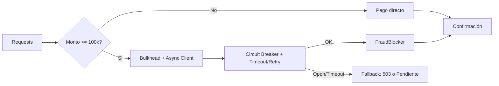
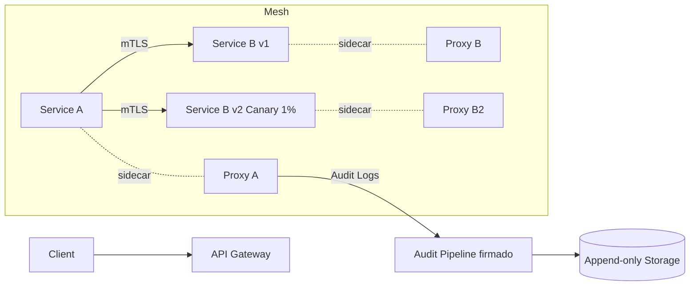
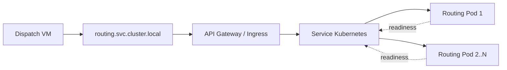

# Laboratory 4 - Architectural Patterns

**Course:** Software Architecture – 2025-II  
**Date:** October 14  
**Names:** Kevin Julian Gonzalez Guerra, Javier Andres Carrillo Carrasco, Jorge Andrés Torres Leal 

---

## 1. Objective

Comprender y aplicar los **patrones arquitectónicos de resiliencia, comunicación y despliegue** documentados por **Chris Richardson** en *Microservices Patterns*.  


---

## 2. Pattern Deconstruction

### 2.1 Microfrontends

**Patrón base:** *Self-Contained Systems / Decomposition by Business Capability*

**Propósito:**  
Dividir el frontend monolítico en microaplicaciones independientes para permitir ciclos de desarrollo, prueba y despliegue autónomos.

**Impacto:**  
Reduce el acoplamiento entre equipos y mejora la cohesión por dominio funcional.

**Mecanismo:**  
- Contenedor principal (*Application Shell*) que orquesta los microfrontends.  
- Integración mediante *Routing*, *Web Components* o *Module Federation*.  
- Comunicación por eventos y contratos compartidos.  
- *Externalized Configuration* para temas comunes (autenticación, estilos, métricas).

**Beneficios:**  
Despliegues independientes, autonomía de equipos, escalabilidad modular.

**Trade-offs:**  
Complejidad de integración y coordinación visual.

**Ejemplo:**  
Marketplace con microfrontends para catálogo, carrito y pagos.

```mermaid
flowchart LR
  User[(User)]
  User --> Shell[App Shell / Router]
  Shell --> MF1[MF - Catálogo]
  Shell --> MF2[MF - Carrito]
  Shell --> MF3[MF - Pagos]
  MF1 --> API1[(API Catálogo)]
  MF2 --> API2[(API Carrito)]
  MF3 --> API3[(API Pagos)]
  classDef mf fill:#eef,stroke:#446;
  class MF1,MF2,MF3 mf;
````

---

### 2.2 Log Aggregation

**Patrón base:** *Centralized Logging*
**Patrón complementario:** *Audit Logging* y *Observability*

**Propósito:**
Recolectar y almacenar logs de múltiples servicios en un punto central para facilitar auditoría, trazabilidad y depuración.

**Mecanismo:**

* Agentes o sidecars recolectan logs locales.
* Pipeline central (*Log Aggregator*) los enriquece e indexa.
* Se almacenan en un repositorio consultable y seguro.
* Se usan *Correlation IDs* para trazar una solicitud entre servicios.

**Beneficios:**
Auditoría inmutable, monitoreo global, reducción del tiempo medio de recuperación.

**Trade-offs:**
Costos de almacenamiento y configuración de retención.

```mermaid
flowchart LR
  subgraph Node/Pod
    App1[Service A]-->Agent1[Log Agent/Sidecar]
    App2[Service B]-->Agent1
  end
  Agent1 --> Ingest[Pipeline Ingestión]
  Ingest --> Store[(Log Storage)]
  Store --> Query[Dashboard & Alerts]
```

---

## 3. Analysis of Scenarios

### 3.1 Scenario 1 – PagoGlobal (Fintech)

**Contexto:**
El microservicio *PaymentProcessor* depende del servicio externo *FraudBlocker*.
Durante picos de carga, *FraudBlocker* entra en *brownout* (responde en 15–20 s) y bloquea todos los hilos de *PaymentProcessor*.

**Objetivo:**
Aumentar la resiliencia aplicando los **patrones de estabilidad de Chris Richardson**.

---

#### Patrones aplicados

1. **Circuit Breaker Pattern**

   * Supervisa latencia y errores.
   * Abre el circuito cuando la tasa de fallos o el p95 supera umbrales definidos.
   * Rechaza llamadas inmediatamente durante el periodo *open*, liberando recursos.
   * Pasa a *half-open* tras un intervalo de enfriamiento para probar recuperación.

2. **Timeout Pattern**

   * Cada llamada remota expira después de 1 segundo.
   * Evita bloqueos prolongados de hilos.

3. **Retry Pattern with Exponential Backoff and Jitter**

   * Un solo reintento con backoff 200 ms y jitter aleatorio.
   * Evita tormentas sincronizadas de reintentos.

4. **Bulkhead Pattern**

   * Aisla recursos por tipo de transacción:

     * 70 % del pool para pagos rápidos (<100 000 COP).
     * 30 % para llamadas a *FraudBlocker*.
   * Limita concurrencia y conexiones para prevenir saturación total.

5. **Queue-Based Load Leveling Pattern**

   * Introduce una cola corta (TTL 3 s) para solicitudes de fraude.
   * Desacopla el ritmo de entrada del ritmo de procesamiento.

6. **Fallback Pattern**

   * Si el *Circuit Breaker* está abierto, responde con:

     * HTTP 503 + *Retry-After*, o
     * Estado “pendiente de validación”.
   * Permite degradación funcional sin caída total.

7. **Asynchronous Request/Response Pattern**

   * Cliente HTTP asíncrono no bloqueante.
   * Libera hilos durante operaciones de red.

8. **Observability Pattern**

   * Métricas por ruta: latencias p50/p95/p99, tasa de apertura del breaker, saturación de pools.
   * Alertas por degradación o breaker abierto >60 % del tiempo.

---

#### Flujo de arquitectura



**Resultado:**
El sistema mantiene disponibilidad, evita bloqueos en cascada y se recupera automáticamente cuando el tercero vuelve a la normalidad.

---

### 3.2 Scenario 2 – MiSalud Digital (Gobierno)

**Contexto:**
Plataforma nacional con más de 70 microservicios desarrollados en distintos lenguajes.
Requisitos: mTLS obligatorio, auditoría inmutable y despliegues progresivos.

**Problema:**
Las políticas de seguridad y resiliencia son inconsistentes entre equipos.
Las bibliotecas comunes generan dependencia y lentitud en las actualizaciones.

---

#### Patrones aplicados

1. **Service Mesh Pattern**

   * Implementa los patrones *Circuit Breaker*, *Retry*, *Timeout* y *Rate Limiting* de forma centralizada.
   * Proporciona mTLS, control de tráfico y observabilidad sin modificar código.

2. **Externalized Configuration Pattern**

   * Las políticas de seguridad, reintentos y timeouts se gestionan fuera de los servicios.
   * Facilita gobernanza y actualizaciones rápidas.

3. **Audit Logging Pattern**

   * Los sidecars del mesh registran todas las llamadas con origen, destino, URL y latencia.
   * Los logs se almacenan en un pipeline inmutable firmado.

4. **Deployment Pipeline / Canary Release Pattern**

   * Control de versiones progresivo mediante redirección de tráfico (1 % a versión nueva).
   * Permite validación segura sin afectar la producción.

5. **Observability Pattern**

   * Métricas y trazas distribuidas por cada servicio.
   * Integración con dashboards centralizados.

---

#### Diagrama de alto nivel



**Resultado:**
El mesh asegura una aplicación consistente de los patrones de resiliencia, auditoría y despliegue controlado, eliminando la dependencia de librerías internas.

---

### 3.3 Scenario 3 – EntregaRápida (Logística)

**Contexto:**
Migración a Kubernetes.
*Routing-Service* escala dinámicamente y *Dispatch-Service* todavía corre en VMs.

**Problema:**
El descubrimiento de pods se hace con un script cada 5 minutos, lo que genera IPs obsoletas y bloqueos por timeouts.

---

#### Patrones aplicados

1. **Service Discovery Pattern**

   * Se elimina el script y se usa el *Service Registry* de Kubernetes.
   * El *Dispatch-Service* accede mediante nombre DNS estable (`routing.svc.cluster.local`).

2. **API Gateway Pattern**

   * Actúa como punto único de entrada.
   * Aplica *Circuit Breaker*, *Rate Limiting* y *Timeout* a nivel global.

3. **Externalized Configuration Pattern**

   * Timeouts, retries y políticas de resiliencia se definen externamente (en el Mesh o Config Server).
   * No requiere cambios en el cliente legacy.

4. **Timeout & Retry Patterns**

   * Timeout: 800–1200 ms.
   * Retries: máximo 2 con backoff exponencial y jitter.

5. **Health Check & Readiness Pattern**

   * Solo se enruta tráfico a pods marcados como *Ready* para evitar fallos de conexión.

6. **Observability Pattern**

   * Métricas: DNS latency, errores de conexión, saturación del gateway y tasa de reintentos.

---

#### Diagrama de arquitectura



**Resultado:**
El descubrimiento se vuelve dinámico, las conexiones son estables y la resiliencia del sistema mejora incluso durante escalamiento rápido.

---

## 4. Summary of Patterns (Based on Chris Richardson’s Catalog)

| Escenario           | Patrones aplicados                                                                                                                        |
| ------------------- | ----------------------------------------------------------------------------------------------------------------------------------------- |
| **PagoGlobal**      | Circuit Breaker, Timeout, Retry with Backoff, Bulkhead, Queue-Based Load Leveling, Fallback, Asynchronous Request/Response, Observability |
| **MiSalud Digital** | Service Mesh, Externalized Configuration, Audit Logging, Deployment Pipeline / Canary Release, Observability                              |
| **EntregaRápida**   | Service Discovery, API Gateway, Externalized Configuration, Timeout, Retry, Health Check & Readiness, Observability                       |

---

## 5. Síntesis final

Cada escenario aplica un conjunto de patrones del catálogo de **Chris Richardson**, diseñados para mejorar resiliencia, comunicación y despliegue en arquitecturas distribuidas:

* **PagoGlobal:** patrones de **Fault Tolerance** y **Stability**.
* **MiSalud Digital:** patrones de **Security, Observability y Deployment**.
* **EntregaRápida:** patrones de **Service Communication y Discovery**.

En conjunto, estas estrategias garantizan sistemas que fallan con gracia, se recuperan de manera automática y mantienen alta disponibilidad sin depender de la estabilidad de servicios externos.


