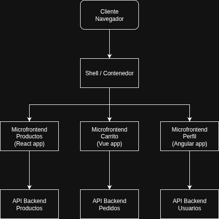
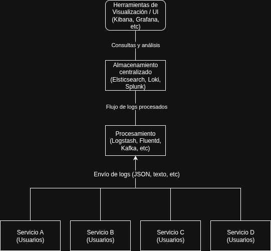

## Architectural Patterns

### 2. Pattern Deconstruction

#### 1. Microfrontends

**A. Problema que busca resolver**

Este patrón de arquitectura busca resolver el **problema del acoplamiento y la complejidad** en aplicaciones **front-end monolíticas**.  
La solución consiste en **dividir la aplicación en módulos más pequeños e independientes**, cada uno responsable de una parte funcional específica.

---

**B. Impacto en el acoplamiento y la cohesión**

- **Disminuye el acoplamiento**, ya que cada módulo implementado tiene su propio ciclo de vida y se comunica con los demás mediante **interfaces bien definidas**, siendo independiente de tecnologías o versiones específicas.  
- **Aumenta la cohesión**, porque cada módulo se centra en su propio **dominio funcional bien delimitado**, agrupando su lógica, UI y datos relacionados.

---

**C. Mecanismo fundamental**

El mecanismo fundamental de este patrón es la **composición de múltiples módulos front-end independientes en una sola interfaz**, mediante un **contenedor o shell** que los integra dinámicamente.  
Este shell coordina la navegación, autenticación y comunicación entre los módulos.

---

**D. Ilustración de alto nivel**

El diagrama muestra una aplicación compuesta por varios microfrontends (por ejemplo: *Productos*, *Carrito*, *Perfil*), cada uno desarrollado y desplegado de forma independiente, pero integrados a través de un contenedor común.

---

**E. Principales beneficios**

- **Desarrollo y despliegue independientes**  
- **Mantenibilidad y modularidad**  
- **Autonomía de equipos**  
- **Escalabilidad tecnológica**  
- **Aislamiento de fallos y resiliencia**

---

**F. Complejidades y desventajas principales**

- **Complejidad de integración:** coordinación del enrutamiento, estilos y estado global.  
- **Sobrecarga cognitiva y organizacional:** múltiples repositorios y pipelines.  
- **Rendimiento reducido:** posibles duplicaciones de dependencias.  
- **Consistencia visual difícil:** distintos frameworks o estilos entre módulos.  
- **Seguridad y aislamiento:** nuevos puntos de exposición entre módulos.  
- **Monitoreo complejo:** mayor esfuerzo para centralizar logs y métricas.

---

### **Trade-offs**

| **Dimensión** | **Beneficio** | **Riesgo / Complejidad Introducida** |
|----------------|----------------|--------------------------------------|
| **Modularidad** | Despliegues independientes | Integración y orquestación más compleja |
| **Autonomía** | Equipos más ágiles y libres | Dificultad para mantener consistencia y estándares |
| **Tecnología** | Libertad de frameworks y versiones | Duplicación de dependencias y aumento del peso del frontend |
| **Escalabilidad** | Mejor paralelismo y mantenibilidad | Mayor esfuerzo de coordinación y monitoreo |
| **Seguridad** | Aislamiento modular | Nuevos puntos de exposición entre módulos |

---

**G. Sistema que usaría este patrón**

Imaginemos una empresa con una **tienda virtual (e-commerce)**.  
La parte visual de la aplicación se puede dividir en diferentes **módulos funcionales**, por ejemplo:
- Catálogo de productos  
- Reseñas  
- Carrito de compras  

Cada módulo puede ser desarrollado por un **equipo independiente**, sin afectar el trabajo de los demás.  
Al final, todos los módulos se **integran en una sola interfaz coherente** para el usuario final, mediante el contenedor principal.

---

#### 2. Log Aggregation

**A. Problema que busca resolver**

En sistemas distribuidos o con múltiples servicios, los registros (*logs*) se generan en **diferentes servidores, contenedores o microservicios**, lo que dificulta:
- Diagnosticar errores o fallos.  
- Rastrear flujos de ejecución entre componentes.  
- Monitorear el comportamiento del sistema en tiempo real.

El patrón **Log Aggregation** busca resolver este problema **centralizando y unificando los registros** generados por todos los componentes del sistema, para facilitar la **observabilidad, monitoreo y depuración**.

---

**B. Impacto en el acoplamiento y la cohesión**

- **Acoplamiento:**  
  Los sistemas mantienen un **bajo acoplamiento** con el agregador, ya que solo necesitan enviar sus logs a un punto central (por red o agente).  
  No dependen del formato o la ubicación de otros servicios.  

- **Cohesión:**  
  Aumenta la **cohesión del proceso de monitoreo**, ya que toda la información de logs se unifica en una misma fuente, mejorando la trazabilidad y el análisis global del sistema.

---

**C. Mecanismo fundamental**

El mecanismo central del patrón consiste en **recolectar y centralizar los logs de múltiples fuentes** en un sistema común que permita **almacenarlos, indexarlos y visualizarlos**.  

Componentes típicos:
1. **Productores de logs:** los servicios o aplicaciones que generan registros.  
2. **Agentes recolectores:** software instalado en cada servidor (por ejemplo, *Fluentd*, *Filebeat*) que recopila y envía los logs.  
3. **Canal de transporte:** medio por el cual se envían los logs (por ejemplo, *Kafka*, *Logstash*).  
4. **Almacenamiento centralizado:** base de datos o índice que guarda los logs (por ejemplo, *Elasticsearch*).  
5. **Herramientas de visualización:** interfaz que permite consultar y analizar los datos (por ejemplo, *Kibana*, *Grafana*).

---

**D. Ilustración de alto nivel**

El diagrama representa múltiples servicios o microservicios que envían sus logs a un agregador central.  
Este agregador los procesa, indexa y permite visualizarlos en un panel unificado.

---

**E. Principales beneficios**

- **Centralización de registros:** todos los logs del sistema accesibles desde un solo punto.  
- **Mejor trazabilidad:** se puede seguir el flujo completo de una transacción a través de varios servicios.  
- **Monitoreo y diagnóstico eficientes:** permite detectar fallos o comportamientos anómalos en tiempo real.  
- **Escalabilidad operativa:** facilita el manejo de grandes volúmenes de datos de registro.  
- **Análisis avanzado:** posibilita aplicar búsquedas, métricas y correlaciones entre eventos.

---

**F. Complejidades y desventajas principales**

- **Sobrecarga en la infraestructura:** el agregador puede convertirse en un **punto de cuello de botella** si no se escala adecuadamente.  
- **Riesgos de seguridad:** los logs pueden contener información sensible (tokens, datos personales, etc.).  
- **Gestión del almacenamiento:** requiere políticas de retención, compresión y eliminación de datos.  
- **Configuración inicial compleja:** integrar múltiples fuentes, formatos y niveles de log demanda planificación.  
- **Latencia:** puede existir retraso entre la generación del log y su visualización en el sistema central.  

---

### **Trade-offs**

| **Dimensión** | **Beneficio** | **Riesgo / Complejidad Introducida** |
|----------------|----------------|--------------------------------------|
| **Visibilidad** | Centralización de logs y monitoreo global | Riesgo de sobrecarga o pérdida de datos si el agregador falla |
| **Trazabilidad** | Seguimiento de flujos entre servicios | Requiere sincronización precisa de timestamps |
| **Seguridad** | Control de acceso centralizado | Exposición de información sensible si no se encripta adecuadamente |
| **Escalabilidad** | Manejo de grandes volúmenes de logs | Aumento en costos de almacenamiento y procesamiento |
| **Operación** | Simplifica depuración y auditoría | Complejidad en configuración inicial y mantenimiento del sistema |

---

**G. Sistema que usaría este patrón**

Un ejemplo claro sería una **plataforma basada en microservicios**, donde cada servicio (usuarios, pagos, catálogo, pedidos) genera sus propios logs.  
Mediante *Log Aggregation*, todos los registros se centralizan en una herramienta como **ELK Stack (Elasticsearch, Logstash, Kibana)** o **Grafana Loki**.

Esto permite que el equipo de operaciones:
- Monitoree el comportamiento del sistema completo.  
- Detecte fallos o picos de error rápidamente.  
- Analice eventos históricos o incidentes sin tener que revisar múltiples servidores.

---

### 3. Analysis of Scenarios

#### 3.1 Scenario 1

Basado en el escenario, el patrón de arquitectura más efectivo para resolver este problema es el patrón **Circuit Breaker** (Interruptor de Circuito).

Este patrón está diseñado específicamente para evitar que una falla de red o de servicio se propague en cascada a otras partes del sistema, mejorando así la estabilidad y la resiliencia.

---

##### Análisis del Problema

El problema principal es una **falla en cascada** causada por el agotamiento de recursos. El microservicio `PaymentProcessor` realiza llamadas síncronas a una dependencia lenta y poco confiable (`FraudBlocker`). Durante las horas pico, esta dependencia no falla por completo, sino que experimenta un "brownout" (una ralentización severa).

Debido a que `PaymentProcessor` espera de forma síncrona una respuesta, su grupo limitado de hilos (`thread pool`) se consume por completo con estas llamadas lentas. Este agotamiento de hilos hace que el servicio no responda a ninguna solicitud entrante, incluso a aquellas que no dependen del servicio `FraudBlocker` que está fallando. La falla de un componente derriba todo el sistema.

---

##### La Solución con Circuit Breaker

El patrón Circuit Breaker actúa como un proxy o envoltorio alrededor de las llamadas a un servicio que podría fallar. Funciona como un interruptor de circuito eléctrico, monitoreando las fallas e "interrumpiendo" el flujo de solicitudes cuando las fallas superan un cierto umbral. Opera en tres estados:

* **Cerrado**: Este es el estado por defecto. Las solicitudes de `PaymentProcessor` se transmiten al servicio `FraudBlocker`. El interruptor monitorea fallas, como tiempos de espera de conexión o, más importante en este caso, respuestas que exceden un límite de tiempo configurado (p. ej., 1 segundo). Si el número de fallas supera un umbral dentro de un período de tiempo determinado, el interruptor se "dispara".

* **Abierto**: El interruptor se dispara y pasa al estado Abierto. Durante un período de enfriamiento (`cool-down`) establecido, todas las llamadas posteriores a `FraudBlocker` fallan inmediatamente sin siquiera intentar conectarse. `PaymentProcessor` recibe un error instantáneo en lugar de tener un hilo bloqueado durante 15-20 segundos. Este es el paso crucial que evita el agotamiento del grupo de hilos y mantiene el servicio `PaymentProcessor` activo y receptivo a otras solicitudes. El servicio puede entonces ejecutar una lógica de respaldo (`fallback`), como:
    * Rechazar la transacción de alto valor con un código de error específico ("Intente más tarde").
    * Poner la transacción en una cola para su procesamiento posterior una vez que `FraudBlocker` se recupere.

* **Semiabierto**: Después de que expira el período de enfriamiento, el interruptor permite que una única solicitud de prueba pase a `FraudBlocker`.
    * Si esta solicitud tiene éxito, el interruptor asume que el servicio se ha recuperado y vuelve al estado **Cerrado**.
    * Si falla, el interruptor se dispara de nuevo al estado **Abierto**, iniciando un nuevo período de enfriamiento. Esto evita que `PaymentProcessor` abrume al servicio `FraudBlocker` mientras intenta recuperarse.

---

##### Cómo Resuelve la Crisis de PagoGlobal

Al implementar un Circuit Breaker alrededor de las llamadas a la API de `FraudBlocker`, PagoGlobal logra lo siguiente:

* **Aísla la Falla**: La ralentización de `FraudBlocker` ya no consume todos los recursos del `PaymentProcessor`.

* **Previene Fallas en Cascada**: El `PaymentProcessor` permanece receptivo. Los hilos no se bloquean, por lo que puede continuar procesando transacciones de menos de $100,000 COP sin problema.

* **Permite una Degradación Controlada**: En lugar de que todo el sistema colapse, solo una funcionalidad específica (el procesamiento de transacciones de alto valor) se degrada temporalmente. Esto representa una experiencia de usuario y un resultado de negocio mucho mejores.

* **Facilita la Recuperación**: El estado Semiabierto proporciona una forma automatizada de detectar cuándo `FraudBlocker` se ha recuperado sin bombardearlo constantemente con solicitudes.

---

#### 3.2 Scenario 2

Basado en el escenario, el patrón de arquitectura que resuelve este conjunto de problemas es la **Malla de Servicios** (*Service Mesh*).

Una Malla de Servicios es una capa de infraestructura dedicada a hacer que la comunicación entre servicios sea segura, rápida y confiable. Abstrae la red de los desarrolladores, permitiendo que un equipo de plataforma gestione aspectos transversales complejos como la seguridad, la observabilidad y el control del tráfico sin necesidad de cambiar el código de la aplicación.

---

##### Cómo la Malla de Servicios Resuelve los Problemas de "MiSalud Digital"

La idea central de una malla de servicios es desplegar un proxy de red ligero, llamado **sidecar**, junto a cada instancia de servicio. Todo el tráfico de red que entra y sale de un servicio se enruta a través de este proxy. Estos proxies forman el **Plano de Datos** (`Data Plane`), que es controlado por un **Plano de Control** (`Control Plane`) central. Esta arquitectura aborda directamente cada una de las señales de alerta planteadas:

##### 1. Resuelve el Mandato de Seguridad Zero-Trust (mTLS)
En lugar de que cada uno de los más de 70 servicios implemente la lógica de mTLS, los proxies sidecar se encargan de ello de forma automática y transparente.

* **Proceso**: Cuando el Servicio A quiere llamar al Servicio B, la solicitud es interceptada por el sidecar del Servicio A. Este sidecar inicia una conexión mTLS segura con el sidecar del Servicio B.
* **Beneficio**: El código de la aplicación no es consciente del cifrado; envía una solicitud simple y sin cifrar a `localhost`. El plano de control de la malla gestiona las complejas tareas de emisión, rotación y verificación de identidad de los certificados para todos los proxies, aplicando una estricta política de red de confianza cero (*zero-trust*) en toda la plataforma.

---

##### 2. Resuelve la Auditoría Detallada
Dado que cada llamada a la API pasa a través de un proxy sidecar, los proxies son el punto de observación perfecto para un registro (*logging*) consistente y completo.

* **Proceso**: El proxy sidecar genera automáticamente telemetría detallada para cada solicitud que maneja. Puede registrar el servicio de origen, el servicio de destino, la ruta del URL, el método HTTP, el código de respuesta y la latencia.
* **Beneficio**: Esto crea un registro de auditoría uniforme y a prueba de manipulaciones que se genera independientemente de la implementación de la aplicación. El formato y el destino del registro se pueden configurar una vez en el plano de control y aplicarse en todas partes, garantizando el cumplimiento sin ningún esfuerzo por parte de los desarrolladores en los más de 70 servicios.

---

##### 3. Resuelve los Despliegues Progresivos (Lanzamientos *Canary*)
La malla de servicios proporciona un control dinámico y detallado sobre el enrutamiento del tráfico.

* **Proceso**: El equipo de plataforma puede crear una regla de enrutamiento en el plano de control que indique: "Para las solicitudes al servicio `Appointment-Scheduler`, envía el 99% del tráfico a las instancias etiquetadas con la versión `stable` y el 1% a las instancias etiquetadas con la versión `canary`".
* **Beneficio**: Esta desviación del tráfico ocurre a nivel de infraestructura, dentro del plano de datos. No se necesitan cambios de código ni nuevos despliegues en los servicios que llaman al planificador. El equipo puede ajustar los porcentajes de tráfico en tiempo real a medida que gana confianza en la nueva versión.

---

##### 4. Resuelve la Resiliencia Inconsistente
Las políticas de resiliencia (reintentos, tiempos de espera, interruptores de circuito) se configuran en el plano de control y son aplicadas por los proxies sidecar.

* **Proceso**: Se puede establecer una política para toda la plataforma, por ejemplo, "reintentar cualquier solicitud GET fallida hasta 3 veces con un tiempo de espera de 50ms". Esta política se distribuye a todos los sidecars.
* **Beneficio**: Esto elimina por completo el problema de implementaciones inconsistentes y específicas del lenguaje en librerías (como Hystrix frente a código Python personalizado). El comportamiento de resiliencia es ahora uniforme y predecible en toda la arquitectura políglota, gestionado de forma centralizada por el equipo de operaciones.

---

##### La Superioridad Sobre el Enfoque de "Librerías Comunes"
El fallo fundamental del enfoque de "librerías comunes" es que acopla las preocupaciones operativas con la lógica de negocio. El patrón de Malla de Servicios las desacopla, moviendo esta lógica fuera del proceso de la aplicación y hacia el proxy sidecar. Esto significa que los parches de seguridad, los cambios en el formato de registro o las nuevas políticas de resiliencia pueden implementarse actualizando la malla, sin obligar a los más de 70 equipos de desarrollo a actualizar dependencias y redesplegar sus aplicaciones.

---

#### 3.3 Scenario 3 (Optional)

Este escenario es un caso clásico de **falla en el descubrimiento de servicios** dentro de un entorno dinámico y nativo de la nube. El patrón arquitectónico que resuelve directamente este problema es **Service Discovery del lado del servidor (Server-Side Service Discovery)**, implementado mediante una combinación de un **Servicio de Kubernetes** y un **API Gateway** o **Balanceador de carga (Load Balancer)**.

La causa raíz del colapso del sistema fue el script “rápido y sucio”. Este acoplaba fuertemente el `Dispatch-Service` a las **direcciones IP físicas y efímeras** de los pods del `Routing-Service`. Este enfoque es fundamentalmente incompatible con una arquitectura nativa de la nube y con autoescalado, donde las instancias se tratan como desechables y sus IP son impredecibles.

---

##### La Solución: Server-Side Service Discovery

Este patrón desacopla al cliente (`Dispatch-Service`) de las instancias del servidor (pods de `Routing-Service`). El cliente envía solicitudes a un único endpoint estable y bien conocido, y un componente intermedio se encarga del “descubrimiento” y balanceo de carga para encontrar un pod de backend saludable.

Así es como este patrón se implementa para corregir la arquitectura de “EntregaRápida”:

##### 1. Crear un endpoint interno estable con un Servicio de Kubernetes

Primero, se crea un objeto estándar de Kubernetes `Service` para el despliegue (`deployment`) del `Routing-Service`.

* **Qué hace:** Este `Service` actúa como un balanceador de carga interno y abstracto. Kubernetes le asigna una **dirección IP virtual estable** y un **nombre DNS interno** (por ejemplo: `routing-service.default.svc.cluster.local`).
* **Descubrimiento automático:** El `Service` utiliza etiquetas (labels) para encontrar automáticamente todos los pods del `Routing-Service` que estén activos y saludables. Ya sean 5 o 50 pods, el `Service` siempre conoce en tiempo real la lista correcta de IPs. Registra instantáneamente los nuevos pods y elimina los terminados.
* **Resultado:** Cualquier servicio *dentro* del clúster puede ahora llamar de forma confiable al `Routing-Service` usando su nombre DNS estable, completamente ajeno al caos del autoescalado que ocurre detrás de escena.

##### 2. Exponer el servicio al mundo exterior

El antiguo `Dispatch-Service` se ejecuta en máquinas virtuales fuera del clúster de Kubernetes, por lo que no puede acceder directamente al nombre DNS interno. La solución es **exponer el Servicio de Kubernetes estable al exterior**. La mejor práctica para esto es usar un **API Gateway** (o un balanceador de carga en la nube más simple).

* **Qué hace:** Un API Gateway actúa como el único punto de entrada seguro para todo el tráfico externo hacia el clúster. Se le asigna una **dirección IP pública y un nombre DNS permanentes** (por ejemplo: `api.entregarapida.com.co`).
* **Configuración:** Se configura el gateway con una regla: “Todo el tráfico para la ruta `/route` debe ser redirigido al Servicio interno `routing-service` de Kubernetes.”
* **Resultado:** El `Dispatch-Service` se reconfigura **por última vez**. Su archivo de configuración cambia de una lista dinámica de IPs de pods a una sola URL permanente:
  `http://api.entregarapida.com.co/route`.

---

##### La Nueva Arquitectura Resiliente

Con este patrón, el desastre del “Día de Envío Gratis” se habría convertido en una historia de éxito:

1. La carga masiva llega a la **dirección IP permanente** del API Gateway.
2. El API Gateway reenvía el tráfico hacia la **IP virtual estable** del Servicio interno `Routing-Service` en Kubernetes.
3. Kubernetes autoescala correctamente el `Routing-Service` de 5 a 50 pods. A medida que se inicia cada nuevo pod, el `Service` de Kubernetes **lo agrega instantáneamente** al grupo de balanceo. Los pods antiguos se eliminan automáticamente.
4. El `Service` de Kubernetes distribuye las solicitudes entrantes de forma transparente y eficiente entre los 50 pods saludables.
5. El `Dispatch-Service` se mantiene estable y receptivo porque nunca intenta conectarse a una IP obsoleta o inexistente. Está completamente aislado de la dinámica de escalado del `Routing-Service`.

Al implementar el patrón **Server-Side Service Discovery**, reemplazas un script frágil y manual por una solución automatizada, resiliente y nativa de la plataforma, diseñada para manejar la naturaleza dinámica de la nube.

