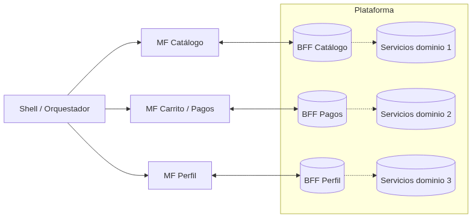
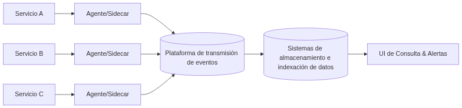

# Laboratorio 4 - Moviedoq - 1010132970
# Architectural Patterns
## Microfrontends

### ¿Qué problema resuelve y cómo?
En aplicación web un _monolito de frontend_ genera cuellos de botella, lo que a su vez puede causar equipos bloqueados, lentos ciclos de despliegue y altos riesgos. Los microfrontends dividen la UI en módulos más pequeños independientes por cada dominio, lo que permite el desarrollo y despliegue independiente a la vez que facilita la escabilidad.

### Efecto en acoplamiento y cohesión.
Los microfrontends buscan reducir el acoplamiento y mantener una alta cohesión:

 - Los microfrontend se desarrollan y despliegan de forma independiente
   lo que reduce las interdependencias entre equipos y tecnologías, y
   realiza su comunicación mediante interfaces bien definidas
 - Cada microfrontend se enfoca en una funcionalidad de negocio especifica y bien definida; los cambios y lógica de cada funcionalidad está contenidos dentro de su propo microfrontend, lo que facilita su prueba y comprensión.

 Gracias al patrón en capas, repositorios, y uso de servicios bien definidos, es sencillo agregar nuevas funciones o cambiar reglas sin reescribir todo.

### Mecanismo fundamental
Cada MFE se asocia a un dominio funcional claro, y pertenece a un equipo responsable end-to-end.
Se comunica mediante reglas bien definida, como:
-   **Rutas**: cada microfrontend maneja su propio fragmento del router global (`/profile/*`).
    
-   **Eventos**: intercambio de información mediante eventos custom o mensajería (CustomEvent, pub/sub, etc.).
    
-   **Tokens de diseño**: reglas de estilo comunes (colores, tipografía, espaciados) para mantener coherencia visual

Y tiene dos enfoques principales respecto a la composición

 - **Runtime composition:** Los MFE se cargan dinamicamente en el navegador
 - **Build-time composition:** Los MFE se combinan en elproceso de compilación.
 ### Arquitectura

### **Beneficios**

-   **Implementaciones independientes por dominio:** entregas más rápidas sin necesidad de desplegar toda la aplicación globalmente.
    
-   **Escalabilidad organizacional:** los equipos son dueños de su dominio y pueden desarrollar y desplegar de forma autónoma. (end to end)
    
-   **Heterogeneidad tecnológica:** cada dominio puede usar **React, Vue o Svelte**, según sus necesidades.
    
-   **Dominios de fallo más pequeños:** un error en una funcionalidad no afecta toda la interfaz de usuario como sí lo haría en un monolito.
   
   ### Complejidades:
   -   **Rendimiento:** hay varios bundles que pueden aumentar el tiempo de carga.
    
-   **Consistencia en la experiencia del usuario y del desarrollador:** mantener el mismo estilo, diseño y buenas prácticas puede ser un obstaculo entre diferentes equipos de desarrollo
    
-   **Seguridad:** se necesita aislar cada microfrontend, aplicar políticas de seguridad y controlar las dependencias externas.
    
-   **Pruebas end-to-end:** son más difíciles, ya que hay que validar los contratos entre módulos y hacer pruebas de integración visual.
    
-   **Observabilidad:** el seguimiento de errores o eventos se vuelve distribuido, lo que complica el tracing en toda la interfaz.

### Sistema realista:
Marketplace que expone: **Home/Descubrimiento**, **Detalle de producto**, **Carrito/Pagos**, **Perfil/Órdenes** como microfrontends. Cada dominio hace deploy independiente y reporta telemetría al shell para user-journeys.

## Log Agreggation
### ¿Qué problema resuelve y cómo?
En arquitecturas distribuidas los logs quedan fragmentados pro cada servicio, lo cual puede imposibilitar la trazabilidad y la auditoría, el log agreggation centraliza los logs de todas las fuentes en un solo pipeline. 

### Efecto en acoplamiento y cohesión.
La **agregación de logs** reduce el acoplamiento y aumenta la cohesión dentro del sistema.

 - Al centralizar los logs en una plataforma en común se **desacoplan** los
   servicios de la capa de observabilidad, ya que solo necesitan enviar
   sus eventos sin preocuparse por el formato o el almacenamiento final.
 - Mejora la **cohesión** a nivel de monitoreo y diagnostico, porqué todos
   los componentes contribuyen al mismo contexto de observación. Estos datos se intengran en un solo flujo coherente lo que facilita el
   rastreo de eventos entre miscroservicios y permite mejor comprensión
   del sistema.

### Mecanismo fundamental

 - **Emisión estandarizada** :Cada servicio genera sus logs con un **formato común**, normalmente **JSON**.
 - **Agentes / Sidecars**: son componentes que recolectan los logs localmente (desde archivos, stdout o sockets) y los envían al agregador central.
 - **Indexación y consulta:** los logs se almacenan e indexan para que puedan buscarse rápidamente.

 ### Arquitectura

### **Beneficios**

- Búsqueda centralizada, **auditoría** y **forensia**.

- Correlación inter-servicios (tracing).

- Alertas sobre logs.
 
 
 ### Complejidades:
-   **Costos:** almacenar y procesar logs puede ser caro.
    
-   **Seguridad y privacidad:** proteger datos sensibles y controlar quién accede.
    
-   **Operación:** manejar sobrecarga, retrasos o pérdida de logs en el pipeline.
    
-   **Estandarización:** mantener un formato consistente de logs entre servicios.

### Sistema realista:
Una plataforma de e-commerce que procesa millones de pedidos diarios, donde cada microservicio (inventario, pagos, envíos, notificaciones) envía sus logs a un **sistema centralizado con Fluent Bit → Kafka → Elasticsearch**, permitiendo a los equipos de operaciones monitorizar fallos en tiempo real, generar alertas automáticas y analizar tendencias de rendimiento.

## Escenario 2.1 - PagoGlobal
### Arquitectura actual
El escenario describe una arquitectura de microservicios sin mecanismos de resiliencia ni aislamiento adecuados, es decir:
-   el sistema está hecho con varios servicios que se comunican entre sí, pero dependen unos de otros de forma directa y bloqueante.
    
-   el servicio principal (paymentprocessor) depende totalmente de un sistema externo llamado fraudblocker, que cuando se pone lento, frena todo.
    
-   no hay mecanismos que protejan o separen los procesos, así que si un servicio falla o se demora, todos se ven afectados.
    
-   cuando llegan muchas transacciones, el sistema se llena y deja de responder, causando una caída total de la plataforma.
### CircuitBreaker:
Actúa como un interruptor que controla el flujo de llamadas; mantiene un contador de errores y tiempos de respuesta y si detecta que las solicitudes ocmienzan a fallar o tardan demasiado, abre el circuito para detener e impedir que el sistema lleve a cabo o continúe haciendo solicitudes

Se utilizaría el patrón CircuitBreaker, y se colocaría entre el servicio principal *P**aymentProcessor*** y el servicio externo ***FraudBlocker***. 

#### Proposito:
En lugar de que una dependencia lenta o inestable como Fraudblocker bloquee y colapse el sistema principal, el **CircuitBreaker** devuelve una respuesta como:
> “Fraud analysis pending — will be processed later.”

Lo que el permite qe el sistema continue operativo, aunque el servicio esté degradado.

#### Trade-offs:

-   **Ventajas:**
    
    -   Evita fallas en cascada y libera recursos del `PaymentProcessor`.
        
    -   Permite respuestas rápidas incluso cuando la dependencia está fallando.
        
    -   Mejora la disponibilidad general del sistema.
        
-   **Desventajas:**
    -   Si los umbrales están mal configurados, puede abrirse innecesariamente y rechazar solicitudes válidas.
        
    -   Requiere definir políticas de _fallback_ claras (qué hacer cuando el circuito está abierto).
        
    -   Añade cierta complejidad de monitoreo y telemetría.

### Bulkhead:

En una arquitectura bulkhead, también conocida como arquitectura basada en celdas, los elementos de una aplicación se aíslan en grupos para que, si se produce un error en uno de ellos, los demás sigan funcionando.

En el caso de _PagoGlobal_, se puede aplicar creando pools de hilos separados dentro del `PaymentProcessor`

-   Un _pool_ para transacciones mayores a $100 000 COP, que necesitan comunicarse con _FraudBlocker_.
    
-   Otro _pool_ para transacciones menores, que no dependen del servicio de fraude.

#### Proposito:

Aumentar la resiliencia y disponibilidad del sistema, asegurando que una sección no bloquee a las demás, para que las transacciones que no requieren ser verificadas no colapsen el sistema.

#### Trade-offs:

-   **Ventajas:**
    
    -   Aísla fallas y evita bloqueos globales.
    -   Permite definir prioridades y niveles de servicio diferenciados.
        
    -   Reduce el riesgo de que eventos externos (como la lentitud de _FraudBlocker_) paralicen todo el sistema.
        
-   **Desventajas:**
    
    -   Requiere una planificación cuidadosa del uso de recursos (si un _pool_ se sobredimensiona, otros pueden quedar limitados).
        
    -   Aumenta la complejidad de configuración y monitoreo.
        
    -   Si la carga cambia drásticamente, puede necesitar reconfiguración dinámica para no generar subutilización o saturación.

### Mensajería Asíncrona:

En lugar de que un servicio espere la respuesta inmediata de otro (comunicación sincrónica y bloqueante que podría tardar hasta 15 segundos según el ejemplo), el sistema envía un mensaje o evento a una cola o _broker_ 
Otros componentes del sistema escuchan esos eventos, los procesan de forma independiente y luego devuelven los resultados mediante otro evento.

#### Proposito:

 1. Cuando llega una transacción mayor a $100 000 COP, el
    *PaymentProcessor* no llama directamente a *FraudBlocker*. 
    
 2. En su lugar, publica un evento como *TransactionCreated* en un broker
        de mensajes.
 3. Un microservicio aparte, llamado por ejemplo *FraudCheckWorker*,
        escucha ese evento, llama a *FraudBlocker* y cuando obtiene la
        respuesta, emite otro evento (*FraudCheckCompleted*) con el resultado.
 4. El sistema actualiza el estado del pago cuando recibe ese evento final.

#### Trade-offs:
-   **Ventajas:**
    
    -   Elimina la espera activa (los hilos no se bloquean esperando una respuesta).
        
    -   Incrementa la escalabilidad: se pueden agregar más _workers_ para manejar mayor volumen.
        
    -   Permite reintentos automáticos y manejo de fallos sin interrumpir el flujo principal.
        
    -   Mejora la tolerancia a fallas: si _FraudBlocker_ se cae, los eventos se acumulan y se procesan después.
        
-   **Desventajas:**
    
    -   Introduce **complejidad adicional**: hay que gestionar colas, persistencia de mensajes, y coordinación entre servicios.
        
    -   El resultado del fraude llega **con retardo**, por lo que se debe diseñar una lógica de “estado pendiente” o “autorización provisional”.
        
    -   La consistencia pasa de ser inmediata a **eventual**, lo que requiere un manejo cuidadoso en transacciones financieras.

## Escenario 2.2 - MiSalud Digital
### **Arquitectura Actual**
Arquitectura de microservicios tradicional
-   Más de **70 microservicios** desarrollados por equipos independientes.
    
-   **Políglota:** cada servicio usa su propio lenguaje y librerías (Java, Python, Node.js, etc.).
    
-   La **comunicación es directa** entre microservicios (HTTP o gRPC).
    
-   Cada equipo gestiona **su propia seguridad, auditoría y resiliencia**, sin coordinación central.
    
-   No existe una capa transversal que unifique políticas de red, seguridad o observabilidad.
### **Problema a solucionar**
El gran problema no es técnico de código, sino de gestión y coherencia arquitectónica:  
Cada equipo resolvió los problemas comunes a su manera, lo que generó caos operativo y riesgos de cumplimiento.

### **Service Mesh**:
Es una capa de infraestructura que maneja la comunicación entre los microservicios de una aplicación, gestionando de forma centralizada aspectos como el enrutamiento del tráfico, el balanceo de carga, la seguridad y la observabilidad.
#### Proposito:
Resolver de forma transversal y consistente los requisitos que no son funcionales (seguridad, auditoría, resiliencia, tráfico progresivo) sin tener que modificar ni redesplegar cada microservicio.

#### Trade-offs:

 -   **Ventajas:**
 - 
    -   No hay que tocar el código de cada microservicio.
    -   Todo el tráfico es cifrado, seguro y auditable.
    -   Puedes hacer despliegues progresivos fácilmente.
    -   Las políticas se cambian una sola vez y se aplican a todos.
 -   **Desventajas:**
 - -   Requiere más conocimiento de infraestructura (DevOps, Kubernetes).
    -   Añade un poquito de latencia (porque el tráfico pasa por el proxy).
    -   Si se configura mal el _control plane_, puede afectar a toda la red.

## Escenario 2.3 - EntregaRapida
### Arquitectura actual
Actualmente, EntregaRápida opera con una arquitectura híbrida, donde el servicio Dispatch-Service aún corre en máquinas virtuales y el Routing-Service fue migrado a Kubernetes con escalado automático mediante HPA. La comunicación entre ambos depende de un script en Python que cada cinco minutos consulta las IP de los pods y actualiza un archivo de configuración compartido. Este enfoque manual y estático impide un descubrimiento dinámico de servicios, generando una arquitectura frágil y propensa a fallos cuando los pods cambian constantemente durante los picos de carga.
### Problema a solucionar
El método actual de comunicación no soporta la naturaleza efímera y cambiante de los pods. Durante los picos de carga, las direcciones IP del Routing-Service quedan obsoletas antes de que el script se actualice, generando intentos de conexión fallidos, bloqueos por timeouts y la caída completa del Dispatch-Service.

###  Service Discovery:
El patrón de Service Discovery permite que los servicios se localicen y se comuniquen entre sí de manera automática y en tiempo real, sin depender de IPs fijas ni archivos de configuración. En Kubernetes, esto se implementa mediante un objeto Service que asigna un nombre DNS estable al Routing-Service, gestionando internamente las IPs de los pods y balanceando las solicitudes.
### Propósito:
Permitir que los servicios se comuniquen de manera automática, confiable y actualizada sin depender de direcciones IP fijas ni configuraciones manuales. Con un mecanismo de descubrimiento de servicios, el Dispatch-Service puede encontrar al Routing-Service de forma dinámica, incluso cuando Kubernetes escala o reemplaza pods constantemente, asegurando continuidad operativa y alta disponibilidad.
### Trade-offs:

 -   **Ventajas:**
 - Comunicación dinámica y actualizada entre servicios, sin dependencia 
   de IPs.
      -   Alta disponibilidad durante escalados o reinicios de pods.
      -   Reducción de fallos por configuraciones obsoletas.
      -   Menor complejidad operativa y mantenimiento.

        
 -   **Desventajas:**
	 - Requiere integrar los servicios legacy (en máquinas virtuales) con el
   entorno de Kubernetes o un registro externo.
   -   Añade una capa adicional de infraestructura que necesita monitoreo y configuración.
   -   Puede implicar un cambio de red o ajustes en la seguridad y conectividad entre entornos híbridos.

