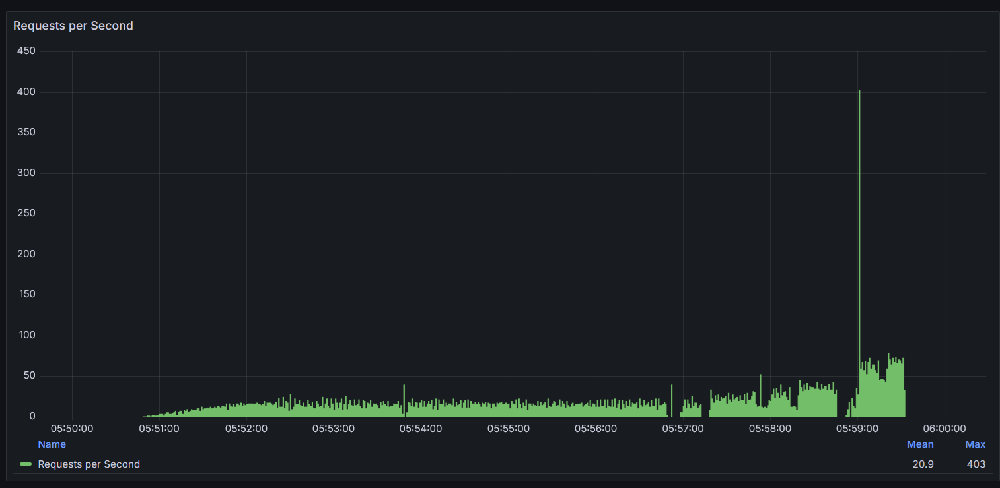
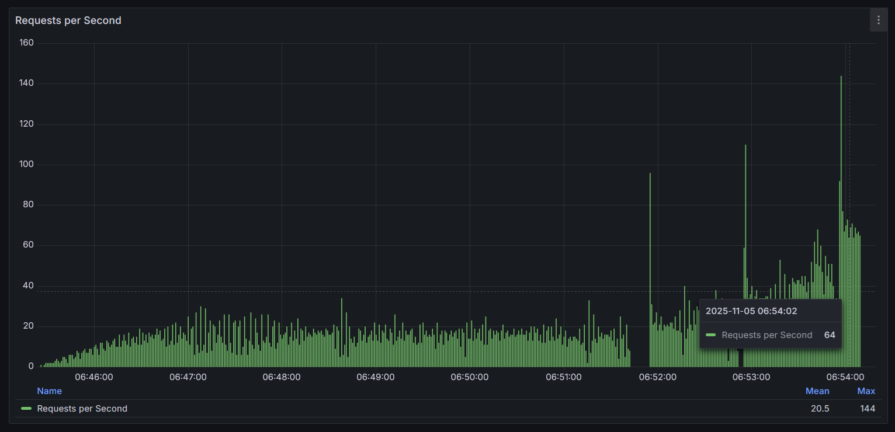
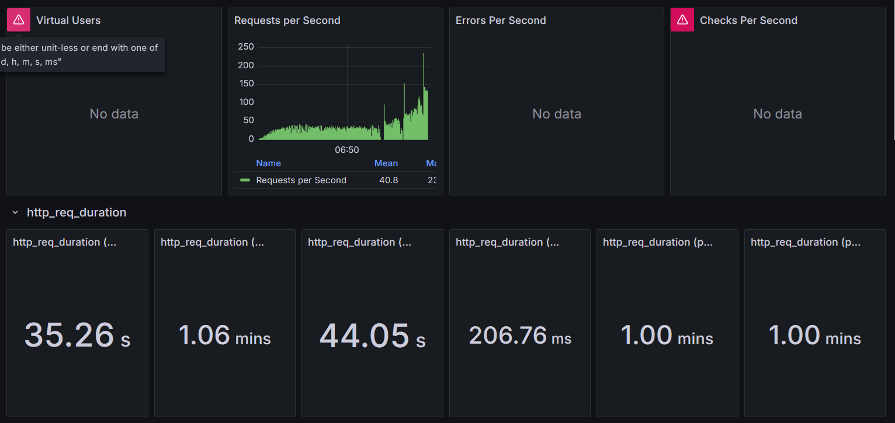

### Prueba 1 (Imágenes 1.png, 1.2.png)

* **Throughput (Rendimiento):**
    * **Promedio:** 20.2 Peticiones/Segundo
    * **Máximo:** 70 Peticiones/Segundo
* **Tiempos de Respuesta (`http_req_duration`):**
    * Vemos valores como **36.88s**, **1.00 mins**, **47.58s**.
* **Análisis:**
    * Esta parece ser una prueba de "rampa" (ramp-up), donde k6 añade usuarios gradualmente (por eso la gráfica sube de izquierda a derecha).
    * Incluso con un promedio bajo de 20 peticiones/seg, los tiempos de respuesta ya son inaceptables. Que un usuario tenga que esperar un minuto por una respuesta es un indicador clave de un cuello de botella severo.
    
    

### Prueba 2 (Imágenes 2.1.png, 2.2.png)

* **Throughput (Rendimiento):**
    * **Promedio:** 20.9 Peticiones/Segundo (aunque el panel `2.2.png` dice 41.4, la gráfica general `2.1.png` es la referencia).
    * **Máximo:** 403 Peticiones/Segundo
* **Tiempos de Respuesta (`http_req_duration`):**
    * Valores similares o peores: **35.20s**, **1.25 mins**, **1.01 mins**.
* **Análisis:**
    * Esta prueba tuvo un pico (spike) muy agresivo, llegando a 403 peticiones/segundo.
    * La latencia empeoró ligeramente (1.25 minutos), confirmando que la aplicación no puede manejar este tipo de carga. El pico de 403 reqs/s probablemente fue una acumulación de peticiones que se resolvieron todas juntas después de una larga espera.
    
    

### Prueba 3 (Imágenes 3.1.png, 3.2.png)

* **Throughput (Rendimiento):**
    * **Promedio:** 20.5 Peticiones/Segundo (el panel `3.2.png` dice 40.8).
    * **Máximo:** 144 Peticiones/Segundo
* **Tiempos de Respuesta (`http_req_duration`):**
    * La misma historia: **35.26s**, **1.06 mins**, **1.00 mins**.
* **Análisis:**
    * Esta prueba es muy similar a la primera y confirma los hallazgos. Tan pronto como la carga empieza a aumentar (después de las 06:52:00), las latencias se disparan.
    
    
---

## Conclusión General

El contenedor está funcionando bien, pero tiene problemas de latencia en la respuesta, hay picos muy altos de demora de tiempo y de respuesta.

**El problema es un cuello de botella masivo en la aplicación.**

Cuando la latencia es tan alta, pero los errores son cero, casi siempre apunta a una de estas dos cosas:

1.  **Base de Datos Lenta:** El servicio `app-1` está enviando consultas a `database-1` (MySQL). Con muchos usuarios concurrentes, la base de datos no puede mantener el ritmo. Las peticiones se encolan, esperando que la base de datos termine consultas lentas o libere bloqueos. La `app` se queda simplemente esperando.
2.  **Código Ineficiente:** La `app` misma tiene algún proceso que consume mucho CPU o memoria y que no escala con múltiples peticiones.

