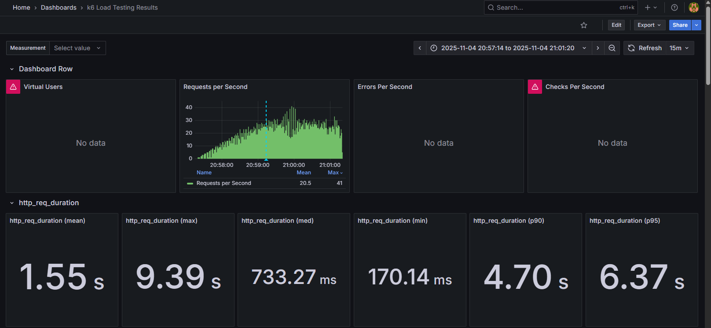
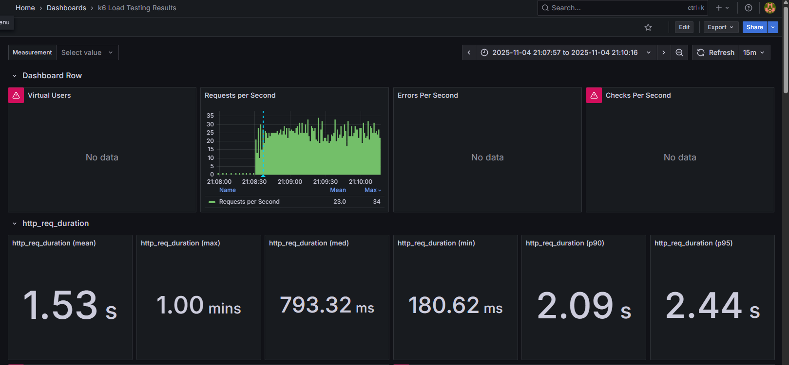
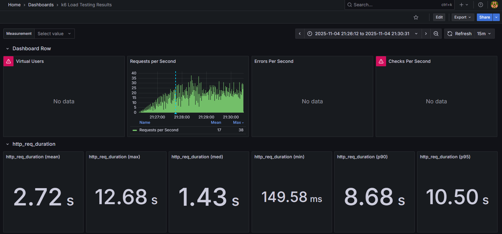

## Andres David Caro Mora
ancarom
# Laboratorio #6

## Objetivo
Identificar el punto "knee" (rodilla) del sistema mediante pruebas de estrés, que representa el punto de inflexión donde el rendimiento del sistema comienza a degradarse significativamente antes del colapso total.

## Concepto de "Knee" (Rodilla)
La rodilla es el punto crítico en las pruebas de rendimiento donde:
- El sistema alcanza su máxima capacidad de procesamiento (pico de RPS)
- Inmediatamente después, el throughput cae drásticamente
- Indica que el sistema está saturado y no puede manejar más carga sin degradación severa
- Es el límite operacional seguro antes del punto de ruptura

Este punto es crucial porque marca el umbral máximo de carga que el sistema puede soportar antes de entrar en estado de degradación crítica.

---

## Primera prueba

### Resultados Observados
- **Throughput máximo:** 41 RPS (Pico máximo)
- **Throughput promedio:** 20.5 RPS

### Métricas de Latencia (Grafana)
- **Mediana (med):** 733.27 ms
- **Promedio (mean):** 1.55 s
- **Máximo (max):** 9.39 s
- **Percentil 90 (p90):** 4.70 s
- **Percentil 95 (p95):** 6.37 s

### Interpretación del Comportamiento
Durante este tramo de la prueba, el sistema muestra un tiempo de respuesta central rápido (mediana de 733.27 ms). Sin embargo, el promedio de 1.55 s es significativamente más alto, lo que indica que una parte de las solicitudes experimenta latencias elevadas. Esto se confirma con el p90 de 4.70 s y el p95 de 6.37 s, lo que significa que el 5-10% de los usuarios experimenta tiempos de espera muy largos. El throughput promedio sostenido es de 20.5 RPS.

### Análisis de la Rodilla
El punto "knee" se identifica en el pico de **41 RPS**. Este es el punto de rodilla porque:

1.  **Pico máximo observable:** El sistema logra procesar hasta 41 solicitudes por segundo, representando su capacidad máxima momentánea.
2.  **Degradación de latencia:** Aunque el throughput es alto, el p95 de 6.37 s muestra una degradación significativa del rendimiento para un subconjunto de usuarios.
3.  **Punto de saturación:** El pico abrupto seguido de un rendimiento promedio más bajo (20.5 RPS) sugiere que el sistema alcanzó su límite de recursos y no pudo sostener ese pico.

---

## Segunda prueba

### Resultados Observados
- **Throughput máximo:** 34 RPS (Pico máximo)
- **Throughput promedio:** 23.0 RPS

### Métricas de Latencia (Grafana)
- **Mediana (med):** 793.32 ms
- **Promedio (mean):** 1.53 s
- **Máximo (max):** 1.00 mins (60 segundos)
- **Percentil 90 (p90):** 2.09 s
- **Percentil 95 (p95):** 2.44 s

### Interpretación del Comportamiento
Esta prueba muestra el **mejor rendimiento de latencia** para la gran mayoría de los usuarios. El p90 (2.09 s) y el p95 (2.44 s) son excelentes y están dentro de un SLA aceptable (ej. ≤3s). El sistema mantiene el throughput promedio más alto y estable de las tres pruebas (23.0 RPS). Sin embargo, hay una **alerta crítica**: el tiempo de respuesta máximo fue de **1.00 minuto**. Esto indica que, aunque el sistema es estable para el 95% de las solicitudes, algunas peticiones (posiblemente por bloqueo de base de datos o agotamiento de pool) fallan catastróficamente.

### Análisis de la Rodilla
Esta gráfica no muestra un "knee" claro (pico y caída), sino un **rendimiento sostenido**. El pico máximo registrado fue de 34 RPS.

1.  **Rendimiento Sostenible:** El sistema demuestra que puede manejar un promedio sostenido de **23.0 RPS** con excelentes latencias p95 (2.44 s).
2.  **Outlier Peligroso:** El máximo de 1.00 minuto es un signo de un problema grave de contención de recursos bajo esta carga, que afecta a un pequeño número de solicitudes.
3.  **Límite Operacional:** Este escenario (23.0 RPS) parece ser el punto óptimo de operación (cerca de la rodilla) antes de que las latencias p95 comiencen a degradarse masivamente, como se ve en las otras pruebas.

---

## Tercera prueba

### Resultados Observados
- **Throughput máximo:** 38 RPS (Pico máximo)
- **Throughput promedio:** 17 RPS

### Métricas de Latencia (Grafana)
- **Mediana (med):** 1.43 s
- **Promedio (mean):** 2.72 s
- **Máximo (max):** 12.68 s
- **Percentil 90 (p90):** 8.68 s
- **Percentil 95 (p95):** 10.50 s

### Interpretación del Comportamiento
Este tramo presenta los **peores tiempos de respuesta generales**. Aunque la mediana es de 1.43 s, el promedio de 2.72 s es mucho más alto. Lo más crítico es el p95 de **10.50 s** y el p90 de **8.68 s**. Esto significa que al menos el 10% de los usuarios experimentó tiempos de espera superiores a 8 segundos, lo cual es inaceptable. El throughput promedio (17 RPS) también es el más bajo de las tres pruebas, lo que indica que el sistema está sobrecargado y procesa menos solicitudes mientras tiene latencias más altas.

### Análisis de la Rodilla
El punto "knee" se identifica en el pico de **38 RPS**.

1.  **Degradación Severa:** Este escenario muestra claramente lo que sucede *después* de pasar la rodilla. El sistema intenta manejar picos (38 RPS) pero el costo es una degradación severa y generalizada de la latencia (p95 de 10.50 s).
2.  **Menor Throughput:** El sistema está en un estado de congestión. Está tan ocupado manejando solicitudes lentas que su throughput general cae a un promedio de 17 RPS, menos que en la prueba 2.
3.  **Estado de Colapso:** Este comportamiento (alto p95, bajo throughput promedio) es un signo clásico de un sistema que ha superado su punto de rodilla y está en un estado de colapso de rendimiento.

---

## Conclusiones

### Identificación del Punto "Knee"
A través de las tres pruebas, se identificó que **el punto de rodilla del sistema (capacidad máxima sostenible) está alrededor de 23 RPS**.

1.  **Capacidad máxima (Picos):** El sistema puede manejar picos momentáneos de hasta **41 RPS**, pero esto conlleva una degradación de la latencia p95 (6.37 s).
2.  **Umbral Sostenible (Rodilla):** La prueba 2 muestra que el sistema puede operar de manera sostenible a **23.0 RPS** (promedio) manteniendo latencias p95 excelentes (2.44 s). Este es el umbral operacional seguro.
3.  **Comportamiento Post-Rodilla (Colapso):** La prueba 3 demuestra que al intentar superar este límite, el sistema entra en colapso. Aunque el pico fue de 38 RPS, el throughput promedio cayó a 17 RPS y las latencias p95 se dispararon a **10.50 s**.

### ¿Por qué estos puntos son la "Rodilla"?
-   **Picos (34-41 RPS):** Representan el máximo absoluto que el sistema puede procesar momentáneamente antes de que la contención de recursos provoque una caída.
-   **Punto de Inflexión (23 RPS):** La prueba 2 (23 RPS promedio, p95 de 2.44s) y la prueba 1 (20.5 RPS promedio, p95 de 6.37s) muestran que en algún punto entre 20 y 23 RPS, el sistema pasa de ser estable a degradarse exponencialmente en latencia.
-   **No hay meseta:** El sistema no puede sostener sus picos máximos; intentar hacerlo (como en la prueba 3) resulta en un rendimiento promedio más bajo y latencias mucho peores.
