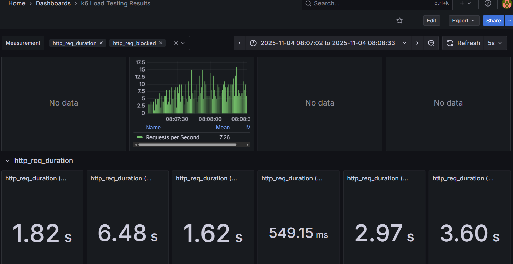
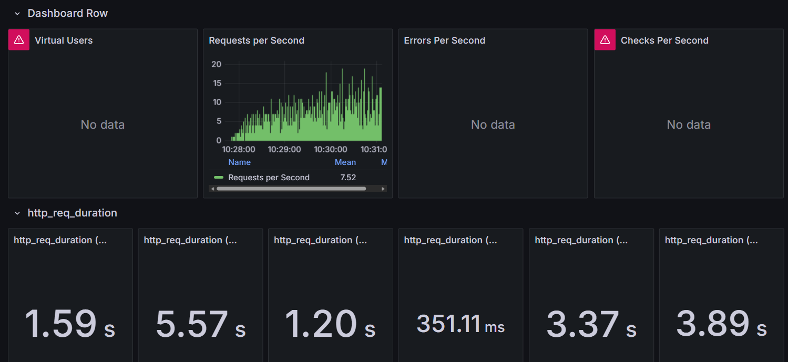
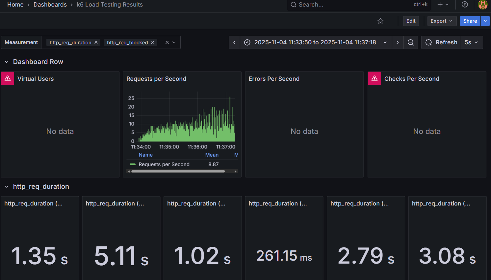

## Cristhian Alejandro Alarcón Florido y Daniel Ochoa Ruiz 
calarconf y daochoar
# Laboratorio #6
Métrica: Throughput (RPS - Requests Per Second)

## Objetivo
Identificar el punto "knee" (rodilla) del sistema mediante pruebas de estrés, que representa el punto de inflexión donde el rendimiento del sistema comienza a degradarse significativamente antes del colapso total.

## Concepto de "Knee" (Rodilla)
La rodilla es el punto crítico en las pruebas de rendimiento donde:
- El sistema alcanza su máxima capacidad de procesamiento (pico de RPS)
- Inmediatamente después, el throughput cae drásticamente
- Indica que el sistema está saturado y no puede manejar más carga sin degradación severa
- Es el límite operacional seguro antes del punto de ruptura

Este punto es crucial porque marca el umbral máximo de carga que el sistema puede soportar antes de entrar en estado de degradación crítica.

---

## Primera prueba

### Resultados Observados
- **Throughput máximo:** 15 RPS
- **Throughput post-caída:** ~7.3 RPS
- **Degradación:** 53.3%

### Métricas de Latencia (Grafana)
- **Mediana:** 1.6-1.8 s
- **Promedio:** Similar a la mediana
- **Máximo:** ~6.5 s
- **SLA (≤3s):** Mayoría cumple, pero con porcentaje significativo de violaciones

### Interpretación del Comportamiento
Durante este tramo de la prueba, el sistema mantiene un rendimiento aceptable para la mayoría de solicitudes (1.6-1.8s). Sin embargo, la presencia de latencias máximas de ~6.5s indica que el sistema ya experimenta **variabilidad significativa** bajo carga. El throughput de ~7.3 RPS después de la caída sugiere que no se ha alcanzado saturación completa, pero los máximos elevados advierten que el sistema está cerca de su límite operativo.

### Análisis de la Rodilla
El punto "knee" se identifica en los **15 RPS**, donde el sistema alcanza su pico de rendimiento. Este es el punto de rodilla porque:

1. **Pico máximo observable:** El sistema logra procesar hasta 15 solicitudes por segundo, representando su capacidad máxima bajo las condiciones de prueba.

2. **Caída significativa:** Inmediatamente después del pico, el throughput desciende a 7 RPS, lo que representa una degradación del **53.3%** del rendimiento.

3. **Punto de saturación:** La caída abrupta indica que el sistema alcanzó su límite de recursos (CPU, memoria, conexiones, etc.) y comenzó a rechazar o procesar más lentamente las peticiones adicionales.

4. **Umbral operacional:** Los 15 RPS marcan el límite donde mantener la estabilidad se vuelve imposible, cualquier carga adicional provoca degradación exponencial.

---

## Segunda prueba

### Resultados Observados
- **Throughput máximo:** 18 RPS
- **Throughput post-caída:** ~7.5 RPS (luego cae a 3 RPS)
- **Degradación:** 83.3%

### Métricas de Latencia (Grafana)
- **Mediana:** 1.20 s
- **Promedio:** ~1.6 s
- **Máximo:** ~5.6 s
- **SLA (≤3s):** Mayoría cumple, acercándose al límite operativo

### Interpretación del Comportamiento
Esta prueba muestra una **mejora en latencias centrales** (mediana de 1.20s vs 1.6-1.8s anterior), indicando que el sistema responde bien bajo condiciones normales. Sin embargo, el máximo de ~5.6s persiste, revelando que parte de la carga genera latencias elevadas. El throughput inicial de ~7.5 RPS sugiere que el sistema aún tiene capacidad, pero los **signos de estrés son evidentes**. La posterior caída drástica a 3 RPS indica que al alcanzar los 18 RPS, el sistema experimentó un colapso crítico de recursos.

### Análisis de la Rodilla
El punto "knee" se sitúa en los **18 RPS**, siendo el más crítico de las tres pruebas debido a:

1. **Mayor capacidad alcanzada:** El sistema logró procesar 18 solicitudes por segundo, superando la primera prueba en 3 RPS, posiblemente debido a condiciones iniciales diferentes o variabilidad en los recursos disponibles.

2. **Colapso más severo:** La caída a 3 RPS representa una degradación del **83.3%**, la más drástica de todas las pruebas. Esto indica un colapso casi total del sistema después de alcanzar el punto de saturación.

3. **Sobrecarga crítica:** La magnitud de la caída sugiere que al alcanzar los 18 RPS, el sistema entró en un estado de sobrecarga donde los recursos se agotaron completamente (posiblemente queue overflow, thread pool exhaustion, o memory pressure).

4. **Punto de no retorno:** Este comportamiento muestra que 18 RPS representa un límite extremadamente peligroso donde el sistema no solo se degrada, sino que prácticamente colapsa funcionalmente.

---

## Tercera prueba

### Resultados Observados
- **Throughput máximo:** 19 RPS
- **Throughput post-caída:** ~8.9 RPS (luego cae a 9 RPS)
- **Degradación:** 52.6%

### Métricas de Latencia (Grafana)
- **Mediana:** ~1.02 s (mejor de las tres pruebas)
- **Promedio:** ~1.35 s
- **Máximo:** ~5.1 s
- **SLA (≤3s):** Sistema cumple para la mayoría, pero requiere vigilancia

### Interpretación del Comportamiento
Este tramo presenta los **mejores tiempos de respuesta** (mediana de 1.02s), lo cual es muy positivo e indica operación óptima bajo carga moderada. El promedio de 1.35s confirma un buen nivel de servicio para la mayoría de usuarios. Sin embargo, el máximo de ~5.1s revela la presencia de **outliers significativos**. El throughput de ~8.9 RPS es el más alto de los tres tramos, sugiriendo que estamos **más cerca del "knee"** del sistema. Los tiempos máximos elevándose son señal temprana de que se aproxima la degradación, aunque el sistema logra mantener mejor estabilidad post-pico comparado con la segunda prueba.

### Análisis de la Rodilla
El punto "knee" se identifica en los **19 RPS**, el más alto registrado:

1. **Máximo absoluto:** Con 19 RPS, esta prueba alcanzó el throughput máximo observado en todas las iteraciones, representando el límite teórico del sistema bajo condiciones óptimas.

2. **Degradación moderada:** La caída a 9 RPS representa una reducción del **52.6%**, significativa pero menos severa que la segunda prueba, lo que sugiere que aunque el sistema se saturó, logró mantener cierta estabilidad parcial.

3. **Capacidad residual:** A diferencia de la segunda prueba, el sistema mantuvo 9 RPS después del pico, indicando que aunque alcanzó la rodilla, aún pudo procesar casi la mitad de su capacidad máxima bajo estrés.

4. **Variabilidad del sistema:** La diferencia en el comportamiento post-rodilla comparado con la segunda prueba sugiere que factores externos (caché, garbage collection, conexiones establecidas) pueden influir en la recuperación del sistema después de alcanzar el punto de saturación.

---

## Conclusiones

### Identificación del Punto "Knee"
A través de las tres pruebas, se identificó que **el punto de rodilla del sistema se encuentra entre 15-19 RPS**, con los siguientes hallazgos:

1. **Capacidad máxima:** El sistema puede alcanzar hasta 19 RPS en condiciones óptimas
2. **Umbral seguro:** Se recomienda operar bajo 15 RPS para evitar riesgo de degradación
3. **Comportamiento post-rodilla:** El sistema puede degradarse entre 50-83% una vez superado el límite

### ¿Por qué estos puntos son la "Rodilla"?
Estos picos (15, 18 y 19 RPS) representan la rodilla porque:

- **Precedidos por estabilidad:** El sistema maneja valores relativamente estables (5-11 RPS) antes del pico
- **Pico súbito:** Se alcanza un máximo abrupto que representa el límite de capacidad
- **Caída inmediata:** Después del pico, el throughput cae drásticamente y no se recupera
- **No hay meseta:** No existe un plateau sostenible en el máximo, indicando inestabilidad crítica
- **Punto de inflexión:** Marca el cambio de comportamiento lineal a degradación exponencial
