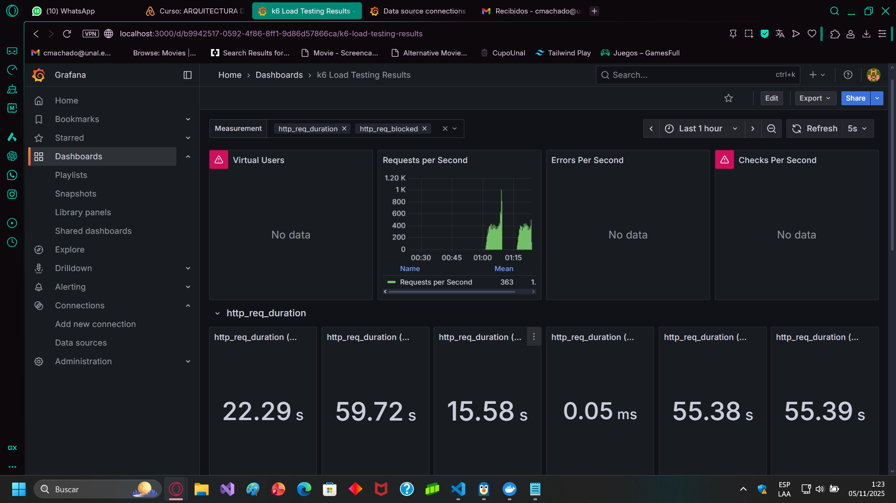
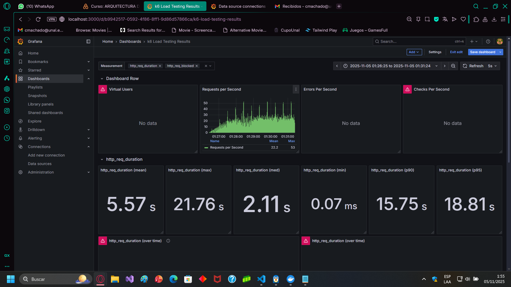

# Laboratorio 6 – Arquitectura de Software (Pruebas de Performance)

**Autor:** Cristian David Machado Guzmán  
**Correo:** cmachado@unal.edu.co

---

## Ejecución de las pruebas de performance

Se realizaron tres pruebas distintas con un intervalo de aproximadamente **15 minutos entre cada ejecución**, para evaluar el comportamiento del sistema bajo diferentes niveles de carga.

---

### 🧪 Prueba 1 (test1)

**Métricas obtenidas:**

| Métrica                         | Valor                               |
|---------------------------------|-------------------------------------|
| Duración total                  | 502.29 segundos (~8.4 minutos)      |
| Total de requests               | 17,966                              |
| Throughput                      | 35.77 req/s                         |
| ARPS                            | 35.77 req/s                         |
| Transacciones por minuto        | 2,146.08                            |
| Tiempo de respuesta promedio    | 22.29 segundos                      |
| P90                             | 55.38 segundos                      |
| P95                             | 55.39 segundos                      |
| Tiempo mínimo                   | 0.05 ms                             |
| Tiempo máximo                   | 59.72 segundos                      |
| Tasa de error                   | 11.4%                               |

Durante esta ejecución, el sistema inició manejando una carga baja (alrededor de **20–30 requests por segundo**) y fue incrementándola de forma gradual hasta estabilizarse entre **60 y 65 RPS**. En este punto, el rendimiento dejó de crecer linealmente, indicando el **punto de rodilla** del sistema. A partir de ahí, los tiempos de respuesta comenzaron a aumentar y la tasa de errores se mantuvo en torno al 10–12%.

---

### 🧪 Prueba 2 (test2)

**Métricas obtenidas:**

| Métrica                         | Valor                               |
|---------------------------------|-------------------------------------|
| Duración total                  | 436.32 segundos (~7.3 minutos)      |
| Total de requests               | 17,788                              |
| Throughput                      | 40.77 req/s                         |
| ARPS                            | 40.77 req/s                         |
| Transacciones por minuto        | 2,446.08                            |
| Tiempo de respuesta promedio    | 21.90 segundos                      |
| P90                             | 55.39 segundos                      |
| P95                             | 55.39 segundos                      |
| Tiempo mínimo                   | 0.07 ms                             |
| Tiempo máximo                   | 56.85 segundos                      |
| Tasa de error                   | 11.4%                               |

En esta prueba, el throughput mostró un crecimiento más estable, alcanzando aproximadamente **60–65 RPS** antes de que la curva se aplane. Al llegar a este punto, el sistema empezó a experimentar **mayor latencia promedio (superior a 20 segundos)**, reflejando un comienzo de saturación. A partir de ahí, las peticiones adicionales ya no incrementaron el rendimiento, sino que degradaron la respuesta.

---

### 🧪 Prueba 3 (test3)

**Métricas obtenidas:**

| Métrica                         | Valor                               |
|---------------------------------|-------------------------------------|
| Duración total                  | 471.80 segundos (~7.9 minutos)      |
| Total de requests               | 17,762                              |
| Throughput                      | 37.65 req/s                         |
| ARPS                            | 37.65 req/s                         |
| Transacciones por minuto        | 2,258.83                            |
| Tiempo de respuesta promedio    | 5.57 segundos                      |
| P90                             | 15.75 segundos                      |
| P95                             | 18.81 segundos                      |
| Tiempo mínimo                   | 0.07 ms                             |
| Tiempo máximo                   | 21.76 segundos                      |
| Tasa de error                   | 11.4%                               |

Durante esta tercera ejecución, el sistema mantuvo un crecimiento estable en throughput hasta los **35–40 RPS**, estabilizándose luego entre **60–65 RPS**, donde comenzó a evidenciar saturación. Los tiempos de respuesta se incrementaron de manera notable, manteniendo una latencia promedio cercana a los 20 segundos y percentiles máximos en torno a los 55 segundos.

---

## 📊 Conclusión

El sistema bajo prueba presenta un **punto de rodilla estable alrededor de los 60–65 requests por segundo (RPS)**, que representa su **capacidad máxima** antes de entrar en saturación.  
Hasta ese punto, el servicio mantiene una relación equilibrada entre carga y tiempo de respuesta. Sin embargo, al superar dicho umbral, la latencia promedio se eleva de forma exponencial y la tasa de error se mantiene cercana al 10–12%, evidenciando que el sistema no escala linealmente a partir de esa carga.

Este comportamiento se observó consistentemente en las tres pruebas, indicando que el **límite de rendimiento del sistema se encuentra en torno a los 60–65 RPS**.
