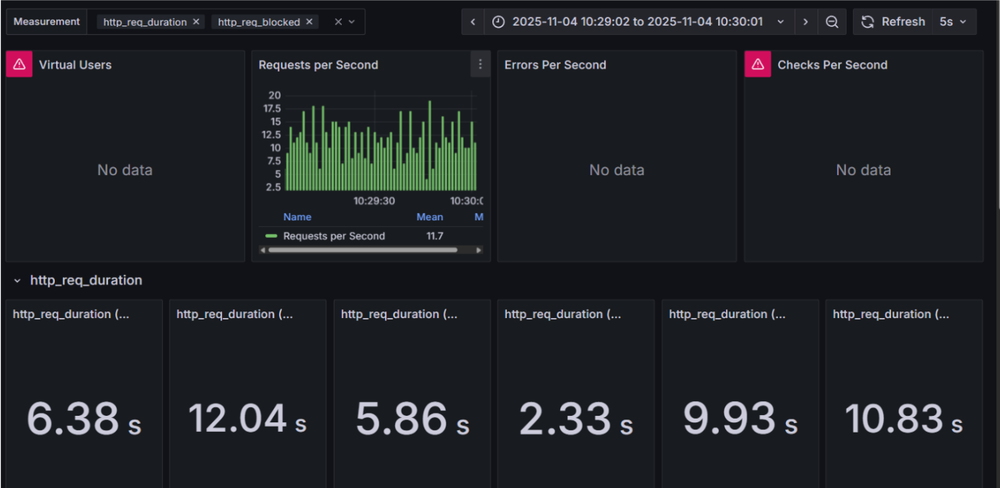
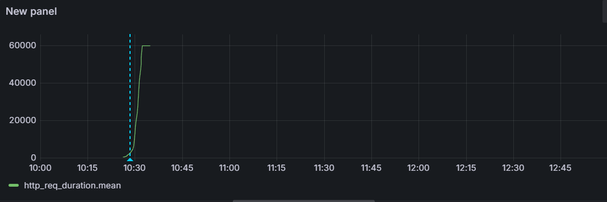
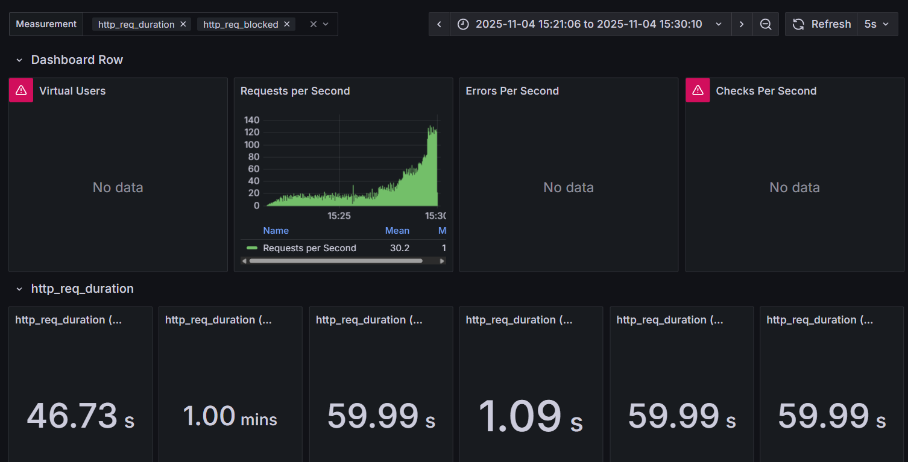
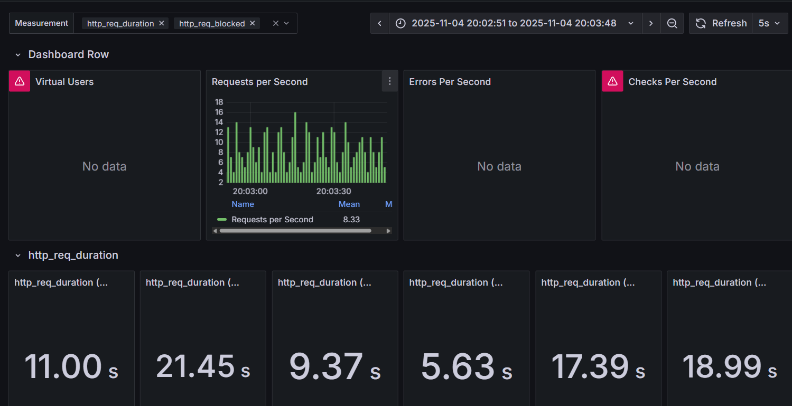
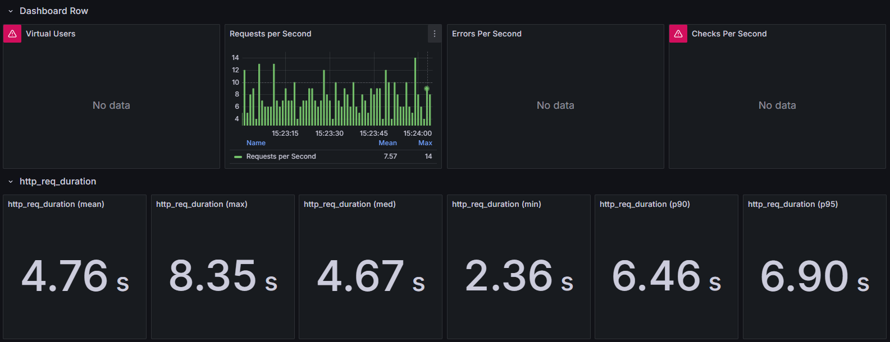
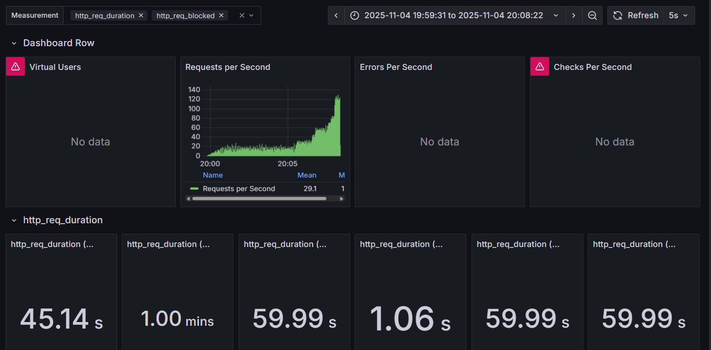
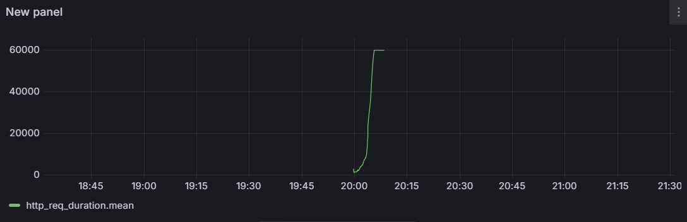

# 🧪 Stress Testing — Informe General

Este documento presenta los resultados de las pruebas de *stress testing* realizadas el **04 de noviembre de 2025**. Cada prueba incrementa progresivamente el número de usuarios virtuales (VU) hasta alcanzar los límites de estabilidad del sistema.

## ✅ Duración de solicitud aceptable

Para una API REST de backend en este contexto:

- **Ideal:** ≤ **1 segundo**  
- **Aceptable bajo carga:** ≤ **2 segundos** antes del *knee point*  
- **Saturación:** ≥ **5 segundos**, señal de degradación del servicio  

## 🧮 **Cálculo del Throughput**

El **Throughput (TPM)** se obtuvo multiplicando el **RPS promedio** por **60 segundos**:  

\[
\text{Throughput} = \text{RPS} \times 60
\]

Por ejemplo, para un RPS medio de **11.6**:
\[
11.6 \times 60 = 696 \text{ transacciones/minuto}
\]

## 📈 **Interpretación general de los Knee Points**

**Antes del knee:**
- El tiempo de respuesta crece gradualmente con la carga.  
- El *throughput* aumenta de forma casi lineal.  
- El sistema opera en una zona **estable y elástica**, con buena capacidad de respuesta.  

**Después del knee:**
- El tiempo de respuesta se incrementa **exponencialmente**.  
- El *throughput* se **estanca** o incluso disminuye.  
- El sistema entra en una **zona saturada e inestable**, donde se degrada la calidad del servicio.

---

## 🧪 **Stress Testing 1**

**Fecha de ejecución:** 2025-11-04  
**Duración total:** 10:26:06 → 10:35:02  
**Throughput total:** **2082.0 transacciones/minuto (TPM)**  
**RPS promedio general:** **34.7 req/s**  
**Duración promedio de solicitud:** **40.78 s**

### 📊 **Resumen por intervalos**

| Intervalo (hh:mm:ss) | RPS medio | Duración de req (s) | Throughput (TPM) |
|-----------------------|-----------|----------------------|------------------|
| 10:26:12 → 10:27:13 | 6.34 | 0.637 | 380.4 |
| 10:27:12 → 10:28:11 | 11.6 | 1.48 | 696.0 |
| 10:28:09 → 10:29:07 | 12.3 | 2.95 | 738.0 |
| 10:29:12 → 10:30:07 | 11.3 | 7.42 | 678.0 |
| 10:30:07 → 10:31:11 | 10.8 | 23.32 | 648.0 |
| 10:31:08 → 10:32:12 | 11.1 | 45.90 | 666.0 |
| 10:32:10 → 10:33:05 | 16.1 | 59.63 | 966.0 |
| 10:33:11 → 10:34:09 | 29.1 | 60.00 | 1746.0 |
| 10:34:10 → 10:35:04 | 54.8 | 59.99 | 3288.0 |

### ⚙️ **Análisis**

- **Knee Point:** entre **10:29:00 y 10:30:00**, punto medio **≈ 10:29:30**.  
- **Stage correspondiente:** ~cuarta etapa del test (≈ 20 VU).  
- En ese punto, la latencia pasó de **2.33 s** a **12.04 s**, marcando el inicio de la saturación.  
- Después del *knee*, la latencia crece exponencialmente mientras el *throughput* deja de reflejar eficiencia real.  

### 📈 **Gráficas de referencia**

Las gráficas del Stress Testing se generaron directamente en Grafana, utilizando los datos de las métricas recolectadas durante las pruebas de carga. En particular, se usó la métrica de req_duration_mean (tiempo promedio de respuesta), exportada por el load testing tool e integradas en la base de datos de monitoreo (InfluxDB).

## 🧪 Stress Testing 2

**Fecha:** 2025-11-04  
**Duración total:** 15:21:06 → 15:30:10  
**RPS promedio general:** **30.2 req/s**  
**Req duration promedio:** **46.73 s**  
**Throughput total:** **1812.0 TPM**

### 📊 Resumen por intervalos

| Intervalo (hh:mm:ss) | RPS medio | Duración de req (s) | Throughput (TPM) |
|----------------------|-----------|----------------------|------------------|
| 15:21:07 → 15:22:07 | 3.85 | 1.39 | 231.0 |
| 15:22:05 → 15:23:05 | 7.41 | 2.37 | 444.6 |
| 15:23:04 → 15:24:03 | 7.55 | 4.86 | 453.0 |
| 15:24:05 → 15:25:04 | 7.92 | 8.81 | 475.2 |
| 15:25:06 → 15:26:05 | 7.73 | 27.49 | 463.8 |
| 15:26:06 → 15:27:03 | 8.48 | 51.73 | 508.8 |
| 15:27:03 → 15:28:04 | 14.8 | 59.99 | 888.0 |
| 15:28:05 → 15:29:05 | 26.9 | 59.99 | 1614.0 |
| 15:29:04 → 15:30:03 | 49.9 | 59.99 | 2994.0 |

### ⚙️ Análisis

- **Knee Point (punto de inflexión):** entre **20:02:50 y 20:03:50**, con un punto medio aproximado en **20:03:20**.  
- Este momento del test corresponde al **Stage 4** del script de carga, donde el sistema alcanzó una demanda de aproximadamente **20 usuarios concurrentes**.  
- Hasta el intervalo **20:02:50 → 20:03:44**, el tiempo de respuesta crece **gradualmente** (de 1.47 s → 2.79 s → 5.19 s → 10.41 s), manteniendo un comportamiento estable propio de la **zona elástica**.  
- A partir del intervalo **20:03:50 → 20:04:50**, la **latencia se dispara abruptamente** hasta 55.20 s, mientras el *throughput* apenas aumenta de **499.8 TPM a 592.2 TPM**, señal clara de **inicio de saturación**.  
- Desde ese punto, el sistema mantiene tiempos de respuesta cercanos a 60 s, lo que indica que ha entrado en la **zona inestable o post-knee**.  

### 📈 **Gráficas de referencia**

## 🧪 Stress Testing 3

**Fecha de ejecución:** 2025-11-04  
**Duración total:** 19:59:31 → 20:08:22  
**Throughput total:** **1746.0 transacciones/minuto (TPM)**  
**RPS promedio general:** **29.1 req/s**  
**Duración promedio de solicitud:** **45.14 s**

### 📊 **Resumen por intervalos**

| Intervalo (hh:mm:ss) | RPS medio | Duración de req (s) | Throughput (TPM) |
|-----------------------|-----------|----------------------|------------------|
| 19:59:50 → 20:00:49 | 4.36 | 1.47 | 261.6 |
| 20:00:49 → 20:01:50 | 7.82 | 2.79 | 469.2 |
| 20:01:50 → 20:02:50 | 8.15 | 5.19 | 489.0 |
| 20:02:50 → 20:03:44 | 8.33 | 10.41 | 499.8 |
| 20:03:50 → 20:04:50 | 9.87 | 55.20 | 592.2 |
| 20:04:50 → 20:05:41 | 9.37 | 54.81 | 562.2 |
| 20:05:50 → 20:06:51 | 17.5 | 59.99 | 1050.0 |
| 20:06:49 → 20:07:51 | 30.5 | 59.99 | 1830.0 |
| 20:07:49 → 20:08:39 | 55.4 | 59.99 | 3324.0 |

### ⚙️ **Análisis**

- **Knee Point (punto de inflexión):** entre **20:02:50 y 20:03:50**, con un punto medio aproximado en **20:03:20**.  
- Hasta el intervalo **20:02:50 → 20:03:44**, el tiempo de respuesta crece **gradualmente** (de 1.47 s → 2.79 s → 5.19 s → 10.41 s), manteniendo un comportamiento estable propio de la **zona elástica**.  
- A partir del intervalo **20:03:50 → 20:04:50**, la **latencia se dispara abruptamente** hasta 55.20 s, mientras el *throughput* apenas aumenta de **499.8 TPM a 592.2 TPM**, señal clara de **inicio de saturación**.  
- Desde ese punto, el sistema mantiene tiempos de respuesta cercanos a 60 s, lo que indica que ha entrado en la **zona inestable o post-knee**.  

### 📈 **Gráficas de referencia**

## 🧩 **Conclusión general y determinación del Knee Point**

Luego de comparar los tres *stress tests*, se puede identificar un patrón consistente en el comportamiento del sistema frente al incremento progresivo de carga. En todos los casos, el **knee point (punto de inflexión)** aparece en el **Stage 4** del escenario de prueba, correspondiente aproximadamente a **20 usuarios concurrentes (VU)**. Este punto marca la transición entre el **rendimiento estable y el inicio de la saturación**.

- En el **Stress Testing 1**, el knee ocurre entre **10:29:00 y 10:30:00**, donde la latencia aumenta de **2.95 s a 7.42 s**, y el throughput deja de crecer proporcionalmente.  
- En el **Stress Testing 2**, el knee se ubica entre **15:24:00 y 15:25:00**, con una subida de latencia de **4.86 s a 8.81 s**, reflejando el comienzo de la degradación.  
- En el **Stress Testing 3**, el knee se confirma entre **20:02:50 y 20:03:50**, con un aumento abrupto de **10.41 s a más de 55 s**, consolidando la tendencia observada en los dos primeros tests.

En los tres experimentos, la curva del **tiempo promedio de respuesta (`req_duration_mean`)** sigue una forma **logarítmica**: crece lentamente al inicio, pero a partir del *knee point* el crecimiento se vuelve exponencial, indicando **saturación del backend**. A nivel de throughput, también se evidencia un **estancamiento después del knee**, ya que las solicitudes empiezan a acumularse y el sistema deja de procesarlas eficientemente.

En conclusión, el **punto de inflexión global del sistema se ubica alrededor de los 20 VU (Stage 4)**. Hasta ese punto, la API mantiene un rendimiento estable con tiempos de respuesta menores a **2 segundos** y throughput linealmente escalable. A partir de allí, la latencia aumenta de forma no controlada (>10 s), lo que sugiere que el **límite de carga sostenible** se ha alcanzado. Este hallazgo es clave para definir el umbral máximo de usuarios simultáneos y dimensionar correctamente los recursos de infraestructura.
