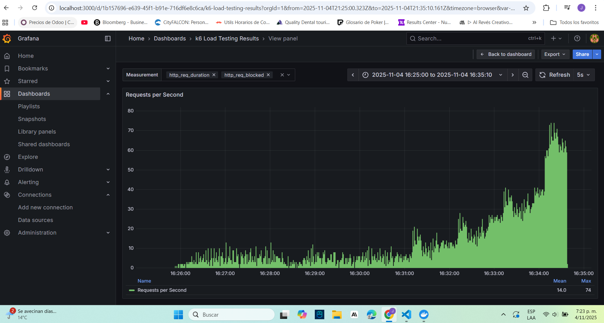
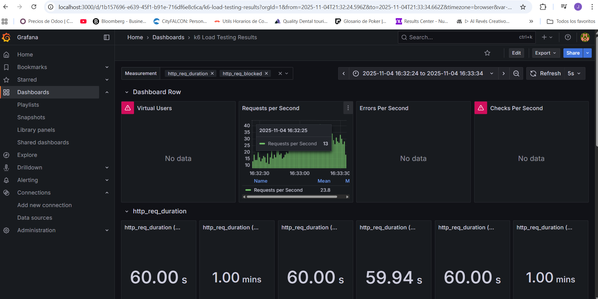
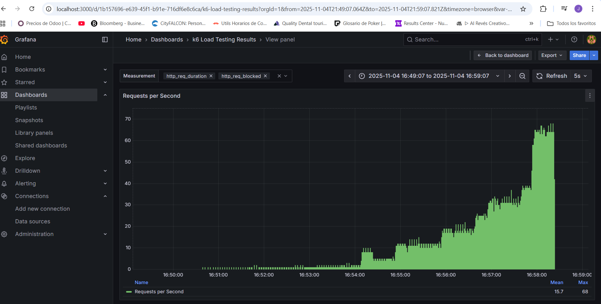
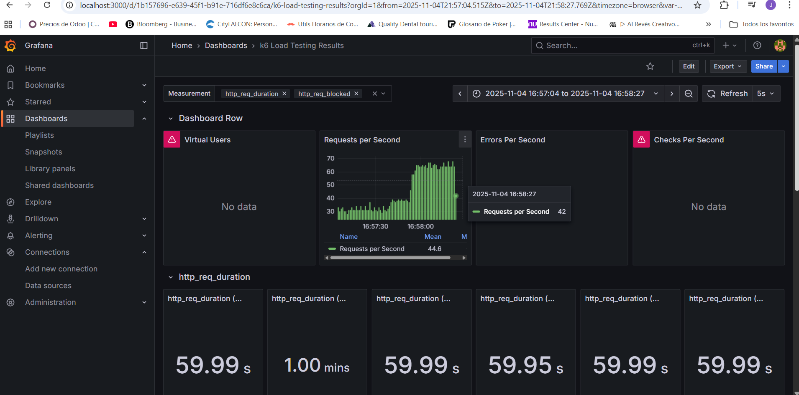
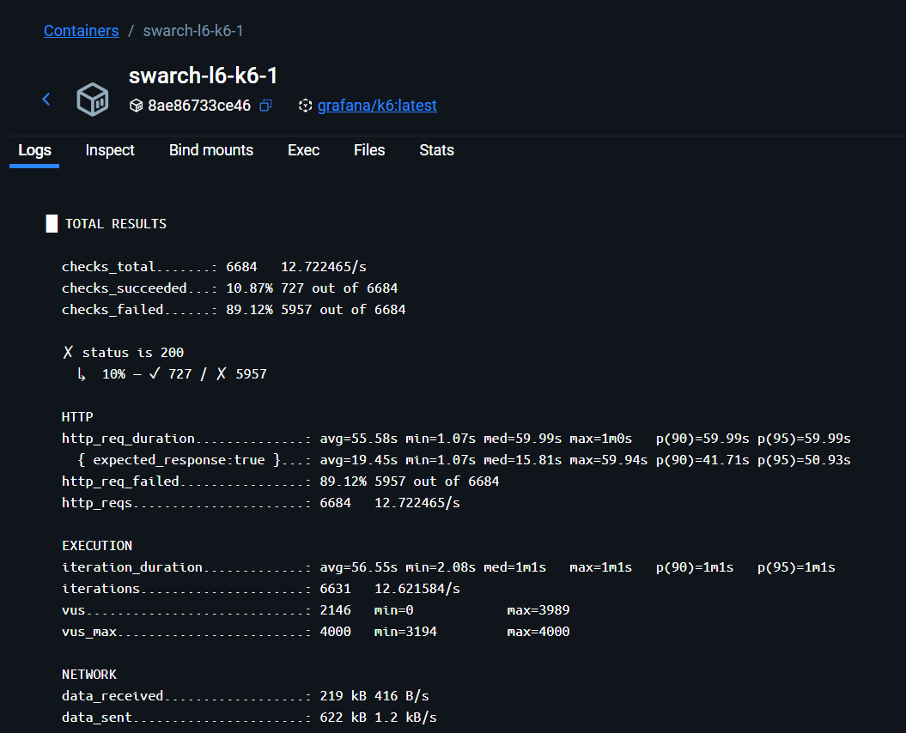

# Resultados laboratorio 6

## Prueba 1

Aquí podemos ver la primera prueba ejecutada donde en las últimas partes de la prueba se nota cómo las RPS empiezan aumentar bastante.

En la sección específica que se tomó como la "knee of the curve" podemos ver que el tiempo medio de las solicitudes fue de 60 segundos lo cual es lo que nosotros establecemos como "inaceptable" para nuestro sistema.

## Prueba 2

Aquí podemos ver la segunda prueba ejecutada donde en las últimas partes de la prueba se nota cómo las RPS empiezan aumentar bastante.

Al igual que en la segunda prueba encontramos la rodilla en la curva cuando la duración de las request es de 1 minuto aproximadamente en promedio

## Prueba 3

Aquí podemos ver la tercera prueba ejecutada donde en las últimas partes de la prueba se nota cómo las RPS empiezan aumentar bastante.

Al igual que en las demás podemos ver la rodilla en la curva cuando en un mismo intervalo de tiempo el tiempo de las peticiones alcanzan en promedio 1 minuto

## Throughput

En esta salida del contenedor de k6 podemos ver que el Throughput fue de 12.7222465 RPS o 763.35 req/min

Si calculamos el Throughput como el número de request exitosas obtenemos que es:

Duración ≈ total_reqs / RPS = 6684 / 12.722465 = ≈ 525.37 s

Éxitos = 727 ⇒ RPS exitoso = 727 / 525.37 = ≈ 1.384 req/s

RPM exitoso = 1.384 × 60 = ≈ 83.0 req/min

