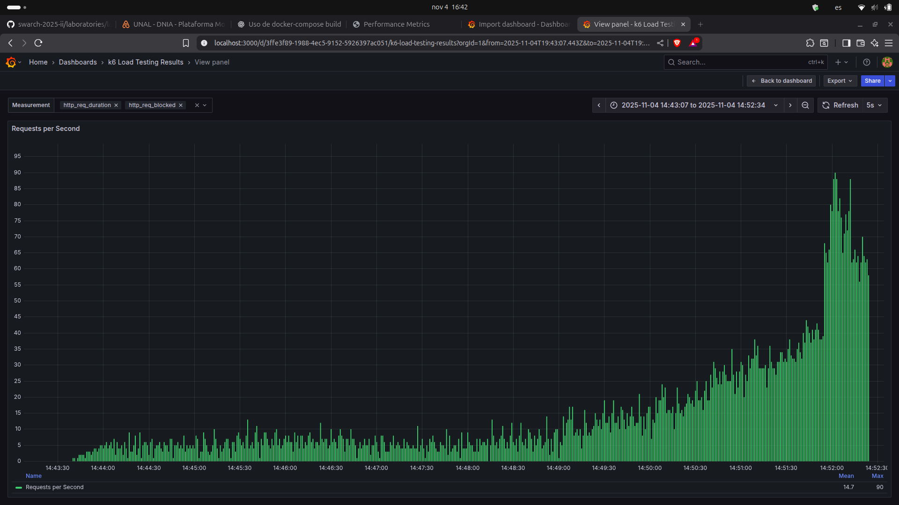
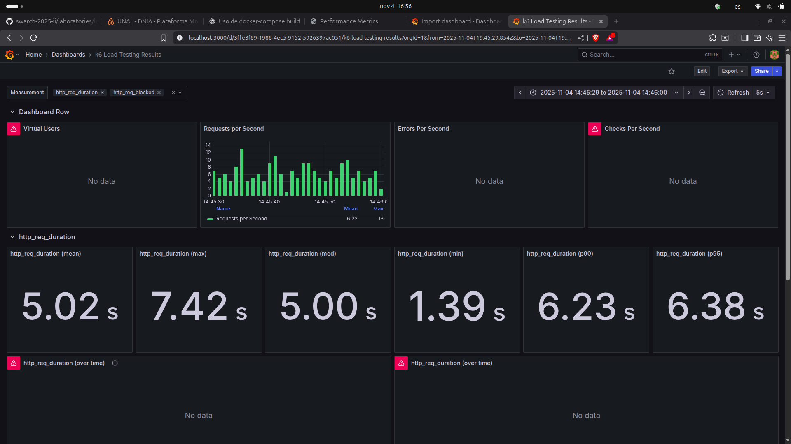
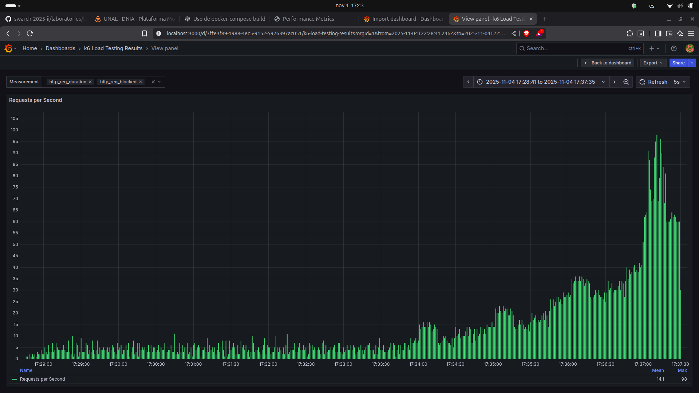
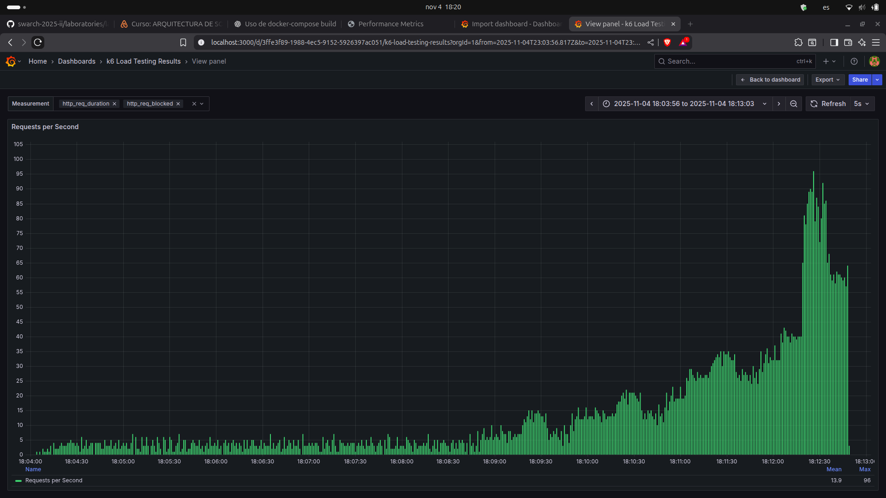
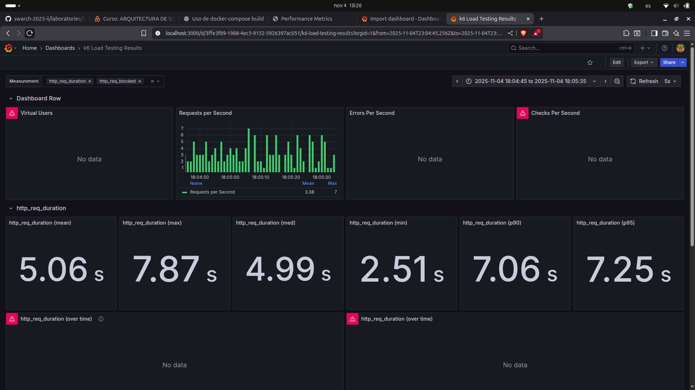

# Resultados de Pruebas Laboratorio 6

### Prueba 1 
14:43:40 - 14:52:25
	Objetivo: http_req_duration (med) = 5 segundos
	De 14:45:30 a 14:46:00 la mediana es de 5 segundos, luego de 14:46:00 incrementa la mediana por encima de 5 segundos 
	En este intervalo de tiempo la media de RpS es de 6.22 y el máximo es de 13 RpS.

	- Trhoughput para este escenario: 780 Requests por minuto
	
### Prueba 2 
17:28:46 - 17:37:31
	Objetivo: http_req_duration (med) = 5 segundos
	De 17:29:50 a 17:30:30 la mediana es de casi 5 segundos,luego de 17:30:30 incrementa la mediana por encima de 5 segundos 
	En este intervalo de tiempo la media de RpS es de 4.40 y el máximo es de 8 RpS.
	- Trhoughput para este escenario: 480 Requests por minuto
	
### Prueba 3 
18:04:04 - 18:12:50
	Objetivo: http_req_duration (med) = 5 segundos
	De 18:04:45 a 18:05:35 la mediana es de casi 5 segundos,luego de 18:05:35 incrementa la mediana por encima de 5 segundos 
	En este intervalo de tiempo la media de RpS es de 3.47 y el máximo es de 7 RpS.
	
	- Trhoughput para este escenario: 420 Requests por minuto
	
