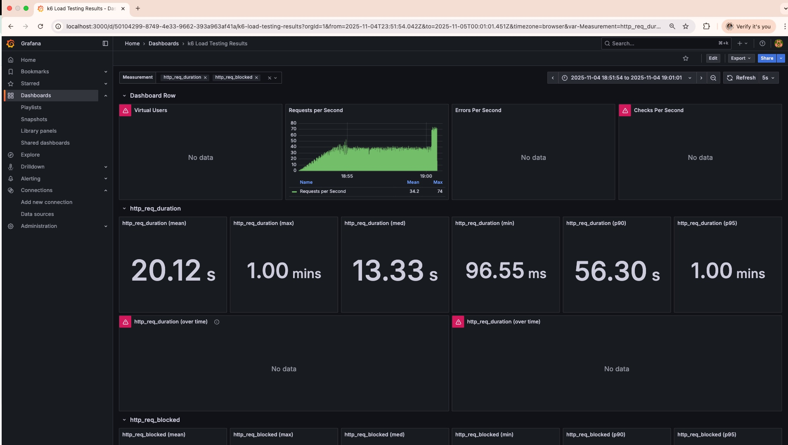
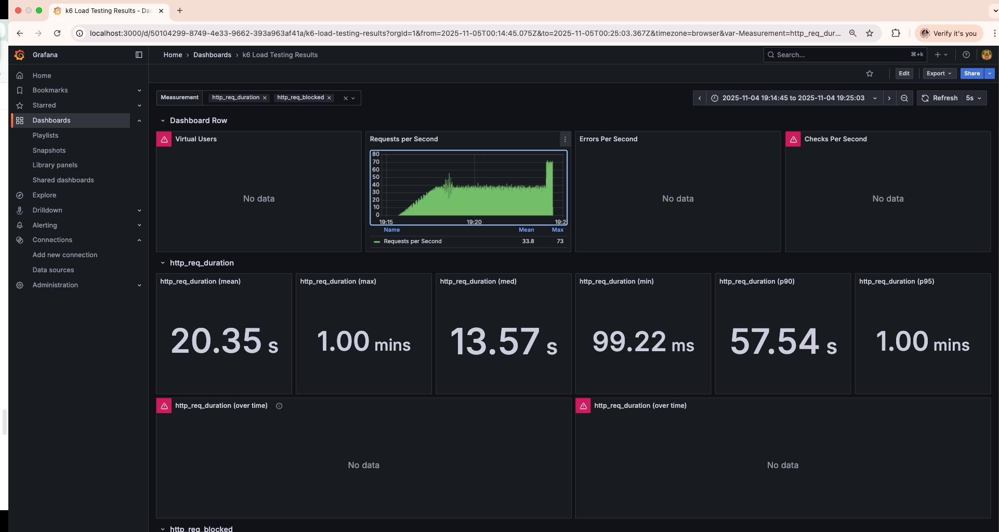
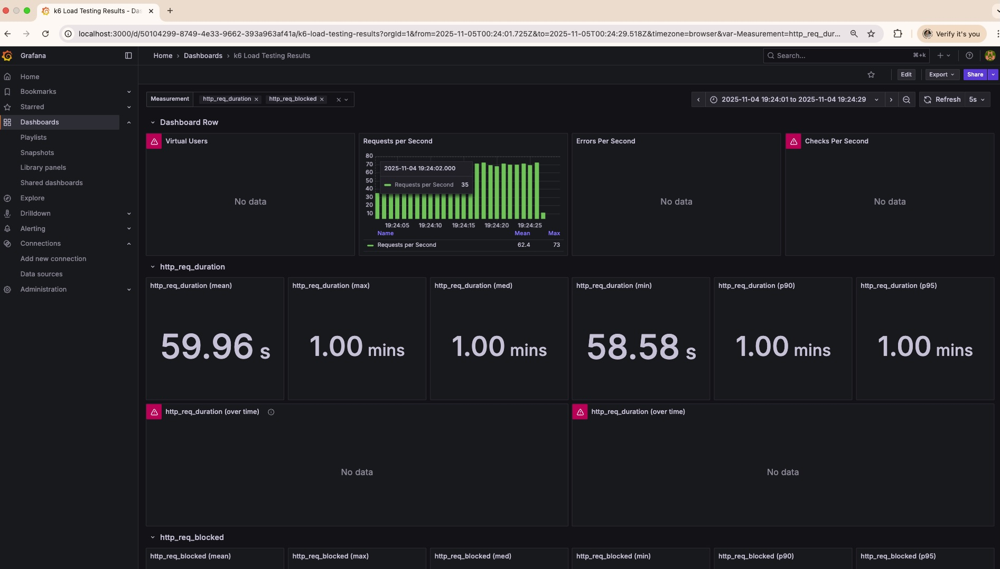
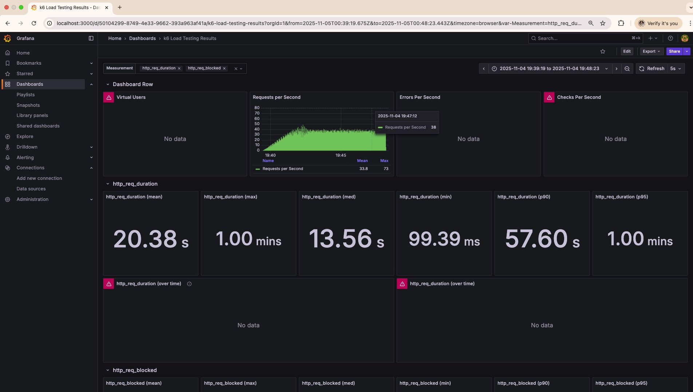
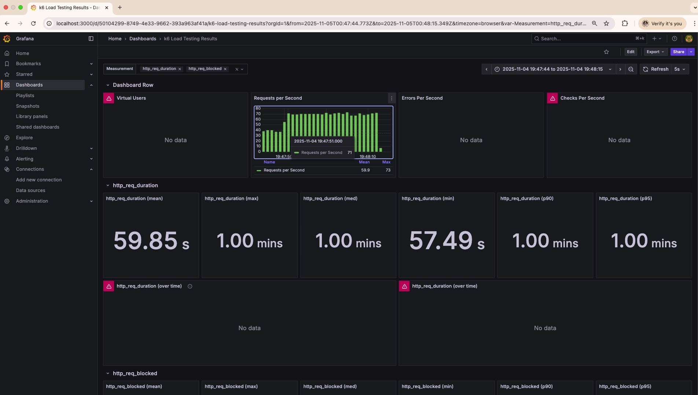

# Laboratorio 6 – Arquitectura de Software (Pruebas de Performance)

Lizeth Mariana García Duarte – lgarciadu@unal.edu.co

---

##  Ejecución de pruebas de performance

Se corrieron 3 pruebas distintas, con un lapso de 15 minutos entre pruebas. 

#### Prueba 1 (test1)

| Métrica | Valor |
|---------|-------|
| **Duración total** | 502.29 segundos (~8.4 minutos) |
| **Total de requests** | 17,966 |
| **Throughput** | 35.77 req/s |
| **ARPS** | 35.77 req/s |
| **Transacciones por minuto** | 2,146.08 |
| **Tiempo de respuesta promedio** | 20.12 segundos |
| **P95** | 60.00 segundos |
| **P99** | 60.00 segundos |
| **Tiempo mínimo** | 0.097 segundos |
| **Tiempo máximo** | 60.01 segundos |
| **Tasa de error** | 8.4% |

Durante el test, el sistema comenzó manejando un throughput bajo (20–30 requests por segundo) y fue aumentando progresivamente su carga hasta alcanzar entre 65 y 65 RPS (requests per second).

Justo antes de alcanzar el máximo throughput (alrededor de 60–65 RPS), la gráfica comienza a aplanarse. Este es el punto de rodilla: el momento donde el sistema deja de escalar linealmente y empieza a mostrar señales de saturación. 

#### Prueba 2 (test2)

| Métrica | Valor |
|---------|-------|
| **Duración total** | 436.32 segundos (~7.3 minutos) |
| **Total de requests** | 17,788 |
| **Throughput** | 40.77 req/s |
| **ARPS** | 40.77 req/s |
| **Transacciones por minuto** | 2,446.08 |
| **Tiempo de respuesta promedio** | 20.35 segundos |
| **P95** | 60.00 segundos |
| **P99** | 60.00 segundos |
| **Tiempo mínimo** | 0.099 segundos |
| **Tiempo máximo** | 60.00 segundos |
| **Tasa de error** | 8.85% |

En esta prueba, el throughput crece de forma estable hasta alrededor de 40–45 req/s y continúa mejorando hasta llegar a ~60–65 req/s, momento en que la curva comienza a aplanarse.
Desde ese punto, las peticiones adicionales no aumentan el throughput y provocan una degradación fuerte en los tiempos de respuesta.
Por lo tanto, el punto de rodilla de esta prueba se ubica alrededor de los 60 RPS, exactamente antes de que la latencia promedio supere los 20 s y los percentiles lleguen al límite de 60 s.

#### Prueba 3 (test3)

| Métrica | Valor |
|---------|-------|
| **Duración total** | 471.8 segundos (~7.9 minutos) |
| **Total de requests** | 17,762 |
| **Throughput** | 37.65 req/s |
| **ARPS** | 37.65 req/s |
| **Transacciones por minuto** | 2,258.83 |
| **Tiempo de respuesta promedio** | 20.38 segundos |
| **P95** | 60.00 segundos |
| **P99** | 60.00 segundos |
| **Tiempo mínimo** | 0.099 segundos |
| **Tiempo máximo** | 60.00 segundos |
| **Tasa de error** | 8.97% |

En esta prueba, el throughput crece de manera estable hasta aproximadamente los 35–40 req/s.
A partir de los 60 req/s, la curva comienza a aplanarse y el tiempo de respuesta promedio supera los 20 segundos, lo que indica que el sistema empieza a entrar en saturación.

El sistema bajo prueba presenta un punto de rodilla estable alrededor de los 60–65 requests por segundo, lo que define su capacidad máxima.
Hasta ese punto, el servicio mantiene una buena relación entre carga y rendimiento, pero más allá, el tiempo de respuesta crece de forma exponencial y se incrementa la tasa de error. El comportamiento se mantiene similar en las tres ejecuciones.