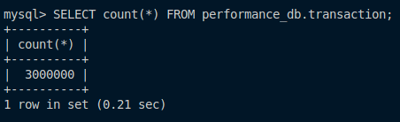
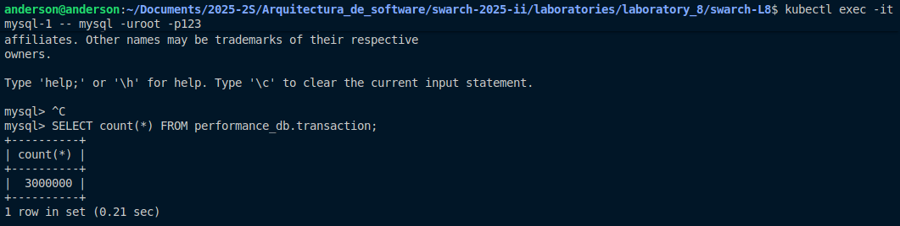

# Laboratorio 8 - Reliability

## Presentado por:
Anderson David Morales Chila (amoralesch@unal.edu.co)

## Imágenes de las bases de datos

### mysql-0

    

### mysql-1

    

### mysql-2

    

