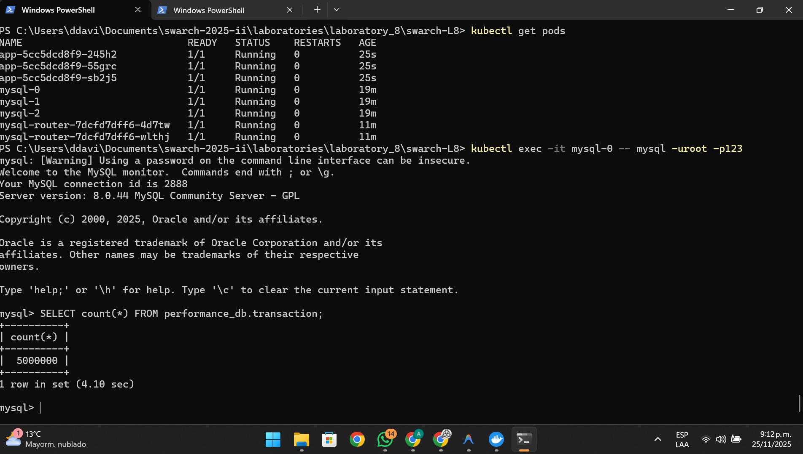
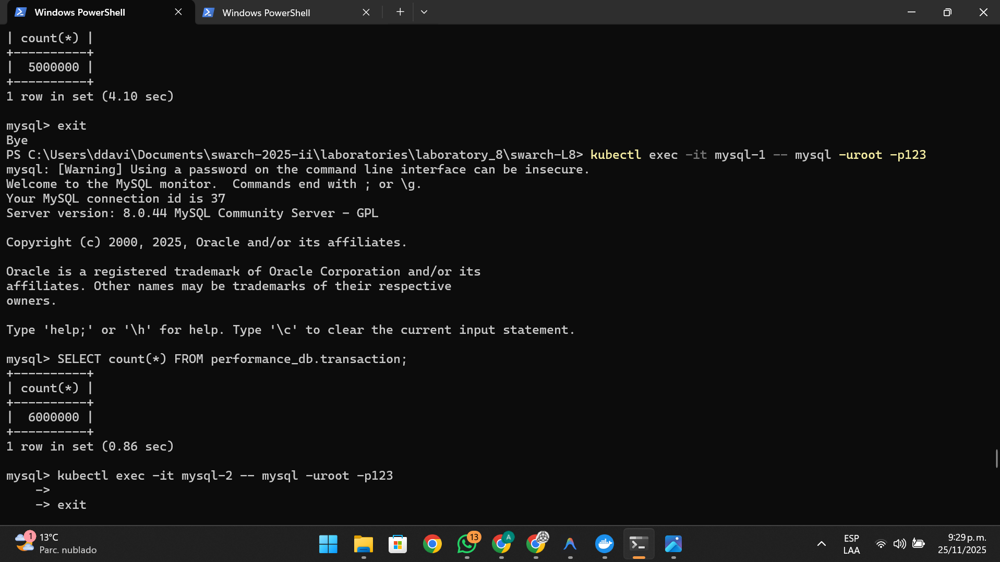
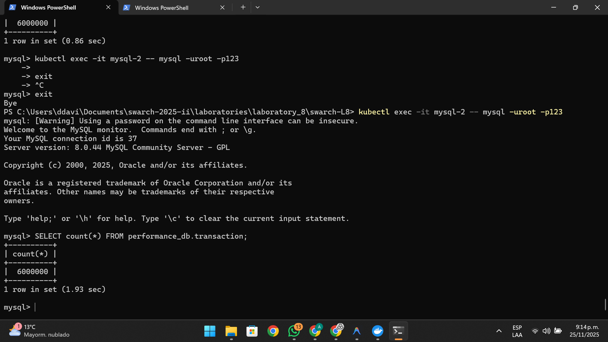
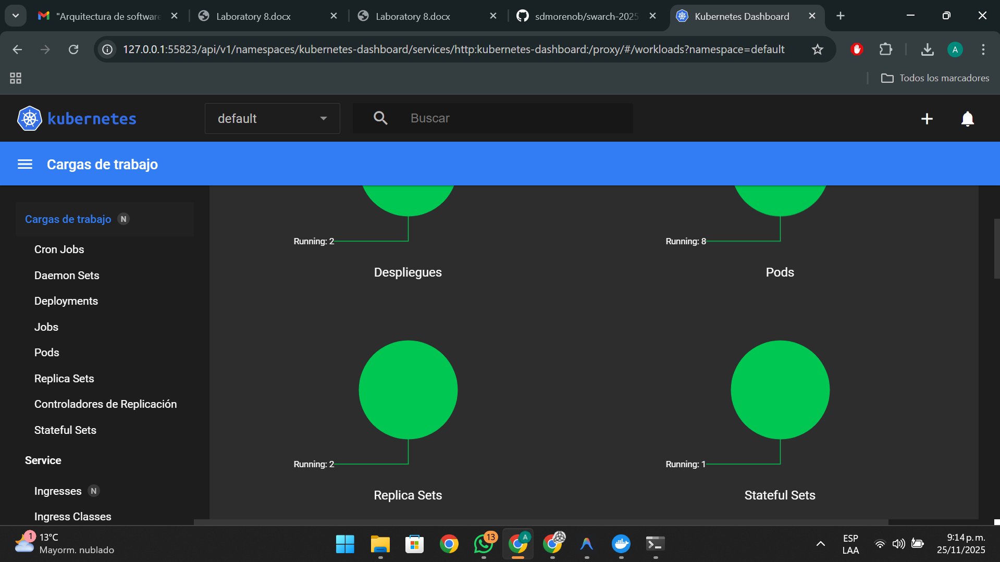

# Laboratorio 8: Reliability - MySQL Group Replication

**Estudiante:** Andres David Caro Mora
**Usuario UNAL:** ancarom@unal.edu.co
**Fecha:** 25 de Noviembre de 2025

---

### 1. Evidencia de Replicación

A continuación se presenta la consulta realizada al clúster de base de datos, confirmando la inserción y replicación de las transacciones generadas por la aplicación.

---

---

---

---

### 2. Descripción del proceso

Se desplegó exitosamente:
- Un clúster de **MySQL** con 3 nodos usando Group Replication.
- Un **MySQL Router** para gestionar las conexiones.
- Una aplicación en **Python** que insertó la carga de datos.

La consulta `SELECT count(*) ...` valida que los datos fueron escritos y son accesibles desde el clúster.
