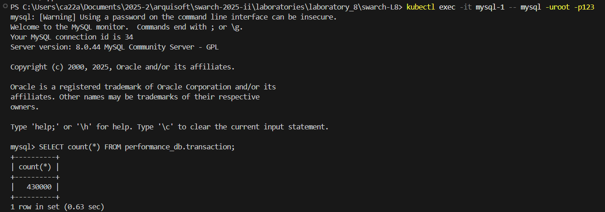
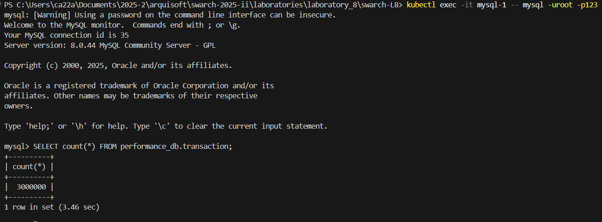
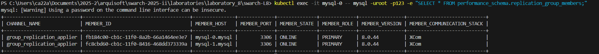

# Entrega laboratorio #8 - Cristhian Alejandro Alarcón Florido @calarconf
## Solo pude hacer dos replicas por los limitados recursos de mi computador
# Mysql-0
### Consiguió 3'000.000 de transacciones

# Mysql-1
### Inicio con 430000 transacciones

### Termino igualando las 3'000.000 de transacciones de Mysql-0 

# Tabla de Replicas
