# Project: Prototype 1 - Simple Architectural Structure
# MusicShare - Red Social Musical
## Equipo
- **Team name**: Los SilkSongs
- **Full name and team members**
  - Julian David Rodriguez Fernandez
  - Julián Andrés Vargas Gutiérrez
  - Gabriel Felipe Fonseca Guerrero
  - Gabriel Felipe González Bohórquez
  - Andrés Felipe Perdomo Uruburu
  - Andrés Felipe Poveda Bellón

## Sofware System
 - **Name:** MusicShare
 - **Logo**


 
 - **Description**
**MusicShare** es una red social de música desarrollada con una **arquitectura distribuida de microservicios**, que integra presentación web en **React/TypeScript**, servicios de negocio independientes y bases de datos híbridas (**PostgreSQL y MongoDB**). El sistema permite a los usuarios compartir y descubrir música mientras garantiza **escalabilidad horizontal**, **baja latencia en streaming y alta disponibilidad**. La comunicación entre componentes se gestiona mediante **REST, gRPC y WebSockets**, bajo un esquema seguro con **OAuth2/JWT y TLS 1.2+**. Todo el software se despliega en entornos contenedorizados con Docker/Kubernetes, con monitoreo centralizado, pruebas automatizadas y cumplimiento de estándares de usabilidad, accesibilidad (WCAG 2.1 AA) y protección de datos (GDPR/legislación colombiana).
# MusicShare - Red Social Musical
## Functional Requirements
### RF01 - Gestión de Usuarios
- El sistema debe permitir el registro de usuarios con email/username y contraseña
- El sistema debe permitir el login y logout de usuarios
- El sistema debe permitir crear y editar perfiles básicos (foto, nombre)
### RF02 - Subida y Gestión de Música
- El sistema debe permitir subir archivos de audio (MP3, WAV) al cloud storage
- El sistema debe permitir agregar metadatos básicos a las pistas (título, artista, género)
- El sistema debe permitir reproducir las pistas subidas
### RF03 - Feed Social Musical
- El sistema debe mostrar un timeline con las publicaciones musicales de usuarios seguidos
- El sistema debe permitir compartir pistas musicales como publicaciones
- El sistema debe mostrar información básica de cada publicación (usuario, fecha, título de la canción)
### RF04 - Sistema de Seguimiento
- El sistema debe permitir seguir y dejar de seguir otros usuarios
- El sistema debe mostrar la lista de seguidores y seguidos
- El sistema debe filtrar el feed basado en usuarios seguidos
### RF05 - Salas de Música Colaborativa - Para mirar para el mvp
- El sistema debe permitir crear salas de música donde un usuario actúe como "DJ"
- El sistema debe permitir que otros usuarios se conecten a las salas creadas
- El sistema debe sincronizar la reproducción para todos los participantes de la sala
- El sistema debe mostrar quién está conectado en cada sala
### RF06 - Interacciones Básicas
- El sistema debe permitir dar "like" a publicaciones musicales
- El sistema debe mostrar el contador de likes por publicación
- El sistema debe permitir comentarios básicos en las publicaciones
### RF07 - Descubrimiento Simple
- El sistema debe permitir explorar música por género básico
- El sistema debe mostrar publicaciones populares/trending
- El sistema debe permitir búsqueda simple por usuario o título de canción
## Non-Functional Requirements

MusicShare es una aplicación web que funciona como red social especializada donde los usuarios pueden compartir su música favorita, crear playlists y descubrir nueva música a través de una experiencia social interactiva.
### RNF-5.1: Diseño Responsivo
Requisito: La interfaz de usuario web debe ser completamente responsiva y funcional en los principales tamaños de pantalla: móviles (320px-767px), tabletas (768px-1023px) y escritorio (1024px+).
Métrica de Aceptación: Pruebas en emuladores de dispositivos y dispositivos físicos confirman que no hay elementos rotos o inutilizables en las resoluciones clave.
### RNF-5.2: Accesibilidad Web
Requisito: La aplicación debe cumplir con el nivel AA de las Pautas de Accesibilidad para el Contenido Web (WCAG 2.1).
Métrica de Aceptación: La aplicación pasa las validaciones de herramientas automatizadas de accesibilidad (ej. Lighthouse, Axe) y supera una revisión manual de criterios clave (contraste, navegación por teclado, texto alternativo para imágenes).
Arquitectura y Distribución
### RNF-1.1 Arquitectura Distribuida
El sistema debe seguir una arquitectura distribuida basada en microservicios, de modo que cada componente (frontend, servicios de negocio y bases de datos) pueda desplegarse y escalarse de manera independiente.
### RNF-1.2 Componentes de Presentación
En el sistema la aplicación web se desarrolla en React/TypeScript, de modo que interactúe con los servicios a través de conectores HTTP.
### RNF-1.3 Componentes de Lógica de Negocio
El sistema debe contar con un conjunto de componentes de lógica, representados por microservicios independientes (UserService, MusicService, SocialService, SearchService, NotificationService, MetadataService) encargados de las distintas funcionalidades.
### RNF-1.4 Componentes de Datos
El sistema incluye componentes de datos de distinto tipo, específicamente:
Base de datos relacional (PostgreSQL) para información estructurada de usuarios, relaciones sociales y metadatos clave.
Base de datos NoSQL (MongoDB) para almacenamiento de metadatos musicales, búsqueda y análisis flexible.
Conectividad y Protocolos
### RNF-2.1 conectores basados en HTTP:
REST para operaciones CRUD y comunicación estándar entre frontend, gateway y microservicios.
WebSocket para notificaciones en tiempo real y actualizaciones del feed.
gRCP para soportar comunicación entre microservicios internos para operaciones de alta frecuencia
### RNF-2.2 Conectividad con MongoDB
MongoDB Wire Protocol se encarga de la comunicación entre la base de datos que guarda la música y el componente que se encarga del servicio de música
## Rendimiento y Escalabilidad
### RNF-3.1 Escalabilidad Horizontal:
La plataforma debe permitir el despliegue independiente de cada microservicio para escalar de manera horizontal según la carga de usuarios, soportando picos de al menos 100 usuarios concurrentes. (toca discutir # de usuarios)
### RNF-3.2 Tiempo de Respuesta:
El tiempo promedio de respuesta de las API REST no debe superar 300 ms bajo una carga media, y 500 ms en picos de tráfico.
### RNF-3.3 Reproducción en Streaming:
La entrega de archivos de audio desde el Cloud Storage debe mantener una latencia inicial máxima de 2 s antes de iniciar la reproducción. (Desde el momento que el usuario pone play hasta que empieza a sonar no deben pasar más de 2 segundos)
Lenguajes y tecnologías
Se implementará el sistema de software en Python, Go y Java.
## Disponibilidad y Confiabilidad
### RNF-5.1: Tolerancia a Fallos
Requisito: La falla de un microservicio no crítico (ej. NotificationService) no debe afectar las funcionalidades principales del sistema, como la autenticación, la subida y la reproducción de música.
Métrica de Aceptación: Se realizan pruebas de caos (ej. deteniendo el contenedor de un servicio no crítico) y se verifica que las funciones principales siguen operativas.
### RNF-5.2 Modularidad e independencia:
La arquitectura de microservicios debe aislar fallos de un servicio sin afectar el funcionamiento global.
## Seguridad
### RNF-6.1 Autenticación y Autorización:
Todos los endpoints deben requerir autenticación mediante OAuth2, donde un servidor de autorización emite tokens de acceso en formato JWT. Dichos tokens deben incluir claims de roles y privilegios de usuario, que serán validados en el gateway y en los microservicios para aplicar autorización basada en roles.
### RNF-6.2 Protección de Datos:
Todo el tráfico entre cliente, gateway y microservicios debe viajar sobre HTTPS/TLS 1.2+.
### RNF-6.3 Almacenamiento Seguro:
Las contraseñas en PostgreSQL deben almacenarse con bcrypt o algoritmo equivalente.
### RNF-6.4 Cumplimiento Legal:
El sistema debe cumplir con GDPR/LPD colombiana para la protección de datos personales.
Mantenibilidad y Evolución
### RNF-7.1 Despliegue Contenerizado:
Toda la infraestructura debe empaquetarse con Docker y ser orquestable mediante Docker Compose/Kubernetes, permitiendo CI/CD.
### RNF-7.2 Documentación:
Cada servicio debe proveer documentación de su API usando OpenAPI/Swagger actualizada.
### RNF-7.3 Pruebas Automatizadas:
Cobertura mínima de 80 % en pruebas unitarias e integración para cada microservicio.
## Compatibilidad e Interoperabilidad
### RNF-8.1 Navegadores Soportados:
El frontend debe funcionar en las últimas dos versiones estables de Chrome.
### RNF-8.1: Diseño Responsivo
Requisito: La interfaz de usuario web debe ser completamente responsiva y funcional en los principales tamaños de pantalla: móviles (320px-767px), tabletas (768px-1023px) y escritorio (1024px+).
Métrica de Aceptación: Pruebas en emuladores de dispositivos y dispositivos físicos confirman que no hay elementos rotos o inutilizables en las resoluciones clave.
### RNF-8.2: Accesibilidad Web
Requisito: La aplicación debe cumplir con el nivel AA de las Pautas de Accesibilidad para el Contenido Web (WCAG 2.1).
Métrica de Aceptación: La aplicación pasa las validaciones de herramientas automatizadas de accesibilidad (ej. Lighthouse, Axe) y supera una revisión manual de criterios clave (contraste, navegación por teclado, texto alternativo para imágenes).
## Usabilidad y Experiencia de Usuario
### RNF-9.1 Accesibilidad:
Cumplir con el nivel AA de WCAG 2.1, garantizando que personas con discapacidades visuales o motoras puedan usar el sistema.
### RNF-9.2 Responsividad:
La interfaz debe adaptarse a pantallas móviles, tabletas y escritorios.
## Observabilidad y Monitoreo
### RNF-10.1 Logging Centralizado:
Todos los microservicios deben emitir logs en formato estructurado (JSON) y enviarlos a una plataforma central (ej. ELK/Prometheus + Grafana).
### RNF-10.2 Métricas de Salud:
Cada servicio expondrá un endpoint /health para chequeos automáticos por parte del orquestador y el API Gateway.

# Architectural Structures
## Components and Connectors (C&C) Structure
C&C View:
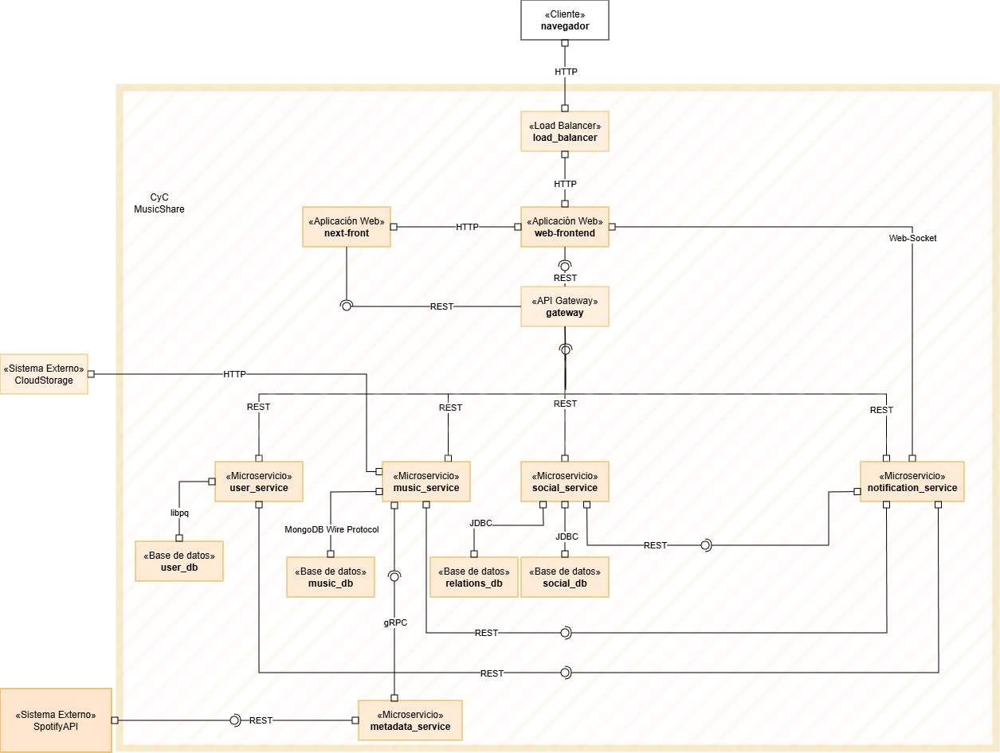

## Description of architectural styles used.

- Microservicios: Servicios independientes con responsabilidades específicas
- MicroFrontends: Frontends independientes
- Layered Architecture: Separación clara entre presentación, lógica y datos
- Event-Driven: Para notificaciones y actualizaciones en tiempo real
- API Gateway Pattern: Para enrutar requests y manejar autenticación

## Description of architectural elements and relations 
## Componentes:
### Presentación:
- Web Frontend (React/TypeScript): Interfaz de usuario principal
- Posts Frontend (JavaScript): Interfaz para la creacion de posts
### Lógica de Negocio:
- User Service (Python/FastAPI): Gestión de usuarios, autenticación, perfiles
- Music Service (Go): Manejo de archivos musicales, metadata, cloud storage
- Social Service (Java/Spring Boot): Feed, seguimientos, interacciones sociales
- Notification Service (Python): Sistema de notificaciones en tiempo real
- Search Service (Go): Búsquedas y recomendaciones
- Metadata Service (Python/FastAPI): Obtención de metadatos para las canciones subidas por medio de Music Service
### Datos:
- User Database (PostgreSQL): Datos de usuarios, perfiles, relaciones
- Music Metadata Database (MongoDB): Metadatos de canciones, playlists, tags
- Cloud Storage (AWS S3/Google Cloud): Archivos de audio
- Cache Layer (Redis): Cache para búsquedas y feed
## Conectores HTTP:
### REST API Connector:
  - Comunicación entre Frontend y servicios
  - Operaciones CRUD estándar
  - Autenticación via JWT
### WebSocket Connector:
  - Notificaciones en tiempo real
  - Chat en vivo durante reproducciones
  - Updates del feed en tiempo real
### gRPC:
  - Conexión MusicService con MetadataService

## Layered Structure
##### Layered View:
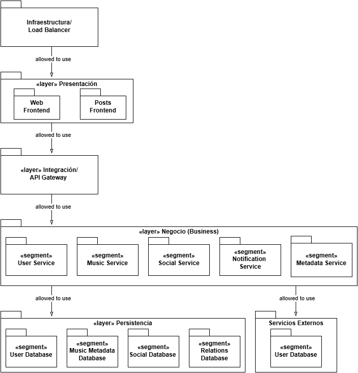

##### Diagrama de capas de la capa de negocios:

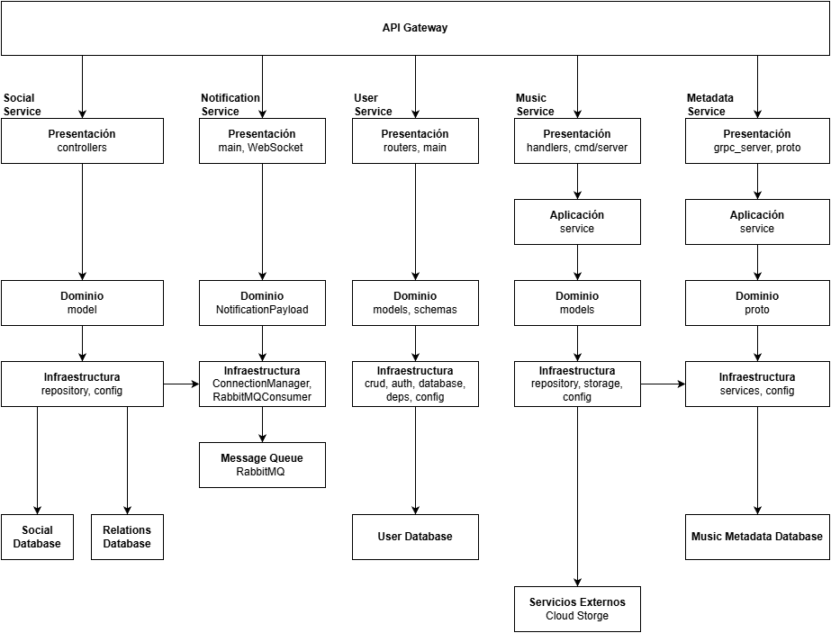

## Descripción de los Patrones Arquitectónicos Utilizados

La arquitectura del sistema sigue el Patrón Arquitectónico en Capas (Layered Architectural Pattern), el cual organiza el software en niveles jerárquicos con responsabilidades bien definidas y relaciones unidireccionales tipo “allowed-to-use”. Cada capa superior depende únicamente de los servicios ofrecidos por la capa inmediatamente inferior, promoviendo así la modificabilidad, la escalabilidad y la separación de responsabilidades.

Asimismo, se aplica el Patrón de Microservicios dentro de la Capa de Negocio, donde cada servicio (User, Music, Social, Notification y Metadata) encapsula un dominio funcional específico y se comunica mediante APIs REST o protocolos asíncronos. Este enfoque permite el despliegue independiente, el aislamiento de fallos y una alta mantenibilidad.

Además, en la capa de presentación se aplica el Patrón de Micro Frontends, dividiendo la interfaz de usuario en dos aplicaciones independientes (Web Frontend y Posts Frontend). Cada una se despliega de manera autónoma y consume los servicios del API Gateway. Este enfoque facilita la escalabilidad del frontend, el desarrollo paralelo por equipos distintos y la actualización independiente de módulos de interfaz sin afectar al resto del sistema.

Entre los patrones complementarios utilizados se encuentran:

Patrón API Gateway: centraliza el acceso externo, el enrutamiento y la autenticación hacia los servicios del backend.

Patrón Base de Datos por Servicio (Database per Service): cada microservicio gestiona su propia base de datos, garantizando independencia de datos.

## Descripción de los Elementos Arquitectónicos y sus Relaciones

La arquitectura está compuesta por cinco capas lógicas:

### Capa de Presentación: 

incluye los componentes orientados al usuario como Web Frontend y Posts Frontend. Estos módulos gestionan la interacción con el usuario, la visualización de datos y las peticiones al sistema. Se comunican exclusivamente con la Capa de Integración mediante HTTP/REST.

### Capa de Integración: 
implementa el API Gateway, responsable del enrutamiento, balanceo de carga, autenticación y control de tráfico. Actúa como una fachada que expone un punto de acceso unificado al frontend y delega las solicitudes hacia los microservicios correspondientes.

### Capa de Negocio (Business): 
compuesta por microservicios independientes (User Service, Music Service, Social Service, Notification Service y Metadata Service). Cada uno encapsula reglas de negocio específicas.

### Capa de Persistencia: 
agrupa los componentes de almacenamiento de datos, como User Database (PostgreSQL), Music/Metadata Database (MongoDB), Social Database (PostgreSQL) y Cloud Storage para archivos multimedia. Cada microservicio accede exclusivamente a su propia fuente de datos.

### Capa de Infraestructura: 
proporciona soporte de ejecución y despliegue mediante Docker, Kubernetes, pipelines de CI/CD, monitoreo (Prometheus/Grafana) y gestión de logs (ELK). Esta capa sustenta a todas las demás sin generar dependencias ascendentes.

Las relaciones entre capas son estrictamente descendentes (allowed-to-use), lo que asegura modularidad y evita dependencias circulares. Esta organización favorece el mantenimiento, permite reemplazar tecnologías en capas inferiores y facilita la escalabilidad independiente de los servicios.

## Deployment Structure
Deployment View:
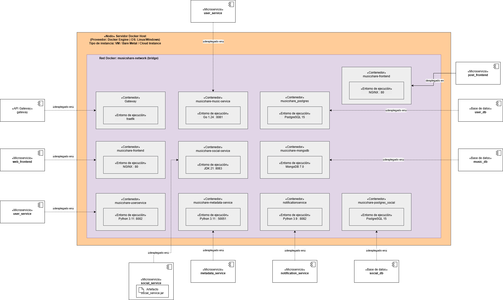


# Arquitectura de Despliegue – MusicShare

Este documento describe la arquitectura física y el despliegue del ecosistema **MusicShare** utilizando contenedores Docker organizados dentro de una red interna. Cada microservicio, base de datos y componente de infraestructura se ejecuta de forma aislada, asegurando autonomía, escalabilidad y mantenibilidad.

---

## 🏗️ 1. Nodo Principal: Servidor Docker Host

Toda la arquitectura se ejecuta sobre un **Servidor Docker Host**, que puede ser:

- Linux / Windows / macOS
- Máquina virtual (VM)
- Infraestructura bare-metal
- Instancia cloud

Este nodo ejecuta todos los contenedores del sistema.

---

## 🌐 2. Red Interna Docker

Se utiliza una red interna tipo bridge llamada:

Esta red permite:

- Comunicación entre microservicios  
- Aislamiento de tráfico  
- Control de seguridad interno  

Todos los contenedores del ecosistema están dentro de esta red.

---

## 🚪 3. API Gateway (Traefik)

**Contenedor:** `gateway`  
**Tecnología:** Traefik  

**Responsabilidades:**

- Punto único de entrada al sistema  
- Enrutamiento dinámico hacia microservicios  
- Manejo de certificados  
- Balanceo básico de carga  
- Seguridad, CORS, logging  

---

## 🎨 4. Frontend Web

**Contenedor:** `musicshare-frontend`  
**Tecnología:** NGINX  
**Puerto:** 80  

Sirve la interfaz visual de MusicShare y se expone a través del Gateway.

---

## ⚙️ 5. Microservicios Backend

Cada microservicio se despliega en contenedores independientes, con sus propias tecnologías y puertos.

### **User Service**
- **Contenedor:** `musicshare-userservice`
- **Tecnología:** Python 3.11
- **Puerto:** 8002

### **Music Service**
- **Contenedor:** `musicshare-music-service`
- **Tecnología:** Go 1.24
- **Puerto:** 8081

### **Social Service**
- **Contenedor:** `musicshare-social-service`
- **Tecnología:** Java JDK 21
- **Puerto:** 8083

### **Metadata Service**
- **Contenedor:** `musicshare-metadata-service`
- **Tecnología:** Python 3.11
- **Puerto:** 50051

### **Notification Service**
- **Contenedor:** `notificationservice`
- **Tecnología:** Python 3.9
- **Puerto:** 8082

---

## 🗄️ 6. Bases de Datos

Cada microservicio cuenta con su propia base de datos, garantizando **independencia y bajo acoplamiento**.

### PostgreSQL
- **Contenedor:** `musicshare-postgres`
  - Base de datos: `user_db`
- **Contenedor:** `musicshare-postgres_social`
  - Base de datos: `social_db`

### MongoDB
- **Contenedor:** `musicshare-mongodb`
  - Base de datos: `music_db`

---

## 🔗 7. Conexiones y Relaciones

- El **API Gateway** enruta peticiones hacia:
  - Frontend  
  - User Service  
  - Music Service  
  - Social Service  
  - Metadata Service  
  - Notification Service  

- Cada microservicio se comunica directamente con su base de datos.
- La red interna `musicshare-network` permite comunicación entre contenedores sin exponer puertos innecesarios al exterior.

---

## 📦 8. Artefactos Externos

En la arquitectura se muestran los artefactos que generan cada microservicio:

- `social_service.jar` (Java)
- `metadata_service` (Python)
- `notification_service` (Python)

Estos artefactos son empaquetados previamente y utilizados para construir los contenedores.

---

## 🧩 Resumen General

La arquitectura MusicShare está basada en microservicios altamente desacoplados, desplegados sobre Docker y organizados en una red interna. Sus características:

- Gateway centralizado (Traefik)
- Microservicios independientes
- Bases de datos aisladas por servicio
- Red Docker interna segura
- Alta modularidad
- Preparada para escalar o migrar a Kubernetes

---


## Decomposition Structure
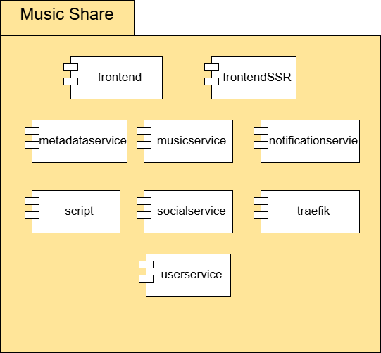

## Description 
🎵 Estructura de Descomposición de Dominio — MusicShare
Dominio Raíz: MusicShare

Descripción general:
MusicShare es una plataforma colaborativa para compartir, reproducir y descubrir música. El sistema está diseñado bajo una arquitectura basada en microservicios, donde cada dominio encapsula una funcionalidad específica, comunicándose entre sí mediante un API Gateway.
Su estructura promueve la escalabilidad, la independencia de desarrollo y el despliegue modular de componentes.
Cliente para funcionalidades principales


### 1. frontend

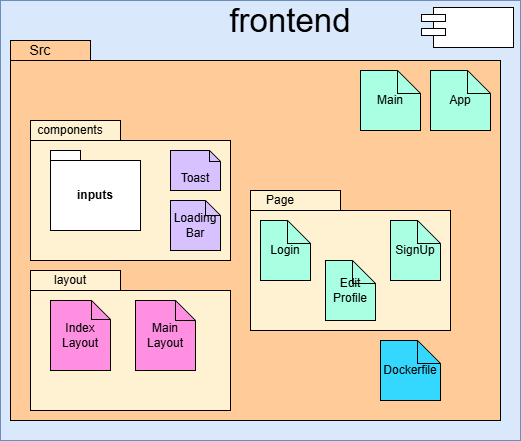


- **Responsabilidad principal**:
  - Proporcionar la interfaz gráfica principal para los usuarios finales.
  - Es la capa de presentación encargada de gestionar la interacción del usuario con las funcionalidades de la plataforma.

- **Funciones clave:**
  - Registro e inicio de sesión de usuarios.
  - Exploración de canciones, playlists y perfiles.
  - Comunicación directa con el API Gateway para consumir servicios REST.
  - Implementación adaptable para navegadores web.

### 2. frontendSSR

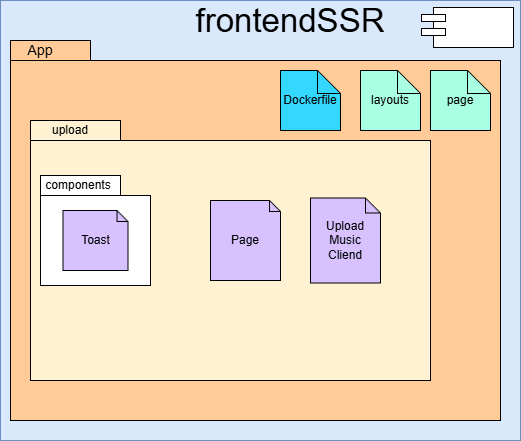


- **Responsabilidad principal**:
  - Cliente con Server-Side Rendering que carga el formulario para enviar al cliente para crear los POST
- **Funciones clave:**
  - Permite arrastar canciones
  - Insersión de Tags, 
  - Definir si es de tipo de publica, agrega descripción y hashtags

### 3. SocialService

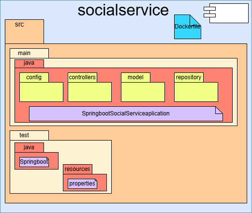

- **Responsabilidad principal:**
  - Encargado del componente social de la plataforma. Administra las interacciones, conexiones y actividades entre los usuarios.

- **Funciones clave:**
  - Manejo de publicaciones, comentarios y likes.
  - Seguimiento de usuarios (“followers/following”).
  - Integración con el NotificationService para alertas sociales.
  - Conexión con UserService para obtener perfiles.

### 4. MusicService

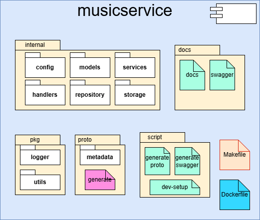

- **Responsabilidad principal:**
  - Administrar los recursos musicales y su ciclo de vida dentro del sistema.

- **Funciones clave:**
  - Almacenamiento y gestión de canciones y álbumes.
  - Control de derechos, autoría y acceso.
  - Integración con el MetadataService para obtener información descriptiva.
  - Exposición de endpoints para streaming o descarga.

### 5. Traekik

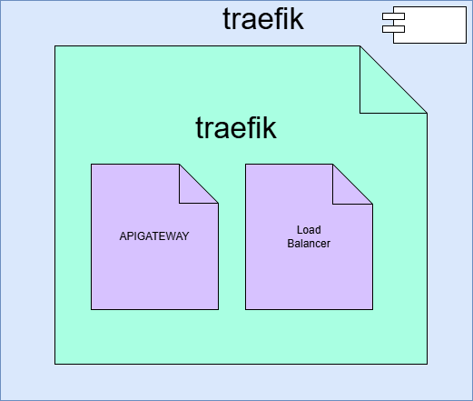


## Apigateway
- **Responsabilidad principal:**
  - Centralizar y gestionar todas las solicitudes externas hacia los microservicios.
  - Actúa como punto único de entrada al ecosistema MusicShare.

-**Funciones clave**:
  - Seguridad, autenticación y autorización.
  - Control de tráfico, logging y CORS.
  - Comunicación entre frontends y los servicios internos.

## Load Balancer
- **Responsabilidad principal:**
  - Distribuir equitativamente las solicitudes entrantes entre múltiples instancias de un servicio.

-**Funciones clave**:
  - Garantizar alta disponibilidad del ecosistema MusicShare.
  - Garantizar escalabilidad del ecosistema MusicShare.

### 6. MetadataService

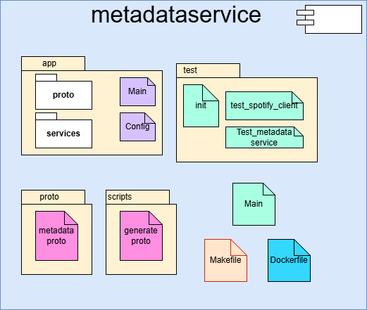

- **Responsabilidad principal:**
  - Gestionar y proveer información descriptiva asociada al contenido musical.

- **Funciones clave:**
  - Procesamiento y almacenamiento de metadatos de audio (artista, álbum, duración, género, etc.).
  - Indexación de canciones para búsqueda y filtrado.
  - Soporte a MusicService y RecommendationService (si existiera).
  - Posible integración con APIs externas para completar metadatos.

### 7. UserService

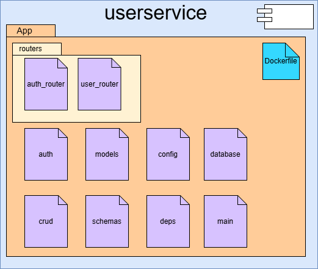

- **Responsabilidad principal:**
  - Gestionar la información y autenticación de los usuarios del sistema.

- **Funciones clave:**
  - Registro, login y recuperación de contraseñas.
  - Administración de roles y permisos.
  - Exposición de información de perfil para otros servicios (SocialService, NotificationService).
  - Almacenamiento seguro de credenciales (posiblemente con JWT o OAuth2).

### 8. NotificationService

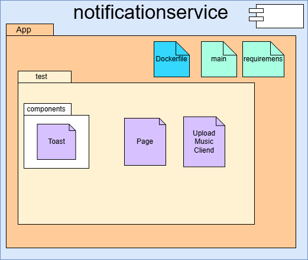

- **Responsabilidad principal:**
  - Coordinar y enviar notificaciones a los usuarios según eventos del sistema.

- **Funciones clave:**
  - Notificaciones por nuevas publicaciones, seguidores o reacciones.
  - Integración con SocialService y UserService.
  - Envío de notificaciones por correo, push o en la aplicación.

Registro de eventos relevantes para los usuarios.

---

## Correciones entrga anterior y cumplimiento de requisitos actuales

### Correciones hechas:
- Ya se agregó el cuarto componente de la capa de base de datos.
- Se implementó un componente SSR. Este componente corresponde al formulario para hacer un post de una canción.
- Se corrigió la documentación inconsistente.
- Cada vista ya tiene su propósito principal. Se revisó y corrigió la descripción de los elementos, relaciones y propiedades de cada vista.

### Cumplimientos del prototipo 3:
- Escenarios de seguridad:
  - Escenario 1: Se implementó el patrón de [Secure Channel Pattern](#-secure-channel-pattern-tlshttps-con-traefik) para proteger la comunicación entre el cliente y los servicios.  
  - Escenario 2: Se implementó el patrón de [Reverse Proxy Pattern](#-reverse-proxy-pattern) para centralizar todo el tráfico de red en un único punto de entrada.  
  - Escenario 3: Se implementó el patrón de [Network Segmentation Pattern](#-network-segmentation-pattern) para aislar las capas de la aplicación.  
  - Escenario 4: Se implementó el patrón de [Access Token Pattern](#-access-token-pattern) para manejar sesiones y autenticación en los microservicios.
- Escenarios de seguridad:
    - Escenario 1: Se implementó el patrón de [Load Balancer](#balanceo-de-carga-y-escalado) y se realizaron pruebas de estrés a tres servicios.
    - Escenario 2: Se implementó el patrón de [Auto Scaling](#balanceo-de-carga-y-escalado) ajusta el número de recursos computacionales.

---

## ⚙️ Despliegue

### Requisitos
- [Docker](https://docs.docker.com/get-docker/)
- [Docker Compose](https://docs.docker.com/compose/)

### Pasos
```bash
# Clonar repositorio
git clone <repository-url>
cd MusicShare
```

> ⚠️ **IMPORTANTE:**  
> Si se despliega en un sistema **Linux**, es necesario otorgar permisos de escritura a la carpeta  
> `uploads/audio/` para que el sistema pueda guardar las canciones correctamente.  
>  
> Ejecuta el siguiente comando **dentro de la carpeta correspondiente**:
> ```bash
> chmod 777 .
> ```

```bash
# 📄 Crear el archivo .env en la raíz del proyecto
touch .env

# 📋 Copiar el contenido del archivo de ejemplo (.env.example) al nuevo archivo
cp .env.example .env
```

##### ✏️ Agregar las credenciales del API de Spotify dentro del archivo .env
Reemplaza las siguientes líneas
SPOTIFY_CLIENT_ID=ac2b79b47a0643bd824d4fece4d8d110
SPOTIFY_CLIENT_SECRET=3a61c9187a674bf9a505e9a810700e6d

```bash
# Generar certificados locales con el comando:
docker run --rm -it \
  -v ./traefik/certs:/certs \
  alpine/openssl req -x509 -nodes -days 365 -newkey rsa:2048 \
  -keyout /certs/musicshare.key \
  -out /certs/musicshare.crt \
  -subj "/C=CO/ST=Bogota/L=Bogota/O=Universidad Nacional de Colombia/CN=localhost"
```

```bash
# Levantar servicios
docker compose build
docker compose up -d

# Si tiene la versión anterior es recomendable construir sin caché para evitar conflictos
docker-compose build --no-cache

# Verificar estado
docker compose ps
```

## 🚀 Servicios levantados

- **Web Frontend** → [https://localhost](http://localhost)
- **User Service** → [https://localhost/api/users/docs](http://localhost/api/users)
- **Music Service** → [https://localhost/api/music/swagger/index.html](http://localhost/api/music)
- **Social Service** → [https://localhost/api/social/swagger-ui/index.html](http://localhost/api/social)
- **Postgres** → puerto `5432`
- **MongoDB** → puerto `27017`

---

## ¿Cómo usar la aplicación?
Dirijase al enlace del Web Frontend, esta es la dirección inicial por defecto de la aplicación, cree su usuario si no lo tiene y luego inicie sesión. Será dirijido al dashboard principal, ahí dirijase a la pestaña "Subir música". Se mostrará un formulario con el que se pueden subir posts con una canción asociada.

Primero deberá subir la canción, seleccionela o arrastrela al campo señalado, agregue tags de su preferencia y configure el tipo de visibilidad de la canción, luego haga click en el botón "Subir Canción", esto hará uso de los serevicios MusicService y MetadataService para guardar la canción en la carpeta `uploads/audio/` con sus metadatos enriquecidos. 

Una vez subida prosiga con la creación de la publicación, agregue una descripción y los hashtags que quiera que estén asociados a ella.
Finalmente presione el botón de "Publicar Post" para subir el post mediante el servicio SocialService.

Para verificar que la subida de la canción y el post ha sido satisfactoria puede hacer uso de postman a los siguientes endoints:

- GET: http://localhost/api/music/api/v1/tracks (Lista de las canciones subidas)
- GET: http://localhost/api/social/api/social/posts (Lista de los posts subidos)

---

## 📖 Endpoints principales de los servicios

### UserService
**Documentacion** [https://localhost/api/users/docs](http://localhost/api/users/docs)
- **Health**: `GET /health`
- **Registro**: `POST /auth/register`
- **Login**: `POST /auth/token` (devuelve JWT)
- **Perfil**: `GET /users/me` (requiere `Authorization: Bearer <token>`)
- **Proxy playlists**: `GET /proxy/users/{id}/playlists`

### MusicService
**Documentacion** [https://localhost/api/music/swagger/index.html](http://localhost/api/music/swagger/index.html)
- `POST /api/v1/tracks/upload` - Subir audio
- `GET /api/v1/tracks` - Listar tracks
- `GET /api/v1/tracks/{id}/stream` - Stream de audio
- CRUD completo de playlists
- Healthcheck en `/health`

### SocialService
**Documentacion** [https://localhost/api/social/swagger-ui/index.html](http://localhost/api/social/swagger-ui/index.html)

#### Posts
- `POST /api/social/posts` — Crear una publicación  
- `GET /api/social/posts` — Obtener todas las publicaciones  
- `GET /api/social/posts/usuario/{userId}` — Obtener publicaciones por usuario  
- `DELETE /api/social/posts/{postId}` — Eliminar publicación  

#### Comments
- `POST /api/social/comments/post/{postId}` — Crear comentario en un post  
- `POST /api/social/comments/reply/{commentId}` — Responder a un comentario  
- `GET /api/social/comments/post/{postId}` — Listar comentarios de un post  
- `GET /api/social/comments/replies/{parentCommentId}` — Listar respuestas de un comentario  
- `DELETE /api/social/comments/{commentId}` — Eliminar comentario  

#### Likes
- `POST /api/social/likes` — Dar like a un post  
- `GET /api/social/likes/post/{postId}` — Obtener todos los likes de un post  
- `DELETE /api/social/likes/{likeId}` — Quitar un like

---

# 🧩 Network Segmentation Pattern

### 🎯 Objetivo

Implementar **segmentación de red** entre los distintos componentes de MusicShare para aislar las capas de la aplicación (presentación, negocio y datos) y limitar el alcance de la comunicación entre contenedores.

Este patrón mejora la seguridad y la mantenibilidad al aplicar el **principio de mínimo privilegio** en la red de Docker.

---

### ⚙️ Implementación

1. **Creación de redes separadas** en el archivo `docker-compose.yml`:

   ```yaml
   networks:
     frontend_net:
       driver: bridge
     backend_net:
       driver: bridge
     data_net:
       driver: bridge
   ```

2. **Asignación de redes a los servicios** según su capa:

   | Capa         | Redes          | Servicios incluidos                                                                                    |
   | ------------ | -------------- | ------------------------------------------------------------------------------------------------------ |
   | Presentación | `frontend_net` | `frontend`, `formulario-post-front`, `traefik`                                                         |
   | Negocio      | `backend_net`  | `userservice`, `music-service`, `social-service`, `metadata-service`, `notificationservice`, `traefik` |
   | Datos        | `data_net`     | `postgres`, `postgres-social`, `mongodb`, `rabbitmq`                                                   |

3. **Puentes de conexión controlados**:

   * `traefik` conecta `frontend_net` ↔ `backend_net`.
   * Cada microservicio que requiere acceso a una base de datos también pertenece a `data_net`.

   Ejemplo:

   ```yaml
   userservice:
     networks:
       - backend_net
       - data_net
   ```

4. **Aislamiento verificado**:

   * Los frontends **no tienen acceso** directo a las bases de datos ni a los microservicios.
   * Los microservicios solo pueden ver los recursos que realmente necesitan.
   * El API Gateway (`traefik`) es el **único punto de interconexión** entre capas.

---

### 🧪 Pruebas de verificación

1. **Levantar la infraestructura:**

   ```bash
   docker compose up -d
   ```

2. **Listar redes creadas:**

   ```bash
   docker network ls
   ```

   Deben aparecer:

   ```
   frontend_net
   backend_net
   data_net
   ```

3. **Ver los contenedores conectados a cada red:**

   ```bash
   docker network inspect frontend_net
   docker network inspect backend_net
   docker network inspect data_net
   ```

4. **Probar conectividad con `ping` o `curl`:**

   Instalar herramientas en el contenedor (solo para pruebas):

   ```bash
   docker exec -it musicshare-frontend sh
   apk add --no-cache iputils
   ```

   * Desde el `frontend`:

     ```bash
     ping formulario-post-front       # ✅ debería responder
     ping postgres                    # ❌ debería fallar
     ping userservice                 # ❌ debería fallar
     ```

   * Desde `userservice`:

     ```bash
     ping postgres                    # ✅ debería responder
     ping frontend                    # ❌ debería fallar
     ```

   * Desde `traefik`:

     ```bash
     ping frontend                    # ✅
     ping userservice                 # ✅
     ```

   Estos resultados confirman el **aislamiento por capas**.

---

### ✅ Resultado

La red de MusicShare queda estructurada de la siguiente forma:

```
[ Frontend, Formulario Front ]
           │
     (frontend_net)
           │
        [ Traefik ]
           │
     (backend_net)
           │
 [ User, Music, Social, Metadata, Notification Services ]
           │
     (data_net)
           │
 [ Postgres, MongoDB, RabbitMQ ]
```

Con esta segmentación:

* Los frontends no acceden directamente a los backends ni a las bases de datos.
* El gateway controla todo el flujo de red.
* Se reduce la superficie de ataque y se refuerza el aislamiento de servicios.

---

# 🌐 Reverse Proxy Pattern

### 🎯 Objetivo

El **Reverse Proxy Pattern** busca centralizar todo el tráfico de red de una aplicación distribuida en un único punto de entrada.
Este proxy inverso actúa como intermediario entre los clientes externos y los servicios internos, gestionando el enrutamiento de peticiones, el control de acceso y la seguridad.

En MusicShare, el servicio **Traefik** cumple este rol, funcionando como **reverse proxy y API Gateway** al mismo tiempo.


### ⚙️ Implementación en MusicShare

1. **Servicio Traefik**

   * El contenedor `traefik` se definió en el `docker-compose.yml` como el **único servicio que expone puertos al exterior**:

     ```yaml
     traefik:
       image: traefik:v3.0
       ports:
         - "80:80"       # tráfico HTTP público
         - "8080:8080"   # dashboard (solo desarrollo)
       volumes:
         - ./traefik/traefik.yml:/etc/traefik/traefik.yml:ro
         - /var/run/docker.sock:/var/run/docker.sock:ro
       networks:
         - frontend_net
         - backend_net
     ```

     Esto permite que Traefik escuche peticiones externas (HTTP) y se comunique con los microfrontends y microservicios internos en las redes segmentadas.

2. **Configuración base (`traefik/traefik.yml`)**

   ```yaml
   api:
     dashboard: true
     insecure: true

   entryPoints:
     web:
       address: ":80"

   providers:
     docker:
       endpoint: "unix:///var/run/docker.sock"
       exposedByDefault: false
   ```

   Con esto, Traefik:

   * Habilita un **dashboard** para monitorear los routers y servicios detectados.
   * Define el punto de entrada HTTP en el puerto `80`.
   * Obtiene dinámicamente la configuración de ruteo a partir de las etiquetas (`labels`) de Docker.

3. **Ruteo basado en etiquetas (`labels`)**
   Cada microfrontend y microservicio declara etiquetas que indican cómo deben manejarse las solicitudes.
   Por ejemplo:

   ```yaml
   userservice:
     labels:
       - "traefik.enable=true"
       - "traefik.http.routers.user.rule=PathPrefix(`/api/users`)"
       - "traefik.http.services.user.loadbalancer.server.port=8080"
   ```

   Esto le indica a Traefik que todas las solicitudes que empiecen por `/api/users` deben ser dirigidas al contenedor `userservice`.

   De igual forma:

   * `/` → `frontend`
   * `/formulario-post` → `formulario-post-front`
   * `/api/music` → `music-service`
   * `/api/social` → `social-service`
   * etc.

4. **Integración con la segmentación de red**

   * Traefik está conectado a las redes `frontend_net` y `backend_net`.
   * Los contenedores internos **no exponen puertos**; solo Traefik los conoce y los enruta internamente.
   * Esto asegura que ningún servicio sea accesible directamente desde fuera del entorno Docker.


### 🔍 Verificación

1. Levanta la aplicación:

   ```bash
   docker compose up -d
   ```
2. Abre el dashboard de Traefik:

   ```
   http://localhost:8080/dashboard/
   ```

   Aquí podrás visualizar todos los routers y middlewares activos.
3. Accede a las rutas expuestas:

   * `http://localhost/` → frontend principal
   * `http://localhost/formulario-post` → microfrontend de publicación
   * `http://localhost/api/users` → microservicio de usuarios
   * `http://localhost/api/music` → microservicio de música

Solo el contenedor `traefik` debe tener puertos publicados externamente (verificable con `docker ps`).


### ⚖️ Comparación: Traefik vs NGINX

| Característica                     | **Traefik**                                                            | **NGINX**                                                     |
| ---------------------------------- | ---------------------------------------------------------------------- | ------------------------------------------------------------- |
| **Naturaleza**                     | Proxy inverso dinámico y API Gateway moderno.                          | Servidor web y proxy inverso tradicional.                     |
| **Configuración**                  | Basada en etiquetas y detección automática de servicios Docker.        | Requiere un archivo `nginx.conf` estático con rutas manuales. |
| **Soporte nativo de contenedores** | ✅ Sí, detecta contenedores y redes Docker automáticamente.             | ⚙️ No, requiere configuración manual o scripts externos.      |
| **Balanceo de carga y middleware** | Integrados, configurables vía labels o API.                            | Requiere módulos o configuración extra.                       |
| **TLS automático (Let's Encrypt)** | ✅ Nativo.                                                              | ⚙️ Manual o con scripts externos.                             |
| **Dashboard**                      | ✅ Web GUI en `:8080` con routers, servicios y logs.                    | ❌ No tiene dashboard nativo.                                  |
| **Orientación**                    | Diseñado para entornos de microservicios, Kubernetes y Docker Compose. | Más usado para servidores web o APIs monolíticas.             |

🔹 En el laboratorio anterior, **NGINX** se configuró manualmente como reverse proxy, especificando rutas en `nginx.conf`.
🔹 En MusicShare, **Traefik** automatiza este proceso detectando servicios y aplicando reglas declarativas desde las etiquetas Docker.
Ambos cumplen el mismo patrón **Reverse Proxy**, pero Traefik está optimizado para arquitecturas distribuidas y dinámicas como la tuya.


### ✅ Resultado

Con Traefik funcionando como reverse proxy:

* Solo el contenedor `traefik` está expuesto al exterior.
* Todo el tráfico HTTP pasa primero por el proxy.
* Los microservicios internos están aislados y se comunican solo dentro de las redes segmentadas.
* El ruteo es dinámico, declarativo y fácilmente extensible.

Esto completa la implementación del **Reverse Proxy Pattern** en MusicShare, preparando el entorno para el siguiente patrón:
🔐 **Secure Channel Pattern (TLS/HTTPS)**.

---

## 🌐 API Gateway - Arquitectura y Configuración

### 📋 Descripción General

MusicShare utiliza **Traefik** como API Gateway, proporcionando un punto de entrada unificado para todos los servicios del sistema. El gateway gestiona:

- **Enrutamiento automático** basado en prefijos de ruta
- **Descubrimiento dinámico** de servicios vía Docker labels
- **Seguridad TLS/SSL** con redirección automática HTTP → HTTPS
- **Balanceo de carga** entre instancias de servicios
- **Middlewares** para transformación de rutas (strip prefix)

📖 Para documentación detallada sobre el API Gateway, consulta: **[APIGateway.md](./APIGateway.md)**

### 🗺️ Mapa de Rutas

```
https://localhost/
├── /                          → Frontend React (Puerto 80) [Prioridad 1]
├── /upload                    → Next.js SSR (Puerto 3000) [Prioridad 2]
├── /formulario-post           → Formulario Post Frontend (Puerto 80)
├── /api/users/*               → UserService (Puerto 8002)
├── /api/music/*               → MusicService (Puerto 8081)
├── /api/social/*              → SocialService (Puerto 8083)
├── /api/notifications/*       → NotificationService (Puerto 8082)
└── /ws                        → NotificationService WebSocket (Puerto 8082)
```

### ✅ Servicios Configurados

| Servicio | Ruta Externa | Puerto Interno | Strip Prefix | Estado |
|----------|--------------|----------------|--------------|--------|
| Frontend React | `/` | 80 | ❌ | ✅ Activo |
| Next.js SSR | `/upload` | 3000 | ❌ | ✅ Activo |
| Formulario Post | `/formulario-post` | 80 | ✅ | ✅ Activo |
| UserService | `/api/users` | 8002 | ✅ | ✅ Activo |
| MusicService | `/api/music` | 8081 | ✅ | ✅ Activo |
| SocialService | `/api/social` | 8083 | ✅ | ✅ Activo |
| NotificationService | `/api/notifications` | 8082 | ✅ | ✅ Activo |
| NotificationService WS | `/ws` | 8082 | ❌ | ✅ Activo |
| **MetadataService** | - | 50051 (gRPC) | - | 🔒 **Interno** |

> 💡 **Nota sobre MetadataService**: Este servicio utiliza gRPC y es consumido **únicamente por MusicService** de forma interna. Por diseño arquitectónico correcto, **no está expuesto** a través del API Gateway.

### ⚠️ Servicios Pendientes

#### SearchService ❌
- **Estado**: No implementado (carpeta vacía)
- **Ruta sugerida**: `/api/search`
- **Acción requerida**: Implementar el servicio antes de configurar en el gateway

### 🔧 Configuración del Gateway

#### Archivo `traefik/traefik.yml`
```yaml
api:
  dashboard: true
  insecure: true  # Dashboard en puerto 8080 (solo desarrollo)

entryPoints:
  web:
    address: ":80"
    http:
      redirections:
        entryPoint:
          to: websecure
          scheme: https  # Redirección HTTP → HTTPS

  websecure:
    address: ":443"  # HTTPS

providers:
  docker:
    endpoint: "unix:///var/run/docker.sock"
    exposedByDefault: false  # Requiere traefik.enable=true explícito

log:
  level: DEBUG
```

#### Puertos Expuestos
- **80**: HTTP (redirige automáticamente a HTTPS)
- **443**: HTTPS (punto de entrada principal)
- **8080**: Dashboard de Traefik (monitoreo en tiempo real)

### 📊 Dashboard de Monitoreo

Accede al dashboard de Traefik para ver:
- Routers activos y sus reglas
- Estado de servicios backend y sus réplicas
- Middlewares aplicados
- Métricas de tráfico en tiempo real
- Distribución de carga entre réplicas

```
http://localhost:8080/dashboard/
```

---

# Balanceo de Carga y Escalado

MusicShare implementa **balanceo de carga automático** con Traefik. Los servicios backend se ejecutan con **múltiples réplicas** para alta disponibilidad y mejor rendimiento.

#### Servicios Escalables

| Servicio | Réplicas Iniciales | Algoritmo | Sticky Sessions |
|----------|-------------------|-----------|-----------------|
| UserService | 2 | Round Robin | ✅ Habilitadas |
| MusicService | 2 | Round Robin | ✅ Habilitadas |
| SocialService | 2 | Round Robin | ✅ Habilitadas |
| NotificationService | 2 | Round Robin | ✅ Habilitadas |

#### Escalar Servicios Manualmente

```powershell
# Usando Docker Compose directamente
docker compose up -d --scale userservice=5 --no-recreate

# Usando el script de escalado (recomendado)
.\scripts\scale-service.ps1 -Service userservice -Replicas 5
.\scripts\scale-service.ps1 -Service all -Replicas 3
```

#### Probar el Balanceo de Carga

```powershell
# Ejecutar prueba de carga
.\scripts\load-test.ps1 -Service userservice -Requests 20 -Delay 500

# El script mostrará:
# - Estado de cada petición
# - Tiempos de respuesta
# - Distribución entre réplicas
```

#### Características del Balanceo

- ✅ **Round Robin**: Distribución equitativa de peticiones
- ✅ **Health Checks**: Verificación automática cada 10s
- ✅ **Sticky Sessions**: Mantiene sesiones de usuario consistentes
- ✅ **Failover Automático**: Si una réplica falla, el tráfico va a las sanas
- ✅ **Límites de Recursos**: CPU y RAM controlados por réplica

### 🔄 Ejemplo de Configuración de Servicio

Cuando agregas un nuevo servicio al `docker-compose.yml`, la configuración de Traefik se hace mediante labels:

```yaml
nuevo-servicio:
  build:
    context: ./nuevo-servicio
  container_name: musicshare-nuevo-servicio
  networks:
    - backend_net
  labels:
    # Habilitar en Traefik
    - "traefik.enable=true"
    
    # Regla de enrutamiento
    - "traefik.http.routers.nuevo-servicio.rule=PathPrefix(`/api/nuevo`)"
    
    # Middleware para eliminar prefijo
    - "traefik.http.middlewares.nuevo-servicio-stripprefix.stripprefix.prefixes=/api/nuevo"
    - "traefik.http.routers.nuevo-servicio.middlewares=nuevo-servicio-stripprefix"
    
    # Puerto del contenedor
    - "traefik.http.services.nuevo-servicio.loadbalancer.server.port=8000"
    
    # Punto de entrada y TLS
    - "traefik.http.routers.nuevo-servicio.entrypoints=websecure"
    - "traefik.http.routers.nuevo-servicio.tls=true"
```

### 🎯 Ventajas del API Gateway

1. **Punto único de entrada**: Simplifica la gestión de seguridad y monitoreo
2. **Desacoplamiento**: Los clientes no necesitan conocer las ubicaciones de los servicios
3. **Flexibilidad**: Cambios en servicios backend sin afectar al frontend
4. **Escalabilidad**: Permite balanceo de carga automático
5. **Seguridad**: Centraliza autenticación, rate limiting y TLS
6. **Descubrimiento dinámico**: Detecta automáticamente nuevos servicios

### 🚀 Agregar un Nuevo Servicio

1. Define el servicio en `docker-compose.yml` con las labels de Traefik
2. Levanta el servicio: `docker compose up -d nuevo-servicio`
3. Traefik detecta automáticamente y comienza a enrutar tráfico
4. Verifica en el dashboard: `http://localhost:8080`

**No es necesario reiniciar Traefik** - la configuración se actualiza dinámicamente.

---

# 🧩 Secure Channel Pattern (TLS/HTTPS con Traefik)

Para proteger la comunicación entre el cliente y los servicios, se implementó el **Secure Channel Pattern** mediante **Traefik** actuando como *terminador TLS*.
Todas las conexiones externas ahora usan HTTPS con certificados locales.

#### 🔧 Configuración principal

* **Entrypoints:**

  * `web` (puerto 80) → redirige automáticamente a `websecure`
  * `websecure` (puerto 443) → maneja el canal cifrado HTTPS
* **Certificados locales:**
  Generados con:

  ```bash
  docker run --rm -it \
    -v ./traefik/certs:/certs \
    alpine/openssl req -x509 -nodes -days 365 -newkey rsa:2048 \
    -keyout /certs/musicshare.key \
    -out /certs/musicshare.crt \
    -subj "/C=CO/ST=Bogota/L=Bogota/O=Universidad Nacional de Colombia/CN=localhost"
  ```

  > ⚠️ Los certificados se excluyen del repositorio mediante `.gitignore`.

#### 🔐 Funcionamiento

* Traefik escucha en `80` y `443`, redirigiendo automáticamente HTTP → HTTPS.
* Termina las conexiones TLS usando los certificados locales.
* El tráfico interno entre contenedores sigue siendo HTTP dentro de redes aisladas (`frontend_net`, `backend_net`, `data_net`).

#### 🌍 Resultado

* Todas las rutas públicas (`/`, `/api/users`, `/api/music`, etc.) son accesibles en **[https://localhost](https://localhost)**.
* Los intentos de conexión HTTP son redirigidos automáticamente a HTTPS.
* Se elimina el riesgo de *mixed content* y se garantiza la confidencialidad de las credenciales de usuario y datos transmitidos.

---

# 🔑 Access Token Pattern

## 🎯 Objetivo

El **Access Token Pattern** permite autenticar y autorizar solicitudes en aplicaciones distribuidas mediante el uso de **tokens firmados**, evitando el uso de sesiones tradicionales basadas en cookies o almacenamiento centralizado.

Este patrón es esencial en MusicShare para:

* Manejar **sesiones de usuario** entre microfrontends y microservicios.
* Garantizar que cada solicitud lleve información verificable sobre el usuario.
* Obtener el **ID del usuario autenticado** cuando se realizan acciones sensibles (como subir un post, crear comentarios, dar like, etc.).
* Evitar dependencias entre servicios o estado compartido en memoria.


## 🔧 ¿Cómo funciona en MusicShare?

MusicShare implementa un esquema **JWT-based Access Token**, donde el microservicio de usuarios (`userservice`) es responsable de:

1. **Verificar credenciales** cuando un usuario inicia sesión.

2. **Emitir un access token** con datos esenciales del usuario:

   * `userId`
   * `username` (si aplica)
   * fecha de expiración
   * firma criptográfica para evitar manipulación

3. Entregar el token al cliente (frontend).

4. El cliente almacena temporalmente el token (ej. `localStorage`).

5. Todas las solicitudes a microservicios incluyen el token en la cabecera HTTP:

   ```
   Authorization: Bearer <token>
   ```

6. Cada microservicio valida el token localmente sin necesidad de contactar al userservice.


## 📦 Implementación del patrón

### 1. Emisión del token (login)

Cuando el usuario inicia sesión correctamente:

```json
{
  "token": "<JWT generado>",
  "expiresIn": 3600
}
```

El frontend guarda este token y lo envía en todas las peticiones subsecuentes.


### 2. Inclusión del token en solicitudes

Ejemplo desde un frontend:

```js
fetch("https://localhost/api/social/posts", {
  method: "POST",
  headers: {
    "Authorization": `Bearer ${token}`,
    "Content-Type": "application/json"
  },
  body: JSON.stringify({ text: "Mi nueva publicación" })
});
```


### 3. Validación del token en microservicios

Cada microservicio tiene un middleware o filtro que:

1. **Extrae** el token del header.
2. **Verifica la firma** usando la clave secreta compartida.
3. **Comprueba expiración**.
4. Recupera el `userId` para vincular la acción con el usuario autenticado.

Ejemplo de extracción:

```java
String token = request.getHeader("Authorization").replace("Bearer ", "");
String userId = jwtService.getUserIdFromToken(token);
```

Esto permite, por ejemplo, crear un post asociado al usuario correcto sin que el frontend envíe manualmente el campo `userId`.


## 🔐 Beneficios del Patrón

### ✔ No requiere estado compartido entre servicios

Cada microservicio puede validar tokens por sí mismo.

### ✔ Escala de forma natural en entornos de microservicios

No requiere sesiones centralizadas ni sticky sessions.

### ✔ Reduce superficie de ataque

No se envían credenciales en cada solicitud, solo tokens firmados.

### ✔ Simplifica autorización

El backend recibe directamente el `userId` en el token sin confiar en valores proporcionados desde el cliente.

### ✔ Ideal para arquitecturas basadas en API Gateway

Traefik pasa el token sin inspección; la autenticación se maneja internamente.


## 🛡️ Pruebas de verificación

1. **Iniciar sesión** y verificar que el servidor responde con un token válido.

2. Enviar una solicitud autenticada:

   ```bash
   curl -X GET https://localhost/api/social/feed \
     -H "Authorization: Bearer <token>"
   ```

3. Enviar una solicitud **sin token** o con token inválido y verificar que retorna `401 Unauthorized`.

4. Crear un post y verificar en base de datos que:

   * el post está asociado al `userId` que viene dentro del token,
   * no depende de valores enviados desde el frontend.


## 🧩 Integración con otros patrones de MusicShare

| Patrón                              | Relación con Access Token Pattern                                                                                   |
| ----------------------------------- | ------------------------------------------------------------------------------------------------------------------- |
| **Reverse Proxy Pattern (Traefik)** | Traefik enruta las peticiones, pero **no interpreta tokens**. El token fluye transparente hacia los microservicios. |
| **Secure Channel Pattern (HTTPS)**  | Los tokens viajan cifrados, evitando robo de credenciales (MitM, sniffing).                                         |
| **Network Segmentation Pattern**    | Los tokens permiten que el API Gateway dirija tráfico sin exponer servicios ni almacenar sesiones.                  |


## ✅ Resultado

Con el **Access Token Pattern**, MusicShare garantiza:

* Autenticación y autorización seguras entre microservicios.
* Sesiones sin estado (**stateless authentication**).
* Extracción confiable del `userId` para acciones como subir posts, comentarios o likes.
* Un modelo de seguridad consistente, escalable y compatible con arquitecturas distribuidas.
