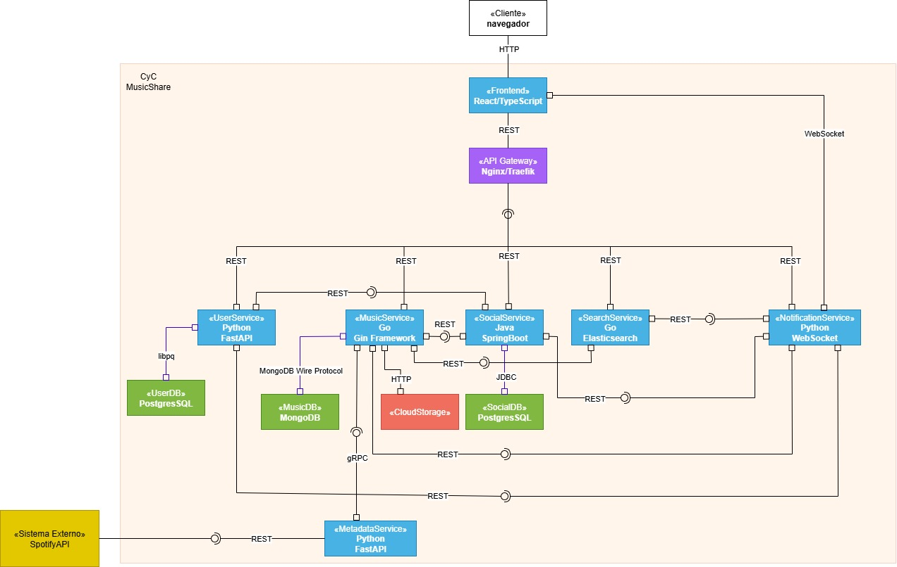

# Project: Prototype 1 - Simple Architectural Structure
# MusicShare - Red Social Musical
## Equipo
- **Team name**: Los SilkSongs
- **Full name and team members**
  - Julian David Rodriguez Fernandez
  - Julián Andrés Vargas Gutiérrez
  - Gabriel Felipe Fonseca Guerrero
  - Gabriel Felipe González Bohórquez
  - Andrés Felipe Perdomo Uruburu
  - Andrés Felipe Poveda Bellón
  - Iván David Molina Leguízamo

## Sofware System
 - **Name:** MusicShare
 - **Logo**

 - **Description**
**MusicShare** es una red social de música desarrollada con una **arquitectura distribuida de microservicios**, que integra presentación web en **React/TypeScript**, servicios de negocio independientes y bases de datos híbridas (**PostgreSQL y MongoDB/Elasticsearch**). El sistema permite a los usuarios compartir y descubrir música mientras garantiza **escalabilidad horizontal**, **baja latencia en streaming y alta disponibilidad**. La comunicación entre componentes se gestiona mediante **REST, gRPC y WebSockets**, bajo un esquema seguro con **OAuth2/JWT y TLS 1.2+**. Todo el software se despliega en entornos contenedorizados con Docker/Kubernetes, con monitoreo centralizado, pruebas automatizadas y cumplimiento de estándares de usabilidad, accesibilidad (WCAG 2.1 AA) y protección de datos (GDPR/legislación colombiana).
# MusicShare - Red Social Musical
## Functional Requirements
### RF01 - Gestión de Usuarios
- El sistema debe permitir el registro de usuarios con email/username y contraseña
- El sistema debe permitir el login y logout de usuarios
- El sistema debe permitir crear y editar perfiles básicos (foto, nombre)
### RF02 - Subida y Gestión de Música
- El sistema debe permitir subir archivos de audio (MP3, WAV) al cloud storage
- El sistema debe permitir agregar metadatos básicos a las pistas (título, artista, género)
- El sistema debe permitir reproducir las pistas subidas
### RF03 - Feed Social Musical
- El sistema debe mostrar un timeline con las publicaciones musicales de usuarios seguidos
- El sistema debe permitir compartir pistas musicales como publicaciones
- El sistema debe mostrar información básica de cada publicación (usuario, fecha, título de la canción)
### RF04 - Sistema de Seguimiento
- El sistema debe permitir seguir y dejar de seguir otros usuarios
- El sistema debe mostrar la lista de seguidores y seguidos
- El sistema debe filtrar el feed basado en usuarios seguidos
### RF05 - Salas de Música Colaborativa - Para mirar para el mvp
- El sistema debe permitir crear salas de música donde un usuario actúe como "DJ"
- El sistema debe permitir que otros usuarios se conecten a las salas creadas
- El sistema debe sincronizar la reproducción para todos los participantes de la sala
- El sistema debe mostrar quién está conectado en cada sala
### RF06 - Interacciones Básicas
- El sistema debe permitir dar "like" a publicaciones musicales
- El sistema debe mostrar el contador de likes por publicación
- El sistema debe permitir comentarios básicos en las publicaciones
### RF07 - Descubrimiento Simple
- El sistema debe permitir explorar música por género básico
- El sistema debe mostrar publicaciones populares/trending
- El sistema debe permitir búsqueda simple por usuario o título de canción
## Non-Functional Requirements

MusicShare es una aplicación web que funciona como red social especializada donde los usuarios pueden compartir su música favorita, crear playlists y descubrir nueva música a través de una experiencia social interactiva.
### RNF-5.1: Diseño Responsivo
Requisito: La interfaz de usuario web debe ser completamente responsiva y funcional en los principales tamaños de pantalla: móviles (320px-767px), tabletas (768px-1023px) y escritorio (1024px+).
Métrica de Aceptación: Pruebas en emuladores de dispositivos y dispositivos físicos confirman que no hay elementos rotos o inutilizables en las resoluciones clave.
### RNF-5.2: Accesibilidad Web
Requisito: La aplicación debe cumplir con el nivel AA de las Pautas de Accesibilidad para el Contenido Web (WCAG 2.1).
Métrica de Aceptación: La aplicación pasa las validaciones de herramientas automatizadas de accesibilidad (ej. Lighthouse, Axe) y supera una revisión manual de criterios clave (contraste, navegación por teclado, texto alternativo para imágenes).
Arquitectura y Distribución
### RNF-1.1 Arquitectura Distribuida
El sistema debe seguir una arquitectura distribuida basada en microservicios, de modo que cada componente (frontend, servicios de negocio y bases de datos) pueda desplegarse y escalarse de manera independiente.
### RNF-1.2 Componentes de Presentación
En el sistema la aplicación web se desarrolla en React/TypeScript, de modo que interactúe con los servicios a través de conectores HTTP.
### RNF-1.3 Componentes de Lógica de Negocio
El sistema debe contar con un conjunto de componentes de lógica, representados por microservicios independientes (UserService, MusicService, SocialService, SearchService, NotificationService, MetadataService) encargados de las distintas funcionalidades.
### RNF-1.4 Componentes de Datos
El sistema incluye componentes de datos de distinto tipo, específicamente:
Base de datos relacional (PostgreSQL) para información estructurada de usuarios, relaciones sociales y metadatos clave.
Base de datos NoSQL (MongoDB/Elasticsearch) para almacenamiento de metadatos musicales, búsqueda y análisis flexible.
Conectividad y Protocolos
### RNF-2.1 conectores basados en HTTP:
REST para operaciones CRUD y comunicación estándar entre frontend, gateway y microservicios.
WebSocket para notificaciones en tiempo real y actualizaciones del feed.
gRCP para soportar comunicación entre microservicios internos para operaciones de alta frecuencia
### RNF-2.2 Conectividad con MongoDB
MongoDB Wire Protocol se encarga de la comunicación entre la base de datos que guarda la música y el componente que se encarga del servicio de música
## Rendimiento y Escalabilidad
### RNF-3.1 Escalabilidad Horizontal:
La plataforma debe permitir el despliegue independiente de cada microservicio para escalar de manera horizontal según la carga de usuarios, soportando picos de al menos 100 usuarios concurrentes. (toca discutir # de usuarios)
### RNF-3.2 Tiempo de Respuesta:
El tiempo promedio de respuesta de las API REST no debe superar 300 ms bajo una carga media, y 500 ms en picos de tráfico.
### RNF-3.3 Reproducción en Streaming:
La entrega de archivos de audio desde el Cloud Storage debe mantener una latencia inicial máxima de 2 s antes de iniciar la reproducción. (Desde el momento que el usuario pone play hasta que empieza a sonar no deben pasar más de 2 segundos)
Lenguajes y tecnologías
Se implementará el sistema de software en Python, Go y Java.
## Disponibilidad y Confiabilidad
### RNF-5.1: Tolerancia a Fallos
Requisito: La falla de un microservicio no crítico (ej. NotificationService) no debe afectar las funcionalidades principales del sistema, como la autenticación, la subida y la reproducción de música.
Métrica de Aceptación: Se realizan pruebas de caos (ej. deteniendo el contenedor de un servicio no crítico) y se verifica que las funciones principales siguen operativas.
### RNF-5.2 Modularidad e independencia:
La arquitectura de microservicios debe aislar fallos de un servicio sin afectar el funcionamiento global.
## Seguridad
### RNF-6.1 Autenticación y Autorización:
Todos los endpoints deben requerir autenticación mediante OAuth2, donde un servidor de autorización emite tokens de acceso en formato JWT. Dichos tokens deben incluir claims de roles y privilegios de usuario, que serán validados en el gateway y en los microservicios para aplicar autorización basada en roles.
### RNF-6.2 Protección de Datos:
Todo el tráfico entre cliente, gateway y microservicios debe viajar sobre HTTPS/TLS 1.2+.
### RNF-6.3 Almacenamiento Seguro:
Las contraseñas en PostgreSQL deben almacenarse con bcrypt o algoritmo equivalente.
### RNF-6.4 Cumplimiento Legal:
El sistema debe cumplir con GDPR/LPD colombiana para la protección de datos personales.
Mantenibilidad y Evolución
### RNF-7.1 Despliegue Contenerizado:
Toda la infraestructura debe empaquetarse con Docker y ser orquestable mediante Docker Compose/Kubernetes, permitiendo CI/CD.
### RNF-7.2 Documentación:
Cada servicio debe proveer documentación de su API usando OpenAPI/Swagger actualizada.
### RNF-7.3 Pruebas Automatizadas:
Cobertura mínima de 80 % en pruebas unitarias e integración para cada microservicio.
## Compatibilidad e Interoperabilidad
### RNF-8.1 Navegadores Soportados:
El frontend debe funcionar en las últimas dos versiones estables de Chrome.
### RNF-8.1: Diseño Responsivo
Requisito: La interfaz de usuario web debe ser completamente responsiva y funcional en los principales tamaños de pantalla: móviles (320px-767px), tabletas (768px-1023px) y escritorio (1024px+).
Métrica de Aceptación: Pruebas en emuladores de dispositivos y dispositivos físicos confirman que no hay elementos rotos o inutilizables en las resoluciones clave.
### RNF-8.2: Accesibilidad Web
Requisito: La aplicación debe cumplir con el nivel AA de las Pautas de Accesibilidad para el Contenido Web (WCAG 2.1).
Métrica de Aceptación: La aplicación pasa las validaciones de herramientas automatizadas de accesibilidad (ej. Lighthouse, Axe) y supera una revisión manual de criterios clave (contraste, navegación por teclado, texto alternativo para imágenes).
## Usabilidad y Experiencia de Usuario
### RNF-9.1 Accesibilidad:
Cumplir con el nivel AA de WCAG 2.1, garantizando que personas con discapacidades visuales o motoras puedan usar el sistema.
### RNF-9.2 Responsividad:
La interfaz debe adaptarse a pantallas móviles, tabletas y escritorios.
## Observabilidad y Monitoreo
### RNF-10.1 Logging Centralizado:
Todos los microservicios deben emitir logs en formato estructurado (JSON) y enviarlos a una plataforma central (ej. ELK/Prometheus + Grafana).
### RNF-10.2 Métricas de Salud:
Cada servicio expondrá un endpoint /health para chequeos automáticos por parte del orquestador y el API Gateway.

# Architectural Structures
## Components and Connectors (C&C) Structure
C&C View:


## Description of architectural styles used.

Microservicios: Servicios independientes con responsabilidades específicas
Layered Architecture: Separación clara entre presentación, lógica y datos
Event-Driven: Para notificaciones y actualizaciones en tiempo real
API Gateway Pattern: Para enrutar requests y manejar autenticación

## Description of architectural elements and relations 
## Componentes:
### Presentación:
- Web Frontend (React/TypeScript): Interfaz de usuario principal
### Lógica de Negocio:
- User Service (Python/FastAPI): Gestión de usuarios, autenticación, perfiles
- Music Service (Go): Manejo de archivos musicales, metadata, cloud storage
- Social Service (Java/Spring Boot): Feed, seguimientos, interacciones sociales
- Notification Service (Python): Sistema de notificaciones en tiempo real
- Search Service (Go): Búsquedas y recomendaciones
- Metadata Service (Python/FastAPI): Obtención de metadatos para las canciones subidas por medio de Music Service
### Datos:
- User Database (PostgreSQL): Datos de usuarios, perfiles, relaciones
- Music Metadata Database (MongoDB): Metadatos de canciones, playlists, tags
- Cloud Storage (AWS S3/Google Cloud): Archivos de audio
- Cache Layer (Redis): Cache para búsquedas y feed
## Conectores HTTP:
### REST API Connector:
  - Comunicación entre Frontend y servicios
  - Operaciones CRUD estándar
  - Autenticación via JWT
### WebSocket Connector:
  - Notificaciones en tiempo real
  - Chat en vivo durante reproducciones
  - Updates del feed en tiempo real
### gRPC:
  - Conexión MusicService con MetadataService


## 🎯 Objetivo del prototipo

Construir un prototipo **vertical** de la arquitectura distribuida de MusicShare, con:
- Microservicios backend (Go, Python)
- Bases de datos: relacional (**Postgres**) y documental (**MongoDB**)
- Conectores HTTP entre servicios
- Despliegue completo con Docker Compose
- Frontend (planificado para siguiente iteración)

---

## 🏗️ Arquitectura del Sistema

### Componentes Implementados

```
┌─────────────────────────────────────────────────────────┐
│                    MUSIC SHARE                          │
│                                                         │
│   ┌───────────────┐        ┌───────────────┐            │
│   │ Music Service │◄──────►│  MongoDB      │            │
│   │     (Go)      │        │  Database     │            │
│   └───────────────┘        └───────────────┘            │
│                                                         │
│   ┌───────────────┐        ┌────────────────┐           │
│   │ User Service  │◄──────►│  Postgres      │           │
│   │ (FastAPI/Py)  │        │  Relational DB │           │
│   └───────────────┘        └────────────────┘           │
│                                                         │
│                 (conectados vía Docker network)         │
└─────────────────────────────────────────────────────────┘
```

- **MusicService (Go)**: subida y streaming de música, gestión de playlists, metadatos.
- **UserService (Python + FastAPI)**: registro/login JWT, gestión de usuarios, proxy hacia MusicService.
- **Postgres**: almacenamiento relacional de usuarios.
- **MongoDB**: almacenamiento documental de tracks y playlists.
- **Otros servicios (stub)**: Metadata, Notifications, Search.

---

## ✅ Estado Actual del Proyecto

### Music Service (Go)
- Upload de archivos de audio (MP3, FLAC, WAV, etc.)
- Extracción de metadatos ID3
- CRUD completo de playlists
- Streaming de audio
- API REST documentada

### User Service (FastAPI + Postgres)
- Registro de usuarios con hash de contraseña
- Login con JWT (OAuth2)
- Endpoint `/users/me` protegido
- Proxy hacia MusicService (`/proxy/users/{id}/playlists`)

### Bases de Datos
- **MongoDB**: tracks, metadatos y playlists
- **Postgres**: usuarios y credenciales

### Infraestructura
- `docker-compose.yml` con Postgres, MongoDB, MusicService y UserService
- Networking entre contenedores
- Volúmenes persistentes
- Health checks básicos

---

## ⚙️ Despliegue

### Requisitos
- [Docker](https://docs.docker.com/get-docker/)
- [Docker Compose](https://docs.docker.com/compose/)

### Pasos
```bash
# Clonar repositorio
git clone <repository-url>
cd MusicShare

# Levantar servicios
docker compose build
docker compose up -d

# Verificar estado
docker compose ps
```

Servicios levantados:
- `userservice` → [http://localhost:8001](http://localhost:8001)
- `musicservice` → [http://localhost:8080](http://localhost:8080)
- `postgres` → puerto 5432
- `mongodb` → puerto 27017

---

## 📖 Endpoints principales

### UserService
- **Health**: `GET /health`
- **Registro**: `POST /auth/register`
- **Login**: `POST /auth/token` (devuelve JWT)
- **Perfil**: `GET /users/me` (requiere `Authorization: Bearer <token>`)
- **Proxy playlists**: `GET /proxy/users/{id}/playlists`

### MusicService
- `POST /api/v1/tracks/upload` - Subir audio
- `GET /api/v1/tracks` - Listar tracks
- `GET /api/v1/tracks/{id}/stream` - Stream de audio
- CRUD completo de playlists
- Healthcheck en `/health`

---

## 📌 Notas
- El **frontend React** está planificado pero aún no implementado.
- Este prototipo cumple los requisitos de la materia: arquitectura distribuida, uso de 2 bases de datos, múltiples lenguajes (Go, Python), conectores HTTP, y despliegue en contenedores.
