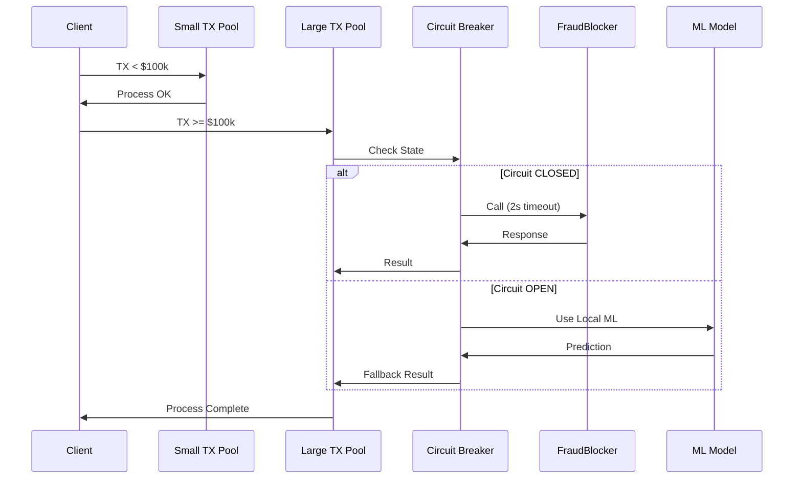
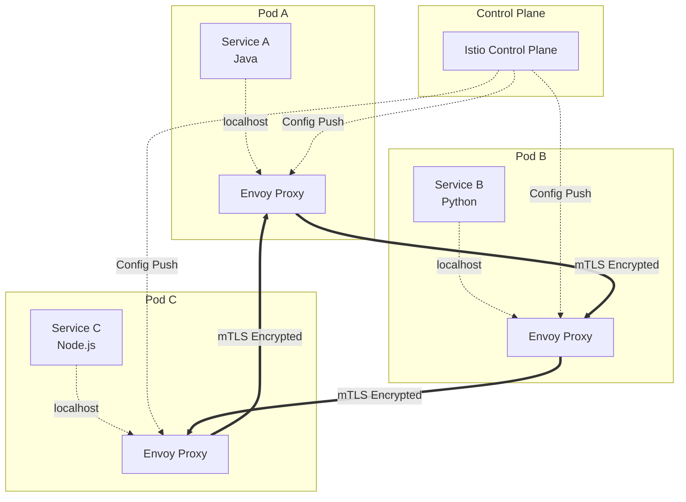

# Laboratory 4 - Architectural Patterns

**Equipo:** Julian David Rodriguez fernandez

---

**Análisis del Problema:**

El sistema de PagoGlobal sufre un problema crítico de agotamiento de recursos (Thread Pool Exhaustion). Durante el flash sale, las transacciones grandes que requieren validación de fraude con FraudBlocker bloquearon todos los threads disponibles esperando respuestas lentas (15-20 segundos). Como no existe separación de recursos, las transacciones pequeñas que no requieren validación también fueron rechazadas, causando una falla en cascada que tumbó todo el sistema de pagos por 45 minutos.

Los problemas específicos son:

- Blocking I/O sin aislamiento de recursos entre flujos críticos y no críticos
- Timeout muy alto (20 segundos) que mantiene threads bloqueados demasiado tiempo
- Ausencia de Circuit Breaker para detectar degradación del servicio externo
- Sin estrategia de fallback cuando FraudBlocker falla

**Solución Propuesta: Circuit Breaker + Bulkhead Pattern**

La solución combina dos patrones arquitectónicos:

1. **Bulkhead Pattern:** Separar recursos en pools aislados

   - Thread Pool 1: Transacciones < $100k (sin fraud check) - 50 threads
   - Thread Pool 2: Transacciones >= $100k (con fraud check) - 20 threads
   - Esto garantiza que transacciones pequeñas nunca se vean afectadas por problemas con FraudBlocker

2. **Circuit Breaker Pattern:** Detectar y manejar fallas del servicio externo

   - Configuración: Abre el circuito si 50% de llamadas fallan o tardan más de 2 segundos
   - Timeout agresivo de 2 segundos (vs 20 segundos original)
   - Estados: CLOSED (normal), OPEN (fallando), HALF_OPEN (probando recuperación)
   - Cuando el circuito está abierto, usa fallback inmediatamente

3. **Fallback Strategy:** Plan B cuando FraudBlocker no está disponible
   - Opción A: Usar modelo de Machine Learning local (menos preciso pero funcional)
   - Opción B: Aprobar transacción con flag de "revisar manualmente después"
   - La transacción se encola para revisión posterior cuando FraudBlocker se recupere

**Arquitectura de la Solución:**

**Resultados Esperados:**

- Transacciones pequeñas: 100% disponibilidad (no afectadas por FraudBlocker)
- Transacciones grandes: Degradación elegante con fallback
- Tiempo de falla reducido de 20s a 2s
- Auto-recuperación cuando FraudBlocker vuelve a funcionar
- Pérdidas reducidas de miles de millones a prácticamente cero

---

### Scenario 2: MiSalud Digital - Cross-Cutting Concerns Hell

**Análisis del Problema:**

MiSalud Digital tiene 70+ microservicios en múltiples lenguajes (Java, Python, Node.js) donde cada equipo implementó funcionalidades transversales de forma inconsistente. Problemas críticos que bloquean el lanzamiento:

1. **mTLS inconsistente:** Cada servicio maneja certificados y encriptación de forma diferente
2. **Auditoría fragmentada:** No hay forma unificada de loggear todas las llamadas entre servicios
3. **Canary deployments imposibles:** No existe infraestructura para rutear 1% del tráfico a versiones nuevas
4. **Resiliencia inconsistente:** Java usa Hystrix, Python tiene lógica custom, Node.js otra diferente

El problema raíz es que **cross-cutting concerns** (seguridad, observabilidad, resiliencia, traffic management) están mezclados con la lógica de negocio en cada servicio. Cualquier cambio requiere actualizar 70 servicios en 3+ lenguajes diferentes, coordinando deploys que toman semanas.

**Solución Propuesta: Service Mesh (Istio)**

Un Service Mesh separa completamente los cross-cutting concerns de la lógica de negocio usando el patrón Sidecar Proxy:

1. **Sidecar Injection:** Istio inyecta automáticamente un proxy (Envoy) en cada pod
2. **Traffic Interception:** El proxy intercepta TODO el tráfico entrante y saliente del servicio
3. **Services to Localhost:** Los servicios solo hablan a localhost sin saber de mTLS, retries, etc.
4. **Control Plane:** Istio configura todos los proxies centralizadamente con políticas consistentes

**Soluciones Específicas:**

**1. mTLS Automático:**

- Citadel genera y rota certificados automáticamente
- Envoy maneja todo el handshake mTLS
- Los servicios hablan a localhost sin encriptación
- 100% del tráfico encriptado sin cambiar una línea de código

**2. Auditoría Centralizada:**

- Envoy loggea automáticamente source, destination, path, latency de TODAS las llamadas
- Logs inmutables enviados a sistema centralizado
- Cumple 100% con requisitos de auditoría

**3. Canary Deployments (1% tráfico):**

- Traffic splitting configurado con YAML
- Cambiar porcentajes sin redesplegar servicios
- Rollback instantáneo cambiando configuración

**4. Resiliencia Consistente:**

- Misma política para TODOS los servicios que llaman a patient-records
- Independiente del lenguaje (Java, Python, Node.js)
- Configuración centralizada y consistente

**Arquitectura de la Solución:**

**Resultados Esperados:**

- mTLS 100% automático en todos los servicios
- Auditoría completa sin modificar código
- Canary deployments con cambios de configuración
- Políticas de resiliencia consistentes
- Tiempo de actualización reducido de semanas a minutos
- Desbloqueo del lanzamiento de la plataforma

---
