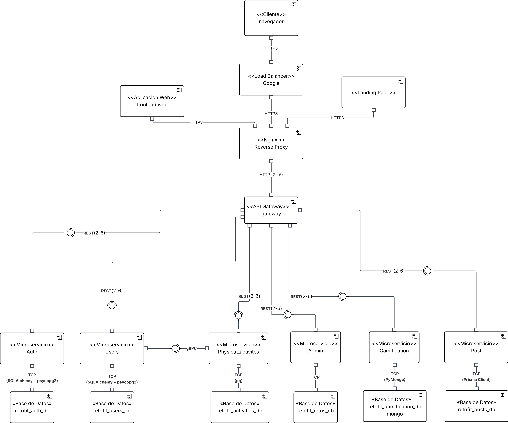
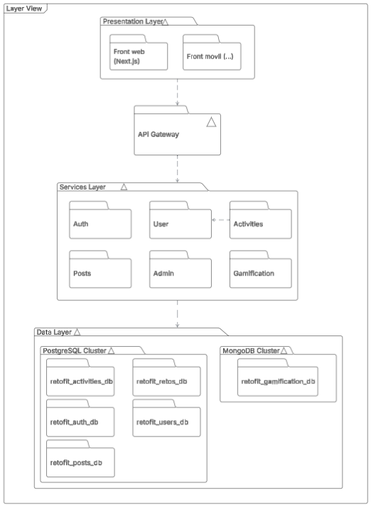
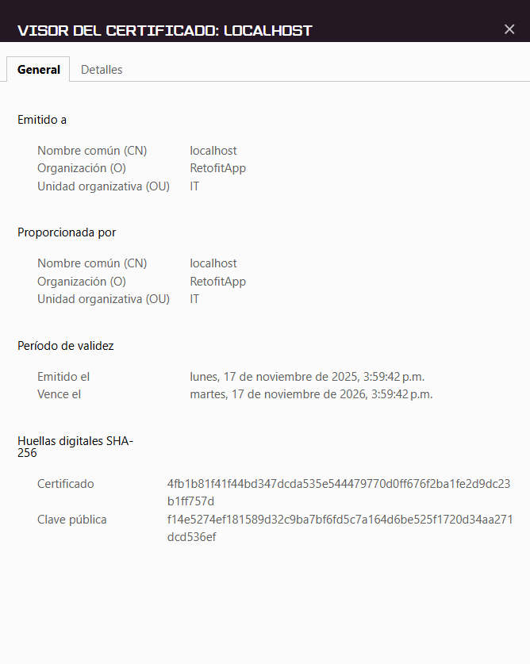
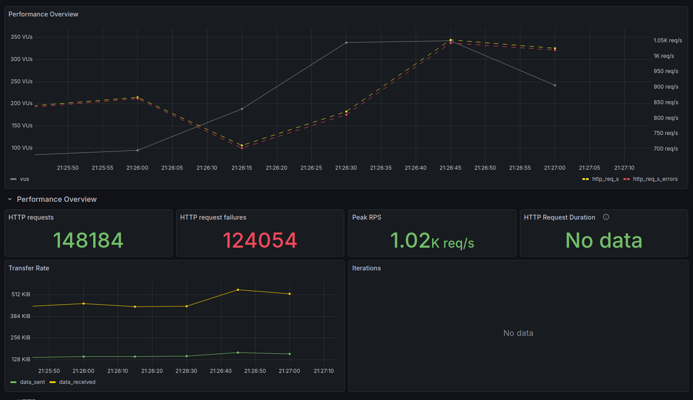
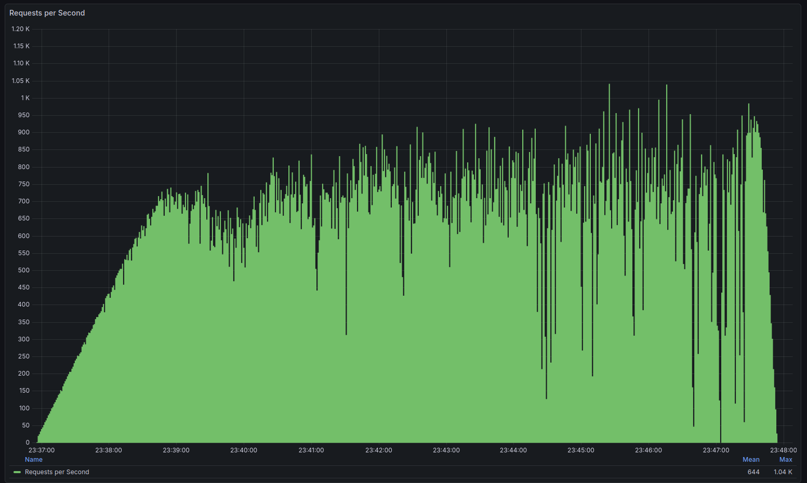

# RetoFit 2.0 🏋️‍♂️

Bienvenido al repositorio oficial del proyecto RetoFit 2.0. Este es un monorepo que contiene la aplicación completa, incluyendo el frontend (con arquitectura de microfrontends) y todos los microservicios del backend.

## 🏗️ Arquitectura de Microfrontends

El proyecto ahora implementa una **arquitectura de microfrontends** que separa:

- **Landing Page** (`/landing-page`) - Puerto 3001
  - Página de aterrizaje pública
  - Presentación del producto
  - Información del equipo
  
- **Frontend Principal** (`/front`) - Puerto 3000
  - Aplicación completa con autenticación
  - Dashboard, retos, perfil
  - Panel de administración

📖 **Documentación detallada**: Ver [MICROFRONTENDS.md](./MICROFRONTENDS.md)

## Equipo

### Nombre del equipo
<div style="font-size: 24px"><center><p><strong> RetoFit Team </strong></p></center></div>

### Miembros:
- **Cristhian Alejandro Alarcón Florido** (calarconf@unal.edu.co)
- **Andres David Caro Mora** (ancarom@unal.edu.co)
- **Anderson Steven Mateus Lopez** (amateusl@unal.edu.co)
- **Anderson David Morales Chila** (amoralesch@unal.edu.co)
- **Daniel Alejandro Ochoa Ruiz** (daochoar@unal.edu.co)
- **Cristian David Machado Guzmán** (cmachado@unal.edu.co)

## Sistema de Software

### Nombre
<div align="center"><h3><strong> RetoFit </strong></h3>
</div>

### 📜 Descripción

RETOFIT es una plataforma diseñada para ayudar y hacer un seguimiento a los ejercicios físicos de un usuario. Además, se intenta incentivar un mayor ejercicio físico con retos, logros y la creación de comunidades. La arquitectura está basada en microservicios para garantizar la escalabilidad y mantenibilidad del sistema.

## 💻 Pila Tecnológica

-   **Frontend:** [Next.js](https://nextjs.org/) (React Framework)
-   **Backend:** 
    - [Python](https://www.python.org/) + [FastAPI](https://fastapi.tiangolo.com/).
    - Go.
    - Node.js.
    - PHP.
    - Java.
-   **Arquitectura:** Microservicios

## Requisitos funcionales y no funcionales

### Requisitos funcionales
---
- **RF-1:** Registrar nuevos usuarios mediante correo electrónico, redes sociales o autenticación federada (OAuth2, Google, Facebook).
- **RF-2:** Permitir login seguro y recuperación de contraseña.
- **RF-3:** Gestionar perfiles (edad, peso, altura, nivel de condición física).
- **RF-4:** Guardar historial de entrenamientos y métricas de progreso.
- **RF-5:** Crear y unirse a retos individuales o grupales.
- **RF-6:** Notificar avances, asignar puntos y medallas por logros alcanzados.
- **RF-7:** Registrar actividades físicas manualmente.
- **RF-8:** Permitir compartir/publicar logros.
- **RF-9:** Permitir interacción básica (likes, comentarios en logros).
- **RF-10:** Administración de contenidos (retos oficiales, banners de campañas).
- **RF-11:** Monitoreo de estadísticas de uso (usuarios activos, actividades registradas).

### Requisitos no funcionales
---
- **RNF-1:** Integrar autenticación con JWT.
- **RNF-2:** Generar token seguro de recuperación (con expiración).
- **RNF-3:** Asegurar que las rutas /login y /password/* solo funcionen sobre HTTPS.
- **RNF-4:** Añadir seguridad: solo el usuario dueño puede editar/consultar su perfil.
- **RNF-5:** Validar consistencia de datos antes de guardarlos (ej. duración > 0, fecha válida).
- **RNF-6:** Validar que un usuario no se pueda unir dos veces al mismo reto. 
- **RNF-7:** Definir reglas para asignación de puntos (ej. 10 puntos por cada actividad registrada, 50 por completar un reto).
- **RNF-8:** Definir reglas para asignación de medallas (ej. medalla por primer reto completado, medalla por 100 km acumulados).
- **RNF-9:** Implementar validaciones de fechas para la activación de retos y banners.
- **RNF-10:** El software debe seguir una arquitectura distribuida.
- **RNF-11:** El software debe incluir al menos dos componentes diferentes de tipo presentación.
- **RNF-12:** El front-end web debe seguir una subarquitectura SSR (Server-Side Rendering).
- **RNF-13:** El software debe incluir al menos 4 componentes de tipo lógico.
- **RNF-14:** El software debe incluir al menos un componente que permita la comunicación/orquestación entre los componentes lógicos.
- **RNF-15:** El software debe incluir al menos 4 componentes del tipo de datos (incluyendo bases de datos relacionales y no relacionales).
- **RNF-16:** El software debe incluir al menos un componente que sea responsable de manejar procesos asincrónicos dentro del sistema.
- **RNF-17:** El software debe incluir al menos dos tipos diferentes de conectores basados en HTTP.
- **RNF-18:** El software debe construirse usando al menos 5 lenguajes de programación diferentes de proposito general.
- **RNF-19:** El despliegue del software debe ser orientado a contenedores.

## Estructura arquitectónica
### Estructura de componentes y conectores
---
#### C&C View


#### **Estilos y patrones arquitectónicos usados**

#### Estilos arquitectónicos


El estilo arquitectónico usado es el de ***microservicios*** ya que el sistema de software se divide en pequeños servicios o componentes de backend con una responsabilidad y función específicas. Consta de 6 de estos microservicios que se describiran más adelante.

#### Patrones arquitectónicos

El principal patrón usado fue el ***api gateway***, el cual consiste en que desde el exterior del sistema solo hay un único punto de acceso, que en este caso es el ***api gateway***.

#### **Elementos y relaciones arquitectónicas**
Consta de 15 componentes y 16 conectores. En este caso, se tienen 2 componentes de presentación:

- **Frontend web:**

    Interfaz gráfica del sistema que se usa desde el navegador web.

- **Frontend móvil:**

    Interfaz gráfica del que se usa específicamente desde dispositivos moviles. Por ende, esta mejor optimizada para estos dispositivos.

Adicionalmente, se tiene un componente de comunicación:

- **Api Gateway**:

    Único punto de entrada al sistema desde el exterior, encargado de enrutar al microservicio al que se le ha pedido la solicitud. También, ayuda en la enrutación dentro del sistema cuando algunos servicios necesitan información de otros.

Tiene 6 componentes de lógica de negocio:

- **Auth:** 
    
    Este microservicio se encarga del registro, autenticación y autorización (login) del sistema.

- **Users:**

    Se encarga de la gestión de la base de datos de usuarios. En él, se registran y modifican los perfiles de los usuarios que tenga el sistema.

- **Physical_activities:**

    Se encarga de registrar las actividades físicas (como correr, ciclismo, caminar) de los usuarios registrados en el sistema.

- **Admin:**

    Se encarga de suspender o eliminar usuarios, ver las estadísticas de estos (por ejemplo, cuántos hay, qué condición física tienen, su género, etc). También, es el encargado de crear y mostrar los retos dentro de la plataforma.

- **Gamification:**

    Se encarga de asignar y calcular los puntos, de acuerdo a la actividad del usuario dentro del sistema.

- **Posts:**

    Servicio encargado de las publicaciones de los usuarios, asi como la interacción entre ellos (me gusta y responder).

A su vez cada componente de lógica de negocio tiene su base de datos, es decir que hay 6 componentes de datos.

- **retofit_auth_db:**

    Tiene la información de las cuentas de los usuarios como el correo y la contraseña.

- **retofit_users_db:**

    Tiene la información de los perfiles de los usuarios con datos como la edad, estado físico, deporte favorito, etc.

- **retofit_activities_db:**

    Tiene la información de las actividades físicas realizadas por el usuarrio como los kilómetros recorridos y en cuánto tiempo los recorrió.

- **retofit_retos_db:**

    Tiene la información de todos los retos creados por el administrador, asi como el porcentaje de avance de los usuarios.

- **retofit_gamification_db:**

    Tiene los puntos que tiene cada usuario por la realización de actividades.

- **retofit_posts_db:**

    Contiene la información relacionada al contenido de los posts, ya sea el texto escrito o la imagen compartida. Además de los *me gusta* y las respuestas hechas a cada post.

En cuanto a los conectores, existen los siguientes: 

- **HTTP:**

    Conecta directamente el navegador con el frontend web.

- **Rest:**

    Existen 8 de estos conectores dentro del sistema, de los cuales 2 se utilizan para comunicarse los dos componentes de presentación con el ***Api Gateway***, y los 6 restantes para la comunicación entre el ***api gateway*** y cada uno de los microservicios.

- **TCP:** 

    Los conectores TCP, se usaron para comunicar cada microservicio con su base de datos. Cada lenguaje utilizó su propio controlador para la respectiva base de datos.

- **gRPC:**

    Este conector se utilizó para realizar una petición desde el microservicio ***Physical_activities*** directamente hacia el microservicio ***Users***. Esto se hizó para confirmar que el usuario exista realmente en la base de datos.


---

## Layered View


### Capa de Presentación (Presentation Layer)

Es la interfaz con la que interactúa el usuario final. Se compone de las aplicaciones cliente que consumen la API.

* **Front web (Next.js):** Aplicación web principal, construida con Next.js.
* **Front mobil (...):** Aplicación móvil (iOS/Android).

### API Gateway

Actúa como el **punto de entrada único** (Single Point of Entry) para todas las peticiones que vienen de la Capa de Presentación. Sus responsabilidades principales incluyen:

* **Enrutamiento:** Redirige las peticiones al microservicio correspondiente en la Capa de Servicios.
* **Agregación:** Puede combinar respuestas de múltiples servicios en una sola.
* **Gestión Transversal:** Maneja tareas comunes como la autenticación inicial, el balanceo de carga y la limitación de tasa (rate limiting).

### Capa de Servicios (Services Layer)

El núcleo de la lógica de negocio de la aplicación. Está dividida en microservicios independientes, cada uno enfocado en una única responsabilidad de negocio.

* **Auth:** Maneja la autenticación (inicio de sesión, registro, gestión de tokens).
* **User:** Gestiona toda la información y operaciones relacionadas con los perfiles de usuario.
* **Activities:** Administra las actividades que los usuarios realizan.
* **Posts:** Se encarga de las publicaciones (crear, leer, actualizar, borrar).
* **Admin:** Contiene la lógica para las tareas de administración del sistema.
* **Gamification:** Implementa la lógica de ludificación (puntos, insignias, niveles, tablas de clasificación).

*Nota: Los servicios pueden comunicarse entre sí (como se indica entre `User` y `Activities`) para operaciones que requieren datos de diferentes dominios.*

### Capa de Datos (Data Layer)

Gestiona la persistencia de los datos. Esta arquitectura sigue el patrón **"Database per Service"** (Base de Datos por Servicio), lo que significa que cada microservicio es dueño de sus propios datos y tiene su propia base de datos.

Esto asegura que los servicios estén desacoplados y puedan evolucionar de forma independiente. Se utilizan dos tecnologías de bases de datos:

#### Cluster PostgreSQL (SQL)

Utilizado para datos estructurados y relacionales:

* **`retofit_auth_db`** (pertenece al servicio `Auth`)
* **`retofit_users_db`** (pertenece al servicio `User`)
* **`retofit_activities_db`** (pertenece al servicio `Activities`)
* **`retofit_posts_db`** (pertenece al servicio `Posts`)
* **`retofit_retos_db`** (pertenece a un servicio de Retos, probablemente `Activities` o `Gamification`)

#### Cluster MongoDB (NoSQL)

Utilizado para datos con mayor flexibilidad, esquemas dinámicos o alta volúmenes de escritura, como los de ludificación:

* **`retofit_gamification_db`** (pertenece al servicio `Gamification`)

---

#### Deployment View
<div align="center"></div>

La vista de despliegue (Deployment View) de RETOFIT 2.0 ilustra la distribución física del sistema en contenedores Docker y servicios externos.

**Patrones arquitectónicos aplicados:**

1. **Containerization Pattern**: Cada microservicio y frontend se empaqueta en un contenedor Docker independiente, garantizando portabilidad y aislamiento (RNF-19).

2. **Client-Server Pattern**: Separación entre cliente (navegador del usuario) y servidores (Application Server y Data Server).

3. **Multi-tier Architecture**: Distribución en tres capas físicas: Clientes, Application Server (presentación y lógica) y Data Server (persistencia).

4. **Managed Database Services**: Uso de servicios cloud (AWS RDS para PostgreSQL, Railway para MongoDB).

5. **Reverse Proxy Pattern**: Uso de Nginx como proxy inverso para manejar tráfico HTTPS y enrutar peticiones a los contenedores internos.

---

**Descripción de los elementos y relaciones:**

**1. Clients (Nodo de Cliente)**

**Elemento:** User (Usuario)

**Descripción:** Navegadores web en dispositivos de usuario final.

**Responsabilidades:**
- Ejecutar la aplicación web Next.js.
- Realizar peticiones HTTP/HTTPS al Application Server.
- Renderizar interfaces de usuario.

**Relaciones:**
- **Cliente → Application Server:** HTTP/HTTPS sobre internet (puertos 3000 y 3001).

---

**2. Application Server (Servidor de Aplicación)**

**Descripción:** Servidor que aloja la lógica de presentación y negocio del sistema.

**Plataforma:** Contenedores Docker orquestados con Docker Compose.

**Componentes internos:**

**a) Presentation Layer**

- **Front web (Next.js)**  
  - **Contenedor:** Node.js 20  
  - **Puerto:** 3000  
  - **Responsabilidades:** Server-Side Rendering (SSR), servir assets estáticos, gestión de sesiones.

- **Landing Page (Next.js)**  
  - **Contenedor:** Node.js 18  
  - **Puerto:** 3001  
  - **Responsabilidades:** Página de aterrizaje pública.

**b) API Gateway**

- **Contenedor:** Java 17 + Spring Cloud Gateway  
- **Puerto:** 8080  
- **Responsabilidades:**  
  - Punto único de entrada para peticiones.  
  - Enrutamiento a microservicios.  
  - Logging centralizado.  
  - Implementación de Circuit Breaker y Rate Limiting.

**c) Service Layer**

Cada microservicio se despliega como contenedor Docker independiente:

1. **auth-service** - Python 3.11 + FastAPI (puerto 8001).  
2. **admin-service** - PHP 8.4 + Slim Framework (puerto 8006).  
3. **gamification-service** - Python 3.11 + FastAPI (puerto 8003).  
4. **user-service** - Python 3.11 + FastAPI (puerto 8004).  
5. **activities-service** - Go 1.25 + Gin Framework (puerto 8002).  
6. **post-service** - Node.js 20 + TypeScript + Prisma (puerto 8005).

**Comunicación interna:**
- **Service-to-Service:** REST API sobre HTTP.
- **Service Discovery:** Docker Compose DNS.
- **gRPC:** Activities Service → User Service para validación.

**Relaciones:**
- **Application Server → Data Server:** TCP para conexiones a bases de datos.
- **Comunicación interna:** Red privada dentro de Docker Compose.

---

**3. Data Server (Servidor de Datos)**

**Descripción:** Infraestructura de bases de datos gestionadas en la nube.

**Plataforma:** AWS RDS y Railway.

**Componentes:**

**a) PostgreSQL Cluster (Postgres 15)**

**Proveedor:** AWS RDS

**Seguridad:**  
- Encriptación en reposo y en tránsito (SSL/TLS).  
- Security Groups limitando acceso solo desde Application Server.

**Bases de datos alojadas:**
1. **retofit_posts_db** - Posts Service (posts, likes, comments).  
2. **retofit_retos_db** - Admin Service (challenges, progress_logs).  
3. **retofit_auth_db** - Auth Service (users, tokens).  
4. **retofit_activities_db** - Activities Service (activities, activity_types).  
5. **retofit_users_db** - User Service (profiles, training_history).

**Conectores:**
- Python services → `psycopg2`.  
- Node.js service → `pg` via Prisma ORM.  
- PHP service → `PDO PostgreSQL`.  
- Go service → `pq`.

**b) MongoDB Cluster (MongoDB 6.0)**

**Proveedor:** Railway (MongoDB Atlas)

**Base de datos:**  
1. **retofit_gamification_db** - Gamification Service  
   - Colecciones: user_points, achievements, events, leaderboard.  
   - Ventaja: Esquema flexible para diferentes tipos de logros.

**Conector:**  
- Python → `pymongo`.

**Relaciones:**  
- **Data Server ← Application Server:** TCP desde cada microservicio a su base de datos.  
- **Protocolo:** TCP/IP con SSL/TLS.  
- **Puertos:** PostgreSQL (5432), MongoDB (27017).  
- **Seguridad:** No hay acceso público directo a las bases de datos.

---

**Flujo de comunicación:**

```
Usuario (Navegador) → [HTTP/HTTPS] → Front web / Landing Page → [REST] → API Gateway → 
[REST] → Microservicio → [TCP/SSL] → Base de datos
```


**Comunicación especial:**
- **Activities Service → User Service:** gRPC.  
- **Admin Service → Auth/User Service:** HTTP via Guzzle.

---

**Características de despliegue:**

**Escalabilidad:**  
- Aumento de réplicas de contenedores según carga.  
- Ajuste de recursos por contenedor.

**Alta disponibilidad:**  
- Servicios críticos con múltiples réplicas.  
- Bases de datos distribuidas en múltiples zonas.  
- Docker Compose reinicia automáticamente contenedores no saludables.

**Seguridad:**  
- Redes privadas en Docker Compose.  
- Credenciales en archivos `.env`.  
- HTTPS obligatorio (RNF-3).  
- Encriptación en bases de datos.

**Cumplimiento de requisitos:**  
- **RNF-19:** Despliegue orientado a contenedores ✓  
- **RNF-10:** Arquitectura distribuida ✓  
- **RNF-3:** HTTPS en rutas de autenticación ✓

---

## Security View

Esta sección describe cómo se gestionan los aspectos clave de seguridad dentro de la arquitectura de RetoFit 2.0, incluyendo amenazas, tácticas aplicadas y patrones arquitectónicos utilizados. El propósito de este view es complementar la información del *Deployment View* mostrando cómo se protege cada punto del sistema, desde la comunicación externa hasta las interacciones internas entre microservicios.


### 1. Threat Model — Security Scenarios

Este diagrama representa una visión general de los flujos de datos críticos dentro del sistema y los puntos donde pueden aparecer amenazas relevantes.  
Incluye el recorrido que realiza un usuario desde el frontend, pasando por Nginx y el API Gateway, y llegando a los microservicios expuestos en la red privada.

El diagrama identifica amenazas comunes como:
- Manipulación de tokens durante la comunicación.
- Interceptación de tráfico externo.
- Peticiones maliciosas hacia rutas críticas.
- Accesos indebidos a servicios internos.

**Diagrama:**  


---

### 2. Security Tactics — Controles Aplicados

Este diagrama muestra, desde una perspectiva arquitectónica, qué tácticas de seguridad se aplican sobre cada uno de los componentes del sistema.  
El objetivo es presentar de manera clara cómo se refuerza cada capa del modelo:

- Terminación de HTTPS en Nginx.  
- Validación y emisión de JWT en el Auth Service.  
- Filtrado y enrutamiento controlado en el API Gateway.  
- Aislamiento por redes internas para microservicios.  
- Respeto al patrón “database-per-service”.

Esto complementa y amplía la información vista en el *Deployment View*.

**Diagrama:**  


---

### 3. Security Architecture Pattern — Patrones Aplicados

Este diagrama presenta una vista de alto nivel sobre cómo los componentes principales se organizan siguiendo patrones de seguridad utilizados en arquitecturas modernas.

Entre los patrones incluidos se encuentran:
- **Reverse Proxy** (Nginx recibiendo todo el tráfico entrante).  
- **API Gateway Pattern** para controlar el acceso a los microservicios.  
- **Separation of Concerns** al delegar autenticación en un solo servicio.  
- **Network Segmentation** mediante redes públicas y privadas.  
- **Database-per-Service Pattern** reforzando el aislamiento de datos.

Este diagrama sirve para entender rápidamente cómo la estructura general del sistema favorece la seguridad end-to-end.

**Diagrama:**  


---

### 4. Authentication Sequence — Flujo de Autenticación

Este diagrama de secuencia ilustra el proceso completo desde que un usuario inicia sesión en la aplicación web hasta que obtiene un JWT válido, así como la validación posterior del token cuando realiza solicitudes a microservicios protegidos.

El flujo cubre:
1. Envío de credenciales desde el frontend.  
2. Paso por Nginx y enrutamiento por el API Gateway.  
3. Validación de credenciales por el Auth Service.  
4. Emisión de un JWT si las credenciales son válidas.  
5. Validación posterior del token en cada request autenticada.

Este diagrama complementa otros views técnicos del sistema mostrando claramente la interacción entre frontend, proxy, gateway y servicios internos en procesos sensibles.

**Diagrama:**  


### 5. HTTPS Evidence — Deployment Security Proof

Esta sección presenta evidencia visual de que el sistema está funcionando efectivamente bajo HTTPS, con terminación TLS en Nginx tal como se describe en el *Deployment View* y en las tácticas de seguridad previamente enumeradas.

Las capturas de pantalla demuestran:

- Que el frontend es servido mediante `https://localhost`.
- Que el navegador reconoce el certificado instalado en Nginx.
- Que la conexión es segura (🔒) y el certificado es válido.
- Que no existen advertencias de contenido inseguro.
- Que el tráfico entre usuario ⇆ Nginx se encuentra cifrado.

Estas evidencias complementan el modelo de amenazas y validan la configuración real del entorno.

**Capturas:**

1. **Indicador de conexión segura (HTTPS activo): NO LO PUDE PONER**    
   

2. **Detalles del certificado y su validez:**  
   

3. **Frontend cargado correctamente bajo HTTPS:**  
   

---


## Decomposition View
<div align="center"></div>


#### 🎨 FRONT

El **Front** representa las interfaces de usuario del sistema, permitiendo la interacción con las funcionalidades expuestas por los microservicios.

- **FRONT WEB**  
  Interfaz web desarrollada (**Next.js**) para administración y uso general desde navegadores.

- **FRONT MÓVIL**  
  Aplicación móvil (**Dart**) para usuarios finales.

Ambas interfaces se comunican con el **API Gateway**, que enruta las solicitudes hacia los servicios internos.


#### ⚙️ SERVICES

El sistema está compuesto por varios microservicios independientes, cada uno con una responsabilidad específica:

| Servicio | Descripción |
|-----------|--------------|
| **auth-service** | Maneja la autenticación y autorización de usuarios (login, registro, tokens JWT, etc.). |
| **user-service** | Gestiona la información del perfil de usuario y datos personales. |
| **physical_activities_service** | Registra y consulta actividades físicas realizadas por los usuarios. |
| **posts-service** | Permite la creación, lectura y gestión de publicaciones o retos dentro de la plataforma. |
| **admin-service** | Ofrece funcionalidades administrativas para la gestión general del sistema. |
| **gamification-service** | Administra la lógica de gamificación: puntos, niveles, recompensas y ranking de usuarios. |

Cada servicio puede ejecutarse de forma independiente y se comunica con los demás a través del **API Gateway**.


#### 🌐 API GATEWAY

El **API Gateway** actúa como punto de entrada único para todas las solicitudes externas.  
Su función principal es redirigir, filtrar y centralizar la comunicación entre el **Front** y los distintos **microservicios**.

- Carpeta `target/`  
  Contiene el archivo compilado `api-gateway-1.0.0.0.jar`, que puede ejecutarse para iniciar el Gateway.

---
## 🔒 Pruebas de Patrones de Seguridad

### 🛡️ Seguridad y Segmentación de Red

El proyecto implementa una estrategia de **defensa en profundidad** mediante segmentación de redes en Docker. Esto asegura que los microservicios no sean accesibles directamente desde el frontend o internet, forzando todo el tráfico a través del API Gateway.

### Arquitectura de Redes

| Red | Tipo | Servicios Conectados | Descripción |
|-----|------|----------------------|-------------|
| **public-net** | Bridge | Nginx, Landing Page, Frontend, API Gateway | Red expuesta (vía proxy) para la interfaz de usuario. |
| **private-net** | Bridge | API Gateway, Todos los Microservicios, Bases de Datos | Red aislada. Contiene la lógica de negocio y datos. |

### Verificación de Aislamiento

Se ha incluido un script automatizado para validar que las reglas de firewall de Docker estén funcionando correctamente.

Esto se detallar de mejor forma en el diagrama de despliegue anteriormente mostrado.

**Requisitos:**
- Python 3 instalado.
- Contenedores corriendo (`docker compose up -d`).

### Rate Limiting Pattern

El sistema implementa el patrón **Rate Limiting**  utilizando **Nginx** como Reverse Proxy y de forma más detallada en el api gateway usando redis. Este mecanismo protege a los microservicios situados abajo (como `auth-service` y `user-service`) de ser saturados por picos de tráfico o ataques de denegación de servicio (DoS).

#### Configuración del Patrón

- **Zona de Memoria:** `apilimit` (10MB compartidos)
- **Tasa Sostenida:** 10 peticiones/segundo (`10r/s`)
- **Ráfaga (Burst):** 20 peticiones
- **Comportamiento:** Las peticiones dentro de la ráfaga se procesan instantáneamente (`nodelay`), pero si se excede la capacidad total (Tasa + Ráfaga), Nginx corta la conexión inmediatamente.
- En la clase `RateLimiterConfig.Java`, se implementan 3 modos en el cual puede analizar el trafico el api gateway con redis:
    - ipKeyResolver
    - userKeyResolver
    - userIpKeyResolver (implementado por defecto)

#### Realización de prueba
Se tienen que ejecutar los siguientes comandos:
```bash
# Primero
cd ./testing/rate_limit/

# Segundo
kubectl apply -f prometheus.yaml

# Tercero
kubectl apply -f grafana.yaml

# Cuarto
kubectl create configmap k6-scripts --from-file=scripts/k6_rate_limit_test.js --namespace=default

# Quinto
kubectl apply -f k6-prometheus-job.yaml

# Para abrir grafana
minikube service grafana --url
```

En la interfaz de grafana:
- **Usuario:** admin
- **Contraseña:** admin

Luego, se escribe la constraseña que desea.

Después, importa un dashboard. Para *Prometheus* el **id** es ***18030***. A continuación, se tiene que importar un data source colocando como url: *http://prometheus.default.svc.cluster.local:9090*.

#### Resultado obtenido
<div align="center"></div>

**Beneficios Demostrados**
1. Protección Anti-DoS: Evita que un atacante inunde el sistema con solicitudes.

2. Estabilidad: Garantiza que los microservicios (User, Auth, etc.) solo reciban una carga de trabajo que pueden procesar.

3. Seguridad en el Borde: El tráfico malicioso es detenido en Nginx, antes de consumir recursos de procesamiento del API Gateway o la Base de Datos.


## 🧪 Pruebas de Patrones de Escalabilidad

### Circuit Breaker Pattern

El sistema implementa el patrón **Circuit Breaker** usando Spring Cloud Gateway y Resilience4j para mejorar la resiliencia y prevenir cascadas de fallos cuando un servicio está caído.

#### Configuración del Circuit Breaker

- **Umbral de fallos:** 50%
- **Llamadas mínimas:** 5
- **Timeout por petición:** 5 segundos
- **Tiempo en estado OPEN:** 10 segundos
- **Estados:** CLOSED → OPEN → HALF_OPEN → CLOSED

#### Scripts de Prueba

Se incluyen dos scripts PowerShell para probar el Circuit Breaker:

**1. Prueba Directa al Gateway (sin Nginx)**

```powershell
.\test-circuit-breaker-direct.ps1
```

Este script prueba el Circuit Breaker accediendo directamente al API Gateway en el puerto 8081, sin pasar por Nginx.

**Resultados esperados:**
- Tiempo SIN Circuit Breaker: ~24-30 segundos (timeouts)
- Tiempo CON Circuit Breaker: ~1-2 segundos (fallback inmediato)
- **Mejora de performance: ~15-20x más rápido**

**2. Prueba a través de Nginx (HTTPS)**

```powershell
.\test-circuit-breaker-nginx.ps1
```

Este script prueba el Circuit Breaker en un escenario real, accediendo a través de Nginx con HTTPS y Rate Limiting configurado.

**Resultados esperados:**
- Tiempo SIN Circuit Breaker: ~5-10 segundos
- Tiempo CON Circuit Breaker: ~1-2 segundos
- **Mejora de performance: ~4-5x más rápido**

#### Monitoreo del Circuit Breaker

Puedes verificar el estado de los Circuit Breakers en tiempo real:

```powershell
# Ver todos los circuit breakers
Invoke-WebRequest -Uri http://localhost:8081/actuator/circuit-breakers -UseBasicParsing

# Ver un circuit breaker específico
Invoke-WebRequest -Uri http://localhost:8081/actuator/circuit-breakers/usersServiceCircuitBreaker -UseBasicParsing
```

#### Endpoints de Fallback

Cuando un servicio falla y el Circuit Breaker se activa (estado OPEN), el sistema retorna automáticamente respuestas de fallback con mensajes descriptivos:

```json
{
  "timestamp": "2025-11-17T03:02:23.822894950",
  "status": 503,
  "error": "Service Unavailable",
  "message": "El servicio de usuarios no está disponible temporalmente. Por favor, intente más tarde.",
  "service": "Users Service",
  "circuitBreakerActivated": true
}
```

#### Beneficios Demostrados

1. **Resiliencia:** El sistema sigue respondiendo aunque servicios internos fallen
2. **Performance:** Respuestas inmediatas (sin esperar timeouts de 5 segundos)
3. **Auto-recuperación:** El circuito se cierra automáticamente cuando el servicio se recupera
4. **Prevención de cascada:** Evita que fallos en un servicio tumben todo el sistema
5. **Experiencia de usuario:** Mensajes claros en lugar de timeouts largos

### Prueba de estrés
<div align="center"></div>

---

## Prototipo
## 🚀 Guía de Instalación y Ejecución

## 📋 Requisitos Previos

- **Kubernetes local**: minikube, kind, o Docker Desktop con Kubernetes habilitado
- **kubectl**: CLI de Kubernetes instalado
- **Docker**: Para construir imágenes
- **Recursos mínimos**: 8GB RAM, 4 CPU cores, 20GB disk

## 🚀 Guía de Deployment Rápido

### Paso 1: Iniciar Cluster

**Opción A - minikube:**
```bash
minikube start --memory=8192 --cpus=4
minikube tunnel  # En terminal separada (necesario para LoadBalancer local)
```

**Opción B - Docker Desktop:**
- Settings → Kubernetes → Enable Kubernetes

### Paso 2: Construir Imágenes Docker

```bash
# Desde la raíz del proyecto
docker build -t retofit/auth-service:latest ./services/auth-service
docker build -t retofit/users-service:latest ./services/user-service
docker build -t retofit/activities-service:latest ./services/physical_activities_service
docker build -t retofit/gamification-service:latest ./services/gamification-service
docker build -t retofit/posts-service:latest ./services/posts-service
docker build -t retofit/admin-service:latest ./services/admin-service
docker build -t retofit/api-gateway:latest ./api_gateway_2.1
docker build -t retofit/landing-page:latest ./landing-page
docker build -t retofit/frontend:latest ./front
```

**Para minikube - cargar imágenes:**
```bash
minikube image load retofit/auth-service:latest
minikube image load retofit/users-service:latest
minikube image load retofit/activities-service:latest
minikube image load retofit/gamification-service:latest
minikube image load retofit/posts-service:latest
minikube image load retofit/admin-service:latest
minikube image load retofit/api-gateway:latest
minikube image load retofit/landing-page:latest
minikube image load retofit/frontend:latest
```

### Paso 3: Generar Certificados TLS

**IMPORTANTE**: Antes de desplegar, debes generar certificados TLS para Nginx.

**Opción A - Usar script automatizado (Recomendado):**

```bash
# En PowerShell (Windows)
cd k8s
.\generate-certs.ps1

# En Bash (Linux/Mac/Git Bash)
cd k8s
chmod +x generate-certs.sh
./generate-certs.sh
```

**Opción B - Generar manualmente con OpenSSL:**

```bash
# Crear directorio
mkdir -p nginx/tls

# Generar clave privada
openssl genrsa -out nginx/tls/nginx-key.pem 2048

# Generar certificado autofirmado (válido por 365 días)
openssl req -new -x509 -sha256 \
  -key nginx/tls/nginx-key.pem \
  -out nginx/tls/nginx.pem \
  -days 365 \
  -subj "/C=CO/ST=Cundinamarca/L=Bogota/O=RetoFit/OU=Development/CN=localhost" \
  -addext "subjectAltName=DNS:localhost,DNS:*.localhost,IP:127.0.0.1"
```

⚠️ **Nota**: Estos son certificados autofirmados para desarrollo. Los navegadores mostrarán advertencias de seguridad - esto es normal para desarrollo local.

### Paso 4: Crear Secrets

```bash
# TLS Secret (Nginx)
kubectl create secret generic nginx-tls-secret \
  --from-file=nginx.pem=./nginx/tls/nginx.pem \
  --from-file=nginx-key.pem=./nginx/tls/nginx-key.pem

# Aplicar secrets YAML
kubectl apply -f k8s/02-secrets/

# Verificar
kubectl get secrets
```

### Paso 5: Crear ConfigMaps

```bash
kubectl apply -f k8s/01-configmaps/

# Verificar
kubectl get configmaps
```

### Paso 6: Crear Services

```bash
kubectl apply -f k8s/03-services/

# Verificar
kubectl get services
```

### Paso 7: Desplegar Aplicaciones

```bash
# Backend services
kubectl apply -f k8s/04-deployments/auth-service-deployment.yaml
kubectl apply -f k8s/04-deployments/users-service-deployment.yaml
kubectl apply -f k8s/04-deployments/activities-service-deployment.yaml
kubectl apply -f k8s/04-deployments/gamification-service-deployment.yaml
kubectl apply -f k8s/04-deployments/posts-service-deployment.yaml
kubectl apply -f k8s/04-deployments/admin-service-deployment.yaml

# Esperar a que estén ready
kubectl wait --for=condition=ready pod -l tier=backend --timeout=180s

# API Gateway
kubectl apply -f k8s/04-deployments/api-gateway-deployment.yaml
kubectl wait --for=condition=ready pod -l app=api-gateway --timeout=180s

# Frontends
kubectl apply -f k8s/04-deployments/landing-page-deployment.yaml
kubectl apply -f k8s/04-deployments/frontend-deployment.yaml
kubectl wait --for=condition=ready pod -l tier=frontend --timeout=120s

# Nginx
kubectl apply -f k8s/04-deployments/nginx-deployment.yaml
kubectl wait --for=condition=ready pod -l app=nginx-proxy --timeout=60s
```

### Paso 8: Aplicar NetworkPolicies

```bash
kubectl apply -f k8s/05-network-policies/

# Verificar
kubectl get networkpolicies
```

### Paso 9: Verificar Deployment

```bash
# Ver todos los pods
kubectl get pods -o wide

# Ver servicios y LoadBalancer IP
kubectl get services

# Ver logs de un servicio
kubectl logs -l app=auth-service --tail=50

# Test acceso externo
curl -k https://localhost/
curl -k https://localhost/dashboard
```

## 🧪 Testing y Validación

### Test de Conectividad Backend

```bash
# Port-forward API Gateway
kubectl port-forward deployment/api-gateway 8081:8081

# Ver circuit breakers
curl http://localhost:8081/actuator/circuitbreakers

# Ver health
curl http://localhost:8081/actuator/health
```

### Test de Load Balancing

```bash
# Escalar auth-service
kubectl scale deployment auth-service --replicas=3

# Ver distribución de pods
kubectl get pods -l app=auth-service -o wide

# Ver logs para verificar load balancing
kubectl logs -l app=auth-service --tail=100
```

### Test de gRPC (Activities → Users)

```bash
# Ver logs de activities service
kubectl logs -l app=activities-service | grep -i "grpc\|users"

# Ver logs de users service
kubectl logs -l app=users-service | grep -i "grpc\|50051"
```

## 🔒 NetworkPolicies Aplicadas

1. **allow-dns.yaml**: Permite a todos los pods acceder a kube-dns
2. **allow-external-db.yaml**: Permite egress a AWS RDS (5432) y Railway MongoDB (10201)
3. **activities-to-users-grpc.yaml**: Permite gRPC entre activities y users (50051)

**Nota**: No se aplica `default-deny-all` para facilitar debugging en desarrollo.

## 🛠️ Comandos Útiles

### Ver Estado del Cluster

```bash
# Ver todos los recursos
kubectl get all

# Ver pods con detalles
kubectl get pods -o wide

# Ver uso de recursos
kubectl top nodes
kubectl top pods

# Ver eventos
kubectl get events --sort-by='.lastTimestamp'
```

### Debugging

```bash
# Logs en tiempo real
kubectl logs -l app=auth-service -f --tail=100

# Ejecutar comando en pod
kubectl exec -it deployment/auth-service -- /bin/sh

# Port-forward para acceso local
kubectl port-forward deployment/api-gateway 8081:8081

# Describir pod (ver eventos y configuración)
kubectl describe pod <pod-name>
```

### Escalar Servicios

```bash
# Escalar manualmente
kubectl scale deployment auth-service --replicas=3

# Ver status de escalado
kubectl get deployment auth-service

# Reiniciar deployment (rolling restart)
kubectl rollout restart deployment auth-service
kubectl rollout status deployment auth-service
```

### Gestión

```bash
# Eliminar deployment específico
kubectl delete deployment auth-service

# Eliminar todos los deployments
kubectl delete -f k8s/04-deployments/

# Eliminar todo
kubectl delete -f k8s/
```

## 🐛 Troubleshooting

### Pod en CrashLoopBackOff

```bash
# Ver logs del pod
kubectl logs <pod-name>

# Ver eventos
kubectl describe pod <pod-name>

# Causas comunes:
# - DATABASE_URL incorrecta
# - Secret no existe
# - Puerto incorrecto en containerPort
```

### ImagePullBackOff

```bash
# Verificar imagen existe
docker images | grep retofit

# Cargar imagen en minikube
minikube image load retofit/<service-name>:latest

# Verificar imagePullPolicy en deployment
kubectl get deployment <name> -o yaml | grep imagePullPolicy
```

### Service No Alcanzable

```bash
# Verificar endpoints
kubectl get endpoints <service-name>

# Si no hay endpoints, verificar selector
kubectl get pods --show-labels
kubectl describe svc <service-name>

# Test desde otro pod
kubectl run test --image=curlimages/curl --rm -it --restart=Never -- \
  curl -v http://<service-name>:<port>/
```

### LoadBalancer Pending

**Para minikube:**
```bash
# Ejecutar en terminal separada
minikube tunnel
```

**Para kind:**
Requiere MetalLB o configuración de port mapping al crear cluster.

**Para Docker Desktop:**
Automático, verificar que puerto no esté en uso.

## 📈 Monitoring

### Metrics Server (Opcional)

```bash
kubectl apply -f https://github.com/kubernetes-sigs/metrics-server/releases/latest/download/components.yaml

# Ver métricas
kubectl top nodes
kubectl top pods
```

### Kubernetes Dashboard (Opcional)

```bash
kubectl apply -f https://raw.githubusercontent.com/kubernetes/dashboard/v2.7.0/aio/deploy/recommended.yaml

# Crear token de acceso
kubectl create serviceaccount dashboard-admin -n kubernetes-dashboard
kubectl create clusterrolebinding dashboard-admin \
  --clusterrole=cluster-admin \
  --serviceaccount=kubernetes-dashboard:dashboard-admin

# Get token
kubectl create token dashboard-admin -n kubernetes-dashboard

# Proxy
kubectl proxy

# Acceder: http://localhost:8001/api/v1/namespaces/kubernetes-dashboard/services/https:kubernetes-dashboard:/proxy/
```
También, se puede usar
```bash
minikube dashboard
```
## 🔄 Actualizar Aplicaciones

```bash
# Rebuild imagen
docker build -t retofit/auth-service:v2 ./services/auth-service

# Cargar en cluster
minikube image load retofit/auth-service:v2

# Actualizar deployment
kubectl set image deployment/auth-service auth-service=retofit/auth-service:v2

# Ver rollout
kubectl rollout status deployment/auth-service
```

## Despliegue
**Link:** https://34.69.186.15

---

## 📁 Estructura del Proyecto

```
RETOFIT_2.0/
├── api_gateway_2.1/            # Api Gateway (Java + Spring Cloud Gateway)
│   ├── src/
|   |   └── main/ 
|   |       ├── java/
|   |       |   └── com/
|   |       |       └── example/
|   |       |           └── api_gateway/
|   |       |               ├── config/
|   |       |               |   ├── CorsConfig.java
|   |       |               |   └── CircuitBreakerConfig.java
|   |       |               ├── filter/
|   |       |               |   └── LoggingFilter.java
|   |       |               └── Application.java
│   |       └── resources/
|   |           └── application.yml
│   ├── pom.xml
├── landing-page/              # 🆕 Landing Page Microfrontend (Next.js - Puerto 3001)
│   ├── src/
│   │   ├── app/              # App Router
│   │   │   ├── page.tsx     # Página principal
│   │   │   ├── layout.tsx   # Layout raíz
│   │   │   └── globals.css  # Estilos
│   │   ├── components/      # Componentes UI
│   │   │   ├── ui/         # shadcn/ui
│   │   │   └── icons.tsx
│   │   └── lib/            # Utilidades
│   ├── public/
│   │   └── images/         # Imágenes del equipo
│   ├── Dockerfile          # Multi-stage build
│   ├── package.json
│   ├── next.config.ts
│   ├── tailwind.config.ts
│   └── README.md
├── front/                     # Frontend Principal (Next.js - Puerto 3000)
│   ├── src/
│   │   ├── app/              # App Router
│   │   │   ├── (auth)/      # Rutas de autenticación
│   │   │   ├── dashboard/   # Dashboard
│   │   │   └── admin/       # Panel admin
│   │   ├── components/      # Componentes React
│   │   ├── hooks/          # Custom hooks
│   │   ├── lib/            # APIs y utilidades
│   │   └── ai/             # Integración Genkit
│   ├── public/
│   ├── Dockerfile
│   ├── package.json
│   └── next.config.ts
├── nginx/                     # Reverse Proxy
│   ├── nginx.conf            # Configuración de enrutamiento
│   └── tls/                  # Certificados SSL
├── services/                  # Microservicios Backend
|    ├── auth-service/          # (Python + FastAPI) Puerto 8001
|    ├── admin-service/         # (PHP + Slim) Puerto 8006
|    ├── gamification-service/  # (Python + FastAPI) Puerto 8003
|    ├── physical_activities_service/  # (Go + Gin) Puerto 8002
|    ├── posts-service          # (Node.js + TypeScript) Puerto 8005
|    └── user-service/          # (Python + FastAPI) Puerto 8004
├── k8s/
├── docker-compose.yaml        # Orquestación de contenedores
├── microfrontends.ps1         # 🆕 Script de gestión de microfrontends
├── MICROFRONTENDS.md          # 🆕 Documentación de arquitectura
├── .gitignore
└── README.md
```

## 🚀 Guía de Inicio Rápido

### Requisitos Previos

- **Docker** y **Docker Compose** instalados
- **Node.js** 18+ (para desarrollo local)
- **PowerShell** (en Windows)

### Opción 1: Despliegue Completo con Docker (Recomendado)

```bash
# Clonar el repositorio
git clone https://github.com/RetoFit/RETOFIT_2.0.git
cd RETOFIT_2.0

# Levantar todos los servicios
docker-compose up --build

# Acceder a la aplicación
# Landing page: https://localhost/
# Frontend: https://localhost/dashboard
# API: https://localhost/api/
```

### Opción 2: Desarrollo Local de Microfrontends

```powershell
# Usar el script de gestión (Windows)
.\microfrontends.ps1 install    # Instalar dependencias
.\microfrontends.ps1 dev        # Modo desarrollo

# O manualmente
cd landing-page
npm install
npm run dev  # Puerto 3001

# En otra terminal
cd front
npm install
npm run dev  # Puerto 3000
```

### Comandos Útiles del Script de Microfrontends

```powershell
.\microfrontends.ps1 dev         # Iniciar ambos frontends en dev
.\microfrontends.ps1 build       # Construir para producción
.\microfrontends.ps1 docker-up   # Levantar con Docker
.\microfrontends.ps1 docker-down # Detener Docker
.\microfrontends.ps1 install     # Instalar dependencias
.\microfrontends.ps1 clean       # Limpiar node_modules
.\microfrontends.ps1 help        # Ver ayuda
```

### Acceso a la Aplicación

Una vez desplegado el sistema:

| Componente | URL | Descripción |
|------------|-----|-------------|
| **Landing Page** | https://localhost/ | Página de bienvenida |
| **Login** | https://localhost/login | Autenticación |
| **Dashboard** | https://localhost/dashboard | Panel principal |
| **Admin** | https://localhost/admin | Administración |
| **API Gateway** | https://localhost/api/ | Endpoints de API |
| **Circuit Breakers** | http://localhost:8081/actuator/ | Monitoreo |

### Variables de Entorno

**Landing Page** (`.env.local`):
```env
NEXT_PUBLIC_FRONTEND_URL=https://localhost
```

**Frontend Principal**: Configurado en `docker-compose.yaml`
```

