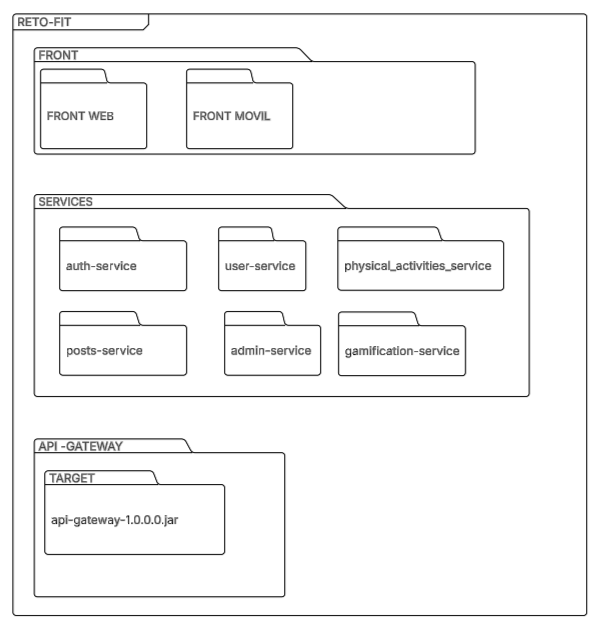
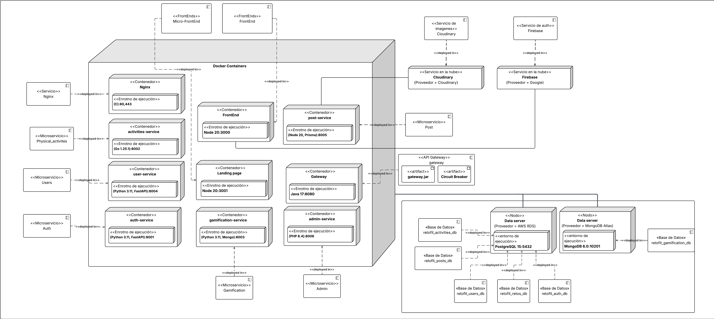
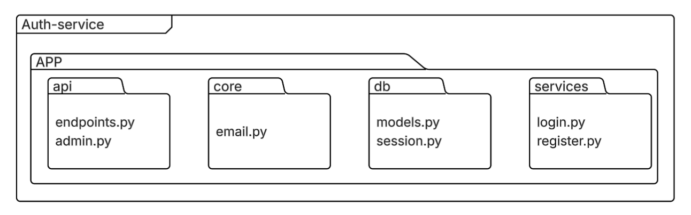
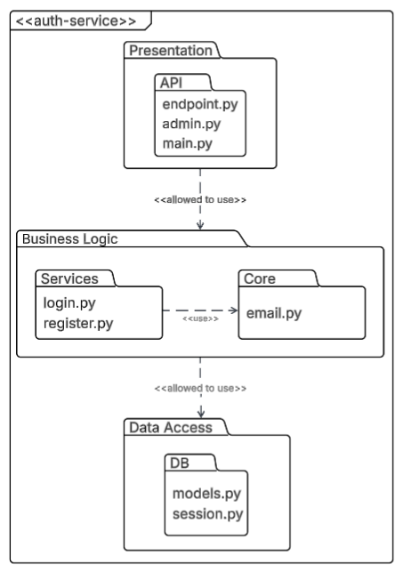
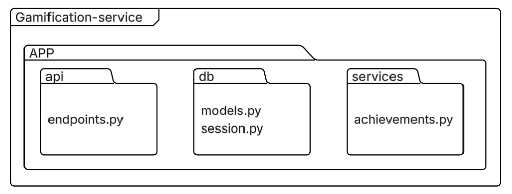
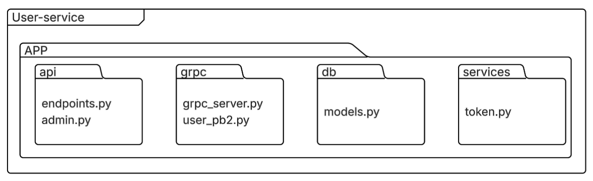
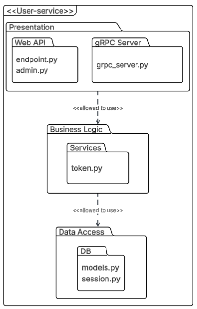

# Documentación de Arquitectura - RetoFit

Este documento detalla la estructura arquitectónica del sistema **RetoFit**, desglosando tanto la visión general del sistema como el diseño interno de sus microservicios principales desarrollados en Python.

Los diagramas siguen los lineamientos de **Estructuras de Descomposición** y **Estructuras de Capas** definidos en el curso de Arquitectura de Software.

---

## 1. Arquitectura General del Sistema

### 1.1. Diagrama de Descomposición del Sistema
Muestra la organización de alto nivel del código, dividiendo el sistema en unidades funcionales de implementación (Frontend, Backend Services, API Gateway).

* **Explicación:** El sistema se descompone jerárquicamente en tres grandes módulos: `FRONT` (Web y Móvil), `SERVICES` (Microservicios de negocio) y `API-GATEWAY` (Punto de entrada).
* **Relación:** Define una relación estricta de "parte-todo" (Is part of), donde cada submódulo tiene un único padre, sin dependencias cíclicas.

### 1.2. Diagrama de Capas del Sistema (Layered View)
Representa la separación lógica de responsabilidades y el flujo de uso permitido entre las partes del sistema.

* **Explicación:** El sistema se estructura en capas horizontales: Presentación, Gateway, Servicios y Datos.
* **Restricción (Allowed-to-use):** Se cumple la restricción de unidireccionalidad. Las capas superiores solo pueden usar las inferiores (ej. `Presentation` -> `Gateway` -> `Services`), garantizando la separación de intereses y evitando ciclos.

### 1.3 Diagrama de Despliegue del Sistema
Muestra la infraestructura física y lógica donde se despliega el sistema, incluyendo servidores, contenedores y servicios externos.

* **Explicación:** El sistema se despliega en contenedores Docker organizados en diferentes nodos. Además, utiliza servicios externos como Firebase y Cloudinary para autenticación y almacenamiento de imágenes.
* **Componentes Principales:**
  - **Docker Containers:** Contienen los microservicios (`auth-service`, `user-service`, `post-service`, etc.), el API Gateway, y los frontends (`FrontEnd` y `Landing Page`).
  - **Servicios Externos:** 
    - **Firebase:** Proveedor de autenticación y servicios adicionales.
    - **Cloudinary:** Proveedor de almacenamiento de imágenes.
  - **Bases de Datos:** 
    - **PostgreSQL:** Bases de datos relacionales (`retofit_users_db`, `retofit_posts_db`, etc.).
    - **MongoDB:** Base de datos no relacional (`retofit_gamification_db`).
  - **Nginx:** Reverse proxy para manejar tráfico HTTP/HTTPS y enrutarlo hacia los contenedores internos.
* **Relación:** Los contenedores Docker interactúan entre sí mediante redes internas, mientras que los servicios externos y las bases de datos están conectados mediante APIs y conexiones seguras.
---

## 2. Arquitectura de Componentes (Microservicios Python)

A continuación, se detalla el diseño interno de los servicios desarrollados en Python: `auth-service`, `gamification-service` y `user-service`.

### 2.1. Auth Service
Servicio encargado de la autenticación y autorización (Login, Registro).

#### Estructura de Descomposición

* **Descripción:** El módulo principal `app` contiene submódulos claramente definidos: `api` (endpoints), `core` (utilidades como email), `services` (lógica de registro/login) y `db` (modelos).

#### Estructura de Capas

* **Descripción:** Diseño en 3 capas estrictas.
    1.  **Presentation:** Contiene el segmento `API` (`endpoints.py`).
    2.  **Business Logic:** Dividida en segmentos `Services` y `Core`. El segmento `Services` utiliza `Core` para tareas auxiliares.
    3.  **Data Access:** Contiene el segmento `DB` (`models.py`), aislado de la presentación.

### 2.2. Gamification Service
Servicio que gestiona los logros y el sistema de gamificación.

#### Estructura de Descomposición

* **Descripción:** Organización simplificada donde `app` agrupa `api`, `services` (lógica de logros) y `db`.

#### Estructura de Capas

* **Descripción:** Flujo lineal simple (`API` -> `Services` -> `DB`).
* **Justificación:** Al tener una única responsabilidad (logros), la capa de negocio no requiere segmentación compleja, manteniendo la arquitectura limpia y fácil de mantener.

### 2.3. User Service
Servicio central de usuarios con capacidad de comunicación dual (REST y gRPC).

#### Estructura de Descomposición

* **Descripción:** Destaca por incluir dos módulos de interfaz: `api` (para web) y `grpc` (para comunicación eficiente entre servicios), además de `services` y `db`.

#### Estructura de Capas

* **Descripción:**
    1.  **Presentation Layer:** Contiene dos segmentos paralelos: `REST Interface` y `gRPC Interface`. Ambos actúan como puntos de entrada.
    2.  **Business Logic Layer:** Ambos segmentos de presentación convergen en el segmento `Domain Services` (`token.py`).
    3.  **Data Access Layer:** Persistencia de datos de usuario.
* **Análisis:** Este diseño demuestra alta cohesión y reutilización, ya que múltiples interfaces de entrada consumen la misma lógica de negocio sin duplicar código.

---

### 2.3. Admin Service

#### Estructura de Descomposición

El admin-service es un microservicio de administración que orquesta las entidades centrales del dominio. Expone una API REST para la gestión completa de Challenges (incluyendo el progreso de usuarios) y Users.

Opera de forma autónoma con su propia base de datos (retofit_retors) y se integra con el user-service para la gestión de datos de usuarios, reflejando una clara separación de responsabilidades en la arquitectura de microservicios.

#### Estructura de Capas

Microservicio REST que funciona como orquestador administrativo. Combina capa de presentación con endpoints HTTP y capa de infraestructura con:

Acceso directo a PostgreSQL vía PDO

Integración síncrona con microservicios (Auth, Users) usando Guzzle HTTP

Gestión completa de Challenges y Users mediante APIs REST

Arquitectura de 2 capas funcional: Presentación (rutas HTTP) + Infraestructura (BD y servicios externos).

### 2.4 Physical Activities Service

#### Estructura de Descomposición 

El servicio adopta el *Standard Go Project Layout*, dividiendo el sistema en tres grandes bloques:

* **cmd/**: Contiene el punto de entrada de la aplicación (main.go). Es la capa de "arranque" y configuración.
* **internal/**: Contiene el código privado de la aplicación que no debe ser importado por otros proyectos. Aquí reside el núcleo funcional dividido en:
    * handlers: Controladores HTTP.
    * services: Lógica de negocio.
    * repositories: Acceso a base de datos SQL.
    * grpc: Clientes para comunicación con otros microservicios.
* **api/**: Define las rutas y la configuración del servidor HTTP.

*Relación:* Se cumple la relación estricta de "parte-todo", donde internal actúa como el contenedor padre de toda la lógica de negocio, protegiéndola del exterior.

---

#### Estructura de Capas

El sistema se organiza en tres capas horizontales con dependencia unidireccional descendente (Presentation -> Business -> Data):

##### 1. Presentation Layer (Capa Superior)
* *Componentes:* HTTP Handlers (en internal/handlers) y Router (en api/router).
* *Responsabilidad:* Recibir las peticiones HTTP, validar la entrada (JSON) y enrutar el tráfico. No contiene lógica de negocio compleja.

##### 2. Business Logic Layer (Capa Intermedia)
* *Componentes:* Domain Services (en internal/services).
* *Responsabilidad:* Ejecutar las reglas de negocio (ej. activityService.go). Es agnóstica a la base de datos o al transporte HTTP.

##### 3. Data Access & Integration Layer (Capa Inferior)
* *Componentes:*
    * **Repositories:** Encargado de la persistencia local en base de datos SQL (activityRepository.go).
    * **gRPC Client Adapter:** Encargado de la comunicación externa con el User Service (userClient.go).
* *Análisis Clave:* A nivel arquitectónico, tanto la base de datos local como el servicio externo (vía gRPC) se consideran *proveedores de datos*. Por ello, el cliente gRPC se ubica en esta capa inferior junto a los repositorios, actuando como infraestructura que "sirve" datos a la capa de negocio.

##### Restricciones Cumplidas (Allowed-to-use)
* La capa de *Presentación* solo usa la capa de *Negocio*.
* La capa de *Negocio* solo usa la capa de *Datos/Integración*.
* No existen ciclos ni dependencias inversas (la capa de datos no conoce a la capa de presentación).

