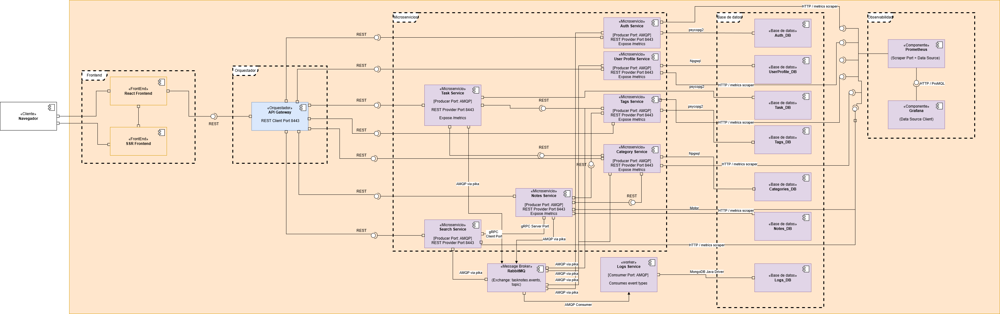
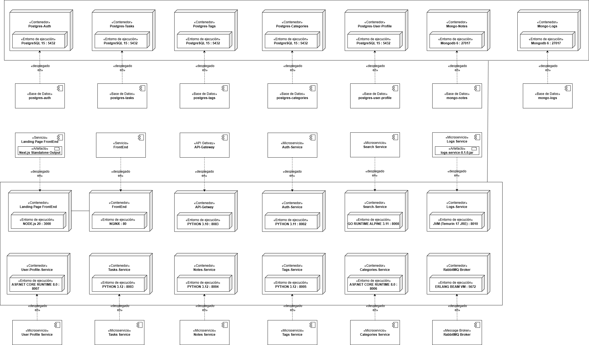
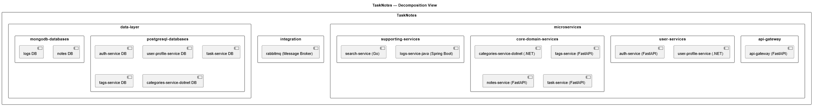

## Artifact – Prototipo 2 

### Equipo

- Nombre del equipo: Cuervos Team
- Integrantes: Jorge Andrés Torres Leal, Javier Andrés Carrillo Carrasco, Kevin Julian Gonzalez Guerra, Gabriel Castiblanco Céspedes, Lizeth Mariana Garcia Duarte, Michael Daniels Oviedo Quiroga, Javier Esteban Martinez Giron

### Sistema de Software

- Nombre: TaskNotes
 - Logo: 
- Descripción: TaskNotes es un sistema para gestionar tareas y notas con categorías y etiquetas. Incluye búsqueda full‑text sobre notas, vista de panel con previsualizaciones y sincronización en tiempo real por WebSockets.

### Requisitos Funcionales y No Funcionales

- Requisitos Funcionales:
  - Crear, listar, editar y eliminar tareas (PostgreSQL) con prioridad, fecha de vencimiento, categoría y etiquetas.
  - Crear, listar, editar y eliminar notas (MongoDB) con categoría y etiquetas.
  - Previsualización de tareas y notas desde el dashboard (no edición directa).
  - Búsqueda full‑text de notas por contenido/título con filtros (categoría/etiquetas) vía microservicio de búsqueda.

- Requisitos No Funcionales:
  - Arquitectura distribuida.
  - Al menos dos componentes de presentación (uno: web front-end).
  - El front-end web sigue subarquitectura SSR (Server-Side Rendering).
  - Al menos cuatro componentes de lógica.
  - Al menos un componente para comunicación/orquestación entre componentes lógicos.
  - Al menos cuatro componentes de datos (relacional y NoSQL).
  - Al menos un componente responsable de procesos asíncronos.
  - Al menos dos tipos diferentes de conectores basados en HTTP.
  - Construido con al menos cinco lenguajes de propósito general.
  - Despliegue container-oriented.

### Estructuras Arquitectónicas

#### Component-and-Connector (C&C) Structure

- C&C View: 
# Descripción de *estilos y patrones* usados

- *Microservicios*: capacidades separadas (Auth, UserProfile, Task, Tags, Category, Notes, Search, Logs), cada una con despliegue y ciclo de vida propios.  
- *API Gateway (Edge/Gateway)*: único punto de entrada para el Frontend; ruteo y contratos REST hacia servicios.  
- *DB-per-service*: cada servicio posee su base de datos y su driver/SDK (PostgreSQL: psycopg2/Npgsql; MongoDB: Motor/Java Driver).  
- *Comunicación síncrona REST*: Frontend→Gateway→Servicios y parte del tráfico S2S.  
- *Comunicación binaria gRPC (S2S): entre *Search Service y Notes Service para baja latencia.  
- *Mensajería asíncrona: RabbitMQ como *Message Broker; patrón Producer → Worker (Logs Service) → persistencia en Logs_DB.  
- *Separación de preocupaciones*: Frontend, Gateway y servicios de dominio claramente delimitados.  
- *Segregación funcional: *Tags y Category como servicios independientes (bounded contexts específicos).

---
# Descripción de elementos y relaciones: 

## Elementos

### Borde del Sistema
- *Cliente / Navegador*  
  Interactúa con la SPA, emite solicitudes HTTP al Gateway.
- *React Frontend*  
  Orquestación ligera por vistas (BFF del cliente). Maneja JWT en memoria segura y cachea resultados de lectura.

- *Next.js SSR Frontend*  
  Landing Page.

### Capa de Entrada
- *API Gateway*
  - *Rol: terminación TLS, validación de **JWT, autorización simple (scopes/roles), **rate-limit, **routing* por path/host.
  - *Interfaces: API pública **REST* versionada (/v1/...).
  - *Políticas*: timeouts, circuit breakers, métricas (P50/P95/P99), logs de acceso.

### Servicios de Dominio
- *Auth Service* ↔ *Auth_DB (PostgreSQL/psycopg2)*  
  Emisión/validación de tokens, login/refresh/logout, listas de revocación.
- *UserProfile Service* ↔ *UserProfile_DB (PostgreSQL/Npgsql)*  
  Datos de perfil extendido (preferencias, idioma, avatar).
- *Task Service* ↔ *Task_DB (PostgreSQL/psycopg2)*  
  To-dos relacionadas con el usuario; filtros por estado/fecha.
- *Tags Service* ↔ *Tags_DB (PostgreSQL/psycopg2)*  
  Catálogo de etiquetas; búsqueda por prefijo.
- *Category Service* ↔ *Categories_DB (PostgreSQL/Npgsql)*  
  Jerarquía padre-hijo de categorías; operaciones CRUD y mover nodo.
- *Notes Service* ↔ *Notes_DB (MongoDB/Motor)*  
  CRUD de notas (documentos flexibles, versiones, metadatos). Produce logs a RabbitMQ. Coopera con Tags/Category vía REST. Interfaz gRPC para hidratar datos a Search.
- *Search Service*  
  REST para /search. Colabora con *Notes* por *gRPC* para hidratar títulos/snippets/permisos. Produce logs a RabbitMQ.  
  > Nota: Idealmente debería consultar un *índice de búsqueda* (Elastic/OpenSearch/Meili) alimentado por eventos de Notes.
- *Logs Service (Worker)* ↔ *Logs_DB (MongoDB/Java Driver)*  
  Consumidor de RabbitMQ; formatea y persiste logs estructurados. No se expone al cliente.

### Mensajería
- *RabbitMQ (Broker)*  
  Exchanges (topic/direct) → colas *durables* con *DLQ* y *TTL*. Productores: Notes, Search (y otros). Consumidor: Logs Service.

### Capa de Datos
- *PostgreSQL*: Auth_DB, UserProfile_DB, Task_DB, Tags_DB, Categories_DB.  
- *MongoDB*: Notes_DB, Logs_DB.  
- *Prohibido* el acceso cruzado entre bases; la integración es por *APIs* o *eventos*.

## Relaciones

### Sincrónicas (REST/gRPC)
- *Frontend → Gateway* (REST): envío de operaciones de usuario con JWT.  
- *Gateway → Servicios* (REST): /auth, /profiles, /tasks, /tags, /categories, /notes, /search.  
- *Search ↔ Notes* (*gRPC*): recuperación eficiente de datos de notas (por lote/IDs), con contrato protobuf versionable.

*Contratos y Semántica*
- REST: idempotencia en GET, PUT, DELETE; POST/PATCH con Idempotency-Key si se admiten reintentos.  
- gRPC: streaming opcional, compresión, y campos opcionales para compatibilidad retroactiva.

### Asíncronas (RabbitMQ)
- *Productores: Notes, Search (publican **logs* no bloqueantes).  
- *Consumidor*: Logs Service (worker escalable horizontalmente).  
- *Garantías: *al menos una vez con ack; *orden por cola* (no global); *reintentos* con backoff; *DLQ* para fallos permanentes.  
- *Trazabilidad*: incluir trace_id/correlation_id en headers de mensaje para correlacionar con trazas.

#### Layered Structure (Estructura por Capas)

- View: 

- Descripción de patrones usados (si aplica): 
  **Layered Architecture Pattern**: El sistema implementa una arquitectura estrictamente en capas con cinco niveles jerárquicos. Cada capa solo puede acceder a la capa inmediatamente inferior (principio de capas estrictas), garantizando separación de responsabilidades y bajo acoplamiento. Se aplican los patrones **Database per Service** para aislamiento de datos, **API Gateway Pattern** para punto único de entrada, y **Event-Driven Architecture** para comunicación asíncrona entre servicios.

- Descripción de elementos y relaciones:
  **Elementos por Capa:**
  
  • **Presentation Layer**: 
    - frontend-ssr: Landing Page SSR (Next.js :3000): Renderizado del servidor para SEO y experiencia inicial
    - frontend-micro: Frontend Micro (React + Nginx :8080): Aplicación web interactiva (SPA)
    - Relación interna: SSR puede redirigir a SPA mediante allow-to-use
  
  • **API Gateway Layer**:
    - api-getaway: API Gateway (FastAPI :8083): Punto único de entrada, validación JWT RS256, enrutamiento, CORS y rate limiting
  
  • **Business Services Layer** (subdividida en tres dominios):
    - *User Services*: user-profile-service (.NET :8007), auth-services (FastAPI :8001)
    - *Core Domain Services*: categories-service-dotnet (.NET :8006), tags-service (FastAPI :8005), notes-service (FastAPI :8004), task-services (FastAPI :8003)
    - *Supporting Services*: logs-service-java (Java Spring :8010), search-service (Go :8008)
  
  • **Integration Layer**:
    - *Comunicación Asíncrona*: rabbitmq (Message Broker para eventos)
  
  • **Data Layer**:
    - *PostgreSQL*: 6 bases especializadas (user-profile-service, auth-services, task-services, tags-service, categories-service-dotnet, logs-service-java)
    - *MongoDB*: 1 base para notes-service con full-text search nativo
  
  **Relaciones Arquitectónicas:**
  
  • **allowed-to-use-below**: Dependencias estrictas entre capas adyacentes (Presentation→Gateway→Services)
  • **allow-to-use**: Dependencias más flexibles (Services ↔ Integration ↔ Data)
  • **Database per Service**: Cada microservicio mantiene acceso exclusivo a su base de datos
  • **Event Publishing**: Servicios publican eventos a RabbitMQ; Logs Service consume todos los eventos
  • **Technology Diversity**: 5+ lenguajes (TypeScript, Python, C#, Go, Java) distribuidos por responsabilidades específicas 

#### Deployment Structure (Estructura de Despliegue)

- Deployment View: 

- Descripción de patrones usados (si aplica): 
El principal patrón arquitectónico implementado en TaskNotes es el **API Gateway Pattern**.

🔹 API Gateway Pattern
Este patrón se utiliza para **centralizar las peticiones externas** hacia los múltiples microservicios del sistema.  
En TaskNotes, el servicio `api-gateway` cumple esta función, actuando como punto único de entrada para el frontend y gestionando:

- **Ruteo de solicitudes** hacia microservicios como `auth-service`, `tasks-service`, `notes-service`, `categories-service`, `user-profile-service` y `search-service`.  
- **Unificación de seguridad y autenticación** mediante JWT.  
- **Transformación y agregación de respuestas**, reduciendo la carga sobre los clientes.  

Este enfoque permite:
- Simplificar la comunicación cliente-servidor.  
- Aislar la lógica de negocio en microservicios especializados.  
- Escalar componentes de forma independiente.  
- Mejorar la mantenibilidad del sistema.

Otros patrones complementarios presentes:
- **Microservices Architecture:** cada dominio funcional (tareas, notas, categorías, usuarios, etc.) opera como un servicio independiente con su propia base de datos.  
- **Database per Service Pattern:** garantiza independencia y evita acoplamientos entre servicios.   
- **Log Aggregation Pattern:** el `logs-service` centraliza los registros de eventos desde múltiples servicios para monitoreo y trazabilidad.  

- Descripción de elementos y relaciones: 

 🔹 Infrastructure Layer
- **RabbitMQ (3-management):** actúa como **message broker** para la comunicación asíncrona entre microservicios.  
- **PostgreSQL (15):** se ejecuta en instancias separadas por microservicio (`postgres-auth`, `postgres-tasks`, `postgres-tags`, `postgres-categories`, `postgres-user-profile`), aplicando el patrón *Database per Service*.  
- **MongoDB (6):** se usa para los microservicios `notes-service` y `logs-service`, especializados en almacenamiento documental.

 🔹 Backend Services
Cada microservicio es desplegado en su propio contenedor con las siguientes tecnologías:

| Microservicio          | Lenguaje / Runtime         | Puerto | Base de Datos / Broker          |
|-------------------------|----------------------------|--------|---------------------------------|
| Auth Service            | Python 3.11                | 8002   | PostgreSQL 15                   |
| Tasks Service           | Python 3.12                | 8003   | PostgreSQL 15 / RabbitMQ        |
| Notes Service           | Python 3.12                | 8004   | MongoDB 6 / RabbitMQ            |
| Tags Service            | Python 3.12                | 8005   | PostgreSQL 15 / RabbitMQ        |ga
| Categories Service      | .NET 8.0                   | 8006   | PostgreSQL 15 / RabbitMQ        |
| User Profile Service    | .NET 8.0                   | 8007   | PostgreSQL 15 / RabbitMQ        |
| Search Service          | Go 1.23 (gRPC)             | 8008   | N/A (consume Notes y Tasks)     |
| Logs Service            | Java 17 (Spring Boot)      | 8010   | MongoDB 6 / RabbitMQ            |
| API Gateway             | Python 3.10 (FastAPI)      | 8083   | -                               |

Cada servicio expone endpoints REST (o gRPC en el caso de `search-service`) y cuenta con un **health check** configurado en Docker Compose para garantizar su disponibilidad.

 🔹 Frontend Layer
- **frontend-micro:** aplicación React construida y servida por Nginx en el puerto `8080`.  
- **frontend-ssr:** aplicación Next.js (Node.js 20) que ofrece renderizado del lado del servidor (SSR) en el puerto `3000`.  
Ambas interactúan exclusivamente con el **API Gateway**.

 🔹 Communication Flow
1. El usuario interactúa con `frontend-ssr` o `frontend-micro`.  
2. Las peticiones se canalizan al `api-gateway`.  
3. El gateway redirige las solicitudes al microservicio correspondiente.  
4. Los microservicios intercambian eventos a través de **RabbitMQ** y registran su actividad en `logs-service`.  
5. Las bases de datos (PostgreSQL y MongoDB) persisten la información de manera independiente por dominio.

#### Decomposition Structure (Estructura de Descomposición)

#### - Decomposition View:

#### Decomposition Structure (Estructura de Descomposición)

#### - Decomposition View:

### Descripción de elementos y relaciones

#### Microservices

##### API Gateway (FastAPI)
- Encargado del enrutamiento y proxy inverso de todas las solicitudes entrantes. Aplica validaciones JWT y políticas de CORS, y actúa como punto central para la comunicación REST/gRPC hacia los microservicios del dominio.

### User Services
**user-profile-service (.NET)**  
- Maneja la información de usuario, perfiles y credenciales; utiliza Entity Framework y PostgreSQL.

**auth-service (FastAPI)**  
- Gestiona autenticación, emisión y validación de tokens JWT.

##### Core Domain Services
**categories-service-dotnet (.NET)**  
- Administración de categorías; expone API REST y publica eventos AMQP.

**tags-service (FastAPI)**  
- Servicio de etiquetas; mantiene relaciones con tareas y notas.

**notes-service (FastAPI)**  
- Gestión de notas; soporta REST y gRPC, usa MongoDB para persistencia.

**task-service (FastAPI)**  
- Gestión de tareas; integra con tags y categories, publica eventos en RabbitMQ.

##### Supporting Services
**logs-service-java (Spring Boot)**  
- Registro distribuido de logs y monitoreo de eventos, con persistencia en MongoDB y PostgreSQL.

**search-service (Go + GraphQL)**  
- Búsqueda de texto e indexación; expone API REST/GraphQL.
 
##### Integration

**rabbitmq (Message Broker)**  
- Middleware de mensajería AMQP que orquesta la comunicación asincrónica entre microservicios (task-created, note-updated, category-event, etc.), asegurando desacoplamiento y fiabilidad en la entrega.

#### Data Layer

##### PostgreSQL Databases
- Almacenes relacionales dedicados a cada microservicio:  
auth-service, user-profile-service, task-service, tags-service, categories-service-dotnet, logs-service-java.

##### MongoDB Databases
- Bases documentales usadas por notes-service y logs-service-java para persistencia no estructurada.

#### - Descripción de relaciones:

| Usa \ Es usado por          | API-GW | AUTH | PROFILES | TASKS | NOTES | TAGS | CATEGORIES | LOGS | SEARCH |
|-----------------------------|:------:|:----:|:---------:|:-----:|:-----:|:----:|:-----------:|:----:|:------:|
| **API-GW (FastAPI)**        | –      | 1    | 1         | 1     | 1     | 1    | 1           | 0    | 1      |
| **AUTH (FastAPI)**          | 0      | –    | 0         | 0     | 0     | 0    | 0           | 0    | 0      |
| **PROFILES (.NET)**         | 0      | 1    | –         | 0     | 0     | 0    | 0           | 0    | 0      |
| **TASKS (FastAPI)**         | 0      | 1    | 0         | –     | 1     | 1    | 1           | 0    | 0      |
| **NOTES (FastAPI)**         | 0      | 0    | 0         | 0     | –     | 1    | 1           | 0    | 0      |
| **TAGS (FastAPI)**          | 0      | 0    | 0         | 1     | 0     | –    | 1           | 0    | 0      |
| **CATEGORIES (.NET)**       | 0      | 0    | 0         | 0     | 0     | 0    | –           | 0    | 0      |
| **LOGS (Spring Boot)**      | 0      | 0    | 0         | 0     | 0     | 0    | 0           | –    | 0      |
| **SEARCH (Go)**             | 0      | 0    | 0         | 0     | 1     | 1    | 1           | 0    | –      |
>  **Leyenda:** “1” = el módulo en la columna *usa* al módulo en la fila.
### Prototipo

- Despliegue rápido (Docker Compose e2e distribuido):
  - `docker compose -f TaskNotes/docker-compose.e2e.dist.yml up -d --build`
  - `docker compose -f TaskNotes/docker-compose.e2e.dist.yml ps`
  - Apagar y limpiar volúmenes: `docker compose -f TaskNotes/docker-compose.e2e.dist.yml down -v`

- Más detalles:
  - Consulta `TaskNotes/DEPLOYMENT_V2.md` para pasos extendidos, troubleshooting y comandos adicionales.

#### Guía Paso a Paso (Breve)

- Requisitos: Docker 24+, Docker Compose v2; puertos libres 3000, 8080, 8083, 8001–8010, 5672, 15672, 27017.
- Levantar entorno distribuido:
  - `docker compose -f TaskNotes/docker-compose.e2e.dist.yml up -d --build`
- Ver contenedores:
  - `docker compose -f TaskNotes/docker-compose.e2e.dist.yml ps`
- Chequear salud:
  - `Invoke-RestMethod -Uri http://localhost:8083/health` (Gateway)
  - `Invoke-RestMethod -Uri http://localhost:8008/health` (Search)
  - `Invoke-RestMethod -Uri http://localhost:8010/healthz` (Logs)
- Registrar y autenticar (HS256):
  - Registro: `Invoke-RestMethod -Method Post -Uri http://localhost:8083/auth/register -ContentType 'application/json' -Body (@{ email='testuser@example.com'; password='Passw0rd!' } | ConvertTo-Json)`
  - Login: `$login = Invoke-RestMethod -Method Post -Uri http://localhost:8083/auth/login -ContentType 'application/json' -Body (@{ email='testuser@example.com'; password='Passw0rd!' } | ConvertTo-Json)`
  - Token: `$token = $login.access_token`
- Probar API con token:
  - `Invoke-RestMethod -Uri http://localhost:8083/user/profile -Headers @{ Authorization = "Bearer $token" }`
- Abrir UIs:
  - SSR: `http://localhost:3000` | Web Micro: `http://localhost:8080`
- Inspección rápida de DBs:
  - Postgres Auth: `docker compose -f TaskNotes/docker-compose.e2e.dist.yml exec postgres-auth psql -U postgres -d tasknotes_auth_service -c "SELECT COUNT(*) FROM users;"`
  - Mongo Logs: `docker compose -f TaskNotes/docker-compose.e2e.dist.yml exec mongo-logs mongosh --quiet --eval "db = db.getSiblingDB('tasknotes_logs_service'); printjson(db.event_logs.countDocuments())"`
- Apagar y limpiar:
  - `docker compose -f TaskNotes/docker-compose.e2e.dist.yml down -v`
- Ampliar pasos y troubleshooting:
  - Ver [DEPLOYMENT_V2.md](./DEPLOYMENT_V2.md).
