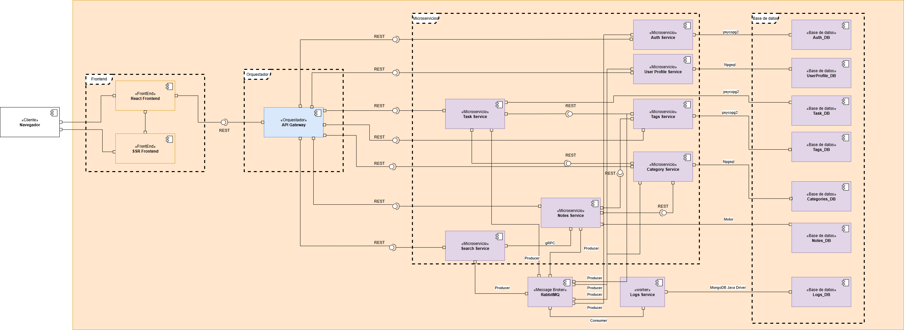

## Artifact – Prototipo 3

### Equipo

- Nombre del equipo: Cuervos Team
- Integrantes: Jorge Andrés Torres Leal, Javier Andrés Carrillo Carrasco, Kevin Julian Gonzalez Guerra, Gabriel Castiblanco Céspedes, Lizeth Mariana Garcia Duarte, Michael Daniels Oviedo Quiroga, Javier Esteban Martinez Giron

### Sistema de Software

- Nombre: TaskNotes
 - Logo: 
- Descripción: TaskNotes es un sistema para gestionar tareas y notas con categorías y etiquetas. Incluye búsqueda full‑text sobre notas, vista de panel con previsualizaciones y sincronización en tiempo real por WebSockets.

### Requisitos Funcionales y No Funcionales

- Requisitos Funcionales:
  - Crear, listar, editar y eliminar tareas (PostgreSQL) con prioridad, fecha de vencimiento, categoría y etiquetas.
  - Crear, listar, editar y eliminar notas (MongoDB) con categoría y etiquetas.
  - Previsualización de tareas y notas desde el dashboard (no edición directa).
  - Búsqueda full‑text de notas por contenido/título con filtros (categoría/etiquetas) vía microservicio de búsqueda.

- Requisitos No Funcionales:
  - Escenarios de seguridad:
    - Patron de canal seguro
    - Patron de proxy reverso
    - Patron de segmnentación de red
    - Adicionales elegidos por el equipo
  - Escenarios de rendimiento y escalabilidad
    - Patron de Balanceador de Carga
    - Adicionales elegidos por el equipo

### Estructuras Arquitectónicas

#### Component-and-Connector (C&C) Structure

- C&C View: 
### Estilos arquitectónicos

* *Microservicios*
  El dominio se divide en servicios pequeños y desplegables de forma independiente:

  * Auth, UserProfile, Task, Tags, Category, Notes, Search, Logs.
    Cada servicio:
  * Tiene su *propio ciclo de vida* (deploy, versionado, escalado).
  * Posee su *base de datos privada* y no se comparte a nivel de SQL.

* *API Gateway (Edge/Gateway)*

  * Único punto de entrada para los frontends.
  * Aplica terminación TLS, autenticación/autorización básica, rate limit, enrutamiento a servicios internos.

* *DB-per-service*

  * PostgreSQL: Auth_DB, UserProfile_DB, Task_DB, Tags_DB, Categories_DB.
  * MongoDB: Notes_DB, Logs_DB.
  * Cada servicio accede *solo* a su BD, usando su driver correspondiente:

    * psycopg2, Npgsql, Motor, MongoDB Java Driver.

* *Comunicación síncrona REST*

  * Frontend → Gateway → Servicios mediante HTTP/REST.
  * Parte de la comunicación S2S también es REST.

* *Comunicación binaria gRPC (S2S)*

  * Search Service ↔ Notes Service mediante gRPC para obtener datos de notas con baja latencia y contrato tipado (protobuf).

* *Mensajería asíncrona con RabbitMQ (AMQP)*

  * Notes Service y Search Service actúan como *productores* de eventos/logs.
  * Logs Service actúa como *worker consumidor*.
  * Patrón: *Producer → Message Broker → Worker → Persistencia*.

* *Separación de preocupaciones*

  * Paquetes: Frontend, Orquestador (API Gateway), Microservicios, Bases de datos, Mensajería, Observabilidad.
  * Bounded contexts específicos para Tags y Category.

* *Observabilidad centralizada*

  * Prometheus para scraping de métricas /metrics.
  * Grafana como cliente de datos (PromQL) para dashboards y alertas.

---

## Elementos y relaciones de la arquitectura

### Borde del sistema

#### Cliente / Navegador

* Usuario final que interactúa con la aplicación.
* Envía solicitudes HTTP al API Gateway a través de:

  * *React Frontend* (SPA).
  * *SSR Frontend* (Next.js u otra tecnología).

#### React Frontend

* Frontend principal tipo SPA.
* Responsabilidades:

  * Gestión de sesión (JWT).
  * Lógica de presentación y navegación.
  * Cacheo de datos de lectura (ej. queries de notas/tareas).
* Comunicación:

  * HTTP/REST hacia el API Gateway.

#### SSR Frontend

* Frontend para páginas renderizadas en servidor (landing, SEO, etc.).
* Comunicación:

  * HTTP/REST hacia el API Gateway, igual que React Frontend.

---

### Capa de entrada

#### API Gateway

* Rol:

  * Terminación TLS.
  * Validación de *JWT*.
  * Autorización básica (scopes / roles).
  * *Rate limiting* y cuotas.
  * *Routing* por path/host a microservicios.
  * Timeouts y circuit breakers básicos.
* Puertos:

  * Exposición externa: *REST (HTTPS)* hacia los frontends.
  * Hacia microservicios: *REST Client Port 8443*.
* Observabilidad:

  * Expone endpoint /metrics para Prometheus.
  * Genera logs de acceso (que podrían ir a RabbitMQ o a Logs Service).

---

### Servicios de dominio

Todos los servicios comparten patrón general:

* *REST Provider Port 8443* (API interna).
* *Producer Port: AMQP* (para logs/eventos, donde aplique).
* *Métricas HTTP* (/metrics) hacia Prometheus.

#### Auth Service ↔ Auth_DB

* Base de datos: Auth_DB (PostgreSQL, driver psycopg2).
* Responsabilidades:

  * Registro/login/refresh/logout.
  * Emisión y validación de tokens JWT.
  * Listas de revocación / sesiones activas.
* Interfaces:

  * REST para /auth/....
  * AMQP Producer para logs de autenticación (opcional).
  * /metrics para observabilidad.

#### UserProfile Service ↔ UserProfile_DB

* Base de datos: UserProfile_DB (PostgreSQL, driver Npgsql).
* Responsabilidades:

  * Gestión de perfil de usuario (nombre, idioma, avatar, preferencias).
* Interfaces:

  * REST para /profiles/....
  * AMQP Producer para logs/eventos de perfil.
  * /metrics.

#### Task Service ↔ Task_DB

* BD: Task_DB (PostgreSQL, driver psycopg2).
* Responsabilidades:

  * CRUD de tareas.
  * Filtros por estado, fecha, prioridad, etc.
* Interfaces:

  * REST /tasks/....
  * AMQP Producer para logs de cambios en tareas.
  * /metrics.

#### Tags Service ↔ Tags_DB

* BD: Tags_DB (PostgreSQL, driver psycopg2).
* Responsabilidades:

  * Catálogo de etiquetas reutilizables.
  * Búsqueda por prefijo.
* Interfaces:

  * REST /tags/....
  * AMQP Producer.
  * /metrics.

#### Category Service ↔ Categories_DB

* BD: Categories_DB (PostgreSQL, driver Npgsql).
* Responsabilidades:

  * Jerarquía de categorías padre-hijo.
  * CRUD de categorías, reordenamientos, mover nodos.
* Interfaces:

  * REST /categories/....
  * AMQP Producer.
  * /metrics.

#### Notes Service ↔ Notes_DB

* BD: Notes_DB (MongoDB, driver Motor).
* Responsabilidades:

  * CRUD de notas (documentos flexibles).
  * Asociación con tags y categorías (vía REST hacia Tags/Category).
  * Publicación de eventos/logs de notas hacia RabbitMQ.
  * Exposición de datos de notas para búsqueda.
* Interfaces:

  * REST /notes/....
  * *gRPC Server Port* para exponer un servicio del tipo NotesGrpcService (usado por Search Service).
  * AMQP Producer (logs/eventos).
  * /metrics.

#### Search Service

* BD propia no mostrada explícitamente (puede integrarse con un motor de búsqueda externo en el futuro).
* Responsabilidades:

  * Endpoints de búsqueda /search (filtrar notas/tareas, etc.).
  * Agregación de datos de notas y permisos.
* Interfaces:

  * REST /search/....
  * *gRPC Client Port* para consumir NotesGrpcService en Notes.
  * AMQP Producer (logs de consultas de búsqueda).
  * /metrics.

#### Logs Service (Worker) ↔ Logs_DB

* BD: Logs_DB (MongoDB, MongoDB Java Driver).
* Tipo de componente: *«worker»* (no se expone al cliente).
* Responsabilidades:

  * Consumir eventos de RabbitMQ (logs, auditoría).
  * Transformar y persistir logs estructurados.
* Interfaces:

  * *Consumer Port: AMQP* (cola(s) conectadas al exchange tasknotes.events).
  * /metrics para monitorizar consumo, backlog, errores.

---

### Mensajería

#### RabbitMQ – «Message Broker»

* Rol:

  * Canalización de eventos/logs de la plataforma.
* Elementos principales:

  * *Exchange de tipo topic*: tasknotes.events.
  * Colas asociadas para Logs Service (y posibles otros consumidores futuros).
* Conectores:

  * Productores (Notes Service, Search Service, otros servicios) → RabbitMQ:

    * Etiquetados como *“AMQP via pika”* (u otro cliente AMQP).
    * Uso de *Producer Port: AMQP* en cada servicio.
  * Consumidor (Logs Service) ← RabbitMQ:

    * Conector *“AMQP Consumer”*.
* Patrones de entrega:

  * *Al menos una vez* con ACKs.
  * Orden garantizado por cola (no global).
  * Se contemplan DLQ/TTL para mensajes fallidos de forma permanente (a nivel de diseño, aunque no se muestran todas las colas).

---

### Capa de datos

* *PostgreSQL*

  * Auth_DB, UserProfile_DB, Task_DB, Tags_DB, Categories_DB.
  * Conexión desde cada servicio mediante drivers psycopg2 o Npgsql según lenguaje.

* *MongoDB*

  * Notes_DB, Logs_DB.
  * Conexiones:

    * Notes Service → Motor.
    * Logs Service → MongoDB Java Driver.

* Restricción clave:

  * Ningún servicio accede directamente a la BD de otro.
  * Toda colaboración es vía *REST/gRPC/AMQP*.

---

### Observabilidad

#### Prometheus

* Tipo de componente: *Scraper + Data Source*.
* Responsabilidades:

  * Hacer scrape de endpoints /metrics expuestos por:

    * API Gateway.
    * Todos los microservicios de dominio.
    * Logs Service.
  * Almacenar series temporales (latencias, tasas de error, colas, etc.).
* Conectores:

  * *HTTP /metrics scraper* desde Prometheus hacia cada servicio.

#### Grafana

* Tipo de componente: *Data Source Client*.
* Responsabilidades:

  * Visualizar dashboards de métricas de negocio y técnicas.
  * Ejecutar consultas PromQL hacia Prometheus.
* Conectores:

  * *HTTP / PromQL* desde Grafana hacia Prometheus.

---

## Conectores y protocolos

### REST

* Patrón general:

  * Cliente → API Gateway → Microservicios.
* Notación en el diagrama:

  * Conectores etiquetados como *REST*.
  * Gateway con *REST Client Port 8443* hacia cada servicio.
  * Microservicios con *REST Provider Port 8443*.
* Semántica sugerida:

  * GET, HEAD, OPTIONS, DELETE: idempotentes.
  * PUT: idempotente.
  * POST/PATCH: soportan reintentos mediante Idempotency-Key en cabeceras si se requiere.

### gRPC

* Relación principal:

  * Search Service (cliente) → Notes Service (servidor).
* Notación:

  * Search Service: *gRPC Client Port*.
  * Notes Service: *gRPC Server Port*.
  * Conector etiquetado gRPC.
* Beneficios:

  * Mejor rendimiento y menor latencia que REST para uso interno.
  * Contratos protobuf fuertemente tipados y versionables.
  * Soporte para streaming y compresión.

### AMQP (RabbitMQ)

* Productores:

  * Notes Service, Search Service, y potencialmente otros servicios.
* Consumidor:

  * Logs Service (worker escalable).
* Notación:

  * Puertos *Producer Port: AMQP* en los productores.
  * *Consumer Port: AMQP* en Logs Service.
  * Conectores etiquetados como AMQP via pika (o cliente equivalente).
* Garantías deseadas:

  * Entrega *al menos una vez*.
  * Manejo de reintentos / backoff.
  * Soporte de DLQ para mensajes no procesables.
  * Inclusión de trace_id / correlation_id en headers de mensajes para correlación con logs y trazas.

### Conectores a Base de datos

* PostgreSQL:

  * psycopg2 (servicios Auth, Task, Tags).
  * Npgsql (servicios UserProfile, Category).
* MongoDB:

  * Motor (Notes).
  * MongoDB Java Driver (Logs).
* En el diagrama:

  * Cada conector servicio ↔ BD está etiquetado con el driver específico para hacer explícito el stack tecnológico.

### Conectores de observabilidad

* *HTTP /metrics scraper*

  * Prometheus → cada servicio (pull de métricas).
* *HTTP / PromQL*

  * Grafana → Prometheus (consultas).

---

## Relaciones principales

### Flujos síncronos

1. *Usuario gestiona tareas/notas*

   * Navegador → React/SSR → API Gateway → Servicios de dominio (Auth, Task, Notes, Tags, Category, etc.) vía REST.
   * Autenticación vía Auth Service con JWT.

2. *Búsqueda de notas*

   * Navegador → Gateway → Search Service (REST /search).
   * Search Service → Notes Service (gRPC) para obtener detalles de notas / permisos.
   * Respuesta agregada de Search Service hacia el cliente.

### Flujos asíncronos

1. *Logs y eventos*

   * Notes / Search (y otros) → RabbitMQ (AMQP, exchange tasknotes.events).
   * RabbitMQ → Logs Service (Consumer AMQP).
   * Logs Service → Logs_DB (MongoDB).

2. *Métricas*

   * Servicios → Prometheus (/metrics).
   * Prometheus → Grafana (PromQL) para dashboards.

#### Layered Structure (Estructura por Capas)

- View General:  

- View Capa de representación:  

- View Capa de API-Getaway:  

- View Capa de Load Balancer:  

- View Capa de Business Services:  

- View Capa de Observabilidad e integración:  

- Descripción de patrones usados (si aplica): 
  **Layered Architecture Pattern**: El sistema implementa una arquitectura estrictamente en capas con cinco niveles jerárquicos. Cada capa solo puede acceder a la capa inmediatamente inferior (principio de capas estrictas).

- Descripción de elementos y relaciones:
  **Elementos por Capa:**
  
  • **Presentation Layer**: 
    - frontend-ssr: Landing Page SSR: Renderizado del servidor para SEO y experiencia inicial
    - frontend-micro: Frontend Micro: Aplicación web interactiva (SPA)
    - Relación interna: SSR puede redirigir a SPA mediante allow-to-use
  
  • **API Gateway Layer**:
    - api-getaway: API Gateway: Punto único de entrada, validación JWT RS256, enrutamiento, CORS y rate limiting

  • **Load Balancer Layer**:
    - nginx-lb: balanceador de carga implementado con nginx mapeando los servicios de Business Service Layer
  
  • **Business Services Layer** (subdividida en tres dominios):
    - *User Services*: user-profile-service, auth-services
    - *Core Domain Services*: categories-service-dotnet, tags-service, notes-service, task-services
    - *Supporting Services*: logs-service-java, search-service
  
  • **Integration Layer**:
    - *Grafana*: Para observación de dashboards con metricas.
    - *promethues*: Recolección de metricas de los servicios.

  • **Observability and Monitoring Layer**:
    - *Comunicación Asíncrona*: rabbitmq (Message Broker para eventos)

  **Relaciones Arquitectónicas:**
  
  • **allow-to-use**: Se usa unicamente este tipo de relación entre las capas, pues cada una consume otra en una sola dirección de forma estricta.

#### Deployment Structure (Estructura de Despliegue)

- Deployment View: 

https://drive.google.com/file/d/1kfJ7gU_vRUhUJtVVdRv7BOifvc4vXUXx/view?usp=sharing 

#### **Deployment Structure**

**Deployment View**

La vista de despliegue describe **cómo los componentes software del sistema TaskNotes se asignan a nodos físicos/lógicos** en tiempo de ejecución. En este proyecto, todos los nodos son contenedores Docker gobernados por Docker Compose, lo cual permite aislamiento, reproducibilidad, escalabilidad horizontal (réplicas) y observabilidad centralizada.

Los objetivos principales de esta vista son:

* Explicar **qué componente se despliega en cada contenedor**.

* Mostrar **cómo se relacionan los contenedores entre sí** (redes, conectores, dependencias).

* Hacer explícito cómo esta estructura apoya requerimientos de **seguridad, disponibilidad, rendimiento y observabilidad**.

- Deployment View: 

##### **Patrones arquitectónicos aplicados en el despliegue**

**Contenedorización (Docker Containers)**

* Cada microservicio, base de datos, gateway, exporter y herramienta de observabilidad se ejecuta en su propio contenedor.

* No hay procesos compartidos entre aplicaciones.

* Cada contenedor tiene:

  * Su propio ciclo de vida (build → run → restart).

  * Variables de entorno aisladas.

  * Política de reinicio (`restart: always`).

  * Conectividad explícita mediante `internal-net` y `public-net`.

---

**Network Segmentation (Security Pattern)**

* **internal-net**:  
   Red privada donde viven todos los microservicios, bases de datos y sistemas internos.  
   No está expuesta al usuario final.

* **public-net**:  
   Solo expone:

  * **API Gateway**

  * **Prometheus**

  * **Grafana**

  * **Alertmanager**  
     Estos servicios requieren acceso desde fuera.

---

**Reverse Proxy \+ Load Balancer (Performance/Security)**

* El contenedor **nginx-lb** ejecuta el componente **Nginx Load Balancer**, que:

  * Hace *routing* interno.

  * Balancea las réplicas de microservicios (por ejemplo, `auth-service` y `auth-service-2`).

  * Expone `/stub_status` para los exporters de métricas.

* El contenedor **nginx-exporter** despliega el componente **Nginx Prometheus Exporter**, que:

  * No ejecuta NGINX.

  * **Scrapea nginx-lb** y expone métricas para Prometheus.

---

**Observabilidad Centralizada (Prometheus \+ Grafana \+ Exporters)**

* Cada servicio expone `/metrics`.

* Los exporters se conectan a bases de datos (Postgres, Mongo, RabbitMQ, Nginx).

* Prometheus hace *scraping* periódico.

* Grafana consulta a Prometheus vía PromQL.

* Alertmanager procesa eventos de alerta desde Prometheus.

---

##### **Elementos y relaciones de la arquitectura de despliegue**

---

**1\. Capa de entrada (Frontends \+ Gateway)**

**React Frontend (container: `frontend-micro`)**

* Componente desplegado: **React SPA compilada**

* Comunicación:

  * REST → API Gateway.

* No se comunica directamente con microservicios internos.

**SSR Frontend (container: `frontend-ssr`)**

* Componente desplegado: **Next.js SSR server**

* Comunicación:

  * REST → API Gateway.

---

**API Gateway (container: `api-gateway`)**

* Componente desplegado: **API Gateway (FastAPI / Python)**

* Funciones:

  * Terminación TLS.

  * Validación de JWT.

  * Rate limiting.

  * Routing interno hacia microservicios.

* Puertos:

  * Público: 8443/443.

  * Interno: peticiones hacia `nginx-lb`.

---

 **2\. Capa de Balanceo y Proxy interno**

**Nginx Load Balancer (container: `nginx-lb`)**

* Componente desplegado: **Nginx (Reverse Proxy \+ Load Balancer)**

* Funciones:

  * Balanceo round-robin.

  * Failover por health checks.

  * Exposición de `/stub_status` para métricas.

* Comunicación:

  * Recibe tráfico desde API Gateway.

  * Reenvía hacia todos los servicios internos.

---

**Nginx Prometheus Exporter (container: `nginx-exporter`)**

* Componente desplegado: **nginx/nginx-prometheus-exporter**

* Función:

  * Lee métricas desde `http://nginx-lb:9100/stub_status`.

  * Expone `/metrics` para Prometheus.

* Importante:

  * No ejecuta NGINX.

  * Es un **exportador de telemetría**.

* Relación clave:

  * `nginx-exporter` **depende de** `nginx-lb` (execution dependency).

  * **No es “desplegado en” nginx-lb**: es otro contenedor que lo observa.

---

**3\. Capa de Microservicios (Domino)**

Todos estos contenedores despliegan un único componente que coincide con su nombre.

 **Servicios Python (REST \+ AMQP \+ Métricas)**

**Auth Service**

* Contenedores: `auth-service`, `auth-service-2`

* Componente: **Auth Service**

* BD: `postgres-auth`

**Tasks Service**

* Contenedores: `tasks-service`, `tasks-service-2`

* Componente: **Tasks Service**

* BD: `postgres-tasks`

**Tags Service**

* Contenedores: `tags-service`, `tags-service-2`

* Componente: **Tags Service**

* BD: `postgres-tags`

**Notes Service**

* Contenedores: `notes-service`, `notes-service-2`

* Componente: **Notes Service**

* BD: `mongo-notes`

* Extra: servidor gRPC para Search Service.

---

**Servicios .NET (REST \+ Métricas)**

**Categories Service**

* Contenedores: `categories-service`, `categories-service-2`

* Componente: **Categories Service (.NET)**

* BD: `postgres-categories`

* Artefacto desplegado: `CategoriesService.dll`.

**User Profile Service**

* Contenedores: `user-profile-service`, `user-profile-service-2`

* Componente: **User Profile Service (.NET)**

* BD: `postgres-user-profile`

---

**Servicios Go (REST \+ gRPC \+ Métricas)**

 **Search Service**

* Contenedores: `search-service`, `search-service-2`

* Componente: **Search Service (Go)**

* Comunicación adicional:

  * gRPC Client → Notes Service.

---

**Servicio Java (Worker \+ AMQP \+ Métricas)**

 **Logs Service**

* Contenedor: `logs-service`

* Componente: **Logs Service (Java / Spring Boot)**

* BD: `mongo-logs`

* Función:

  * Consumidor AMQP de mensajes producidos por Notes y Search.

---

 **4\. Capa de Datos**

 **PostgreSQL (5 instancias)**

Cada una despliega el componente **PostgreSQL Server**, privado por servicio:

* `postgres-auth`

* `postgres-tasks`

* `postgres-tags`

* `postgres-categories`

* `postgres-user-profile`

Su exporter correspondiente corre en contenedores separados, por ejemplo:

* `postgres-exporter-auth`

* `postgres-exporter-tasks`

* etc.

---

 **MongoDB (2 instancias)**

* `mongo-notes` → Notes\_DB

* `mongo-logs` → Logs\_DB

Exporters:

* `mongodb-exporter-notes`

* `mongodb-exporter-logs`

---

**Redis**

* Contenedor: `redis`

* Componente: **Redis Server (k/v cache)**

* Comunicación solo desde servicios que lo necesiten (por ejemplo, caching o rate limiters internos).

---

**RabbitMQ**

* Contenedor: `rabbitmq`

* Componente: **RabbitMQ Broker**

* Relaciones:

  * Productores → Notes, Search.

  * Consumidor → Logs Service.

* Exporter:

  * `rabbitmq-exporter`.

---

 **5\. Capa de Observabilidad**

 **Prometheus**

* Contenedor: `prometheus`

* Componente: **Prometheus Server**

* Toma métricas de:

  * Todos los microservicios.

  * Exporters de BD.

  * nginx-exporter.

  * RabbitMQ exporter.

  * API Gateway.

* Volúmenes montados:

  * `prometheus.yml`

  * `alert-rules.yml`

---

**Grafana**

* Contenedor: `grafana`

* Componente: **Grafana**

* Toma datos desde Prometheus vía PromQL.

* Tiene dashboards provisionados por volumen.

---

 **Alertmanager**

* Contenedor: `alertmanager`

* Componente: **Alertmanager**

* Ejecuta reglas de alerta configuradas desde Prometheus.

---

**Relaciones finales destacadas**

 **Dependencias de ejecución (Docker `depends_on`)**

* `nginx-exporter` depende de `nginx-lb` → **execution dependency**  
   *No es “desplegado en” Nginx.*

* `grafana` depende de `prometheus`.

* microservicios dependen de sus respectivas BDs.

* frontend depende del API Gateway.

---

**Conectores**

* REST:  
   Frontends → Gateway → Nginx-LB → Servicios.

* gRPC:  
   Search → Notes.

* AMQP:  
   Notes/Search → RabbitMQ → Logs Service.

* Drivers DB:

  * psycopg2, Npgsql, Motor, MongoDriver.

* Exporters → Prometheus.

**Relaciones**

"Desplegado en"

#### Decomposition Structure (Estructura de Descomposición)

#### - Decomposition View:

### Descripción de elementos y relaciones

#### Microservices

<a href="./docs/DecompositionViews/APIGateway.png" target="_blank">API Gateway (FastAPI)</a>  
- Encargado del enrutamiento y proxy inverso de todas las solicitudes entrantes. Aplica validaciones JWT y políticas de CORS, y actúa como punto central para la comunicación REST/gRPC hacia los microservicios del dominio.

### User Services
<a href="./docs/DecompositionViews/UserProfileModule.png" target="_blank">User Profile Module</a>  
- Maneja la información de usuario, perfiles y credenciales; utiliza Entity Framework y PostgreSQL.

<a href="./docs/DecompositionViews/AuthModule.png" target="_blank">Auth Module</a>  
- Gestiona autenticación, emisión y validación de tokens JWT.

##### Core Domain Services
<a href="./docs/DecompositionViews/CategoriesModule.png" target="_blank">Categories Module</a>  
- Administración de categorías; expone API REST y publica eventos AMQP.

<a href="./docs/DecompositionViews/TagsModule.png" target="_blank">Tags Module</a>  
- Servicio de etiquetas; mantiene relaciones con tareas y notas.

<a href="./docs/DecompositionViews/NotesModule.png" target="_blank">Notes Module</a>  
- Gestión de notas; soporta REST y gRPC, usa MongoDB para persistencia.

<a href="./docs/DecompositionViews/TaskModule.png" target="_blank">Task Module</a>  
- Gestión de tareas; integra con tags y categories, publica eventos en RabbitMQ.

##### Supporting Services
<a href="./docs/DecompositionViews/LogsModule.png" target="_blank">Logs Module</a>  
- Registro distribuido de logs y monitoreo de eventos, con persistencia en MongoDB y PostgreSQL.

<a href="./docs/DecompositionViews/SearchModule.png" target="_blank">Search Module</a>  
- Búsqueda de texto e indexación; expone API REST/GraphQL.

##### Integration
<a href="./docs/DecompositionViews/MessageBrokerModule.png" target="_blank">Message Broker Module (RabbitMQ)</a>  
- Middleware de mensajería AMQP que orquesta la comunicación asincrónica entre microservicios (task-created, note-updated, category-event, etc.), asegurando desacoplamiento y fiabilidad en la entrega.

#### - Descripción de relaciones:

| Usa \ Es usado por          | API-GW | AUTH | PROFILES | TASKS | NOTES | TAGS | CATEGORIES | LOGS | SEARCH |
|-----------------------------|:------:|:----:|:---------:|:-----:|:-----:|:----:|:-----------:|:----:|:------:|
| **API-GW (FastAPI)**        | –      | 1    | 1         | 1     | 1     | 1    | 1           | 0    | 1      |
| **AUTH (FastAPI)**          | 0      | –    | 0         | 0     | 0     | 0    | 0           | 0    | 0      |
| **PROFILES (.NET)**         | 0      | 1    | –         | 0     | 0     | 0    | 0           | 0    | 0      |
| **TASKS (FastAPI)**         | 0      | 1    | 0         | –     | 1     | 1    | 1           | 0    | 0      |
| **NOTES (FastAPI)**         | 0      | 0    | 0         | 0     | –     | 1    | 1           | 0    | 0      |
| **TAGS (FastAPI)**          | 0      | 0    | 0         | 1     | 0     | –    | 1           | 0    | 0      |
| **CATEGORIES (.NET)**       | 0      | 0    | 0         | 0     | 0     | 0    | –           | 0    | 0      |
| **LOGS (Spring Boot)**      | 0      | 0    | 0         | 0     | 0     | 0    | 0           | –    | 0      |
| **SEARCH (Go)**             | 0      | 0    | 0         | 0     | 1     | 1    | 1           | 0    | –      |
>  **Leyenda:** “1” = el módulo en la columna *usa* al módulo en la fila.

**Quality Attributes**

**Security**
- Escenarios de seguridad (requeridos y definidos por el equipo):
  - Secure Channel Pattern: comunicación cifrada TLS entre clientes y el API Gateway (`certs/gateway.crt`, `certs/gateway.key`) y mTLS para gRPC interno cuando aplica.
  - Reverse Proxy Pattern: `nginx-lb/` actúa como proxy inverso delante del Gateway/servicios, centralizando terminación TLS, reglas y balanceo básico.
  - Network Segmentation Pattern: segmentación de redes Docker (p. ej., `internal-net` para servicios y datos) aislando componentes críticos del tráfico público.
  - Rate Limiting (team-defined): limitación de tasa tipo Token Bucket en el API Gateway para proteger servicios y mitigar abuso/DoS.
- Tácticas aplicadas:
  - Autenticación y autorización por JWT (HS256 en dev/e2e; validación de `iss`, `aud`, `exp`, `iat`, `nbf` y tolerancia de reloj).
  - Limitación de tasa por método/endpoint (ventana configurable y límites por HTTP verb).
  - Canal seguro TLS y políticas de cabeceras (HSTS, saneamiento de headers en el proxy).
  - Observabilidad de seguridad: métricas y logs de accesos, errores y límites excedidos.
- Patrones aplicados:
  - Secure Channel, Reverse Proxy, Network Segmentation, Rate Limiting (definido por el equipo).
- Implementación y configuración:
  - API Gateway (`TaskNotes/api-gateway/main.py`): middleware de rate limit y verificación JWT; env vars: `RATE_LIMIT_WINDOW_SECONDS`, `RATE_LIMIT_GET|POST|PUT|PATCH|DELETE`, `JWT_ISSUER`, `JWT_AUDIENCE`, `JWT_CLOCK_SKEW_SECONDS`, `JWT_MAX_TTL_SECONDS`.
  - TLS: certificados dev en `TaskNotes/certs/`; terminación en `nginx-lb` y Gateway.
  - Segmentación: redes internas en `docker-compose.e2e.dist.yml` para servicios y datos.
- Criterios de aceptación:
  - Excesos de tasa devuelven `429` con conteo en métricas por ruta/método.
  - Rutas protegidas requieren token válido; fallos de validación se registran y se exponen en métricas.
  - Tráfico sensible transita únicamente por canales TLS.
- Referencias: `TaskNotes/SECURITY_REVIEW.md`, `TaskNotes/docs/NFR_Plan.md`, `REQUERIMIENTOS.md` (2.2 y 2.2.1).

**Performance and Scalability**
- Escenarios de performance/escalabilidad:
  - Load Balancer Pattern: `nginx-lb` distribuye carga hacia instancias de servicios para mejorar throughput y resiliencia.
  - Cache Aside (team-defined): `search-service` usa Redis para cachear resultados frecuentes y RabbitMQ para invalidación por eventos de dominio.
- Tácticas aplicadas:
  - Caching read-through/write-around con claves consistentes (`search:{user_id}:{hash(query,filters)}`) y TTL configurable.
  - Invalidation por eventos (`note.updated|deleted`, `task.updated|deleted`) para coherencia de cache.
  - Pooling de conexiones, concurrencia controlada y separación de tráfico (REST/GraphQL) en `search-service`.
  - Escalabilidad horizontal mediante balanceo y aislamiento por componentes.
- Patrones aplicados:
  - Load Balancer, Cache Aside (definido por el equipo).
- Implementación y configuración:
  - `search-service/` (Go) con Redis y consumidores RabbitMQ; env vars: `REDIS_URL`, `CACHE_TTL_SECONDS`, `RABBITMQ_URL`.
  - Métricas Prometheus: `search_cache_hits_total{source}` y `search_cache_misses_total{source}` para REST/GraphQL.
  - Pruebas de performance: `TaskNotes/perf/k6/*.js` y `perf/wrk` con integración a Grafana vía Prometheus/InfluxDB.
- Criterios de aceptación:
  - Reducción medible de latencias P50/P95 en búsquedas repetidas con cache activo.
  - Error rate < 1% a 200 RPS bajo carga normal; coherencia tras actualizaciones/eliminaciones.
  - Saturación y recuperación observables en escenarios de estrés.
- Análisis y resultados de pruebas:
  - Metodología, ejecuciones y hallazgos en `TaskNotes/docs/PerformanceResults.md`.
  - Guía de ejecución reproducible en `TaskNotes/perf/README.md` (k6 y wrk, salida a Prometheus/InfluxDB, uso de `testid`).
  
  - Servicios y resultados (con capturas):
    
    - Auth Service
      - Carga: 
        - Comportamiento estable durante el tramo de carga sostenida; el gráfico de VUs muestra estabilización tras el ramp‑up.
        - Latencias medias y P95 dentro de los objetivos esperados para autenticación; picos transitorios en el inicio de la rampa.
        - Tasa de errores baja; respuestas 401 minimizadas usando tokens válidos y TTL suficiente.
      - Estrés: 
        - A medida que aumentan los VUs, se observan picos de latencia y ligera elevación del error rate en los máximos.
        - Recuperación al descender la carga; el sistema vuelve a niveles de latencia similares al tramo inicial.
        - Validación de límites: rate limiting y controles del gateway responden adecuadamente bajo presión.
    
    - Search Service
      - Carga: 
        - Curva de VUs estable en el plateau de carga; throughput sostenido.
        - Latencias P50/P95 reducidas gracias al patrón Cache Aside; se observan valores menores y más consistentes frente a primeras solicitudes (calentamiento del caché).
        - Error rate bajo; misses iniciales del caché se estabilizan conforme aumenta el hit ratio.
      - Estrés: 
        - Picos de latencia durante ramp‑up alto y en el máximo; el caché mitiga parte del impacto y acelera la recuperación en ramp‑down.
        - Back‑pressure razonable sin incremento significativo de errores; consistencia mantenida en respuestas clave.
    
    - Notes Service
      - Carga y Estrés: 
        - En carga, la latencia se mantiene estable con variaciones contenidas; en estrés, se aprecian picos en los máximos con recuperación posterior.
        - Error rate dentro de tolerancias; el servicio responde con degradación gradual, sin fallos catastróficos.
    
    - Tags Service
      - Carga: 
        - Plateau de VUs estable; latencias regulares y dispersión controlada.
        - Error rate bajo; endpoints de lectura predominan y sostienen buen rendimiento.
      - Estrés: 
        - Aumento de latencias en picos de VUs con recuperación en la fase descendente.
        - Sistema mantiene disponibilidad y consistencia; sin acumulación prolongada de errores.
    
    - Tasks Service
      - Carga: 
        - Comportamiento estable bajo carga; latencias P50 dentro de objetivo, P95 con picos en el inicio del plateau.
        - Error rate bajo; operaciones CRUD responden sin timeouts.
      - Estrés: 
        - Picos de latencia durante ramp‑up/peak; el servicio se estabiliza en ramp‑down.
        - Evidencia de degradación controlada sin incremento sostenido de errores.
    
    - Categories Service
      - Carga: 
        - Throughput constante y latencias estables; plataforma .NET muestra buen manejo de concurrencia.
        - Error rate bajo; endpoints críticos mantienen tiempos de respuesta previsibles.
      - Estrés: 
        - Incremento de latencia en los máximos con recuperación adecuada al reducir VUs.
        - El servicio conserva disponibilidad; sin saturación prolongada.
    
    - User Profile Service
      - Carga: 
        - Estabilidad en VUs y latencias; variabilidad contenida durante el plateau.
        - Error rate bajo; operaciones de perfil toleran concurrencia con buen tiempo de respuesta.
      - Estrés: 
        - Picos de latencia en rampas altas; recuperación al finalizar el estrés.
        - Sin efectos adversos prolongados; el servicio responde con degradación gradual.

    - Conclusiones generales
      - Bajo escenarios de carga, los servicios mantienen latencias y error rate dentro de los objetivos definidos, con estabilización tras el ramp‑up.
      - En escenarios de estrés, se observan picos de latencia y variabilidad esperables en los máximos, con recuperación consistente en ramp‑down.
      - El patrón Cache Aside en `search-service` mejora significativamente la latencia percibida y la estabilidad bajo carga y contribuye a una mejor recuperación bajo estrés.
      - El uso de tokens válidos y TTLs adecuados evita 401s y reduce ruido en las mediciones; el etiquetado `testid` facilita el análisis en Grafana.

### Prototipo

- Despliegue rápido (Docker Compose e2e distribuido):
  - `docker compose -f TaskNotes/docker-compose.e2e.dist.yml up -d --build`
  - `docker compose -f TaskNotes/docker-compose.e2e.dist.yml ps`
  - Apagar y limpiar volúmenes: `docker compose -f TaskNotes/docker-compose.e2e.dist.yml down -v`

- Más detalles:
  - Consulta `TaskNotes/DEPLOYMENT_V2.md` para pasos extendidos, troubleshooting y comandos adicionales.

#### Guía Paso a Paso (Breve)

- Requisitos: Docker 24+, Docker Compose v2; puertos libres 3000, 8080, 8083, 8001–8010, 5672, 15672, 27017.
- Levantar entorno distribuido:
  - `docker compose -f TaskNotes/docker-compose.e2e.dist.yml up -d --build`
- Ver contenedores:
  - `docker compose -f TaskNotes/docker-compose.e2e.dist.yml ps`
- Chequear salud:
  - `Invoke-RestMethod -Uri http://localhost:8083/health` (Gateway)
  - `Invoke-RestMethod -Uri http://localhost:8008/health` (Search)
  - `Invoke-RestMethod -Uri http://localhost:8010/healthz` (Logs)
- Registrar y autenticar (HS256):
  - Registro: `Invoke-RestMethod -Method Post -Uri http://localhost:8083/auth/register -ContentType 'application/json' -Body (@{ email='testuser@example.com'; password='Passw0rd!' } | ConvertTo-Json)`
  - Login: `$login = Invoke-RestMethod -Method Post -Uri http://localhost:8083/auth/login -ContentType 'application/json' -Body (@{ email='testuser@example.com'; password='Passw0rd!' } | ConvertTo-Json)`
  - Token: `$token = $login.access_token`
- Probar API con token:
  - `Invoke-RestMethod -Uri http://localhost:8083/user/profile -Headers @{ Authorization = "Bearer $token" }`
- Abrir UIs:
  - SSR: `http://localhost:3000` | Web Micro: `http://localhost:8080`
- Inspección rápida de DBs:
  - Postgres Auth: `docker compose -f TaskNotes/docker-compose.e2e.dist.yml exec postgres-auth psql -U postgres -d tasknotes_auth_service -c "SELECT COUNT(*) FROM users;"`
  - Mongo Logs: `docker compose -f TaskNotes/docker-compose.e2e.dist.yml exec mongo-logs mongosh --quiet --eval "db = db.getSiblingDB('tasknotes_logs_service'); printjson(db.event_logs.countDocuments())"`
- Apagar y limpiar:
  - `docker compose -f TaskNotes/docker-compose.e2e.dist.yml down -v`
- Ampliar pasos y troubleshooting:
  - Ver [DEPLOYMENT_V2.md](./DEPLOYMENT_V2.md).