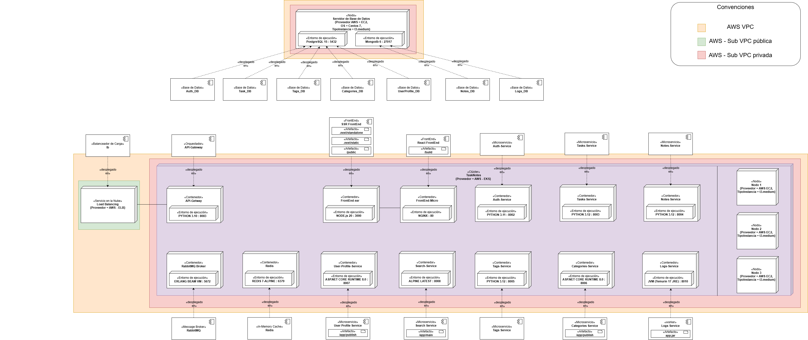
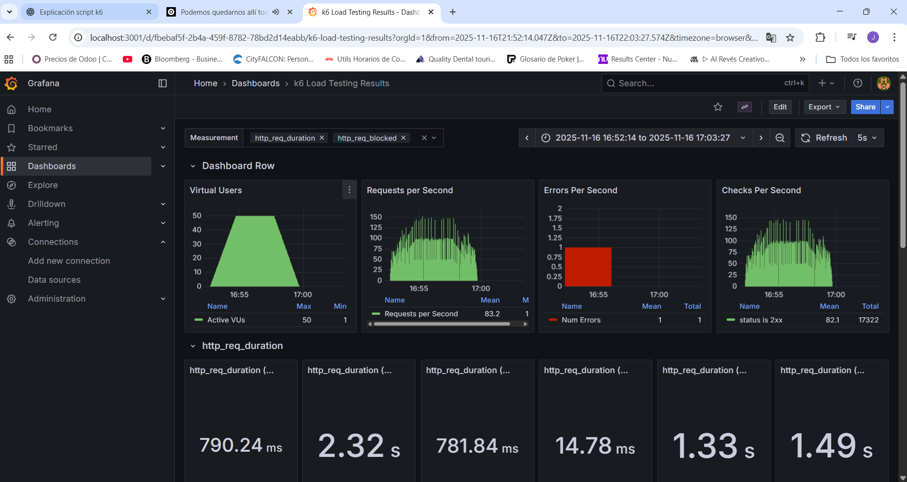

# TaskNotes – Prototype 4

## 1. Artifact

### Team
- **Team Name:** [Cuervos Team]
- **Members:**
  - [Jorge Andrés Torres Leal]
  - [Javier Andrés Carrillo Carrasco]
  - [Kevin Julian Gonzalez Guerra]
  - [Gabriel Castiblanco Céspedes]
  - [Lizeth Mariana Garcia Duarte]
  - [Michael Daniels Oviedo Quiroga]
  - [Javier Esteban Martinez Giron]

### Software System
- **Name:** TaskNotes
- **Logo:** 
- **Description:**  
  TaskNotes es un sistema para gestionar tareas y notas con categorías y etiquetas. Incluye búsqueda full‑text sobre notas, vista de panel con previsualizaciones y sincronización en tiempo real por WebSockets.

  http://k8s-tasknotesfront-f390333062-1655802625.us-east-1.elb.amazonaws.com/micro/login

---

## 2. Functional and Non-Functional Requirements

### Functional Requirements
  - Crear, listar, editar y eliminar tareas (PostgreSQL) con prioridad, fecha de vencimiento, categoría y etiquetas.
  - Crear, listar, editar y eliminar notas (MongoDB) con categoría y etiquetas.
  - Previsualización de tareas y notas desde el dashboard (no edición directa).
  - Búsqueda full‑text de notas por contenido/título con filtros (categoría/etiquetas) vía microservicio de búsqueda.

### Non-Functional Requirements
- The software system must respond to at least four different reliability (high
availability, resilience or fault tolerance) scenarios:
- In scenario 1: the software system must implement the Replication Pattern.
- In scenario 2: the software system must implement the Service Discovery
Pattern.
- In scenario 3: the software system must implement the Cluster Pattern.
- In scenario 4: the software system must implement a pattern defined by the
team.
- The software system must respond to an interoperability scenario.
- Security scenarios of Prototype 3 must be ensured again during the architectural
redesign to be carried out for reliability.
- Performance and scalability scenarios of Prototype 3 must be revalidated during
the architectural redesign to ensure system reliability. The redesign must explicitly
address scalability by adopting an autoscaling method to handle variable
workloads efficiently. Comprehensive performance testing is required again to
confirm that the autoscaling approach meets reliability and scalability objectives.

---

## 3. Architectural Structures

### Component-and-Connector (C&C) Structure
- **C&C View:**  
  [Diagrama C&C]
  
- **Description of architectural styles and patterns used:**  
  [Microservicios, API Gateway, DB-per-service, etc.]
- **Description of architectural elements and relations:**  
  [Explicación de componentes y cómo se comunican]

### Layered Structure
- **Layered View:**  
  [Diagrama de capas]
  
- **Description of architectural patterns used (if applicable):**  
  [Ejemplo: Presentación, Lógica, Datos]
- **Description of architectural elements and relations:**  
  [Explicación de capas y sus relaciones]

### Deployment Structure
- **Deployment View:**  
  [Vista de despliegue]
  
- **Description of architectural patterns used (if applicable):**  
  [Cluster, Replication, Service Discovery, Autoscaling, etc.]
- **Description of architectural elements and relations:**  
  [Explicación de nodos, pods, servicios, redes, etc.]

### Decomposition Structure
- **Decomposition View:**  
  [Vista de descomposición]
  

<a href="./docs/DecompositionViews/APIGateway.png" target="_blank">API Gateway (FastAPI)</a>  
- Encargado del enrutamiento y proxy inverso de todas las solicitudes entrantes. Aplica validaciones JWT y políticas de CORS, y actúa como punto central para la comunicación REST/gRPC hacia los microservicios del dominio.

### User Services
<a href="./docs/DecompositionViews/UserProfileModule.png" target="_blank">User Profile Module</a>  
- Maneja la información de usuario, perfiles y credenciales; utiliza Entity Framework y PostgreSQL.

<a href="./docs/DecompositionViews/AuthModule.png" target="_blank">Auth Module</a>  
- Gestiona autenticación, emisión y validación de tokens JWT.

##### Core Domain Services
<a href="./docs/DecompositionViews/CategoriesModule.png" target="_blank">Categories Module</a>  
- Administración de categorías; expone API REST y publica eventos AMQP.

<a href="./docs/DecompositionViews/TagsModule.png" target="_blank">Tags Module</a>  
- Servicio de etiquetas; mantiene relaciones con tareas y notas.

<a href="./docs/DecompositionViews/NotesModule.png" target="_blank">Notes Module</a>  
- Gestión de notas; soporta REST y gRPC, usa MongoDB para persistencia.

<a href="./docs/DecompositionViews/TaskModule.png" target="_blank">Task Module</a>  
- Gestión de tareas; integra con tags y categories, publica eventos en RabbitMQ.

##### Supporting Services
<a href="./docs/DecompositionViews/LogsModule.png" target="_blank">Logs Module</a>  
- Registro distribuido de logs y monitoreo de eventos, con persistencia en MongoDB y PostgreSQL.

<a href="./docs/DecompositionViews/SearchModule.png" target="_blank">Search Module</a>  
- Búsqueda de texto e indexación; expone API REST/GraphQL.

##### Integration
<a href="./docs/DecompositionViews/MessageBrokerModule.png" target="_blank">Message Broker Module (RabbitMQ)</a>  
- Middleware de mensajería AMQP que orquesta la comunicación asincrónica entre microservicios (task-created, note-updated, category-event, etc.), asegurando desacoplamiento y fiabilidad en la entrega.

- **Description of architectural elements and relations:**  
  [Explicación de módulos, paquetes, microservicios]

---

## 4. Quality Attributes

### Security
- **Security scenarios:**  
  [Lista de escenarios de seguridad]
- **Applied architectural tactics:**  
  [Ejemplo: TLS, JWT, mTLS, segmentación de red]
- **Applied architectural patterns:**  
  [Ejemplo: API Gateway, Zero Trust, etc.]

### Performance and Scalability
- **Performance scenarios:**  
  [Escenarios de carga, concurrencia, etc.]
- **Applied architectural tactics:**  
  [Ejemplo: Cache Aside, Rate Limiting, HPA]
- **Applied architectural patterns:**  
  [Ejemplo: Autoscaling, Load Balancer]
- **Performance testing analysis and results:**  

  [Resultados de pruebas con k6, métricas, análisis]
- Escenarios de performance/escalabilidad:
  - Load Balancer Pattern: `nginx-lb` distribuye carga hacia instancias de servicios para mejorar throughput y resiliencia.
  - Cache Aside (team-defined): `search-service` usa Redis para cachear resultados frecuentes y RabbitMQ para invalidación por eventos de dominio.
- Tácticas aplicadas:
  - Caching read-through/write-around con claves consistentes (`search:{user_id}:{hash(query,filters)}`) y TTL configurable.
  - Invalidation por eventos (`note.updated|deleted`, `task.updated|deleted`) para coherencia de cache.
  - Pooling de conexiones, concurrencia controlada y separación de tráfico (REST/GraphQL) en `search-service`.
  - Escalabilidad horizontal mediante balanceo y aislamiento por componentes.
- Patrones aplicados:
  - Load Balancer, Cache Aside (definido por el equipo).
- Implementación y configuración:
  - `search-service/` (Go) con Redis y consumidores RabbitMQ; env vars: `REDIS_URL`, `CACHE_TTL_SECONDS`, `RABBITMQ_URL`.
  - Métricas Prometheus: `search_cache_hits_total{source}` y `search_cache_misses_total{source}` para REST/GraphQL.
  - Pruebas de performance: `TaskNotes/perf/k6/*.js` y `perf/wrk` con integración a Grafana vía Prometheus/InfluxDB.
- Criterios de aceptación:
  - Reducción medible de latencias P50/P95 en búsquedas repetidas con cache activo.
  - Error rate < 1% a 200 RPS bajo carga normal; coherencia tras actualizaciones/eliminaciones.
  - Saturación y recuperación observables en escenarios de estrés.
- Análisis y resultados de pruebas:
  - Metodología, ejecuciones y hallazgos en `TaskNotes/docs/PerformanceResults.md`.
  - Guía de ejecución reproducible en `TaskNotes/perf/README.md` (k6 y wrk, salida a Prometheus/InfluxDB, uso de `testid`).
  
  - Servicios y resultados (con capturas):
    
    - Auth Service
      - Carga: 
        - Comportamiento estable durante el tramo de carga sostenida; el gráfico de VUs muestra estabilización tras el ramp‑up.
        - Latencias medias y P95 dentro de los objetivos esperados para autenticación; picos transitorios en el inicio de la rampa.
        - Tasa de errores baja; respuestas 401 minimizadas usando tokens válidos y TTL suficiente.
      - Estrés: 
        - A medida que aumentan los VUs, se observan picos de latencia y ligera elevación del error rate en los máximos.
        - Recuperación al descender la carga; el sistema vuelve a niveles de latencia similares al tramo inicial.
        - Validación de límites: rate limiting y controles del gateway responden adecuadamente bajo presión.
    
    - Search Service
      - Carga: 
        - Curva de VUs estable en el plateau de carga; throughput sostenido.
        - Latencias P50/P95 reducidas gracias al patrón Cache Aside; se observan valores menores y más consistentes frente a primeras solicitudes (calentamiento del caché).
        - Error rate bajo; misses iniciales del caché se estabilizan conforme aumenta el hit ratio.
      - Estrés: 
        - Picos de latencia durante ramp‑up alto y en el máximo; el caché mitiga parte del impacto y acelera la recuperación en ramp‑down.
        - Back‑pressure razonable sin incremento significativo de errores; consistencia mantenida en respuestas clave.
    
    - Notes Service
      - Carga y Estrés: 
        - En carga, la latencia se mantiene estable con variaciones contenidas; en estrés, se aprecian picos en los máximos con recuperación posterior.
        - Error rate dentro de tolerancias; el servicio responde con degradación gradual, sin fallos catastróficos.
    
    - Tags Service
      - Carga: 
        - Plateau de VUs estable; latencias regulares y dispersión controlada.
        - Error rate bajo; endpoints de lectura predominan y sostienen buen rendimiento.
      - Estrés: 
        - Aumento de latencias en picos de VUs con recuperación en la fase descendente.
        - Sistema mantiene disponibilidad y consistencia; sin acumulación prolongada de errores.
    
    - Tasks Service
      - Carga: 
        - Comportamiento estable bajo carga; latencias P50 dentro de objetivo, P95 con picos en el inicio del plateau.
        - Error rate bajo; operaciones CRUD responden sin timeouts.
      - Estrés: 
        - Picos de latencia durante ramp‑up/peak; el servicio se estabiliza en ramp‑down.
        - Evidencia de degradación controlada sin incremento sostenido de errores.
    
    - Categories Service
      - Carga: 
        - Throughput constante y latencias estables; plataforma .NET muestra buen manejo de concurrencia.
        - Error rate bajo; endpoints críticos mantienen tiempos de respuesta previsibles.
      - Estrés: 
        - Incremento de latencia en los máximos con recuperación adecuada al reducir VUs.
        - El servicio conserva disponibilidad; sin saturación prolongada.
    
    - User Profile Service
      - Carga: 
        - Estabilidad en VUs y latencias; variabilidad contenida durante el plateau.
        - Error rate bajo; operaciones de perfil toleran concurrencia con buen tiempo de respuesta.
      - Estrés: 
        - Picos de latencia en rampas altas; recuperación al finalizar el estrés.
        - Sin efectos adversos prolongados; el servicio responde con degradación gradual.

    - Conclusiones generales
      - Bajo escenarios de carga, los servicios mantienen latencias y error rate dentro de los objetivos definidos, con estabilización tras el ramp‑up.
      - En escenarios de estrés, se observan picos de latencia y variabilidad esperables en los máximos, con recuperación consistente en ramp‑down.
      - El patrón Cache Aside en `search-service` mejora significativamente la latencia percibida y la estabilidad bajo carga y contribuye a una mejor recuperación bajo estrés.
      - El uso de tokens válidos y TTLs adecuados evita 401s y reduce ruido en las mediciones; el etiquetado `testid` facilita el análisis en Grafana.

### Reliability
- **Reliability scenarios:**  
  [Escenarios de alta disponibilidad, tolerancia a fallos, resiliencia]
- **Applied architectural tactics:**  
  [Ejemplo: Replication, Cluster, Service Discovery]
- **Applied architectural patterns:**  
  [Patrones implementados en K8s]

### Interoperability
- **Interoperability scenario:**  
  [Escenario de interoperabilidad REST/gRPC]
- **Applied architectural tactics:**  
  [Ejemplo: DNS interno, API Gateway]
- **Applied architectural patterns:**  
  [Ejemplo: Service Mesh, API Gateway]

---

## 5. Prototype

### Instructions for deploying the software system locally
- [Pasos para desplegar con Docker Compose]
- [Pasos para desplegar en Kubernetes (Minikube/AWS EKS)]
- [Variables de entorno, configuración, comandos útiles]

---

**Notas:**  
- Agrega diagramas, tablas y ejemplos donde corresponda.  
- Incluye referencias a los archivos de configuración y manifests relevantes.  
- Documenta cualquier decisión arquitectónica importante.
