# TaskNotes – Prototipo 4

## 1. Artefacto

### Equipo
- **Nombre del equipo:** [Cuervos Team]
- **Integrantes:**
  - [Jorge Andrés Torres Leal]
  - [Javier Andrés Carrillo Carrasco]
  - [Kevin Julian Gonzalez Guerra]
  - [Gabriel Castiblanco Céspedes]
  - [Lizeth Mariana Garcia Duarte]
  - [Michael Daniels Oviedo Quiroga]
  - [Javier Esteban Martinez Giron]

### Sistema de Software
- **Nombre:** TaskNotes
- **Logo:** 
- **Descripción:**  
  TaskNotes es un sistema para gestionar tareas y notas con categorías y etiquetas. Incluye búsqueda full‑text sobre notas, vista de panel con previsualizaciones y sincronización en tiempo real por WebSockets.

  http://k8s-tasknotesfront-f390333062-2067262331.us-east-1.elb.amazonaws.com

---

## 2. Requisitos Funcionales y No Funcionales

### Requisitos Funcionales
  - Crear, listar, editar y eliminar tareas (PostgreSQL) con prioridad, fecha de vencimiento, categoría y etiquetas.
  - Crear, listar, editar y eliminar notas (MongoDB) con categoría y etiquetas.
  - Previsualización de tareas y notas desde el panel principal (sin edición directa).
  - Búsqueda full‑text de notas por contenido/título con filtros (categoría/etiquetas) a través del microservicio de búsqueda.

### Requisitos No Funcionales
- El sistema debe responder a al menos cuatro escenarios diferentes de confiabilidad (alta disponibilidad, resiliencia o tolerancia a fallos):
- En el escenario 1: el sistema debe implementar el patrón de replicación.
- En el escenario 2: el sistema debe implementar el patrón de descubrimiento de servicios.
- En el escenario 3: el sistema debe implementar el patrón de clúster.
- En el escenario 4: el sistema debe implementar un patrón definido por el equipo.
- El sistema debe responder a un escenario de interoperabilidad.
- Los escenarios de seguridad del Prototipo 3 deben garantizarse nuevamente durante el rediseño arquitectónico orientado a confiabilidad.
- Los escenarios de rendimiento y escalabilidad del Prototipo 3 deben ser revalidados durante el rediseño arquitectónico para asegurar la confiabilidad del sistema. El rediseño debe abordar explícitamente la escalabilidad adoptando un método de autoescalado para manejar cargas variables de manera eficiente. Se requiere nuevamente pruebas de rendimiento exhaustivas para confirmar que el enfoque de autoescalado cumple los objetivos de confiabilidad y escalabilidad.

---

## 3. Estructuras Arquitectónicas

### Estructura de Componentes y Conectores (C&C)
- **Vista C&C:**  
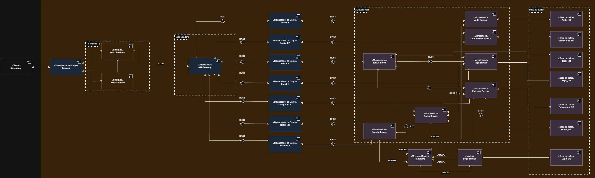

- **Descripción de estilos y patrones arquitectónicos utilizados:**  
* *Microservicios*
  * El núcleo del sistema se estructura bajo este estilo, descomponiendo la aplicación en unidades funcionales autónomas (Task, Auth, Notes, etc.) que encapsulan contextos de negocio específicos. Esta decisión habilita una arquitectura políglota, permitiendo la coexistencia de implementaciones en .NET, Python y Java, y facilita la escalabilidad granular mediante el despliegue de múltiples instancias (Pods) gestionadas por balanceadores de carga internos, optimizando así el uso de recursos.
* *Publicación-Suscripción (Event-Driven)*
  * Para desacoplar el procesamiento transaccional de las tareas secundarias, se implementa un modelo asíncrono basado en eventos utilizando RabbitMQ como Message Broker. Los microservicios publican eventos de dominio vía protocolo AMQP sin conocer a los destinatarios, mientras que componentes especializados, como el Logs Service, se suscriben para procesar esta información en segundo plano, garantizando la resiliencia del sistema y la no obstrucción del flujo principal.
* *API Gateway y Cliente-Servidor Híbrido*
  * El acceso al sistema está centralizado mediante el patrón API Gateway, el cual actúa como único punto de entrada y Reverse Proxy, ocultando la topología interna a los clientes Frontend. La comunicación interna combina dos enfoques: interfaces REST estándar para la mayoría de las interacciones y protocolo gRPC para conexiones críticas de alto rendimiento (entre Search y Notes), aprovechando la serialización binaria para minimizar la latencia.
* *Patrón Base de Datos por Servicio (Database-per-Service)*
  * Se aplica estrictamente el aislamiento de datos, donde cada microservicio es propietario exclusivo de su esquema de persistencia. Esto da lugar a una estrategia de persistencia políglota que combina bases de datos relacionales (PostgreSQL) y documentales (MongoDB) según la naturaleza de los datos, asegurando que los cambios en la estructura de un servicio no impacten la integridad ni la operatividad de los demás.

- **Descripción de elementos arquitectónicos y relaciones:**
* Componentes de Presentación (Frontend)
  * Constituyen la capa de interfaz de usuario del sistema. Se identifican dos elementos: React Frontend, una aplicación de página única (SPA) encargada de la interacción dinámica en el navegador, y SSR Frontend, encargado del renderizado del lado del servidor para optimización de contenido. Ambos componentes poseen exclusivamente lógica de presentación y actúan como clientes HTTP del API Gateway, sin poseer almacenamiento local persistente.
* Servicio de Auditoría (Logs Service)
  * Componente especializado tipo Worker desarrollado en Java. A diferencia de los servicios de negocio, este componente no expone interfaces REST públicas, sino que opera reactivamente mediante un puerto consumidor (Consumer Port). Su función es procesar asíncronamente los mensajes provenientes del Message Broker para garantizar la trazabilidad centralizada del sistema.
* Balanceador de Carga Ingress
  * La exposición externa del sistema se gestiona mediante un recurso Ingress, que actúa como balanceador de carga de Capa 7 y punto de entrada único (Entry Point) para el tráfico entrante. Este componente centraliza la terminación SSL y enruta las peticiones HTTP/HTTPS provenientes de las aplicaciones Frontend hacia el API Gateway, abstrayendo la complejidad de la red interna y unificando el acceso seguro bajo un dominio gestionado.
* Balanceadores de Carga por Microservicio (Kubernetes Services)
  *  A nivel de infraestructura, la disponibilidad de cada módulo (Task, Auth, etc.) se garantiza mediante objetos Kubernetes Service, que funcionan como balanceadores de carga internos virtuales. Este mecanismo asigna una dirección IP estable (ClusterIP) a cada microservicio y distribuye equitativamente el tráfico del orquestador entre las réplicas dinámicas (Pods) disponibles, permitiendo un escalado horizontal transparente sin afectar a los consumidores del servicio.
* Conector RPC Síncrono (gRPC)
  * Mecanismo de comunicación de alto rendimiento utilizado exclusivamente entre el Search Service (Cliente) y el Notes Service (Servidor). Este conector implementa una llamada a procedimiento remoto (RPC) utilizando Protocol Buffers para la serialización binaria. Se utiliza para transferir grandes volúmenes de datos de notas hacia el servicio de búsqueda con una latencia mínima, evitando la sobrecarga del protocolo HTTP/REST tradicional.
* Comunicación Sincrona REST
  * El intercambio de información en tiempo real se rige por el estilo arquitectónico REST sobre HTTP, estableciendo el estándar para la interacción síncrona entre los clientes Frontend, el API Gateway y los microservicios funcionales. Esta elección garantiza la interoperabilidad de las interfaces y desacopla la implementación subyacente de su consumo, facilitando la integración fluida de recursos mediante el uso de infraestructura web estándar.
*  Mensajería Asíncrona con RabbitMQ (AMQP)
  * Para operaciones de auditoría y procesos diferidos, se implementa un modelo asíncrono basado en el protocolo AMQP bajo el patrón Producer-Broker-Worker. Los microservicios Notes y Search actúan como productores publicando eventos en el bus de mensajes RabbitMQ, los cuales son consumidos posteriormente por el Logs Service (Worker) para su persistencia final; este diseño asegura el desacoplamiento temporal y la resiliencia del sistema ante picos de carga.
* Componentes de Persistencia (Databases)
  * Unidades de almacenamiento de datos independientes que cumplen el patrón Database-per-Service. El sistema presenta persistencia políglota: bases de datos relacionales PostgreSQL (Auth_DB, UserProfile_DB, Task_DB, Categories_DB) para datos estructurados transaccionales, y bases de datos documentales MongoDB (Notes_DB, Logs_DB) para almacenamiento flexible de documentos y logs masivos.

### Estructura de Capas
- **Layered View:**  
  **Layered View Principal**
  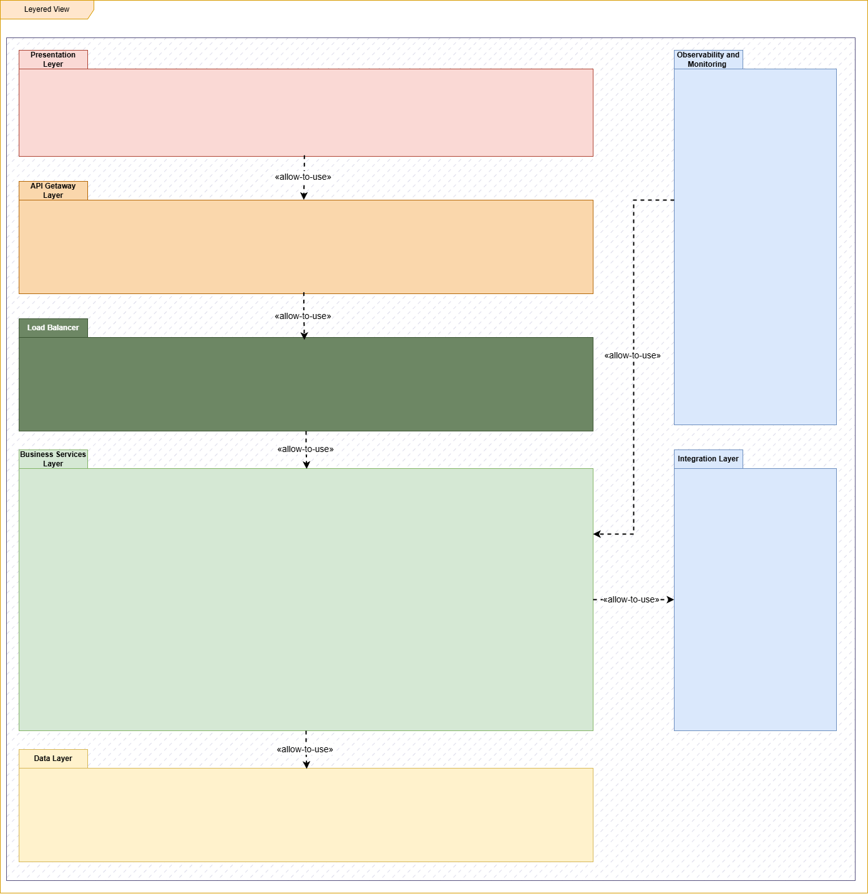

  **Layered Views por microservicio y observabilidad**

  **Auth Service**
  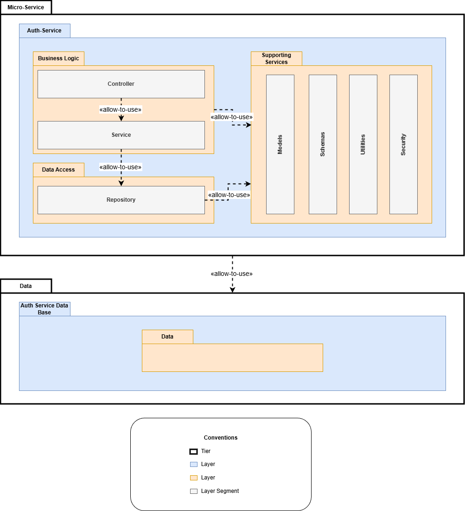

  **Categories Service**
  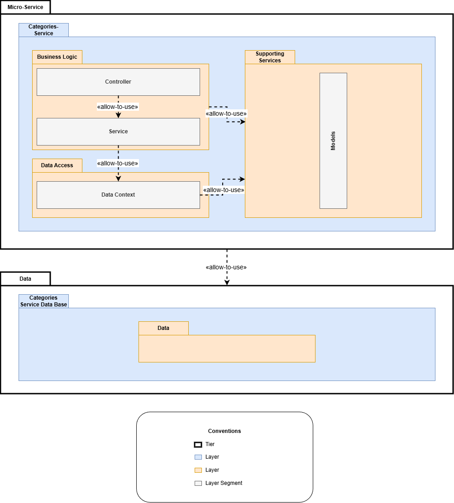

  **Logs Service**
  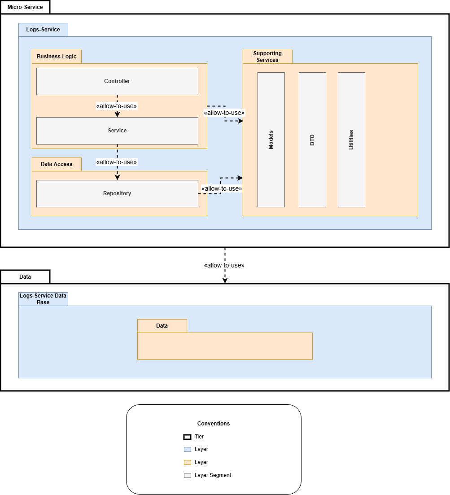

  **Notes Service**
  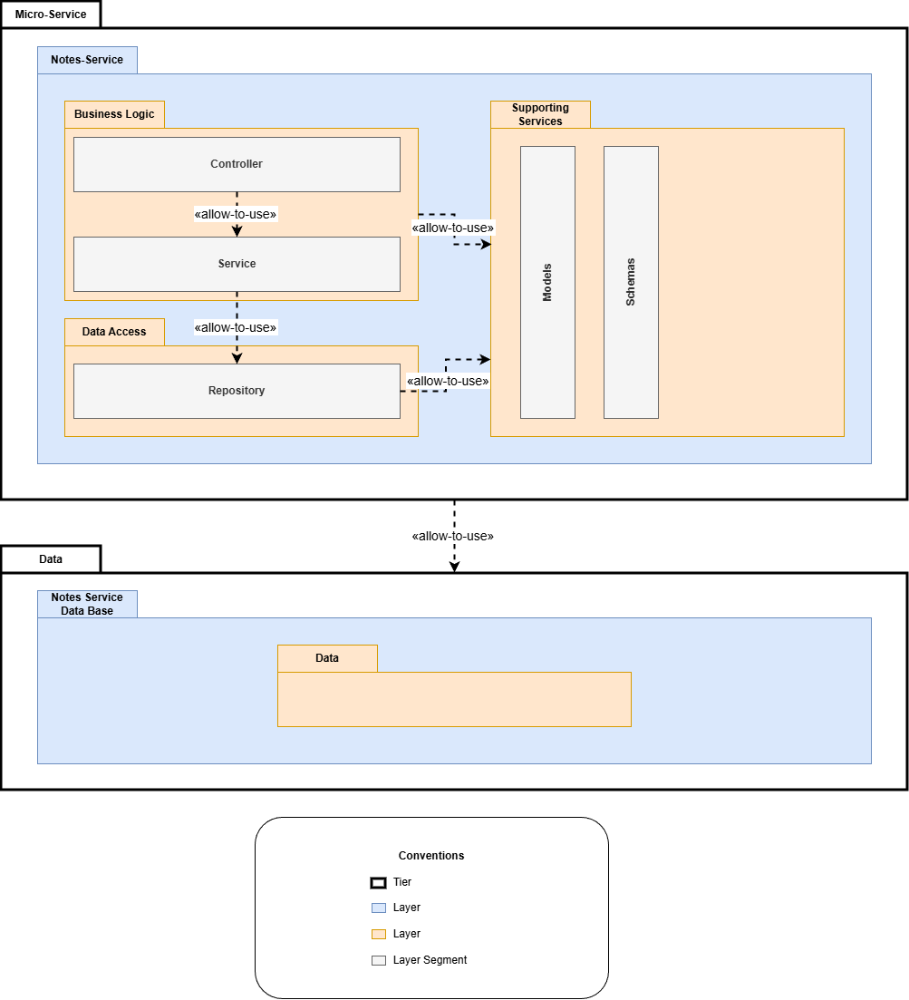

  **Search Service**
  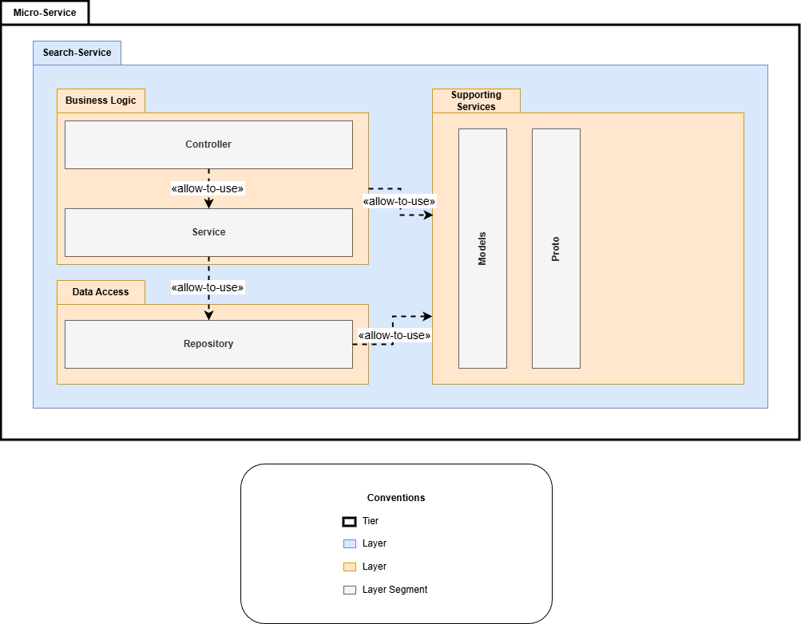

  **Tags Service**
  

  **Tasks Service**
  

  **User Profile Service**
  

  **Observability and Integration**
  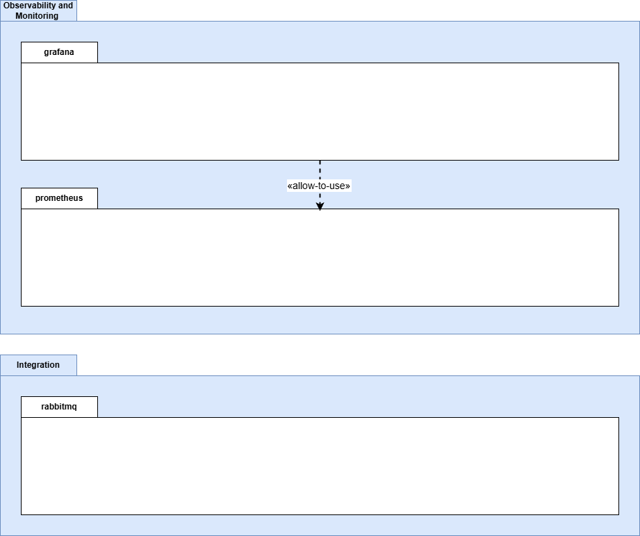

- **Descripción de estilos y patrones arquitectónicos utilizados:** 
  El patrón de Presentación, Lógica y Datos estructura cada microservicio y componente de TaskNotes en capas bien definidas, permitiendo separar la interfaz de usuario, la lógica de negocio y el acceso a datos. Esta decisión facilita la mantenibilidad y la evolución independiente de cada módulo, ya que los cambios en la presentación o en la persistencia no afectan la lógica central. Además, habilita la integración de tecnologías especializadas en cada capa, como React y Next.js en la presentación, frameworks como FastAPI, .NET y Go en la lógica, y PostgreSQL/MongoDB en la persistencia.

  El patrón de Lógica de Negocio centraliza las reglas, validaciones y procesos propios de cada dominio, gestionando la orquestación de operaciones y la integración con otros servicios. En TaskNotes, esta capa implementa tácticas como Cache Aside (en Search Service), Event-Driven (RabbitMQ), y Service Discovery (Kubernetes), permitiendo optimizar el rendimiento, la resiliencia y la escalabilidad. La lógica de negocio también es responsable de aplicar controles de seguridad, validaciones de acceso y coordinación de flujos entre microservicios.

  El patrón de Persistencia/Datos garantiza el aislamiento y la integridad de la información, aplicando el principio Database-per-Service. Cada microservicio es propietario exclusivo de su esquema de datos, lo que permite una estrategia de persistencia políglota y evita el acoplamiento entre dominios. Esta decisión soporta la escalabilidad horizontal y la tolerancia a fallos, ya que cada base de datos puede ser replicada y gestionada de forma independiente.

  El patrón de Observabilidad y Monitoreo se integra transversalmente en la arquitectura en capas mediante componentes dedicados y la instrumentación de cada servicio. El uso de Prometheus y Grafana permite recolectar métricas, trazas y logs desde la capa de lógica y persistencia, facilitando la detección de anomalías, el análisis de performance y la auditoría centralizada. Esta integración no afecta el aislamiento funcional, pero habilita la gestión proactiva y la mejora continua del sistema.

- **Descripción de elementos arquitectónicos y relaciones:** 
  Las relaciones entre capas en TaskNotes son estrictamente unidireccionales: la capa de Presentación delega en la Lógica de Negocio, que a su vez interactúa con la Persistencia. Esta separación asegura que los cambios en la interfaz o en el almacenamiento no afecten la lógica central, promoviendo la mantenibilidad y la extensibilidad del sistema. Los microservicios implementan este esquema adaptando la estructura según su rol; por ejemplo, el Logs Service prioriza la integración con mensajería y almacenamiento masivo, mientras que el Search Service optimiza la lógica para búsquedas y caching.

  La integración entre microservicios se realiza principalmente en la capa de lógica, mediante llamadas REST/gRPC y eventos asíncronos. El API Gateway centraliza el acceso y abstrae la topología interna, mientras que la mensajería con RabbitMQ desacopla los flujos y permite la resiliencia ante picos de carga. La observabilidad y la auditoría se implementan como servicios transversales, interactuando con las capas de lógica y persistencia para garantizar la trazabilidad y el monitoreo sin romper el aislamiento funcional.

### Deployment Structure
- **Deployment View:**  
  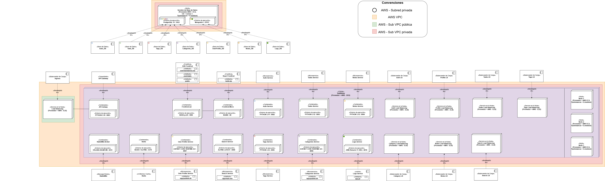

- **Descripción de estilos y patrones arquitectónicos utilizados:**  

  La contenedorización es el patrón fundamental del despliegue en TaskNotes: cada microservicio, base de datos, gateway, exporter y herramienta de observabilidad se ejecuta en su propio contenedor, con ciclo de vida, variables de entorno y políticas de reinicio independientes. Esta decisión elimina procesos compartidos, facilita la escalabilidad y el aislamiento, y permite la gestión granular de dependencias y actualizaciones. La conectividad entre contenedores se define explícitamente mediante redes internas y públicas, asegurando que solo los servicios necesarios sean expuestos externamente.

  El patrón de segmentación de red refuerza la seguridad y la organización del sistema. 

  El uso de Reverse Proxy y Load Balancer permite el balanceo de carga entre réplicas de microservicios, el routing interno y la exposición de métricas para observabilidad. 

  La observabilidad centralizada se logra mediante la integración de Prometheus, Grafana y diversos exporters. Cada servicio expone métricas en /metrics, los exporters se conectan a bases de datos y sistemas clave, y Prometheus realiza scraping periódico. Grafana consulta a Prometheus para visualización y análisis, mientras que Alertmanager procesa eventos de alerta. Este patrón permite monitoreo proactivo, trazabilidad y respuesta rápida ante incidentes.

- **Descripción de elementos arquitectónicos y relaciones:** 

  En cuanto a los elementos y relaciones, la arquitectura de despliegue se organiza en capas funcionales. La capa de entrada incluye los frontends (React SPA y Next.js SSR) y el API Gateway, que centraliza la terminación TLS, validación de JWT, rate limiting y routing interno. El tráfico externo ingresa por el API Gateway y se distribuye internamente por Nginx-LB hacia los microservicios.

  La capa de balanceo y proxy interno gestiona el routing, el balanceo round-robin y la exposición de métricas. La relación clave aquí es la dependencia de ejecución: nginx-exporter depende de nginx-lb para obtener métricas, pero no está desplegado dentro de él.

  La capa de microservicios despliega cada servicio en su propio contenedor, con su base de datos dedicada y exporters asociados. Los servicios Python, .NET, Go y Java se comunican mediante REST, gRPC y AMQP, según su rol. Por ejemplo, Search Service (Go) utiliza gRPC para comunicarse con Notes Service, mientras que Logs Service (Java) consume mensajes AMQP producidos por Notes y Search.

  La capa de datos incluye instancias separadas de PostgreSQL y MongoDB, cada una con su exporter correspondiente, y Redis como cache compartido solo para servicios que lo requieren. RabbitMQ actúa como broker de eventos, con exporters para monitoreo.

  La capa de observabilidad integra Prometheus, Grafana y Alertmanager, con volúmenes montados para configuración y dashboards. Prometheus recolecta métricas de todos los servicios y exporters, Grafana visualiza los datos y Alertmanager gestiona las alertas.

  Las relaciones finales se definen por dependencias de ejecución (Docker depends_on), conectores (REST, gRPC, AMQP, drivers de BD) y la noción de "desplegado en". El frontend depende del API Gateway, los microservicios de sus bases de datos, y los exporters de los servicios que monitorean. La comunicación se realiza por canales bien definidos, asegurando la trazabilidad y la resiliencia del sistema.

#### Decomposition Structure (Estructura de Descomposición)

### - Decomposition View:

## Descripción de elementos y relaciones
### Servicios de Usuario

### [Módulo de Autenticación](./docs/DecompositionViews/AuthModule.png)

Gestiona el inicio de sesión, autenticación y emisión/validación de tokens de acceso.

### [Módulo de Perfiles de Usuario](./docs/DecompositionViews/UserProfileModule.png)
Administra la información general y preferencias del usuario dentro del sistema.

---

## Servicios del Dominio

### [Módulo de Tareas](./docs/DecompositionViews/TaskModule.png)
- Crear, consultar, actualizar y eliminar tareas.  
- Filtrar por estado, prioridad o fecha.  
- Integración con categorías y etiquetas.

### [Módulo de Notas](./docs/DecompositionViews/NotesModule.png)
- CRUD completo de notas.  
- Compatible con búsquedas avanzadas.

### [Módulo de Etiquetas](./docs/DecompositionViews/TagsModule.png)
Gestiona etiquetas creadas por el usuario y su asociación con tareas o notas.

### [Módulo de Categorías](./docs/DecompositionViews/CategoriesModule.png)
Permite definir y administrar categorías relacionadas con tareas o notas.

---

## Servicios de Apoyo

### [Módulo de Búsqueda](./docs/DecompositionViews/SearchModule.png)
Ofrece funcionalidades avanzadas de búsqueda, filtrado y consulta unificada.

### [Módulo de Registro de Eventos (Logs)](./docs/DecompositionViews/LogsModule.png)
Almacena eventos generados por los servicios del dominio para trazabilidad y auditoría.

---

## Integración

### [Módulo de Mensajería (RabbitMQ)](./docs/DecompositionViews/MessageBrokerModule.png)
Coordina la comunicación asincrónica entre microservicios mediante eventos desacoplados.

#### - Descripción de relaciones:

| Usa \ Es usado por | AUTH | PROFILES | TASKS | NOTES | TAGS | CATEGORIES | SEARCH |
|--------------------|:----:|:--------:|:-----:|:-----:|:----:|:----------:|:------:|
| **API-GW**         |  1   |    1     |   1   |   1   |  1   |     1      |   1    |
| **AUTH**           |  –   |    0     |   0   |   0   |  0   |     0      |   0    |
| **PROFILES**       |  0   |    –     |   0   |   0   |  0   |     0      |   0    |
| **TASKS**          |  1   |    0     |   –   |   0   |  1   |     1      |   0    |
| **NOTES**          |  0   |    0     |   0   |   –   |  1   |     1      |   0    |
| **TAGS**           |  0   |    0     |   0   |   0   |   –  |     0      |   0    |
| **CATEGORIES**     |  0   |    0     |   0   |   0   |  0   |     –      |   0    |
| **SEARCH**         |  0   |    0     |   0   |   1   |  1   |     1      |   –    |

>  **Leyenda:** “1” = el módulo en la columna *usa* al módulo en la fila.

---

## 4. Quality Attributes

### Prototype 3 – Seguridad, Performance y Escalabilidad

- **Canal seguro (HTTPS + mTLS gRPC)**
  - Certificados TLS gateway: secret `gateway-tls-secret` ([k8s/base/tls-gateway-secret.yaml](k8s/base/tls-gateway-secret.yaml)). Actualmente los Ingress están en HTTP (ALB); activar TLS requiere reintroducir ingress-nginx o ACM.
  - mTLS interno gRPC: certs en `grpc-certs-secret` ([k8s/base/grpc-certs-secret.yaml](k8s/base/grpc-certs-secret.yaml)) montados en notes/tasks/search; variables `GRPC_TLS_*` en sus Deployments.

- **Reverse Proxy / API Gateway**
  - Gateway FastAPI como único punto de entrada. Ingress ALB HTTP: [k8s/base/ingress-api-gateway.yaml](k8s/base/ingress-api-gateway.yaml). Backend services expuestos solo vía ClusterIP.

- **Segmentación de red**
  - NetworkPolicies para aislar microservicios, bases de datos y dependencias: [k8s/base/networkpolicy-microservices.yaml](k8s/base/networkpolicy-microservices.yaml) y [k8s/base/networkpolicy-databases.yaml](k8s/base/networkpolicy-databases.yaml). Default deny egress; reglas explícitas para DNS, gateway→servicios, search→notes/tasks, DBs y RabbitMQ.

- **Patrón del equipo: Rate Limiting + Cache Aside**
  - Rate limiting gateway: ConfigMap [k8s/base/configmap-gateway-rate-limit.yaml](k8s/base/configmap-gateway-rate-limit.yaml) cargado en [k8s/base/api-gateway-deployment.yaml](k8s/base/api-gateway-deployment.yaml). Respuestas 429 bajo exceso.
  - Cache Aside en search-service: ConfigMap [k8s/base/configmap-search-cache.yaml](k8s/base/configmap-search-cache.yaml); Redis y RabbitMQ para invalidación.

- **Load Balancer + Performance**
  - ALB para entrada externa (HTTP). Balanceo interno vía Services ClusterIP.
  - Scripts de carga en `perf/k6` y `perf/wrk`; reportes en [docs/PerformanceResults.md](docs/PerformanceResults.md).

### Prototype 4 – Confiabilidad y Autoscaling

- **Escenario 1: Replication Pattern**
  - Réplicas >=2 en servicios stateless (gateway, frontends, notes, tasks, search, etc.). Ver Deployments en `k8s/base/*-deployment.yaml`.

- **Escenario 2: Service Discovery Pattern**
  - DNS interno K8s vía Services ClusterIP (`<svc>.tasknotes.svc.cluster.local`). Gateway y microservicios usan nombres de servicio, no IPs.

- **Escenario 3: Cluster Pattern**
  - MongoDB y PostgreSQL como StatefulSets (1 réplica actual en MongoDB; plan para 3 nodos descrito en [docs/MIGRACION_PASO_A_PASO.md](docs/MIGRACION_PASO_A_PASO.md)). StorageClass gp3 ([k8s/base/storageclass-gp3.yaml](k8s/base/storageclass-gp3.yaml)).

- **Escenario 4: Patrón del equipo (Rate Limiting + Cache Aside)**
  - Se mantiene el patrón de Prototype 3 para limitar abuso y mejorar latencia.

- **Autoscaling (HPA)**
  - HPAs definidos para gateway, search, tasks, notes: [k8s/base/hpa-*.yaml](k8s/base). Requiere metrics-server.

- **Interoperabilidad**
  - REST vía gateway; gRPC search→notes/tasks; mensajería RabbitMQ. Probes y DNS garantizan resiliencia.

### Componentes Clave (ubicación rápida)
- Gateway: [k8s/base/api-gateway-deployment.yaml](k8s/base/api-gateway-deployment.yaml) y [k8s/base/ingress-api-gateway.yaml](k8s/base/ingress-api-gateway.yaml)
- Frontends: [k8s/base/frontend-ssr-deployment.yaml](k8s/base/frontend-ssr-deployment.yaml), [k8s/base/frontend-micro-deployment.yaml](k8s/base/frontend-micro-deployment.yaml), [k8s/base/ingress-frontends.yaml](k8s/base/ingress-frontends.yaml)
- Seguridad TLS gRPC: [k8s/base/grpc-certs-secret.yaml](k8s/base/grpc-certs-secret.yaml)
- Rate limiting / Cache: [k8s/base/configmap-gateway-rate-limit.yaml](k8s/base/configmap-gateway-rate-limit.yaml), [k8s/base/configmap-search-cache.yaml](k8s/base/configmap-search-cache.yaml)
- NetworkPolicies: [k8s/base/networkpolicy-microservices.yaml](k8s/base/networkpolicy-microservices.yaml), [k8s/base/networkpolicy-databases.yaml](k8s/base/networkpolicy-databases.yaml)
- HPAs: [k8s/base/hpa-api-gateway.yaml](k8s/base/hpa-api-gateway.yaml), [k8s/base/hpa-search-service.yaml](k8s/base/hpa-search-service.yaml), [k8s/base/hpa-tasks-service.yaml](k8s/base/hpa-tasks-service.yaml), [k8s/base/hpa-notes-service.yaml](k8s/base/hpa-notes-service.yaml)

### Notas Operativas
- Ingress actual: ALB HTTP. Si se requiere HTTPS, usar ACM o reinstalar ingress-nginx y agregar bloque `tls` a los Ingress.
- Ajustar `WEB_URL_PUBLIC` en frontend-ssr al ALB vigente para evitar redirecciones a dominios antiguos.
- Después de editar ConfigMaps/Secrets, hacer `kubectl rollout restart` en los deployments afectados.
- Métricas y logs: consultar Prometheus/Grafana (si desplegado) o `kubectl logs` para verificar rate limiting, cache hits y probes.

  [Resultados de pruebas con k6, métricas, análisis]
- Escenarios de performance/escalabilidad:
  - Load Balancer Pattern: `nginx-lb` distribuye carga hacia instancias de servicios para mejorar throughput y resiliencia.
  - Cache Aside (team-defined): `search-service` usa Redis para cachear resultados frecuentes y RabbitMQ para invalidación por eventos de dominio.
- Tácticas aplicadas:
  - Caching read-through/write-around con claves consistentes (`search:{user_id}:{hash(query,filters)}`) y TTL configurable.
  - Invalidation por eventos (`note.updated|deleted`, `task.updated|deleted`) para coherencia de cache.
  - Pooling de conexiones, concurrencia controlada y separación de tráfico (REST/GraphQL) en `search-service`.
  - Escalabilidad horizontal mediante balanceo y aislamiento por componentes.
- Patrones aplicados:
  - Load Balancer, Cache Aside (definido por el equipo).
- Implementación y configuración:
  - `search-service/` (Go) con Redis y consumidores RabbitMQ; env vars: `REDIS_URL`, `CACHE_TTL_SECONDS`, `RABBITMQ_URL`.
  - Métricas Prometheus: `search_cache_hits_total{source}` y `search_cache_misses_total{source}` para REST/GraphQL.
  - Pruebas de performance: `TaskNotes/perf/k6/*.js` y `perf/wrk` con integración a Grafana vía Prometheus/InfluxDB.
- Criterios de aceptación:
  - Reducción medible de latencias P50/P95 en búsquedas repetidas con cache activo.
  - Error rate < 1% a 200 RPS bajo carga normal; coherencia tras actualizaciones/eliminaciones.
  - Saturación y recuperación observables en escenarios de estrés.
- Análisis y resultados de pruebas:
  - Metodología, ejecuciones y hallazgos en `TaskNotes/docs/PerformanceResults.md`.
  - Guía de ejecución reproducible en `TaskNotes/perf/README.md` (k6 y wrk, salida a Prometheus/InfluxDB, uso de `testid`).
  
  - Servicios y resultados (con capturas):
    
    - Auth Service
      - Carga: 
        - Comportamiento estable durante el tramo de carga sostenida; el gráfico de VUs muestra estabilización tras el ramp‑up.
        - Latencias medias y P95 dentro de los objetivos esperados para autenticación; picos transitorios en el inicio de la rampa.
        - Tasa de errores baja; respuestas 401 minimizadas usando tokens válidos y TTL suficiente.
      - Estrés: 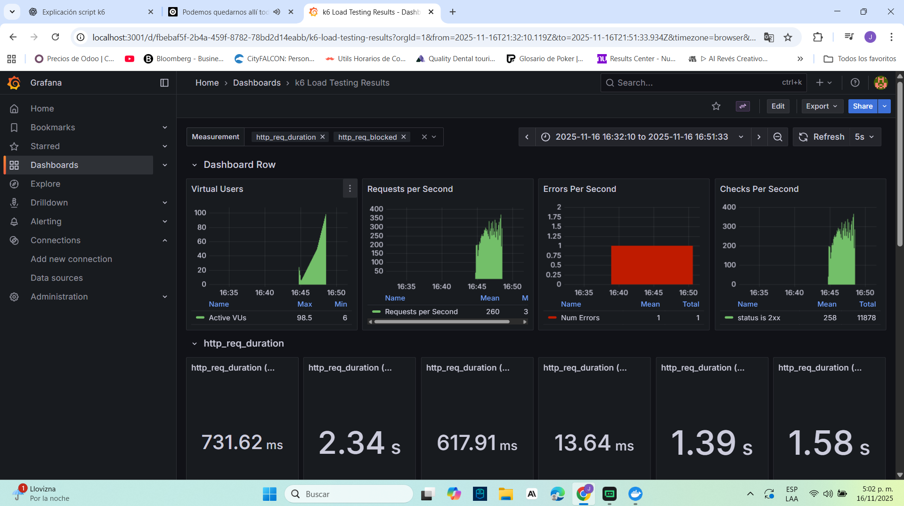
        - A medida que aumentan los VUs, se observan picos de latencia y ligera elevación del error rate en los máximos.
        - Recuperación al descender la carga; el sistema vuelve a niveles de latencia similares al tramo inicial.
        - Validación de límites: rate limiting y controles del gateway responden adecuadamente bajo presión.
    
    - Search Service
      - Carga: 
        - Curva de VUs estable en el plateau de carga; throughput sostenido.
        - Latencias P50/P95 reducidas gracias al patrón Cache Aside; se observan valores menores y más consistentes frente a primeras solicitudes (calentamiento del caché).
        - Error rate bajo; misses iniciales del caché se estabilizan conforme aumenta el hit ratio.
      - Estrés: 
        - Picos de latencia durante ramp‑up alto y en el máximo; el caché mitiga parte del impacto y acelera la recuperación en ramp‑down.
        - Back‑pressure razonable sin incremento significativo de errores; consistencia mantenida en respuestas clave.
    
    - Notes Service
      - Carga y Estrés: 
        - En carga, la latencia se mantiene estable con variaciones contenidas; en estrés, se aprecian picos en los máximos con recuperación posterior.
        - Error rate dentro de tolerancias; el servicio responde con degradación gradual, sin fallos catastróficos.
    
    - Tags Service
      - Carga: 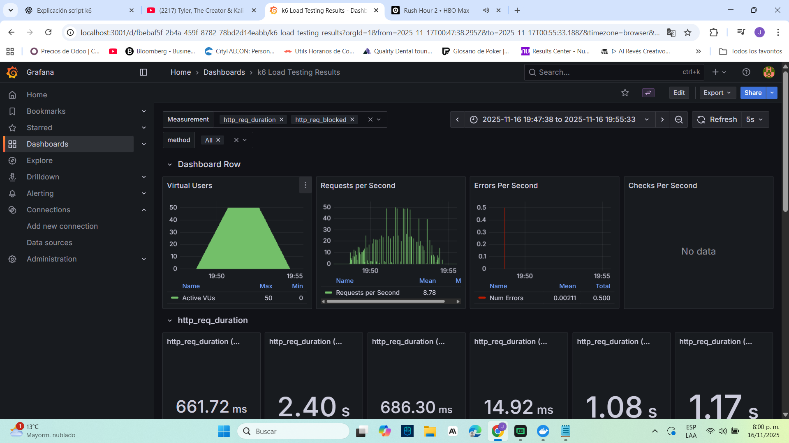
        - Plateau de VUs estable; latencias regulares y dispersión controlada.
        - Error rate bajo; endpoints de lectura predominan y sostienen buen rendimiento.
      - Estrés: 
        - Aumento de latencias en picos de VUs con recuperación en la fase descendente.
        - Sistema mantiene disponibilidad y consistencia; sin acumulación prolongada de errores.
    
    - Tasks Service
      - Carga: 
        - Comportamiento estable bajo carga; latencias P50 dentro de objetivo, P95 con picos en el inicio del plateau.
        - Error rate bajo; operaciones CRUD responden sin timeouts.
      - Estrés: 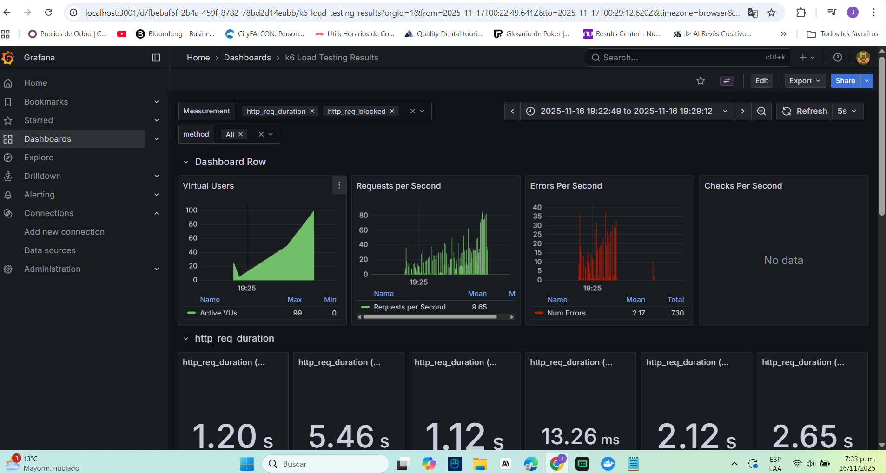
        - Picos de latencia durante ramp‑up/peak; el servicio se estabiliza en ramp‑down.
        - Evidencia de degradación controlada sin incremento sostenido de errores.
    
    - Categories Service
      - Carga: 
        - Throughput constante y latencias estables; plataforma .NET muestra buen manejo de concurrencia.
        - Error rate bajo; endpoints críticos mantienen tiempos de respuesta previsibles.
      - Estrés: 
        - Incremento de latencia en los máximos con recuperación adecuada al reducir VUs.
        - El servicio conserva disponibilidad; sin saturación prolongada.
    
    - User Profile Service
      - Carga: 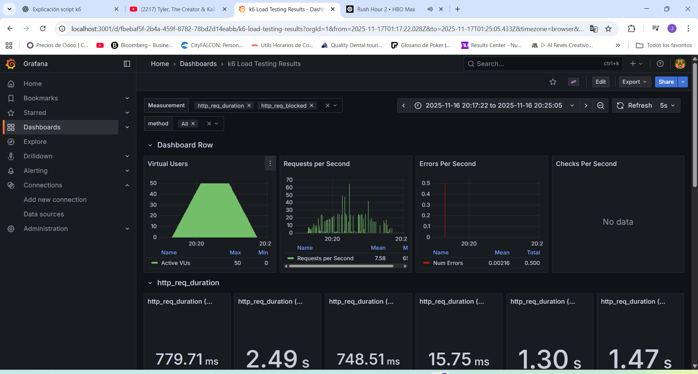
        - Estabilidad en VUs y latencias; variabilidad contenida durante el plateau.
        - Error rate bajo; operaciones de perfil toleran concurrencia con buen tiempo de respuesta.
      - Estrés: 
        - Picos de latencia en rampas altas; recuperación al finalizar el estrés.
        - Sin efectos adversos prolongados; el servicio responde con degradación gradual.

    - Conclusiones generales
      - Bajo escenarios de carga, los servicios mantienen latencias y error rate dentro de los objetivos definidos, con estabilización tras el ramp‑up.
      - En escenarios de estrés, se observan picos de latencia y variabilidad esperables en los máximos, con recuperación consistente en ramp‑down.
      - El patrón Cache Aside en `search-service` mejora significativamente la latencia percibida y la estabilidad bajo carga y contribuye a una mejor recuperación bajo estrés.
      - El uso de tokens válidos y TTLs adecuados evita 401s y reduce ruido en las mediciones; el etiquetado `testid` facilita el análisis en Grafana.

---

## 5. Prototype 4 

http://k8s-tasknotesfront-f390333062-2067262331.us-east-1.elb.amazonaws.com 
